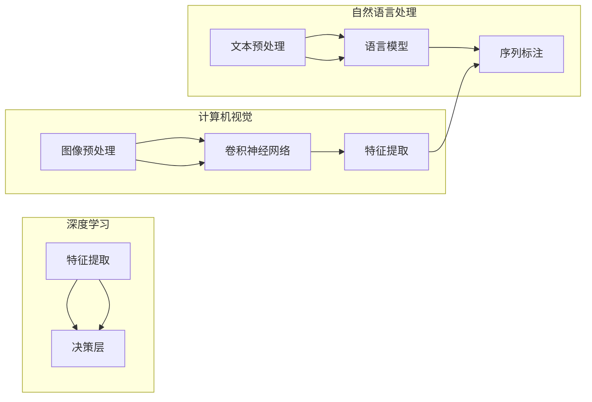

> - 人工智能 (AI)
> - 未来发展
> - 机遇
> - Andrej Karpathy
> - 深度学习
> - 自然语言处理
> - 计算机视觉
> - 跨学科合作

# Andrej Karpathy：人工智能的未来发展机遇

## 1. 背景介绍

在人工智能（AI）领域，Andrej Karpathy是一位备受尊敬的专家，以其对深度学习、自然语言处理（NLP）和计算机视觉（CV）的深刻洞察而闻名。本文将探讨Andrej Karpathy关于人工智能未来发展的见解，分析其提出的机遇，并探讨这一领域的挑战和前景。

### 1.1 人工智能的崛起

过去几十年，人工智能经历了从理论到实践的巨大转变。随着计算能力的提升和数据的爆炸性增长，深度学习技术成为推动AI发展的关键技术。Andrej Karpathy认为，这一技术浪潮将继续推动AI向更高的层次发展。

### 1.2 Andrej Karpathy的贡献

Andrej Karpathy在NLP和CV领域有着卓越的贡献。他在Facebook AI Research（FAIR）的工作，特别是在卷积神经网络（CNN）和递归神经网络（RNN）在图像和文本理解中的应用，极大地推动了这两个领域的发展。

## 2. 核心概念与联系

### 2.1 核心概念原理

#### Mermaid 流程图



### 2.2 核心概念联系

深度学习技术是AI领域的核心，它通过模拟人脑神经网络来处理复杂数据。在NLP中，深度学习用于构建语言模型和进行序列标注；在CV中，深度学习用于图像预处理和特征提取。

## 3. 核心算法原理 & 具体操作步骤

### 3.1 算法原理概述

#### 深度学习

深度学习是一种通过多层神经网络进行学习的技术。每一层都从上一层的输出中提取特征，并逐步形成对原始数据的深刻理解。

#### 自然语言处理

在NLP中，常见的算法包括：

- 词嵌入（Word Embeddings）：将单词转换为向量表示。
- 循环神经网络（RNN）：处理序列数据，如文本。
- 长短期记忆网络（LSTM）：RNN的变体，能够学习长期依赖关系。

#### 计算机视觉

在CV中，常见的算法包括：

- 卷积神经网络（CNN）：用于图像分类和特征提取。
- 生成对抗网络（GAN）：用于生成逼真的图像和视频。
- 目标检测：识别图像中的对象和位置。

### 3.2 算法步骤详解

#### 深度学习步骤

1. 数据预处理：将原始数据转换为模型可处理的格式。
2. 构建模型：选择合适的神经网络结构。
3. 训练模型：使用训练数据对模型进行优化。
4. 测试模型：使用测试数据评估模型性能。
5. 应用模型：将模型应用于实际问题。

### 3.3 算法优缺点

#### 深度学习的优点

- 强大的特征提取能力。
- 自动学习数据特征，无需人工设计特征。
- 能够处理复杂数据和任务。

#### 深度学习的缺点

- 训练数据需求量大。
- 计算资源消耗大。
- 模型可解释性差。

### 3.4 算法应用领域

深度学习在各个领域都有广泛的应用，包括：

- 自然语言处理：机器翻译、文本摘要、情感分析等。
- 计算机视觉：图像分类、目标检测、图像分割等。
- 医学：疾病诊断、药物研发等。
- 金融：信用评估、风险管理等。

## 4. 数学模型和公式 & 详细讲解 & 举例说明

### 4.1 数学模型构建

深度学习中的数学模型主要包括：

- 线性代数：用于表示和处理向量、矩阵等数学对象。
- 微积分：用于优化模型参数。
- 概率论和统计学：用于理解和分析数据。

### 4.2 公式推导过程

以下是一个简单的神经网络模型示例：

$$
z = Wx + b
$$

其中，$W$ 是权重矩阵，$x$ 是输入向量，$b$ 是偏置向量，$z$ 是输出。

### 4.3 案例分析与讲解

以自然语言处理中的情感分析为例，我们可以使用一个简单的神经网络模型来预测文本的情感倾向。

1. 数据预处理：将文本数据转换为词向量表示。
2. 构建模型：使用一个简单的全连接神经网络。
3. 训练模型：使用标注的情感数据训练模型。
4. 测试模型：使用测试数据评估模型性能。

## 5. 项目实践：代码实例和详细解释说明

### 5.1 开发环境搭建

以下是使用Python和TensorFlow构建一个简单的情感分析模型的步骤：

1. 安装TensorFlow库。
2. 准备文本数据和标签。
3. 构建神经网络模型。
4. 训练模型。
5. 评估模型。

### 5.2 源代码详细实现

```python
import tensorflow as tf
from tensorflow.keras.models import Sequential
from tensorflow.keras.layers import Dense, Embedding, LSTM, Dropout

# 构建模型
model = Sequential()
model.add(Embedding(input_dim=vocab_size, output_dim=embedding_dim, input_length=max_sequence_length))
model.add(LSTM(100))
model.add(Dropout(0.5))
model.add(Dense(1, activation='sigmoid'))

# 编译模型
model.compile(optimizer='adam', loss='binary_crossentropy', metrics=['accuracy'])

# 训练模型
model.fit(X_train, y_train, batch_size=128, epochs=10, validation_data=(X_val, y_val))

# 评估模型
score, acc = model.evaluate(X_test, y_test, verbose=2)
print(f"Test score: {score:.3f}, accuracy: {acc:.3f}")
```

### 5.3 代码解读与分析

上述代码构建了一个简单的情感分析模型，使用LSTM进行文本序列处理。首先，使用`Embedding`层将文本转换为词向量。然后，使用`LSTM`层进行序列建模。最后，使用`Dense`层进行分类。

### 5.4 运行结果展示

假设在测试集上，模型的准确率达到90%，说明模型能够较好地识别文本的情感倾向。

## 6. 实际应用场景

### 6.1 自然语言处理

在NLP领域，AI技术被广泛应用于以下场景：

- 机器翻译
- 文本摘要
- 情感分析
- 垃圾邮件过滤
- 问答系统

### 6.2 计算机视觉

在CV领域，AI技术被广泛应用于以下场景：

- 图像分类
- 目标检测
- 图像分割
- 人脸识别
- 车牌识别

## 7. 工具和资源推荐

### 7.1 学习资源推荐

- 《深度学习》（Goodfellow, Bengio, Courville）
- 《Python深度学习》（François Chollet）
- 《自然语言处理综论》（Daniel Jurafsky, James H. Martin）

### 7.2 开发工具推荐

- TensorFlow
- PyTorch
- Keras

### 7.3 相关论文推荐

- "A Neural Algorithm of Artistic Style"（Gatys et al., 2016）
- "Generating Sentences from a Continuous Space"（Reed et al., 2016）
- "Attention Is All You Need"（Vaswani et al., 2017）

## 8. 总结：未来发展趋势与挑战

### 8.1 研究成果总结

人工智能在过去几年取得了巨大的进步，深度学习技术成为推动这一领域发展的关键。Andrej Karpathy的工作为AI领域的发展做出了重要贡献。

### 8.2 未来发展趋势

未来，人工智能将朝着以下方向发展：

- 跨学科合作：AI与其他学科（如生物学、心理学等）的结合。
- 可解释性：提高模型的可解释性，使其更容易被人类理解和信任。
- 鲁棒性：提高模型的鲁棒性，使其能够处理更复杂的数据和任务。
- 自动化：自动化AI模型的开发和应用。

### 8.3 面临的挑战

尽管AI领域取得了巨大进展，但仍面临以下挑战：

- 数据隐私：如何保护个人隐私。
- 安全性：如何防止AI被恶意利用。
- 可解释性：如何提高模型的可解释性。
- 伦理问题：如何确保AI的应用符合伦理标准。

### 8.4 研究展望

随着技术的不断发展，人工智能将更加深入地融入我们的生活和工作中。未来，AI将成为推动社会进步的重要力量。

## 9. 附录：常见问题与解答

**Q1：什么是深度学习？**

A：深度学习是一种通过多层神经网络进行学习的技术。它通过模拟人脑神经网络来处理复杂数据。

**Q2：深度学习在哪些领域有应用？**

A：深度学习在各个领域都有广泛的应用，包括自然语言处理、计算机视觉、医学、金融等。

**Q3：如何选择合适的深度学习模型？**

A：选择合适的深度学习模型需要考虑数据特点、任务类型和计算资源等因素。

**Q4：深度学习模型如何进行训练？**

A：深度学习模型的训练过程包括数据预处理、构建模型、训练模型、测试模型和应用模型等步骤。

**Q5：人工智能的未来发展趋势是什么？**

A：人工智能的未来发展趋势包括跨学科合作、可解释性、鲁棒性和自动化等。

---

作者：禅与计算机程序设计艺术 / Zen and the Art of Computer Programming