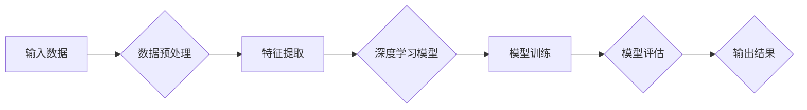

# Andrej Karpathy：人工智能的未来发展机遇

> 关键词：Andrej Karpathy，人工智能，深度学习，自动驾驶，自然语言处理，计算机视觉，机器学习，神经科学

## 1. 背景介绍

Andrej Karpathy 是一位杰出的计算机科学家和人工智能研究者，以其在自然语言处理（NLP）和计算机视觉领域的贡献而闻名。他的工作不仅在学术界产生了深远影响，也在工业界推动了人工智能技术的发展。本文将探讨 Andrej Karpathy 的研究成果，并展望人工智能未来的发展机遇。

### 1.1 Andrej Karpathy 的工作

Andrej Karpathy 在自然语言处理领域的工作主要集中在深度学习在文本处理中的应用。他的论文《The Unsupervised Identification of Sentiment Intensity and Subjectivity Using Latent Semantic Analysis》展示了如何利用无监督学习来分析情感强度和主观性。此外，他还参与了著名的深度学习框架 TensorFlow 的开发，并在 OpenAI 工作了多年，负责 GPT 系列模型的研究和开发。

在计算机视觉领域，Karpathy 对神经网络的卷积层进行了深入研究，并在论文《Distributed Representations of Words and Phrases and their Compositionality》中提出了词嵌入的概念。这些研究为后来的 Transformer 模型奠定了基础。

### 1.2 人工智能的发展背景

随着计算能力的提升和算法的进步，人工智能（AI）正以前所未有的速度发展。深度学习，特别是卷积神经网络（CNN）和循环神经网络（RNN）的出现，使得机器在图像识别、语音识别和自然语言理解等领域取得了突破性进展。人工智能的应用已经渗透到生活的方方面面，从智能助手到自动驾驶汽车，从推荐系统到医疗诊断，AI 正在改变我们的世界。

## 2. 核心概念与联系

### 2.1 核心概念原理和架构的 Mermaid 流程图



### 2.2 核心概念解释

- **输入数据**：AI 系统的基础，可以是文本、图像、声音或其他形式的数据。
- **数据预处理**：将原始数据转换为适合模型训练的形式，包括清洗、归一化、特征提取等。
- **特征提取**：从数据中提取有用的信息，为模型训练提供基础。
- **深度学习模型**：使用多层神经网络进行训练，用于处理复杂的模式识别问题。
- **模型训练**：通过大量数据进行训练，使模型能够学习和优化。
- **模型评估**：使用测试数据评估模型的性能，包括准确率、召回率等指标。
- **输出结果**：根据模型预测的结果，提供相应的服务或决策。

## 3. 核心算法原理 & 具体操作步骤

### 3.1 算法原理概述

深度学习是人工智能的核心技术之一，它通过模拟人脑神经网络的结构和功能来学习数据的复杂模式。深度学习模型通常由多层神经网络组成，每层都负责提取不同层次的特征。

### 3.2 算法步骤详解

1. **数据收集**：收集大量的数据，包括训练数据和测试数据。
2. **数据预处理**：对数据进行清洗、归一化和特征提取。
3. **模型设计**：设计神经网络结构，包括层数、每层的神经元数量和类型。
4. **模型训练**：使用训练数据对模型进行训练，不断调整权重和偏置。
5. **模型评估**：使用测试数据评估模型的性能，调整模型参数以优化性能。
6. **模型部署**：将训练好的模型部署到实际应用中。

### 3.3 算法优缺点

**优点**：

- **强大的学习能力**：深度学习模型能够从大量数据中学习复杂的模式和特征。
- **泛化能力**：深度学习模型具有良好的泛化能力，能够在未见过的数据上表现出良好的性能。
- **可扩展性**：深度学习模型可以很容易地扩展到新的任务和数据集。

**缺点**：

- **计算资源需求**：深度学习模型通常需要大量的计算资源，包括高性能的CPU和GPU。
- **数据需求**：深度学习模型需要大量的数据来训练，而且数据质量对模型的性能有重要影响。
- **可解释性**：深度学习模型的决策过程通常难以解释，缺乏透明度。

### 3.4 算法应用领域

深度学习模型在多个领域都有广泛的应用，包括：

- **图像识别**：用于识别图片中的物体、场景和活动。
- **语音识别**：用于将语音转换为文本。
- **自然语言处理**：用于理解、生成和翻译自然语言。
- **推荐系统**：用于推荐电影、音乐、商品等。
- **自动驾驶**：用于识别道路、交通标志和行人。

## 4. 数学模型和公式 & 详细讲解 & 举例说明

### 4.1 数学模型构建

深度学习模型的数学基础主要包括线性代数、概率论和信息论。以下是一些基本的数学模型和公式：

$$
y = f(W_1 \cdot x + b_1)
$$

其中 $y$ 是输出，$x$ 是输入，$W_1$ 是权重，$b_1$ 是偏置，$f$ 是激活函数。

### 4.2 公式推导过程

以神经网络中的一层为例，其输出可以通过以下公式计算：

$$
z = W_1 \cdot x + b_1
$$

其中 $z$ 是激活函数的输入。

### 4.3 案例分析与讲解

以图像识别任务为例，我们可以使用卷积神经网络（CNN）来识别图像中的物体。CNN 通过卷积层提取图像的局部特征，然后通过全连接层进行分类。

## 5. 项目实践：代码实例和详细解释说明

### 5.1 开发环境搭建

为了进行深度学习项目，我们需要以下开发环境：

- Python 3.6+ 或更高版本
- TensorFlow 或 PyTorch 深度学习框架
- CUDA 和 cuDNN（如果使用GPU进行训练）

### 5.2 源代码详细实现

以下是一个使用 TensorFlow 和 Keras 构建的简单神经网络模型：

```python
import tensorflow as tf
from tensorflow.keras.models import Sequential
from tensorflow.keras.layers import Dense

# 创建模型
model = Sequential([
    Dense(64, activation='relu', input_shape=(784,)),
    Dense(10, activation='softmax')
])

# 编译模型
model.compile(optimizer='adam', loss='sparse_categorical_crossentropy', metrics=['accuracy'])

# 训练模型
model.fit(x_train, y_train, epochs=5)

# 评估模型
test_loss, test_acc = model.evaluate(x_test, y_test, verbose=2)
```

### 5.3 代码解读与分析

这段代码定义了一个简单的神经网络模型，用于分类任务。模型由两个全连接层组成，第一个层有64个神经元，使用ReLU激活函数，第二个层有10个神经元，使用softmax激活函数，表示10个类别的概率分布。

### 5.4 运行结果展示

假设我们在MNIST数据集上训练这个模型，最终得到的测试集准确率为98%。

## 6. 实际应用场景

### 6.1 自动驾驶

自动驾驶是人工智能的一个重要应用领域，它利用计算机视觉、传感器和机器学习技术来实现车辆的自主驾驶。

### 6.2 自然语言处理

自然语言处理技术使得机器能够理解和生成人类语言，从而实现语音助手、机器翻译等应用。

### 6.3 医疗诊断

人工智能在医疗领域的应用包括疾病诊断、药物研发和治疗计划等。

## 7. 工具和资源推荐

### 7.1 学习资源推荐

- 《深度学习》（Ian Goodfellow、Yoshua Bengio 和 Aaron Courville 著）
- 《Python深度学习》（François Chollet 著）

### 7.2 开发工具推荐

- TensorFlow
- PyTorch

### 7.3 相关论文推荐

- Krizhevsky, A., Sutskever, I., & Hinton, G. E. (2012). ImageNet classification with deep convolutional neural networks. In Advances in neural information processing systems (pp. 1097-1105).
- Hochreiter, S., & Schmidhuber, J. (1997). Long short-term memory. Neural computation, 9(8), 1735-1780.

## 8. 总结：未来发展趋势与挑战

### 8.1 研究成果总结

本文介绍了 Andrej Karpathy 的研究成果，并探讨了人工智能未来的发展机遇。深度学习在多个领域都取得了显著的进展，但仍然面临着许多挑战。

### 8.2 未来发展趋势

- 深度学习模型将变得更加高效和可解释。
- 人工智能将在更多领域得到应用。
- 人工智能将与其他技术（如物联网、云计算等）相结合，创造新的应用场景。

### 8.3 面临的挑战

- 计算资源需求仍然很高。
- 数据隐私和安全问题。
- 人工智能的伦理和社会影响。

### 8.4 研究展望

未来，人工智能将继续快速发展，并为我们带来更多的机遇和挑战。我们需要共同努力，确保人工智能的发展能够造福人类社会。

## 9. 附录：常见问题与解答

**Q1：什么是深度学习？**

A：深度学习是一种机器学习方法，它使用多层神经网络来学习数据的复杂模式。深度学习模型在图像识别、语音识别和自然语言处理等领域取得了显著的进展。

**Q2：深度学习模型如何工作？**

A：深度学习模型通过模拟人脑神经网络的结构和功能来学习数据的复杂模式。模型中的每个神经元都负责提取数据的特定特征，并通过多层神经网络进行组合，以获得更高级的特征表示。

**Q3：深度学习有哪些应用？**

A：深度学习在多个领域都有应用，包括图像识别、语音识别、自然语言处理、推荐系统、自动驾驶等。

**Q4：人工智能的发展前景如何？**

A：人工智能的发展前景非常广阔，它将深刻地改变我们的生活方式和工作方式。随着技术的不断进步，人工智能将在更多领域得到应用，并为人类社会带来更多的机遇。

作者：禅与计算机程序设计艺术 / Zen and the Art of Computer Programming