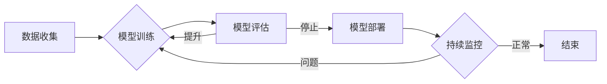

> 关键词：Andrej Karpathy，人工智能，未来趋势，深度学习，自然语言处理，计算机视觉，伦理挑战

# Andrej Karpathy：人工智能的未来发展机遇

## 1. 背景介绍

Andrej Karpathy 是一位享有盛誉的人工智能专家，以其对深度学习，特别是自然语言处理（NLP）和计算机视觉（CV）领域的贡献而闻名。他在 OpenAI 担任研究科学家，并因其在技术博客和社交媒体上的影响力而备受尊敬。本文将探讨 Andrej Karpathy 的见解，以及他对人工智能未来发展的机遇和挑战的看法。

## 2. 核心概念与联系

### 2.1 核心概念原理

#### Mermaid 流程图



#### 关键概念

- **数据收集**：收集大量的数据是人工智能模型训练的基础。
- **模型训练**：使用收集到的数据训练人工智能模型。
- **模型评估**：评估模型的性能，包括准确性、效率和泛化能力。
- **模型部署**：将训练好的模型部署到实际应用中。
- **持续监控**：监控模型的性能，确保其持续满足需求。

### 2.2 关联性

Karpathy 的研究工作主要集中在将深度学习应用于自然语言处理和计算机视觉领域，这两个领域是人工智能应用中最活跃的领域之一。他的工作强调了数据、算法和模型部署之间的紧密联系。

## 3. 核心算法原理 & 具体操作步骤

### 3.1 算法原理概述

Karpathy 的研究侧重于以下核心算法：

- **深度神经网络（DNN）**：用于处理复杂的非线性关系。
- **递归神经网络（RNN）**：特别适用于序列数据的处理，如文本和语音。
- **长短期记忆网络（LSTM）**：RNN的一种变体，可以学习长期依赖。
- **Transformer**：一种基于自注意力机制的模型，广泛应用于NLP和CV任务。

### 3.2 算法步骤详解

1. **数据收集**：收集相关的文本、图像或其他类型的数据。
2. **数据预处理**：对数据进行清洗、标注和格式化。
3. **模型设计**：选择合适的模型架构，如DNN、RNN或Transformer。
4. **模型训练**：使用收集到的数据训练模型。
5. **模型评估**：使用验证集评估模型的性能。
6. **模型优化**：根据评估结果调整模型参数。
7. **模型部署**：将训练好的模型部署到生产环境中。

### 3.3 算法优缺点

#### 优点

- **强大的学习能力**：深度学习模型可以学习复杂的模式和特征。
- **泛化能力**：在未见过的数据上也能表现出良好的性能。
- **自动化**：减少了手动特征工程的需求。

#### 缺点

- **数据需求**：需要大量的标注数据来训练模型。
- **计算需求**：训练深度学习模型需要大量的计算资源。
- **模型可解释性**：深度学习模型的决策过程往往难以解释。

### 3.4 算法应用领域

Karpathy 的研究在以下领域有广泛应用：

- **自然语言处理**：文本分类、机器翻译、情感分析等。
- **计算机视觉**：图像识别、目标检测、图像生成等。

## 4. 数学模型和公式 & 详细讲解 & 举例说明

### 4.1 数学模型构建

深度学习模型通常由多层神经网络组成，每层包含多个神经元。每个神经元通过权重和偏置学习输入和输出之间的关系。

#### 数学公式

$$
y = f(Wx + b)
$$

其中，$y$ 是输出，$W$ 是权重，$x$ 是输入，$b$ 是偏置，$f$ 是激活函数。

### 4.2 公式推导过程

深度学习模型的训练过程涉及损失函数的优化。损失函数衡量模型预测值和真实值之间的差异。

#### 损失函数

$$
L = \frac{1}{N} \sum_{i=1}^{N} (y_i - \hat{y}_i)^2
$$

其中，$L$ 是损失函数，$N$ 是样本数量，$y_i$ 是真实值，$\hat{y}_i$ 是预测值。

### 4.3 案例分析与讲解

以情感分析任务为例，可以使用二元交叉熵损失函数来衡量模型预测文本情感（正面或负面）的准确性。

## 5. 项目实践：代码实例和详细解释说明

### 5.1 开发环境搭建

以下是使用Python和TensorFlow构建情感分析模型的步骤：

```python
import tensorflow as tf
from tensorflow.keras.preprocessing.text import Tokenizer
from tensorflow.keras.preprocessing.sequence import pad_sequences
from tensorflow.keras.models import Sequential
from tensorflow.keras.layers import Embedding, GlobalAveragePooling1D, Dense

# 加载数据集
texts = [...]  # 文本数据
labels = [...]  # 标签数据

# 分词和序列化
tokenizer = Tokenizer()
tokenizer.fit_on_texts(texts)
sequences = tokenizer.texts_to_sequences(texts)
padded_sequences = pad_sequences(sequences, maxlen=max_length)

# 构建模型
model = Sequential()
model.add(Embedding(input_dim=vocab_size, output_dim=embedding_dim, input_length=max_length))
model.add(GlobalAveragePooling1D())
model.add(Dense(1, activation='sigmoid'))

# 编译模型
model.compile(optimizer='adam', loss='binary_crossentropy', metrics=['accuracy'])

# 训练模型
model.fit(padded_sequences, labels, epochs=10, batch_size=32)

# 预测
predictions = model.predict(padded_sequences)
```

### 5.2 源代码详细实现

上述代码展示了如何使用TensorFlow构建一个简单的情感分析模型。首先，对文本数据进行分词和序列化，然后构建一个包含嵌入层、全局平均池化层和输出层的序列模型。最后，编译和训练模型。

### 5.3 代码解读与分析

- **Tokenizer**：将文本数据转换为序列，以便模型处理。
- **Embedding**：将文本序列转换为词向量。
- **GlobalAveragePooling1D**：对序列进行全局平均池化，提取特征。
- **Dense**：输出层，使用sigmoid激活函数进行二元分类。

## 6. 实际应用场景

Karpathy 的研究在多个实际应用场景中取得了成功，包括：

- **自然语言处理**：机器翻译、问答系统、文本摘要等。
- **计算机视觉**：图像识别、目标检测、图像生成等。
- **游戏**：游戏AI，如AlphaGo。

## 6.4 未来应用展望

Karpathy 对人工智能的未来应用充满期待，他认为：

- **自动化**：人工智能将在更多领域实现自动化，提高效率。
- **个性化**：人工智能将更好地理解用户需求，提供个性化服务。
- **跨学科**：人工智能将与其他学科（如生物学、物理学）结合，推动科学进步。

## 7. 工具和资源推荐

### 7.1 学习资源推荐

- TensorFlow官方文档：https://www.tensorflow.org/tutorials
- PyTorch官方文档：https://pytorch.org/tutorials
- Hugging Face Transformers库：https://huggingface.co/transformers

### 7.2 开发工具推荐

- Jupyter Notebook：https://jupyter.org/
- Google Colab：https://colab.research.google.com/

### 7.3 相关论文推荐

- "Attention is All You Need" by Ashish Vaswani et al.
- "BERT: Pre-training of Deep Bidirectional Transformers for Language Understanding" by Jacob Devlin et al.
- "Generative Adversarial Nets" by Ian Goodfellow et al.

## 8. 总结：未来发展趋势与挑战

### 8.1 研究成果总结

Karpathy 的工作为人工智能在自然语言处理和计算机视觉领域的应用做出了重要贡献。他的研究成果不仅推动了学术研究，也为工业应用提供了强大的技术支持。

### 8.2 未来发展趋势

人工智能将继续向以下方向发展：

- **更强大的模型**：模型将变得更加复杂和强大，能够处理更复杂的任务。
- **更高效的数据处理**：数据预处理和模型训练将更加高效。
- **更广泛的应用**：人工智能将在更多领域得到应用。

### 8.3 面临的挑战

人工智能在发展过程中也面临着一些挑战：

- **数据隐私**：如何保护用户数据隐私是一个重要问题。
- **伦理问题**：人工智能的决策过程可能存在偏见和歧视。
- **技术人才**：需要更多的技术人才来开发和应用人工智能技术。

### 8.4 研究展望

未来，人工智能将在以下方面取得重大进展：

- **人机交互**：人工智能将更好地理解人类意图，提供更加自然和流畅的交互体验。
- **智能决策**：人工智能将帮助人类做出更明智的决策。
- **通用人工智能**：人工智能将变得更加通用，能够执行各种任务。

## 9. 附录：常见问题与解答

### 附录 9.1

**Q1：人工智能的未来会是什么样子？**

A1：人工智能的未来将会更加智能、通用和个性化。它将能够更好地理解人类意图，提供更加自然和流畅的交互体验，并在更多领域得到应用。

### 附录 9.2

**Q2：人工智能会取代人类吗？**

A2：人工智能不会取代人类，而是将作为人类的伙伴，帮助人类完成更多任务，提高工作效率。

### 附录 9.3

**Q3：如何成为一名人工智能专家？**

A3：成为一名人工智能专家需要具备扎实的计算机科学和数学基础，同时需要不断学习和实践。以下是一些建议：

- 学习计算机科学和数学的基础知识。
- 学习编程语言，如Python。
- 学习机器学习和深度学习的基础知识。
- 参与开源项目，实践编程技能。
- 阅读相关书籍和论文，了解最新的研究进展。

---

作者：禅与计算机程序设计艺术 / Zen and the Art of Computer Programming