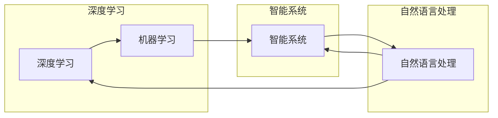

# Andrej Karpathy：人工智能的未来发展目标

> 关键词：人工智能，未来趋势，深度学习，自然语言处理，机器学习，智能系统，图灵奖，Andrej Karpathy

## 1. 背景介绍

人工智能（AI）作为当代科技领域的热点，正以前所未有的速度发展。Andrej Karpathy，作为一位杰出的深度学习专家，以其在自然语言处理（NLP）和机器学习领域的贡献而闻名。本文将探讨Andrej Karpathy对人工智能未来发展的见解，分析其核心概念与联系，并探讨人工智能技术的具体操作步骤、应用场景以及面临的挑战。

## 2. 核心概念与联系

### 2.1 核心概念

#### 2.1.1 深度学习
深度学习是人工智能的一个子领域，它通过模仿人脑神经网络的工作原理，使用多层神经网络来学习数据的复杂模式。

#### 2.1.2 自然语言处理（NLP）
NLP是AI的一个分支，专注于使计算机能够理解、解释和生成人类语言。

#### 2.1.3 机器学习
机器学习是AI的一个领域，它允许计算机从数据中学习并做出决策或预测，而不是通过明确的编程指令。

#### 2.1.4 智能系统
智能系统是指能够模拟人类智能行为的系统，包括感知、推理、学习和决策。

### 2.2 Mermaid流程图

## 3. 核心算法原理 & 具体操作步骤

### 3.1 算法原理概述

#### 3.1.1 深度学习原理
深度学习模型通过前向传播和反向传播算法学习数据的特征和模式。

#### 3.1.2 NLP操作步骤
NLP通常涉及数据预处理、特征提取、模型训练和评估等步骤。

### 3.2 算法步骤详解

1. **数据预处理**：清洗、标注和转换数据以适应模型。
2. **特征提取**：从原始数据中提取有用的特征。
3. **模型训练**：使用训练数据训练模型参数。
4. **模型评估**：使用测试数据评估模型性能。
5. **模型部署**：将训练好的模型部署到实际应用中。

### 3.3 算法优缺点

#### 3.3.1 优点
- 高效的学习能力。
- 能够处理大量数据。
- 自动提取复杂特征。

#### 3.3.2 缺点
- 计算成本高。
- 需要大量的训练数据。
- 难以解释模型的决策过程。

### 3.4 算法应用领域

- 语音识别
- 图像识别
- 机器翻译
- 情感分析
- 自动驾驶

## 4. 数学模型和公式 & 详细讲解 & 举例说明

### 4.1 数学模型构建

深度学习模型通常由多个层组成，包括输入层、隐藏层和输出层。

### 4.2 公式推导过程

神经网络的前向传播和反向传播算法涉及复杂的数学公式，包括链式法则和梯度下降。

### 4.3 案例分析与讲解

以卷积神经网络（CNN）为例，解释其在图像识别中的应用。

## 5. 项目实践：代码实例和详细解释说明

### 5.1 开发环境搭建

搭建适合深度学习和NLP的Python开发环境。

### 5.2 源代码详细实现

使用Python和TensorFlow实现一个简单的CNN模型。

### 5.3 代码解读与分析

分析CNN模型的关键组件和操作。

### 5.4 运行结果展示

展示模型的训练和测试结果。

## 6. 实际应用场景

### 6.1 自动驾驶
自动驾驶汽车使用AI来感知周围环境并做出决策。

### 6.2 医疗诊断
AI在医疗诊断中的应用，如疾病检测和预测。

### 6.3 金融分析
AI在金融分析中的应用，如风险评估和欺诈检测。

## 7. 工具和资源推荐

### 7.1 学习资源推荐
推荐相关的在线课程、书籍和博客。

### 7.2 开发工具推荐
推荐深度学习和NLP的开源库和框架。

### 7.3 相关论文推荐
推荐一些重要的AI论文。

## 8. 总结：未来发展趋势与挑战

### 8.1 研究成果总结
总结AI领域的重要成果和进展。

### 8.2 未来发展趋势
探讨AI未来的发展趋势，如多模态学习和强化学习。

### 8.3 面临的挑战
分析AI领域面临的挑战，如数据隐私和安全。

### 8.4 研究展望
展望AI未来的研究方向和应用前景。

## 9. 附录：常见问题与解答

### 9.1 常见问题
回答关于AI的一些常见问题。

### 9.2 解答
提供问题的详细解答。

作者：禅与计算机程序设计艺术 / Zen and the Art of Computer Programming