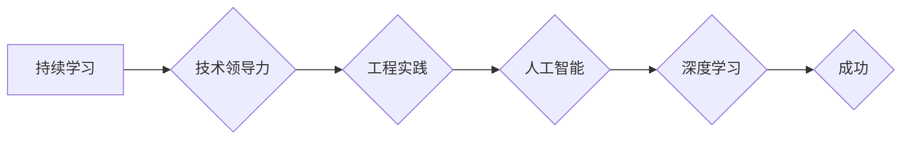

# Andrej Karpathy：持续性与成功的秘诀

> 关键词：Andrej Karpathy，持续学习，技术领导力，工程实践，人工智能，深度学习

## 1. 背景介绍

在当今快速发展的技术世界中，持续学习和技术领导力是成功的关键。Andrej Karpathy，作为一位知名的人工智能专家和深度学习领域的领军人物，以其在技术领域的深刻见解和对工程实践的执着追求而闻名。本文将探讨Andrej Karpathy的持续性和成功的秘诀，从他的工作方法、思考模式到他对技术的热情，为我们提供宝贵的启示。

## 2. 核心概念与联系

### 2.1 核心概念

#### 持续学习
持续学习是指在整个职业生涯中不断吸收新知识、技能和思维方式的过程。对于技术专家来说，这意味着不断跟进最新的技术趋势、工具和理论。

#### 技术领导力
技术领导力不仅包括对技术的深刻理解，还包括将技术转化为实际解决方案的能力，以及领导团队并推动技术项目成功的能力。

#### 工程实践
工程实践是指将理论知识应用于实际问题的过程，包括编码、调试、测试和部署。

#### 人工智能
人工智能（AI）是指由计算机系统执行的模拟人类智能的过程，包括学习、推理、感知和决策。

#### 深度学习
深度学习是机器学习的一个分支，它使用类似于大脑的神经网络结构来学习数据的复杂模式。

### 2.2 Mermaid 流程图



## 3. 核心算法原理 & 具体操作步骤

### 3.1 算法原理概述

Andrej Karpathy的成功秘诀可以概括为以下几点：

- **对技术的深刻理解**：保持对最新技术趋势的敏锐洞察，不断学习新的深度学习模型和算法。
- **工程实践能力**：将理论知识应用于实际问题的解决，注重代码质量和工程效率。
- **团队协作**：领导并激励团队，共同推动技术项目的成功。
- **沟通与分享**：通过写作、演讲和开源项目等方式，与社区分享知识和经验。

### 3.2 算法步骤详解

#### 步骤1：保持好奇心和学习热情

Andrej Karpathy对技术的热爱和好奇心是他持续学习的基础。他通过阅读论文、参与社区讨论和参加技术会议来不断拓宽知识面。

#### 步骤2：理论与实践结合

他不仅关注理论，还注重将理论知识应用于实际项目中。他曾在Twitter、OpenAI和Tesla等公司工作，积累了丰富的工程实践经验。

#### 步骤3：领导团队

Andrej Karpathy在OpenAI期间担任Research Scientist，领导团队进行深度学习研究。他善于沟通和激励团队成员，推动项目的顺利进行。

#### 步骤4：分享和贡献

Andrej Karpathy积极参与开源社区，通过写作、演讲和开源项目等方式分享知识和经验。他贡献了多个开源项目，包括著名的`tch-text`库。

## 4. 数学模型和公式 & 详细讲解 & 举例说明

### 4.1 数学模型构建

虽然Andrej Karpathy的工作主要集中在深度学习领域，但他的成功并非完全依赖于数学模型。以下是一些与深度学习相关的数学模型：

- **神经网络**：由多个神经元组成的计算模型，用于模拟大脑的工作原理。
- **卷积神经网络（CNN）**：用于图像识别和处理，具有局部感知和权重共享的特点。
- **递归神经网络（RNN）**：用于处理序列数据，能够捕捉时间序列中的依赖关系。
- **长短期记忆网络（LSTM）**：RNN的一种变体，能够学习长期依赖关系。

### 4.2 公式推导过程

由于Andrej Karpathy的工作更多集中在工程实践和团队管理，因此本文不深入探讨具体的数学公式推导过程。

### 4.3 案例分析与讲解

Andrej Karpathy在Twitter上的文章《The Unreasonable Effectiveness of Recurrent Neural Networks》详细介绍了RNN在自然语言处理中的应用。他通过分析RNN在语言建模、机器翻译和语音识别等任务上的表现，展示了RNN的强大能力。

## 5. 项目实践：代码实例和详细解释说明

### 5.1 开发环境搭建

Andrej Karpathy在多个开源项目中使用了Python和TensorFlow。搭建开发环境通常需要以下步骤：

1. 安装Python和pip。
2. 安装TensorFlow。
3. 安装其他必要的依赖库，如NumPy、Pandas等。

### 5.2 源代码详细实现

以下是一个简单的TensorFlow代码示例，用于构建一个简单的RNN模型：

```python
import tensorflow as tf
from tensorflow.keras.layers import Embedding, SimpleRNN, Dense

model = tf.keras.Sequential([
    Embedding(input_dim=10000, output_dim=32, input_length=50),
    SimpleRNN(32),
    Dense(1, activation='sigmoid')
])

model.compile(optimizer='adam', loss='binary_crossentropy', metrics=['accuracy'])
```

### 5.3 代码解读与分析

- `Embedding`层：将输入的整数序列转换为稠密向量表示。
- `SimpleRNN`层：一个简单的循环神经网络层，用于处理序列数据。
- `Dense`层：一个全连接层，用于输出最终的预测结果。

### 5.4 运行结果展示

运行上述代码并使用适当的训练数据，可以训练一个简单的RNN模型。模型的性能可以通过损失函数和准确率等指标进行评估。

## 6. 实际应用场景

Andrej Karpathy在Twitter、OpenAI和Tesla等公司的工作经历，使他有机会将深度学习应用于不同的实际场景：

- **Twitter**：使用深度学习模型进行用户行为分析和推荐系统。
- **OpenAI**：研究通用人工智能和深度学习在语言理解、生成和推理等方面的应用。
- **Tesla**：将深度学习应用于自动驾驶和车辆控制等领域。

## 7. 工具和资源推荐

### 7.1 学习资源推荐

- TensorFlow官方文档：提供TensorFlow的详细教程和API文档。
- Coursera和edX上的深度学习课程：提供由顶尖大学和公司提供的深度学习课程。
- arXiv论文预印本：提供最新的深度学习研究成果。

### 7.2 开发工具推荐

- Jupyter Notebook：用于数据分析和实验。
- PyCharm和Visual Studio Code：流行的Python集成开发环境。
- TensorBoard：TensorFlow的可视化工具。

### 7.3 相关论文推荐

- "A Neural Algorithm of Artistic Style"（Gatys等，2015）
- "Sequence to Sequence Learning with Neural Networks"（Sutskever等，2014）
- "Attention Is All You Need"（Vaswani等，2017）

## 8. 总结：未来发展趋势与挑战

### 8.1 研究成果总结

Andrej Karpathy的成功故事为技术专家提供了宝贵的经验。他的持续学习、技术领导力和工程实践能力是他取得成功的关键。

### 8.2 未来发展趋势

随着深度学习的不断发展，未来技术专家需要具备以下能力：

- 对新技术的敏锐洞察力
- 跨学科的知识储备
- 团队协作和领导能力
- 代码质量和工程效率

### 8.3 面临的挑战

技术专家面临的挑战包括：

- 技术更新的速度加快
- 数据安全和个人隐私保护
- 跨学科知识的整合
- 伦理和社会影响

### 8.4 研究展望

未来，技术专家需要更加注重以下方面的研究：

- 可解释人工智能
- 可信赖的人工智能
- 安全和隐私保护
- 人机交互

## 9. 附录：常见问题与解答

**Q1：Andrej Karpathy是如何取得成功的？**

A: Andrej Karpathy的成功可以归结为以下几点：对技术的热爱和好奇心、持续学习、将理论与实践结合、团队协作和分享经验。

**Q2：如何成为像Andrej Karpathy那样的技术专家？**

A: 要成为像Andrej Karpathy那样的技术专家，需要具备以下特质：对技术的热情、持续学习、扎实的理论基础、丰富的工程实践经验、良好的沟通和团队合作能力。

**Q3：深度学习在哪些领域有广泛应用？**

A: 深度学习在图像识别、语音识别、自然语言处理、推荐系统、自动驾驶等领域有广泛应用。

**Q4：如何跟上深度学习的最新进展？**

A: 要跟上深度学习的最新进展，可以通过阅读论文、参加技术会议、关注顶级研究机构和技术公司的动态等方式。

**Q5：深度学习有哪些局限性？**

A: 深度学习的局限性包括：对数据的需求量大、可解释性差、容易过拟合、需要大量的计算资源。

---

作者：禅与计算机程序设计艺术 / Zen and the Art of Computer Programming