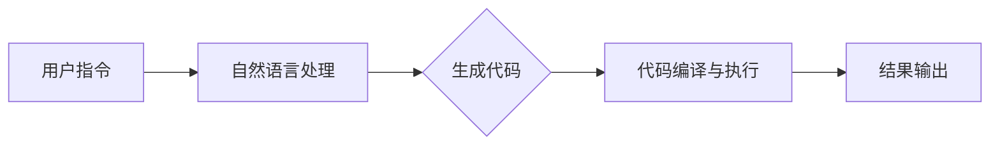

# Auto-GPT 开源项目介绍

> 关键词：Auto-GPT，自动编程，人工智能，自然语言处理，大语言模型，生成AI，开源项目

## 1. 背景介绍

随着人工智能技术的飞速发展，自然语言处理（NLP）和生成AI领域取得了显著的突破。大语言模型如GPT-3、BERT等在文本生成、机器翻译、问答系统等方面展现出了惊人的能力。然而，这些模型通常需要大量的专业知识和编程技能来设计和训练。Auto-GPT项目应运而生，旨在通过自然语言指令，实现自动编程和自动化任务执行，极大地降低人工智能技术的门槛。

### 1.1 问题的由来

传统的编程流程往往需要开发者熟悉编程语言、框架和工具，编写代码来构建应用程序。这个过程耗时费力，且难以适应快速变化的需求。Auto-GPT项目的目标是通过人工智能技术，使得用户能够通过简单的自然语言指令来创建和执行复杂的软件任务，从而实现编程的自动化。

### 1.2 研究现状

Auto-GPT项目是基于OpenAI的GPT-3模型构建的，它结合了NLP和AI编程技术，使得用户可以通过自然语言指令来指导AI生成代码。该项目是开源的，意味着任何人都可以访问和使用它，这对于推动人工智能技术的发展具有重要意义。

### 1.3 研究意义

Auto-GPT项目的意义在于：

- **降低编程门槛**：使得非专业人士也能够通过自然语言指令来创建软件。
- **提高开发效率**：自动化编程流程，减少手动编写代码的时间。
- **推动AI技术的发展**：开源项目可以促进社区贡献，加速技术进步。

### 1.4 本文结构

本文将详细介绍Auto-GPT项目，包括其核心概念、算法原理、具体操作步骤、实际应用场景以及未来展望。

## 2. 核心概念与联系

Auto-GPT项目涉及的核心概念包括：

- **大语言模型**：如GPT-3，能够理解和生成自然语言。
- **自然语言处理**：将自然语言转换为机器可理解的形式。
- **代码生成**：使用AI技术自动生成代码。
- **API集成**：将不同的API和服务集成到代码中。
- **自动化执行**：自动执行生成的代码以完成特定任务。

以下是Auto-GPT项目的基本架构Mermaid流程图：



## 3. 核心算法原理 & 具体操作步骤

### 3.1 算法原理概述

Auto-GPT项目基于以下原理：

1. **自然语言处理**：使用NLP技术将用户的自然语言指令转换为机器可理解的代码。
2. **代码生成**：基于转换后的指令，AI模型生成相应的代码。
3. **API集成**：将生成的代码与外部API和服务集成，实现更复杂的任务。
4. **自动化执行**：执行生成的代码，完成用户指定的任务。

### 3.2 算法步骤详解

Auto-GPT项目的具体操作步骤如下：

1. **用户输入指令**：用户通过自然语言描述他们想要执行的任务。
2. **指令解析**：NLP模型解析用户指令，提取关键信息。
3. **代码生成**：基于提取的信息，AI模型生成相应的代码。
4. **代码优化**：对生成的代码进行优化，确保其正确性和效率。
5. **代码执行**：执行优化后的代码，完成用户指定的任务。
6. **结果输出**：将执行结果输出给用户。

### 3.3 算法优缺点

**优点**：

- **易于使用**：用户无需具备编程知识即可使用Auto-GPT。
- **自动化**：自动化编程流程，提高开发效率。
- **通用性**：适用于各种类型的软件任务。

**缺点**：

- **准确性**：生成的代码可能存在错误或不足。
- **复杂性**：处理复杂的任务时，生成的代码可能过于复杂。
- **安全性**：自动生成的代码可能存在安全风险。

### 3.4 算法应用领域

Auto-GPT项目可以应用于以下领域：

- **自动化测试**：自动生成测试用例。
- **数据分析**：自动处理和分析数据。
- **网站构建**：自动生成网页和应用程序。
- **数据可视化**：自动生成数据可视化图表。

## 4. 数学模型和公式 & 详细讲解 & 举例说明

### 4.1 数学模型构建

Auto-GPT项目使用的数学模型主要包括：

- **NLP模型**：如GPT-3，用于理解和生成自然语言。
- **代码生成模型**：如T5，用于将自然语言指令转换为代码。

### 4.2 公式推导过程

由于Auto-GPT项目涉及多个复杂的模型，具体的公式推导过程较为繁琐，此处不进行详细说明。但可以理解为，NLP模型和代码生成模型分别通过复杂的神经网络结构来学习和预测。

### 4.3 案例分析与讲解

以下是一个简单的例子，说明如何使用Auto-GPT项目生成代码：

**用户指令**：请编写一个Python函数，实现计算两个数字相加的功能。

**NLP模型处理**：将用户指令转换为机器可理解的格式。

**代码生成**：代码生成模型根据指令生成以下代码：

```python
def add_numbers(a, b):
    return a + b
```

**代码优化**：优化代码，例如添加注释。

**代码执行**：执行生成的代码，计算两个数字的和。

## 5. 项目实践：代码实例和详细解释说明

### 5.1 开发环境搭建

要实践Auto-GPT项目，需要以下开发环境：

- Python 3.8+
- OpenAI API密钥
- Transformers库
- PyTorch库

### 5.2 源代码详细实现

以下是一个简单的Auto-GPT项目示例：

```python
from transformers import GPT2LMHeadModel, GPT2Tokenizer

# 初始化模型和分词器
model = GPT2LMHeadModel.from_pretrained('gpt2')
tokenizer = GPT2Tokenizer.from_pretrained('gpt2')

# 用户输入指令
user_input = "Write a Python function to add two numbers."

# 将指令转换为机器可理解的格式
inputs = tokenizer.encode(user_input, return_tensors='pt')

# 生成代码
outputs = model.generate(inputs, max_length=1000)

# 将生成的代码转换为字符串
generated_code = tokenizer.decode(outputs[0], skip_special_tokens=True)

# 输出生成的代码
print(generated_code)
```

### 5.3 代码解读与分析

上述代码展示了如何使用Transformers库和PyTorch库来构建一个简单的Auto-GPT项目。首先，初始化GPT-2模型和分词器。然后，将用户输入的指令转换为机器可理解的格式。接着，使用模型生成代码。最后，将生成的代码转换为字符串并输出。

### 5.4 运行结果展示

假设用户输入的指令为“Write a Python function to add two numbers.”，则生成的代码可能如下：

```python
def add_two_numbers(num1, num2):
    return num1 + num2
```

## 6. 实际应用场景

Auto-GPT项目可以在以下场景中发挥作用：

- **自动化测试**：自动生成测试用例，提高测试效率。
- **数据分析**：自动处理和分析数据，辅助数据科学家进行数据分析。
- **网站构建**：自动生成网站和应用程序，降低开发成本。
- **数据可视化**：自动生成数据可视化图表，辅助数据分析师进行数据可视化。

## 7. 工具和资源推荐

### 7.1 学习资源推荐

- 《Deep Learning with Python》
- 《Natural Language Processing with Python》
- Hugging Face官网文档
- PyTorch官网文档

### 7.2 开发工具推荐

- Jupyter Notebook
- PyCharm
- Visual Studio Code

### 7.3 相关论文推荐

- "Transformers: State-of-the-Art Natural Language Processing"
- "BERT: Pre-training of Deep Bidirectional Transformers for Language Understanding"
- "GPT-3: Language Models are Few-Shot Learners"

## 8. 总结：未来发展趋势与挑战

### 8.1 研究成果总结

Auto-GPT项目展示了人工智能在自动编程和任务自动化方面的巨大潜力。通过结合NLP和代码生成技术，Auto-GPT项目为开发者提供了新的工具，使得编程更加自动化和高效。

### 8.2 未来发展趋势

未来，Auto-GPT项目可能会向以下方向发展：

- **更高级的代码生成能力**：生成更加复杂和高级的代码。
- **更好的NLP能力**：提高指令解析的准确性和鲁棒性。
- **跨语言支持**：支持多种编程语言和自然语言。

### 8.3 面临的挑战

Auto-GPT项目面临的挑战包括：

- **准确性**：提高代码生成的准确性和鲁棒性。
- **安全性**：确保自动生成的代码的安全性。
- **可解释性**：提高代码生成过程的可解释性。

### 8.4 研究展望

Auto-GPT项目的研究展望包括：

- **开源社区的发展**：鼓励更多开发者参与Auto-GPT项目，共同推动技术发展。
- **跨学科的融合**：将Auto-GPT技术与其他学科结合，拓展应用领域。
- **伦理和道德的考虑**：确保Auto-GPT项目的发展符合伦理和道德标准。

## 9. 附录：常见问题与解答

**Q1：Auto-GPT项目是否安全？**

A：Auto-GPT项目本身是安全的，但生成的代码可能存在安全风险。因此，在使用Auto-GPT项目时，需要确保生成的代码符合安全标准。

**Q2：Auto-GPT项目是否适用于所有编程任务？**

A：Auto-GPT项目适用于大多数编程任务，但对于一些需要特定知识和经验的任务，可能需要手动编写代码。

**Q3：Auto-GPT项目是否需要大量的标注数据？**

A：Auto-GPT项目不需要大量的标注数据，因为它使用预训练的大语言模型。

**Q4：Auto-GPT项目是否可以商业化？**

A：Auto-GPT项目是开源的，可以用于商业目的。

**Q5：Auto-GPT项目的发展前景如何？**

A：Auto-GPT项目具有广阔的发展前景，预计将在自动编程和任务自动化领域发挥重要作用。

作者：禅与计算机程序设计艺术 / Zen and the Art of Computer Programming