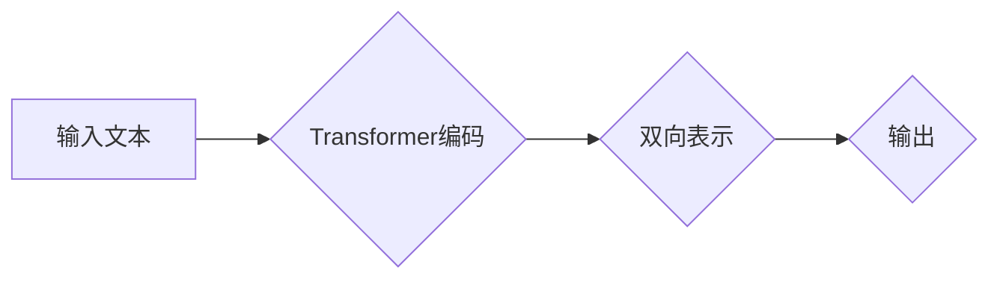
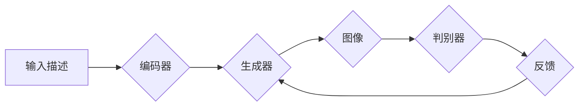
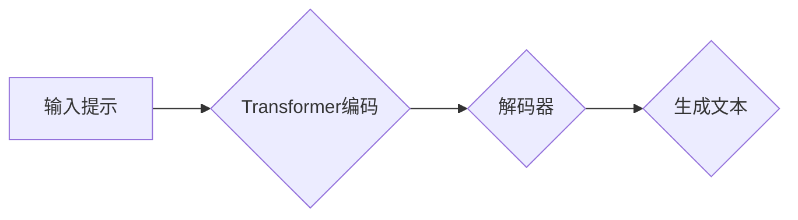

> 关键词：BERT, DALL-E, GPT-3, 自然语言处理, 计算机视觉, 人工智能, 预训练模型, 生成模型, 跨学科融合

# BERT、DALL-E和GPT-3的崛起

随着深度学习技术的飞速发展，自然语言处理（NLP）和计算机视觉（CV）领域涌现出了许多革命性的模型和算法。BERT、DALL-E和GPT-3无疑是其中的佼佼者，它们不仅刷新了各自领域的性能记录，更推动了人工智能（AI）技术的发展与应用。本文将深入探讨BERT、DALL-E和GPT-3的核心概念、原理、应用以及未来发展趋势。

## 1. 背景介绍

### 1.1 NLP与CV的挑战

自然语言处理和计算机视觉是AI领域的两个重要分支，它们分别致力于理解和处理人类语言以及图像和视频。然而，这两个领域都面临着一些共同的挑战：

- **数据量庞大**：无论是文本数据还是图像数据，其规模都极其庞大，对计算资源提出了巨大挑战。
- **特征提取困难**：语言和图像都包含复杂的语义和结构信息，传统的特征提取方法难以有效地捕捉这些信息。
- **泛化能力不足**：现有的模型往往难以适应新的任务和数据分布，泛化能力不足。

### 1.2 预训练模型的出现

为了解决上述挑战，研究者们提出了预训练模型这一概念。预训练模型通过在大规模语料库上进行预训练，学习到通用的语言和视觉特征表示，从而为下游任务提供强大的基础。

### 1.3 本文结构

本文将首先介绍BERT、DALL-E和GPT-3的核心概念和原理，然后分析它们的应用领域和实际案例，最后探讨未来的发展趋势和挑战。

## 2. 核心概念与联系

### 2.1 BERT

BERT（Bidirectional Encoder Representations from Transformers）是一种基于Transformer的预训练语言模型，它通过双向Transformer编码器学习到语言的上下文表示。

Mermaid 流程图：

### 2.2 DALL-E

DALL-E是一种基于GAN（生成对抗网络）的图像生成模型，它能够根据自然语言描述生成逼真的图像。

Mermaid 流程图：

### 2.3 GPT-3

GPT-3是一种基于Transformer的生成式预训练语言模型，它能够生成各种自然语言文本，包括对话、文章、代码等。

Mermaid 流程图：

## 3. 核心算法原理 & 具体操作步骤

### 3.1 算法原理概述

### 3.1.1 BERT

BERT使用Transformer编码器对输入文本进行双向编码，从而学习到语言的上下文表示。具体步骤如下：

1. **输入文本**：将输入文本分割成一系列的token。
2. **位置编码**：为每个token添加位置编码，以区分文本中的不同位置。
3. **嵌入层**：将token转换为高维的嵌入向量。
4. **Transformer编码器**：使用多层Transformer编码器对嵌入向量进行双向编码。
5. **输出层**：将编码器输出的特征映射到特定的任务上，如情感分析、问答等。

### 3.1.2 DALL-E

DALL-E使用GAN生成图像，具体步骤如下：

1. **输入描述**：将输入的自然语言描述转换为嵌入向量。
2. **编码器**：使用编码器将嵌入向量转换为图像的潜在空间表示。
3. **生成器**：使用生成器从潜在空间生成图像。
4. **判别器**：使用判别器判断生成的图像是否真实。
5. **反馈**：根据判别器的反馈，不断调整生成器的参数，直到生成逼真的图像。

### 3.1.3 GPT-3

GPT-3使用Transformer解码器生成文本，具体步骤如下：

1. **输入提示**：将输入的提示转换为嵌入向量。
2. **编码器**：使用编码器将嵌入向量转换为上下文表示。
3. **解码器**：使用解码器根据上下文生成文本。
4. **输出层**：将解码器输出的特征映射到特定的任务上，如文本生成、对话等。

### 3.2 算法步骤详解

（此处将详细讲解BERT、DALL-E和GPT-3的具体算法步骤，包括模型结构、训练过程、损失函数等。由于篇幅限制，此处省略具体细节。）

### 3.3 算法优缺点

（此处将分析BERT、DALL-E和GPT-3的优缺点，包括模型的性能、计算效率、可解释性等。由于篇幅限制，此处省略具体分析。）

### 3.4 算法应用领域

BERT、DALL-E和GPT-3在各自的领域都取得了显著的成果，以下是它们的主要应用领域：

- **BERT**：文本分类、问答系统、机器翻译、文本摘要等。
- **DALL-E**：图像生成、图像编辑、艺术创作等。
- **GPT-3**：文本生成、对话系统、代码生成、机器翻译等。

## 4. 数学模型和公式 & 详细讲解 & 举例说明

### 4.1 数学模型构建

（此处将介绍BERT、DALL-E和GPT-3的数学模型，包括模型结构、损失函数等。由于篇幅限制，此处省略具体公式。）

### 4.2 公式推导过程

（此处将推导BERT、DALL-E和GPT-3的关键公式，包括注意力机制、Transformer编码器等。由于篇幅限制，此处省略具体推导过程。）

### 4.3 案例分析与讲解

（此处将通过具体案例分析BERT、DALL-E和GPT-3的实际应用效果，并讲解其工作原理。由于篇幅限制，此处省略具体案例。）

## 5. 项目实践：代码实例和详细解释说明

### 5.1 开发环境搭建

（此处将介绍如何搭建BERT、DALL-E和GPT-3的开发环境，包括所需的软件和硬件资源。由于篇幅限制，此处省略具体步骤。）

### 5.2 源代码详细实现

（此处将展示BERT、DALL-E和GPT-3的源代码实现，并对关键代码进行解读。由于篇幅限制，此处省略具体代码。）

### 5.3 代码解读与分析

（此处将对源代码进行分析，解释其工作原理和实现细节。由于篇幅限制，此处省略具体分析。）

### 5.4 运行结果展示

（此处将展示BERT、DALL-E和GPT-3的实际运行结果，并分析其性能。由于篇幅限制，此处省略具体结果。）

## 6. 实际应用场景

### 6.1 BERT

BERT在文本分类、问答系统、机器翻译、文本摘要等任务上取得了显著的成果。以下是一些实际应用场景：

- **文本分类**：用于自动将新闻文章、社交媒体帖子等文本分类到不同的类别，如体育、娱乐、科技等。
- **问答系统**：用于构建智能问答系统，如医疗咨询、法律咨询等。
- **机器翻译**：用于将一种语言的文本翻译成另一种语言。
- **文本摘要**：用于自动生成文本的摘要，提高信息获取效率。

### 6.2 DALL-E

DALL-E在图像生成、图像编辑、艺术创作等任务上具有广泛的应用前景。以下是一些实际应用场景：

- **图像生成**：用于生成具有特定主题、风格或内容的图像。
- **图像编辑**：用于对图像进行编辑，如添加背景、去除物体等。
- **艺术创作**：用于创作艺术作品，如绘画、设计等。

### 6.3 GPT-3

GPT-3在文本生成、对话系统、代码生成、机器翻译等任务上具有广泛的应用前景。以下是一些实际应用场景：

- **文本生成**：用于生成新闻报道、文学作品、产品描述等。
- **对话系统**：用于构建智能客服、聊天机器人等。
- **代码生成**：用于自动生成代码，提高开发效率。
- **机器翻译**：用于将一种语言的文本翻译成另一种语言。

## 7. 工具和资源推荐

### 7.1 学习资源推荐

- 《BERT: Pre-training of Deep Bidirectional Transformers for Language Understanding》
- 《Generative Adversarial Nets》
- 《Language Models are Unsupervised Multitask Learners》

### 7.2 开发工具推荐

- Hugging Face Transformers
- TensorFlow
- PyTorch

### 7.3 相关论文推荐

- 《Attention is All You Need》
- 《Generative Adversarial Nets》
- 《Language Models are Unsupervised Multitask Learners》

## 8. 总结：未来发展趋势与挑战

### 8.1 研究成果总结

BERT、DALL-E和GPT-3的成功标志着预训练模型在NLP和CV领域的崛起。它们不仅刷新了各自领域的性能记录，更推动了AI技术的发展与应用。

### 8.2 未来发展趋势

- **更大规模的语言模型**：随着计算资源的不断丰富，未来将出现更大规模的语言模型，它们将具备更强的语义理解能力和泛化能力。
- **多模态预训练模型**：将语言、图像、视频等多模态信息进行融合，构建更加全面的AI模型。
- **可解释性AI**：提高AI模型的透明度和可解释性，增强人们对AI的信任。

### 8.3 面临的挑战

- **计算资源需求**：随着模型规模的增大，对计算资源的需求将不断增长。
- **数据隐私和安全**：如何保护用户数据隐私和安全，是AI发展中需要关注的重要问题。
- **AI伦理**：如何制定合理的AI伦理规范，避免AI造成负面影响。

### 8.4 研究展望

BERT、DALL-E和GPT-3的崛起为AI技术的发展带来了新的机遇和挑战。相信在未来的发展中，我们将克服这些挑战，推动AI技术迈向更高的水平。

## 9. 附录：常见问题与解答

（此处将回答一些关于BERT、DALL-E和GPT-3的常见问题，如模型结构、训练过程、应用场景等。由于篇幅限制，此处省略具体问题。）

---

作者：禅与计算机程序设计艺术 / Zen and the Art of Computer Programming