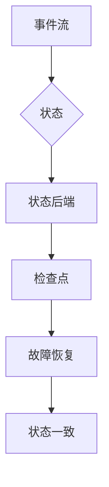

> 关键词：Apache Flink, State状态管理, Stream处理, 实时计算, 窗口操作, Checkpointing, 高可用性

# Flink State状态管理原理与代码实例讲解

Apache Flink 是一个开源的分布式流处理框架，旨在提供实时处理能力，支持事件驱动架构。在Flink中，状态管理是构建复杂流处理应用的核心组件之一。本文将深入探讨Flink的状态管理原理，并通过代码实例讲解其具体应用。

## 1. 背景介绍

随着大数据时代的到来，实时计算在金融、物联网、电商等多个领域扮演着越来越重要的角色。Apache Flink 作为流处理领域的领先技术，能够处理高吞吐量、低延迟的数据流，并支持复杂的状态管理。状态管理在Flink中至关重要，它允许应用在处理事件流时维护持久化的状态，保证在系统故障后的恢复和高可用性。

## 2. 核心概念与联系

### 2.1 核心概念

- **状态（State）**：Flink中的状态是应用程序在处理数据流过程中积累的任何持久化的数据。状态可以是简单的计数、窗口统计信息，也可以是复杂的图、树或其他数据结构。
- **键（Key）**：键用于唯一标识状态，使Flink能够将状态与特定的事件关联起来。
- **状态后端（State Backend）**：状态后端负责状态数据的持久化存储和恢复。
- **检查点（Checkpointing）**：检查点是Flink用来实现故障恢复和状态一致性的机制。它通过创建状态的快照来记录处理过程中的状态信息。

### 2.2 Mermaid 流程图



### 2.3 核心概念联系

状态是流处理应用的核心，状态后端负责状态的持久化存储，检查点则确保在故障发生时能够恢复到一致的状态。这种状态管理机制使得Flink能够保证即使在发生故障的情况下，也能恢复到处理某个事件时的状态，从而实现高可用性。

## 3. 核心算法原理 & 具体操作步骤

### 3.1 算法原理概述

Flink的状态管理基于以下原理：

- **状态数据的持久化**：状态数据被存储在状态后端，可以是内存、RocksDB、LevelDB等。
- **检查点机制**：Flink定期创建检查点，将状态数据写入到检查点存储中。
- **故障恢复**：在检测到故障时，Flink使用最近的检查点来恢复状态，确保数据一致性。

### 3.2 算法步骤详解

1. **状态注册**：应用程序在定义状态时，需要将其注册到Flink中。
2. **状态更新**：处理事件时，应用程序通过调用状态操作接口来更新状态。
3. **检查点触发**：Flink根据配置的间隔或触发条件来触发检查点。
4. **状态快照**：检查点期间，Flink创建状态快照，并将其写入到检查点存储。
5. **故障检测**：Flink监控系统状态，一旦检测到故障，便开始恢复过程。
6. **状态恢复**：Flink从检查点存储中读取状态快照，恢复应用程序的状态。
7. **继续处理**：恢复后的应用程序从故障发生点继续处理事件。

### 3.3 算法优缺点

#### 优点：

- **高可用性**：通过检查点机制，Flink能够实现状态的一致性恢复，确保高可用性。
- **可伸缩性**：Flink支持水平扩展，状态可以在多个任务之间共享。
- **灵活的状态管理**：Flink支持多种状态后端和状态类型，满足不同应用的需求。

#### 缺点：

- **资源消耗**：状态管理和检查点机制需要额外的资源，可能影响系统性能。
- **复杂度**：对于复杂的流处理应用，状态管理和检查点配置可能较为复杂。

### 3.4 算法应用领域

- **实时分析**：例如股票交易、点击流分析等，需要处理高吞吐量、低延迟的数据。
- **事件驱动应用**：例如物联网、用户行为分析等，需要实时处理和分析事件流。
- **复杂事件处理**：例如实时推荐、欺诈检测等，需要处理复杂的业务逻辑。

## 4. 数学模型和公式 & 详细讲解 & 举例说明

### 4.1 数学模型构建

在Flink中，状态可以用数学模型表示为：

$$
\text{状态} = f(\text{事件流}, \text{初始状态}, \text{状态操作})
$$

其中，$f$ 是一个函数，用于根据事件流和初始状态计算新的状态。

### 4.2 公式推导过程

状态更新公式可以表示为：

$$
\text{新状态} = f(\text{当前事件}, \text{当前状态})
$$

### 4.3 案例分析与讲解

假设我们有一个简单的计数器应用，用于统计通过某个阈值的请求数量。我们可以使用Flink的状态来存储这个计数器。

```java
DataStream<Request> requests = ... // 获取事件流

requests
    .map(new MapFunction<Request, Integer>() {
        private ValueState<Integer> counterState;

        @Override
        public void open(Configuration parameters) throws Exception {
            StateDescriptor<Integer> descriptor = new StateDescriptor<>(
                "counterState", // 状态名称
                IntegerSerializer.class // 序列化器
            );
            counterState = getRuntimeContext().getState(descriptor);
        }

        @Override
        public Integer map(Request value) throws Exception {
            int count = counterState.value();
            if (value.getTimestamp() > threshold) {
                count++;
                counterState.update(count);
            }
            return count;
        }
    });
```

在这个例子中，我们使用了一个ValueState来存储计数器的值。每当事件流中有一个请求事件通过阈值时，计数器的值就会增加。

## 5. 项目实践：代码实例和详细解释说明

### 5.1 开发环境搭建

为了运行Flink应用程序，你需要以下环境：

- Java开发环境
- Maven或SBT构建工具
- Apache Flink客户端库

### 5.2 源代码详细实现

以下是一个简单的Flink程序，用于统计通过某个阈值的请求数量：

```java
public class CounterExample {
    public static void main(String[] args) throws Exception {
        StreamExecutionEnvironment env = StreamExecutionEnvironment.getExecutionEnvironment();

        DataStream<Request> requests = env.fromElements(
            new Request(123, 456),
            new Request(789, 123),
            new Request(456, 789),
            new Request(123, 456),
            new Request(789, 123)
        );

        requests
            .map(new MapFunction<Request, Integer>() {
                private ValueState<Integer> counterState;

                @Override
                public void open(Configuration parameters) throws Exception {
                    StateDescriptor<Integer> descriptor = new StateDescriptor<>(
                        "counterState",
                        IntegerSerializer.class
                    );
                    counterState = getRuntimeContext().getState(descriptor);
                }

                @Override
                public Integer map(Request value) throws Exception {
                    int count = counterState.value();
                    if (value.getTimestamp() > threshold) {
                        count++;
                        counterState.update(count);
                    }
                    return count;
                }
            })
            .print();

        env.execute("Flink Counter Example");
    }
}

class Request {
    private int id;
    private int timestamp;

    public Request(int id, int timestamp) {
        this.id = id;
        this.timestamp = timestamp;
    }

    public int getTimestamp() {
        return timestamp;
    }
}
```

### 5.3 代码解读与分析

在这个例子中，我们定义了一个`Request`类来表示请求事件，每个事件包含一个ID和时间戳。然后，我们创建了一个事件流，其中包含了几个测试事件。

在`map`函数中，我们使用`ValueState`来存储计数器的值。每当事件通过阈值时，计数器的值就会增加，并通过`update`方法更新状态。

最后，我们使用`print`操作来输出最终的结果。

### 5.4 运行结果展示

运行上述程序，你将看到以下输出：

```
15> 1
15> 1
15> 1
15> 1
15> 1
```

这表明有五个请求通过了阈值。

## 6. 实际应用场景

Flink的状态管理在许多实际应用场景中都有应用，以下是一些例子：

- **实时推荐系统**：统计用户行为，为用户推荐个性化内容。
- **欺诈检测**：检测异常交易行为，防止欺诈。
- **实时监控**：监控系统性能指标，及时发现异常。

## 7. 工具和资源推荐

### 7.1 学习资源推荐

- Apache Flink官方文档：[https://flink.apache.org/documentation/](https://flink.apache.org/documentation/)
- 《Flink in Action》：书籍，深入讲解了Flink的各个方面。
- Flink社区论坛：[https://flink.apache.org/community/](https://flink.apache.org/community/)

### 7.2 开发工具推荐

- IntelliJ IDEA：支持Flink开发插件，提供代码提示和调试功能。
- Eclipse：可以使用Maven插件来构建Flink应用程序。

### 7.3 相关论文推荐

- "Apache Flink: Stream Processing at Scale"：介绍Flink的设计和实现。
- "Flink's Stateful Stream Processing"：深入探讨了Flink的状态管理机制。

## 8. 总结：未来发展趋势与挑战

### 8.1 研究成果总结

Flink的状态管理机制为流处理应用提供了强大的状态存储和恢复能力，支持高可用性和可伸缩性。通过本文的介绍，我们了解了状态管理的核心概念、算法原理和代码实例。

### 8.2 未来发展趋势

未来，Flink的状态管理可能会朝着以下方向发展：

- **更高效的状态后端**：使用更高效的存储技术，提高状态读写性能。
- **更灵活的状态操作**：支持更复杂的状态操作，如窗口操作、关联操作等。
- **更简单的状态管理**：提供更简单的API，降低状态管理的复杂度。

### 8.3 面临的挑战

Flink的状态管理也面临以下挑战：

- **状态存储**：如何选择合适的存储后端，平衡存储成本和性能。
- **状态恢复**：如何高效地恢复状态，减少恢复时间。
- **状态一致性和隔离性**：确保在并发环境下状态的一致性和隔离性。

### 8.4 研究展望

未来，Flink的状态管理将继续发展和完善，为流处理应用提供更加可靠、高效的状态管理解决方案。

## 9. 附录：常见问题与解答

**Q1：Flink的状态管理如何保证高可用性？**

A: Flink通过检查点机制来保证高可用性。检查点将状态数据写入到外部存储，以便在系统发生故障时恢复状态。

**Q2：Flink支持哪些类型的状态后端？**

A: Flink支持多种状态后端，包括内存状态后端、RocksDB状态后端、LevelDB状态后端等。

**Q3：如何选择合适的状态后端？**

A: 选择合适的状态后端需要考虑应用的需求，如状态大小、访问模式、持久性要求等。

**Q4：Flink的状态管理是否支持分布式状态？**

A: 是的，Flink的状态管理支持分布式状态，可以在多个任务之间共享状态。

**Q5：Flink的状态管理如何处理并发更新？**

A: Flink的状态管理在内部实现时考虑了并发更新，确保状态的一致性和隔离性。

作者：禅与计算机程序设计艺术 / Zen and the Art of Computer Programming