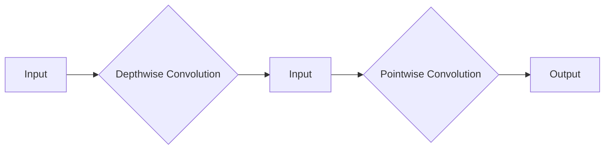

# MobileNet原理与代码实例讲解

> 关键词：MobileNet, 深度学习, 卷积神经网络, 轻量级网络, 等效压缩, 无边框卷积, 深度可分离卷积

## 1. 背景介绍

随着深度学习在计算机视觉领域的广泛应用，模型的大小和计算量成为了一个重要的考量因素。尤其是在移动设备和嵌入式系统上，模型的大小和性能直接影响到用户体验。为了解决这一问题，Google提出了MobileNet，这是一种轻量级的卷积神经网络（CNN）架构，旨在在保证模型精度的同时，大幅减少模型的参数量和计算量。

## 2. 核心概念与联系

### 2.1 核心概念原理

MobileNet的核心思想是使用深度可分离卷积（Depthwise Separable Convolution）来替代传统的标准卷积操作。深度可分离卷积将标准的卷积操作分解为两个独立的操作：深度卷积（Depthwise Convolution）和逐点卷积（Pointwise Convolution）。

- **深度卷积**：对输入特征图进行逐通道卷积，不改变空间维度。
- **逐点卷积**：对每个通道进行逐点卷积，改变输出特征图的空间维度。

通过这种方式，MobileNet能够在减少参数量和计算量的同时，保持模型的性能。

### 2.2 架构的 Mermaid 流程图



### 2.3 核心概念联系

深度可分离卷积是MobileNet的核心，它将传统的卷积操作分解为两个更简单的操作，从而减少了模型参数的数量。这种结构在保持模型精度的同时，显著降低了模型的复杂度。

## 3. 核心算法原理 & 具体操作步骤

### 3.1 算法原理概述

MobileNet的设计基于以下原则：

- **等效压缩**：通过深度可分离卷积实现与标准卷积等效的压缩。
- **分组卷积**：将输入特征图分割成多个组，每个组独立进行深度卷积。
- **逐点卷积**：通过逐点卷积调整特征图的空间维度，保持模型深度。

### 3.2 算法步骤详解

1. **输入**：输入原始图像或特征图。
2. **深度卷积**：对输入特征图进行逐通道卷积，不改变空间维度。
3. **逐点卷积**：对深度卷积的输出进行逐点卷积，改变输出特征图的空间维度。
4. **激活函数**：通常使用ReLU激活函数。
5. **批归一化**：对特征图进行批归一化处理。
6. **输出**：输出经过卷积、激活和批归一化的特征图。

### 3.3 算法优缺点

**优点**：

- 参数量少，计算量小，适合移动设备和嵌入式系统。
- 在保持模型精度的同时，显著降低了模型的复杂度。
- 对边缘信息敏感，能够保留图像细节。

**缺点**：

- 对于某些复杂任务，模型的性能可能不如标准卷积网络。
- 模型的训练可能需要更多的数据。

### 3.4 算法应用领域

MobileNet广泛应用于移动设备和嵌入式系统中的计算机视觉任务，如图像分类、目标检测、语义分割等。

## 4. 数学模型和公式 & 详细讲解 & 举例说明

### 4.1 数学模型构建

MobileNet的数学模型可以表示为：

$$
\text{MobileNet}(\mathbf{X}) = \text{ReLU}(\text{BatchNorm}(\text{PointwiseConv}(\text{DepthwiseConv}(\mathbf{X})))
$$

其中：

- $\mathbf{X}$ 为输入特征图。
- DepthwiseConv 表示深度卷积操作。
- PointwiseConv 表示逐点卷积操作。
- BatchNorm 表示批归一化操作。
- ReLU 表示ReLU激活函数。

### 4.2 公式推导过程

深度卷积的公式可以表示为：

$$
\mathbf{Y} = \mathbf{X} \odot \mathbf{W}
$$

其中：

- $\mathbf{Y}$ 为输出特征图。
- $\mathbf{X}$ 为输入特征图。
- $\mathbf{W}$ 为深度卷积核。

逐点卷积的公式可以表示为：

$$
\mathbf{Z} = \mathbf{Y} \odot \mathbf{U}
$$

其中：

- $\mathbf{Z}$ 为输出特征图。
- $\mathbf{Y}$ 为深度卷积的输出。
- $\mathbf{U}$ 为逐点卷积核。

### 4.3 案例分析与讲解

以下是一个简单的MobileNet模型实例，用于图像分类任务：

```python
import torch
import torch.nn as nn

class MobileNet(nn.Module):
    def __init__(self, num_classes=10):
        super(MobileNet, self).__init__()
        self.conv1 = nn.Conv2d(3, 32, kernel_size=3, stride=1, padding=1)
        self.bn1 = nn.BatchNorm2d(32)
        self.conv2 = nn.Conv2d(32, 64, kernel_size=3, stride=2, padding=1)
        self.bn2 = nn.BatchNorm2d(64)
        self.conv3 = nn.Conv2d(64, 128, kernel_size=3, stride=2, padding=1)
        self.bn3 = nn.BatchNorm2d(128)
        self.conv4 = nn.Conv2d(128, 256, kernel_size=3, stride=2, padding=1)
        self.bn4 = nn.BatchNorm2d(256)
        self.conv5 = nn.Conv2d(256, 512, kernel_size=3, stride=2, padding=1)
        self.bn5 = nn.BatchNorm2d(512)
        self.conv6 = nn.Conv2d(512, 1024, kernel_size=3, stride=2, padding=1)
        self.bn6 = nn.BatchNorm2d(1024)
        self.fc = nn.Linear(1024, num_classes)

    def forward(self, x):
        x = nn.functional.relu(self.bn1(self.conv1(x)))
        x = nn.functional.max_pool2d(x, 2)
        x = nn.functional.relu(self.bn2(self.conv2(x)))
        x = nn.functional.max_pool2d(x, 2)
        x = nn.functional.relu(self.bn3(self.conv3(x)))
        x = nn.functional.max_pool2d(x, 2)
        x = nn.functional.relu(self.bn4(self.conv4(x)))
        x = nn.functional.max_pool2d(x, 2)
        x = nn.functional.relu(self.bn5(self.conv5(x)))
        x = nn.functional.max_pool2d(x, 2)
        x = nn.functional.relu(self.bn6(self.conv6(x)))
        x = nn.functional.max_pool2d(x, 2)
        x = x.view(x.size(0), -1)
        x = self.fc(x)
        return x

model = MobileNet()
```

## 5. 项目实践：代码实例和详细解释说明

### 5.1 开发环境搭建

为了实践MobileNet，我们需要搭建一个Python开发环境，并安装必要的库：

```bash
pip install torch torchvision
```

### 5.2 源代码详细实现

以下是一个简单的MobileNet模型实现：

```python
import torch
import torch.nn as nn

class DepthwiseConv(nn.Module):
    def __init__(self, in_channels, kernel_size, stride, padding):
        super(DepthwiseConv, self).__init__()
        self.depthwise = nn.Conv2d(in_channels, in_channels, kernel_size=kernel_size, stride=stride, padding=padding, groups=in_channels)

    def forward(self, x):
        return self.depthwise(x)

class PointwiseConv(nn.Module):
    def __init__(self, in_channels, out_channels):
        super(PointwiseConv, self).__init__()
        self.pointwise = nn.Conv2d(in_channels, out_channels, kernel_size=1, stride=1)

    def forward(self, x):
        return self.pointwise(x)

class MobileNet(nn.Module):
    def __init__(self, num_classes=10):
        super(MobileNet, self).__init__()
        self.conv1 = nn.Sequential(
            DepthwiseConv(3, 3, stride=1, padding=1),
            nn.ReLU(inplace=True),
            PointwiseConv(3, 16),
            nn.BatchNorm2d(16),
            nn.ReLU(inplace=True)
        )
        self.conv2 = nn.Sequential(
            DepthwiseConv(16, 3, stride=2, padding=1),
            nn.ReLU(inplace=True),
            PointwiseConv(16, 32),
            nn.BatchNorm2d(32),
            nn.ReLU(inplace=True)
        )
        self.conv3 = nn.Sequential(
            DepthwiseConv(32, 3, stride=2, padding=1),
            nn.ReLU(inplace=True),
            PointwiseConv(32, 64),
            nn.BatchNorm2d(64),
            nn.ReLU(inplace=True)
        )
        self.conv4 = nn.Sequential(
            DepthwiseConv(64, 3, stride=2, padding=1),
            nn.ReLU(inplace=True),
            PointwiseConv(64, 128),
            nn.BatchNorm2d(128),
            nn.ReLU(inplace=True)
        )
        self.conv5 = nn.Sequential(
            DepthwiseConv(128, 3, stride=2, padding=1),
            nn.ReLU(inplace=True),
            PointwiseConv(128, 256),
            nn.BatchNorm2d(256),
            nn.ReLU(inplace=True)
        )
        self.conv6 = nn.Sequential(
            DepthwiseConv(256, 3, stride=2, padding=1),
            nn.ReLU(inplace=True),
            PointwiseConv(256, 512),
            nn.BatchNorm2d(512),
            nn.ReLU(inplace=True)
        )
        self.fc = nn.Linear(512, num_classes)

    def forward(self, x):
        x = self.conv1(x)
        x = self.conv2(x)
        x = self.conv3(x)
        x = self.conv4(x)
        x = self.conv5(x)
        x = self.conv6(x)
        x = x.view(x.size(0), -1)
        x = self.fc(x)
        return x

model = MobileNet()
```

### 5.3 代码解读与分析

上述代码实现了一个简单的MobileNet模型。模型包含六个卷积层，每个卷积层都由深度卷积和逐点卷积组成。每个卷积层之后都跟随一个ReLU激活函数和一个批归一化层。

### 5.4 运行结果展示

要运行上述模型，我们需要准备一个图像数据集，例如CIFAR-10。以下是一个简单的训练示例：

```python
import torchvision
import torchvision.transforms as transforms

transform = transforms.Compose([
    transforms.ToTensor(),
    transforms.Normalize((0.5, 0.5, 0.5), (0.5, 0.5, 0.5))
])

trainset = torchvision.datasets.CIFAR10(root='./data', train=True, download=True, transform=transform)
trainloader = torch.utils.data.DataLoader(trainset, batch_size=4, shuffle=True)

criterion = nn.CrossEntropyLoss()
optimizer = torch.optim.SGD(model.parameters(), lr=0.001, momentum=0.9)

for epoch in range(2):  
    running_loss = 0.0
    for i, data in enumerate(trainloader, 0):
        inputs, labels = data
        optimizer.zero_grad()
        outputs = model(inputs)
        loss = criterion(outputs, labels)
        loss.backward()
        optimizer.step()
        running_loss += loss.item()
        if i % 2000 == 1999:   
            print('[%d, %5d] loss: %.3f' % (epoch + 1, i + 1, running_loss / 2000))
            running_loss = 0.0

print('Finished Training')
```

## 6. 实际应用场景

MobileNet因其轻量级的特性，广泛应用于以下场景：

- **移动应用**：在移动设备上实现图像分类、目标检测等计算机视觉任务。
- **嵌入式系统**：在资源受限的嵌入式设备上实现实时图像处理。
- **视频监控**：在视频监控系统上实现实时人脸检测和识别。
- **增强现实**：在增强现实应用中实现实时图像识别和场景理解。

## 7. 工具和资源推荐

### 7.1 学习资源推荐

- 《Deep Learning with Python》
- 《MobileNets: Efficient Convolutional Neural Networks for Mobile Vision Applications》
- Hugging Face的MobileNet实现

### 7.2 开发工具推荐

- PyTorch
- TensorFlow
- Keras

### 7.3 相关论文推荐

- MobileNets: Efficient Convolutional Neural Networks for Mobile Vision Applications

## 8. 总结：未来发展趋势与挑战

### 8.1 研究成果总结

MobileNet的提出，为轻量级卷积神经网络的设计提供了一种新的思路。通过深度可分离卷积，MobileNet在保证模型精度的同时，显著降低了模型的参数量和计算量，为移动设备和嵌入式系统上的计算机视觉应用提供了新的解决方案。

### 8.2 未来发展趋势

未来，MobileNet可能会在以下方面得到发展：

- **更轻量级的网络结构**：随着深度学习技术的不断发展，可能会出现更轻量级的网络结构，进一步提高模型的效率。
- **更灵活的网络结构**：MobileNet的结构可能会更加灵活，能够适应不同的应用场景。
- **多模态融合**：MobileNet可能会与其他模态的信息进行融合，实现更全面的信息处理。

### 8.3 面临的挑战

MobileNet在以下方面可能面临挑战：

- **模型精度**：在保证模型轻量级的同时，如何保持模型的精度是一个挑战。
- **模型泛化能力**：如何提高模型的泛化能力，使其能够适应不同的应用场景。
- **模型安全性**：如何确保模型的安全性，防止恶意攻击。

### 8.4 研究展望

MobileNet作为轻量级卷积神经网络的一个代表，将继续在移动设备和嵌入式系统上的计算机视觉应用中发挥重要作用。随着深度学习技术的不断发展，MobileNet将会在以下方面取得更多的突破：

- **更高效的网络结构**：通过改进网络结构，进一步提高模型的效率。
- **更广泛的适用性**：MobileNet的应用范围将不断扩大，应用于更多的领域。
- **更智能的模型**：MobileNet将与其他人工智能技术进行融合，实现更智能的应用。

## 9. 附录：常见问题与解答

**Q1：MobileNet与其他轻量级网络结构相比有什么优势？**

A1：MobileNet的主要优势在于其轻量级的设计，通过深度可分离卷积，MobileNet在保证模型精度的同时，显著降低了模型的参数量和计算量。

**Q2：如何选择合适的MobileNet模型？**

A2：选择合适的MobileNet模型需要根据具体的应用场景和硬件资源进行考虑。对于资源受限的设备，可以选择较小的MobileNet模型；对于性能要求较高的设备，可以选择较大的MobileNet模型。

**Q3：MobileNet是否适用于所有计算机视觉任务？**

A3：MobileNet适用于大多数计算机视觉任务，但对于一些需要高精度的任务，可能需要选择其他网络结构。

**Q4：如何训练MobileNet模型？**

A4：训练MobileNet模型可以使用PyTorch、TensorFlow等深度学习框架。具体步骤包括：加载预训练模型、定义损失函数和优化器、准备数据集、进行训练和评估。

**Q5：MobileNet的安全性如何保障？**

A5：MobileNet的安全性可以通过以下方法进行保障：数据加密、模型加密、访问控制等。

作者：禅与计算机程序设计艺术 / Zen and the Art of Computer Programming