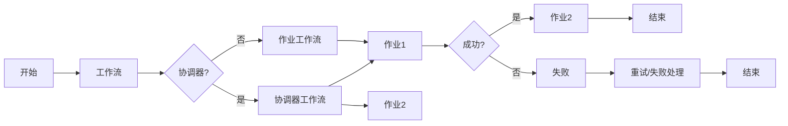

# Oozie原理与代码实例讲解

> 关键词：Oozie，工作流管理，Hadoop，数据处理，作业调度，分布式计算，Java，Apache

## 1. 背景介绍

在分布式计算领域，Hadoop及其生态圈中的工具和框架已成为事实标准。然而，对于复杂的分布式数据处理任务，如何有效地组织和管理这些任务，成为了许多开发者和运维人员面临的挑战。Oozie是一个开源的工作流管理平台，它能够帮助用户以图形化方式定义和部署复杂的Hadoop作业，从而简化了分布式数据处理的流程。

### 1.1 问题的由来

随着大数据时代的到来，企业面临着日益复杂的分布式数据处理任务。这些任务通常涉及多个步骤，包括数据采集、处理、转换、存储等，且各个步骤之间可能存在依赖关系。手动管理这些步骤不仅效率低下，而且容易出错。因此，需要一个能够自动化管理和调度这些步骤的工具。

### 1.2 研究现状

Oozie正是为了解决上述问题而诞生的。它被设计为能够与Hadoop生态系统中的各种工具无缝集成，如Hive、Pig、MapReduce、Spark等。Oozie可以定义工作流中的每一个步骤，包括作业的执行顺序、失败重试机制、资源分配等。

### 1.3 研究意义

Oozie的重要性在于：
- 简化分布式数据处理流程的设计和部署。
- 提高数据处理任务的执行效率和可靠性。
- 降低人为错误，提升数据处理任务的自动化水平。
- 与Hadoop生态圈中的工具无缝集成。

### 1.4 本文结构

本文将围绕Oozie的核心概念、原理、操作步骤、代码实例、应用场景等方面展开，旨在帮助读者全面了解和使用Oozie。

## 2. 核心概念与联系

### 2.1 核心概念

- **工作流（Workflow）**：Oozie中的工作流是一系列相互依赖的作业（Job）的集合。
- **作业（Job）**：工作流中的基本操作单元，可以是Hadoop生态圈中的任何工具或自定义脚本。
- **协调器（Coordinator）**：用于定义复杂的工作流，可以包含多个工作流，并处理它们之间的依赖关系。
- **共享库（Shared Library）**：包含可重用的作业定义和参数。

### 2.2 架构的Mermaid流程图



### 2.3 核心概念联系

在工作流中，协调器和作业是核心概念。协调器可以包含多个作业，并通过定义作业之间的依赖关系来组织工作流。共享库则允许用户重用作业定义和参数，提高工作效率。

## 3. 核心算法原理 & 具体操作步骤

### 3.1 算法原理概述

Oozie的核心算法原理是基于事件驱动的工作流调度。当某个作业完成时，Oozie会根据定义的依赖关系触发下一个作业的执行。

### 3.2 算法步骤详解

1. **定义工作流**：使用Oozie的XML描述语言定义工作流，包括作业的执行顺序、依赖关系等。
2. **配置作业**：为每个作业配置必要的参数和资源。
3. **部署工作流**：将定义好的工作流部署到Oozie服务器。
4. **执行工作流**：启动工作流，Oozie会根据定义的步骤和依赖关系自动执行作业。
5. **监控工作流**：监控工作流的执行状态，包括作业的执行时间、失败原因等。

### 3.3 算法优缺点

**优点**：
- 灵活的工作流定义，支持复杂的作业依赖关系。
- 与Hadoop生态圈中的工具无缝集成。
- 可视化界面，方便用户定义和监控工作流。

**缺点**：
- XML定义语言较为复杂，学习曲线较陡峭。
- 依赖于Oozie服务器，部署和扩展较为复杂。

### 3.4 算法应用领域

Oozie适用于以下应用领域：
- 大数据平台的数据处理流程管理。
- ETL（提取、转换、加载）过程自动化。
- 离线数据分析流程自动化。
- 分布式计算任务的调度和监控。

## 4. 数学模型和公式 & 详细讲解 & 举例说明

### 4.1 数学模型构建

Oozie本身不涉及复杂的数学模型。其核心在于工作流的定义和调度算法。

### 4.2 公式推导过程

Oozie的调度算法可以描述为以下公式：

```
S = F(N)
```

其中，S表示工作流的执行状态，N表示作业的依赖关系。

### 4.3 案例分析与讲解

假设有一个工作流，包含三个作业：作业1、作业2和作业3。作业1完成后触发作业2，作业2完成后触发作业3。以下是一个简单的XML定义示例：

```xml
<workflow-app xmlns="uri:oozie:workflow:0.4" name="my_workflow" version="0.1">
  <start to="job1" />
  <action name="job1">
    <shell>
      <command>hadoop jar my_job1.jar</command>
    </shell>
    <ok to="job2" />
    <error to="fail" />
  </action>
  <action name="job2">
    <shell>
      <command>hadoop jar my_job2.jar</command>
    </shell>
    <ok to="job3" />
    <error to="fail" />
  </action>
  <action name="job3">
    <shell>
      <command>hadoop jar my_job3.jar</command>
    </shell>
    <ok to="end" />
    <error to="fail" />
  </action>
  <end name="end" />
  <fail to="end" />
</workflow-app>
```

在这个例子中，作业1完成后会触发作业2的执行，作业2完成后会触发作业3的执行。如果任何一个作业失败，工作流会跳转到“fail”节点。

## 5. 项目实践：代码实例和详细解释说明

### 5.1 开发环境搭建

要在本地或服务器上运行Oozie，需要以下环境：

- Java开发环境
- Hadoop集群
- Oozie安装包

### 5.2 源代码详细实现

以下是一个简单的Oozie工作流XML文件示例：

```xml
<workflow-app xmlns="uri:oozie:workflow:0.4" name="my_workflow" version="0.1">
  <start to="job1" />
  <action name="job1">
    <shell>
      <command>hadoop jar my_job1.jar</command>
    </shell>
    <ok to="job2" />
    <error to="fail" />
  </action>
  <action name="job2">
    <shell>
      <command>hadoop jar my_job2.jar</command>
    </shell>
    <ok to="job3" />
    <error to="fail" />
  </action>
  <action name="job3">
    <shell>
      <command>hadoop jar my_job3.jar</command>
    </shell>
    <ok to="end" />
    <error to="fail" />
  </action>
  <end name="end" />
  <fail to="end" />
</workflow-app>
```

### 5.3 代码解读与分析

这个XML文件定义了一个名为`my_workflow`的工作流，包含三个作业：`job1`、`job2`和`job3`。工作流从`start`节点开始，执行`job1`。`job1`完成后，如果成功，则执行`job2`，否则跳转到`fail`节点。`job2`同理。最后，`job3`完成后，工作流结束。

### 5.4 运行结果展示

在Oozie界面中，可以启动和监控这个工作流的执行状态。如果一切顺利，工作流将按照定义的步骤执行，并在`end`节点结束。

## 6. 实际应用场景

### 6.1 数据处理流程自动化

Oozie可以用于自动化Hadoop生态圈中的数据处理流程，例如：

- 数据采集：使用Flume或Sqoop从外部系统采集数据。
- 数据预处理：使用Pig或Hive对数据进行清洗和转换。
- 数据存储：将处理后的数据存储到HDFS或Hive表中。

### 6.2 ETL过程自动化

Oozie可以用于自动化ETL（提取、转换、加载）过程，例如：

- 从源系统提取数据。
- 使用Pig或Hive对数据进行转换。
- 将转换后的数据加载到目标系统中。

### 6.3 离线数据分析流程自动化

Oozie可以用于自动化离线数据分析流程，例如：

- 使用MapReduce或Spark对历史数据进行分析。
- 生成报告和图表。
- 将分析结果存储到数据库或数据仓库中。

## 7. 工具和资源推荐

### 7.1 学习资源推荐

- Apache Oozie官方文档
- 《Oozie: The Definitive Guide to the Hadoop Workflow Scheduler》一书
- Oozie用户邮件列表和论坛

### 7.2 开发工具推荐

- IntelliJ IDEA或Eclipse集成开发环境
- Sublime Text或Visual Studio Code文本编辑器
- Oozie客户端

### 7.3 相关论文推荐

- 《Oozie: An extensible and scalable workflow engine for Hadoop》

## 8. 总结：未来发展趋势与挑战

### 8.1 研究成果总结

Oozie作为Hadoop生态圈中重要的工作流管理平台，为分布式数据处理流程的管理和调度提供了便捷的工具。通过Oozie，用户可以轻松定义和部署复杂的作业，提高数据处理任务的效率和可靠性。

### 8.2 未来发展趋势

- 更好的集成性和扩展性，支持更多的作业类型和数据源。
- 更友好的用户界面和可视化工具。
- 更强大的调度算法，支持更复杂的作业依赖关系。

### 8.3 面临的挑战

- 简化XML定义语言的复杂性。
- 提高Oozie的性能和可扩展性。
- 加强与云计算平台的集成。

### 8.4 研究展望

Oozie将继续作为Hadoop生态圈中重要的工作流管理平台，为分布式数据处理提供更加便捷和高效的管理工具。随着大数据技术的不断发展，Oozie的功能和性能将得到进一步提升，为更多用户和场景提供支持。

## 9. 附录：常见问题与解答

**Q1：Oozie与Apache Airflow有何区别？**

A：Oozie和Apache Airflow都是工作流管理工具，但它们的设计理念有所不同。Oozie更注重Hadoop生态圈的集成和调度，而Airflow则更注重通用性和灵活性。用户可以根据具体需求选择合适的工具。

**Q2：如何解决Oozie中的作业依赖关系复杂问题？**

A：Oozie支持多种依赖关系，包括AND、OR、SEPARATOR等。用户可以根据具体需求定义复杂的依赖关系。

**Q3：Oozie如何与HDFS集成？**

A：Oozie可以与HDFS集成，通过Oozie的文件系统API读取和写入HDFS上的文件。

**Q4：Oozie如何与其他大数据工具集成？**

A：Oozie可以与Hadoop生态圈中的各种工具集成，如Hive、Pig、MapReduce、Spark等。

**Q5：Oozie的XML定义语言是否难以学习？**

A：Oozie的XML定义语言确实较为复杂，但对于熟悉XML的开发者来说，学习起来并不困难。此外，社区中也有许多优秀的教程和文档可以帮助用户学习。

作者：禅与计算机程序设计艺术 / Zen and the Art of Computer Programming