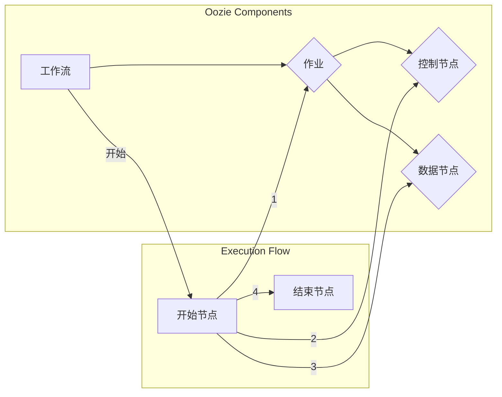

# Oozie原理与代码实例讲解

> 关键词：Oozie，工作流管理，Hadoop，大数据，Hadoop生态系统，Java，调度，工作流

## 1. 背景介绍

随着大数据时代的到来，Hadoop生态系统已经成为处理大规模数据集的标准平台。在这个生态系统中，Oozie扮演着至关重要的角色，它是一个强大的工作流管理引擎，能够帮助用户自动化和协调Hadoop中的复杂数据处理任务。Oozie可以定义、调度和监控由多个Hadoop作业组成的工作流，从而简化了数据处理流程的开发和维护。

### 1.1 问题的由来

在大数据处理中，往往需要执行一系列复杂的作业，如Hive查询、Pig脚本、MapReduce作业等。这些作业之间可能存在依赖关系，需要按顺序执行。手动管理这些作业既费时又容易出错。Oozie的出现正是为了解决这些问题，它提供了一个集中式的解决方案来定义和调度这些作业。

### 1.2 研究现状

Oozie最初由雅虎开发，后来成为Apache软件基金会的一部分。随着Hadoop生态系统的不断发展，Oozie也在不断进化，支持更多的组件和功能。目前，Oozie已经成为Hadoop生态系统中的一个成熟工具。

### 1.3 研究意义

Oozie的主要意义在于：

- **自动化作业调度**：简化了复杂的工作流定义和调度过程。
- **提高效率**：通过自动化减少人工干预，提高数据处理效率。
- **易用性**：提供用户友好的界面和丰富的配置选项。
- **可靠性**：确保作业按照预定的流程执行，减少出错概率。

### 1.4 本文结构

本文将分为以下几个部分：

- 核心概念与联系
- 核心算法原理与具体操作步骤
- 数学模型和公式
- 项目实践：代码实例和详细解释说明
- 实际应用场景
- 工具和资源推荐
- 总结：未来发展趋势与挑战
- 附录：常见问题与解答

## 2. 核心概念与联系

### 2.1 核心概念

- **工作流**：Oozie的基本单元，定义了作业之间的依赖关系和执行顺序。
- **作业**：Oozie可以管理的任务，如Hadoop作业、Shell脚本、Java程序等。
- **控制节点**：定义工作流中的决策点和执行逻辑。
- **数据节点**：提供数据输入和输出的节点。

### 2.2 核心概念原理和架构的 Mermaid 流程图



## 3. 核心算法原理 & 具体操作步骤

### 3.1 算法原理概述

Oozie使用图结构来表示工作流，其中每个节点代表一个作业或控制节点。Oozie通过遍历这个图来执行工作流。它根据节点的依赖关系和执行状态来决定下一个执行哪个节点。

### 3.2 算法步骤详解

1. **定义工作流**：使用Oozie的工作流定义语言（WDL）定义工作流的结构和逻辑。
2. **提交工作流**：将定义好的工作流提交给Oozie服务器。
3. **监控工作流**：监控工作流的执行状态，包括作业的成功、失败和挂起。
4. **重试失败作业**：如果作业失败，可以选择重试。
5. **停止或取消工作流**：在需要时可以停止或取消工作流。

### 3.3 算法优缺点

**优点**：

- **自动化**：简化了作业的调度和监控。
- **灵活性**：支持多种类型的作业和复杂的控制逻辑。
- **可扩展性**：可以扩展到大规模数据处理场景。

**缺点**：

- **学习曲线**：对于新用户来说，学习Oozie的工作流定义语言可能有一定难度。
- **性能**：Oozie本身是一个Java应用程序，对于大规模工作流可能存在性能瓶颈。

### 3.4 算法应用领域

Oozie广泛应用于以下领域：

- 数据集成
- 数据处理管道
- 数据仓库
- ETL（提取、转换、加载）

## 4. 数学模型和公式 & 详细讲解 & 举例说明

### 4.1 数学模型构建

Oozie的工作流定义语言（WDL）是一种XML格式的定义语言，用于描述工作流的组成和逻辑。以下是一个简单的WDL示例：

```xml
<workflow-app xmlns="uri:oozie:workflow:0.4">
    <name>simple-workflow</name>
    <start-to-end>
        <start>
            <action>
                <name>job1</name>
                <type>shell</type>
                <command>echo "Hello, World!"</command>
            </action>
        </start>
        <transition on-success="end"/>
    </start-to-end>
    <end name="end"/>
</workflow-app>
```

### 4.2 公式推导过程

WDL的语法相对简单，主要涉及节点定义、连接和属性设置。Oozie解析WDL文件，构建一个图结构的工作流，并按照图的结构执行工作流。

### 4.3 案例分析与讲解

以下是一个更复杂的工作流示例，包含多个作业和条件分支：

```xml
<workflow-app xmlns="uri:oozie:workflow:0.4">
    <name>complex-workflow</name>
    <start-to-end>
        <start>
            <action>
                <name>job1</name>
                <type>shell</type>
                <command>echo "Job 1 executed.</command>
            </action>
        </start>
        <split>
            <name>split-branch</name>
            <switch>
                <variable name="success" type="boolean"/>
                <case value="true">
                    <action>
                        <name>job2</name>
                        <type>shell</type>
                        <command>echo "Job 2 executed.</command>
                    </action>
                </case>
                <case value="false">
                    <action>
                        <name>job3</name>
                        <type>shell</type>
                        <command>echo "Job 3 executed.</command>
                    </action>
                </case>
            </switch>
        </split>
        <end name="end"/>
    </start-to-end>
</workflow-app>
```

在这个示例中，`job1`是工作流的第一步，根据其成功与否，工作流会执行不同的分支。

## 5. 项目实践：代码实例和详细解释说明

### 5.1 开发环境搭建

要使用Oozie，需要安装Java环境、Hadoop和Oozie本身。以下是基本的安装步骤：

1. 安装Java开发环境。
2. 下载并安装Hadoop。
3. 下载并安装Oozie。

### 5.2 源代码详细实现

以下是一个简单的Oozie工作流示例，它定义了一个包含两个Shell作业的工作流：

```java
package com.example.oozie;

import org.apache.oozie.action.oozie.ShellAction;
import org.apache.oozie.client.WorkflowApp;

public class SimpleWorkflowExample {
    public static void main(String[] args) throws Exception {
        WorkflowApp app = new WorkflowApp();
        app.setName("SimpleWorkflow");
        app.setAppPath(new Path("/user/hadoop/oozie/example"));

        WorkflowApp.Action start = app.addAction("start", ShellAction.TYPE);
        start.addArg("-e");
        start.addArg("/bin/echo");
        start.addArg("Start of workflow");

        WorkflowApp.Action end = app.addAction("end", ShellAction.TYPE);
        end.addArg("-e");
        end.addArg("/bin/echo");
        end.addArg("End of workflow");

        start.addFollow("end");

        app.addEnd("end");
        app.save();
    }
}
```

### 5.3 代码解读与分析

这个Java程序定义了一个简单的Oozie工作流，其中包含两个Shell作业：`start`和`end`。`start`作业会在工作流开始时执行，输出"Start of workflow"。`end`作业会在工作流结束时执行，输出"End of workflow"。

### 5.4 运行结果展示

要运行这个工作流，需要将其编译成Java类，然后使用Oozie客户端提交。以下是在命令行中运行这个工作流的示例：

```bash
java -cp /path/to/oozie/lib/*:./SimpleWorkflowExample.jar com.example.oozie.SimpleWorkflowExample
```

如果一切正常，你会看到以下输出：

```
Start of workflow
End of workflow
```

## 6. 实际应用场景

Oozie在实际应用中非常灵活，以下是一些常见的应用场景：

- **数据清洗**：使用Oozie定义一个工作流，自动执行数据清洗任务，如去除重复记录、填充缺失值等。
- **数据转换**：将原始数据转换为特定格式，以便于进一步分析。
- **数据处理**：执行复杂的ETL流程，将数据从源系统提取出来，进行转换和加载到目标系统。
- **报告生成**：定期生成报告，如日志分析、性能监控报告等。

## 7. 工具和资源推荐

### 7.1 学习资源推荐

- Apache Oozie官方文档：[http://oozie.apache.org/docs/latest/](http://oozie.apache.org/docs/latest/)
- 《Hadoop Operations》：介绍Hadoop和Oozie等工具的书籍。
- 《Hadoop in Action》：涵盖Hadoop生态系统中各种工具的实战指南。

### 7.2 开发工具推荐

- IntelliJ IDEA：支持Hadoop和Oozie插件，提供代码补全和调试功能。
- Eclipse：支持Hadoop和Oozie插件，提供代码补全和调试功能。

### 7.3 相关论文推荐

- 《Oozie: An extensible and scalable workflow management system for Hadoop》

## 8. 总结：未来发展趋势与挑战

### 8.1 研究成果总结

Oozie作为Hadoop生态系统中的一个重要工具，已经成功地解决了大数据处理中的工作流管理问题。它提供了一个强大的平台，可以定义和调度复杂的作业，提高数据处理效率。

### 8.2 未来发展趋势

随着大数据和云计算技术的发展，Oozie可能会向以下方向发展：

- 支持更多的数据处理框架，如Apache Spark。
- 提供更加用户友好的界面。
- 加强与其他大数据工具的集成。

### 8.3 面临的挑战

Oozie面临的挑战包括：

- **性能**：随着数据量的增长，Oozie的性能可能成为瓶颈。
- **易用性**：Oozie的配置和操作可能对新手来说比较复杂。
- **维护**：随着Hadoop生态系统的不断发展，Oozie需要不断更新以支持新的功能。

### 8.4 研究展望

为了应对这些挑战，未来的研究可以关注以下方向：

- **性能优化**：通过改进算法和优化代码来提高Oozie的性能。
- **用户界面**：开发更加直观和易用的用户界面。
- **自动化**：通过自动化工具来简化Oozie的配置和使用。

## 9. 附录：常见问题与解答

**Q1：Oozie与Azkaban有什么区别？**

A：Oozie和Azkaban都是工作流管理工具，但它们有一些不同之处。Oozie更适合Hadoop生态系统，而Azkaban更适合更广泛的任务调度场景。此外，Oozie提供了更细粒度的控制，而Azkaban则更加注重易用性。

**Q2：如何调试Oozie工作流？**

A：可以通过Oozie的Web界面查看工作流的执行日志和状态。如果需要更详细的调试信息，可以配置Oozie的日志级别，并查看详细的日志文件。

**Q3：Oozie是否支持并行执行？**

A：Oozie支持并行执行，但需要通过特定的配置来实现。可以使用`<fork>`和`<join>`节点来定义并行作业和它们的依赖关系。

**Q4：Oozie是否支持重试失败的作业？**

A：是的，Oozie支持重试失败的作业。可以在作业配置中设置重试次数和间隔。

**Q5：Oozie是否支持监控和报警？**

A：是的，Oozie支持监控和报警。可以通过配置邮件报警、JMX报警等方式来实现。

---

作者：禅与计算机程序设计艺术 / Zen and the Art of Computer Programming