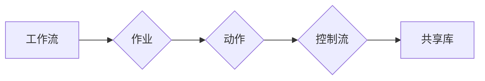

# Oozie工作流调度原理与代码实例讲解

> 关键词：Oozie，工作流调度，Hadoop，MapReduce，YARN，HDFS，作业管理，数据流程自动化

## 1. 背景介绍

随着大数据时代的到来，数据处理的规模和复杂性不断增加。为了高效、自动化地处理大规模数据，Hadoop生态系统中的Oozie应运而生。Oozie是一个开源的工作流调度引擎，它能够协调和管理Hadoop生态系统中的各种组件，如Hadoop MapReduce、Hive、Pig、Spark等，以自动化数据流程。

### 1.1 问题的由来

在处理复杂的批量数据处理任务时，开发者通常需要编写多个Hadoop作业，并手动在各个作业之间进行调度。这个过程不仅繁琐，而且容易出错。Oozie的出现，就是为了解决这一痛点，通过提供一个统一的工作流调度平台，简化了数据流程的自动化管理。

### 1.2 研究现状

Oozie已经成为了Hadoop生态系统中的一个重要组成部分，被广泛应用于各种大数据应用场景。它支持多种作业类型，包括MapReduce、Spark、Hive、Pig、FsAction、ShellAction和JavaAction等，能够满足不同类型的数据处理需求。

### 1.3 研究意义

Oozie的意义在于：

- **自动化作业调度**：简化了复杂数据流程的自动化管理，提高数据处理效率。
- **集中式管理**：所有作业都在Oozie中统一管理和监控，便于维护和扩展。
- **灵活配置**：支持多种作业类型，可以适应不同的数据处理需求。
- **高可用性**：Oozie集群可以提供高可用性和容错性，确保数据处理任务的可靠性。

### 1.4 本文结构

本文将系统介绍Oozie工作流调度引擎的原理与应用，内容包括：

- Oozie的核心概念与联系
- Oozie的工作流调度原理与操作步骤
- Oozie的数学模型和公式
- Oozie的项目实践与代码实例
- Oozie的实际应用场景
- Oozie的未来发展趋势与挑战
- Oozie的学习资源与开发工具推荐
- 总结与展望

## 2. 核心概念与联系

### 2.1 核心概念

- **工作流**：Oozie中的工作流是一系列作业的集合，它们按照特定的顺序执行，完成特定的数据处理任务。
- **作业**：Oozie中的作业可以是Hadoop生态系统中的任何组件，如MapReduce、Hive等。
- **动作**：动作是工作流中的基本单元，它定义了作业的执行行为，如执行MapReduce作业、调用Shell脚本等。
- **控制流**：控制流定义了作业之间的执行顺序和逻辑关系，如顺序执行、条件执行、循环执行等。
- **共享库**：共享库是用于存储工作流中重复使用的动作和配置信息的容器。

### 2.2 核心概念联系

Oozie的核心概念之间存在着紧密的联系。工作流由多个作业组成，每个作业可以包含多个动作，动作通过控制流连接起来，共同完成数据处理任务。共享库则提供了可重用的资源，提高了工作流的复用性和可维护性。

### 2.3 Mermaid流程图



## 3. 核心算法原理 & 具体操作步骤

### 3.1 算法原理概述

Oozie的工作流调度算法基于以下原理：

- **事件驱动**：Oozie中的所有操作都是基于事件触发的，如作业完成、超时、失败等。
- **状态机**：每个作业都对应一个状态机，定义了作业的执行状态和状态转换规则。
- **调度引擎**：调度引擎负责根据作业的状态和依赖关系，调度作业的执行。

### 3.2 算法步骤详解

Oozie工作流的执行步骤如下：

1. **解析工作流定义**：Oozie解析工作流定义文件，提取作业、动作和控制流信息。
2. **构建状态机**：根据作业信息，Oozie为每个作业构建一个状态机，定义作业的执行状态和状态转换规则。
3. **初始化作业**：Oozie初始化作业状态，设置作业的初始状态。
4. **调度作业**：调度引擎根据作业的状态和依赖关系，调度作业的执行。
5. **执行作业**：作业按照定义的动作和控制流执行。
6. **状态更新**：作业执行完成后，Oozie更新作业的状态，并根据状态转换规则决定下一个操作。
7. **监控与报警**：Oozie监控作业的执行状态，并在出现问题时发送报警。

### 3.3 算法优缺点

#### 优点：

- **自动化**：Oozie能够自动化地执行工作流，简化了数据流程的管理。
- **灵活**：支持多种作业类型，可以适应不同的数据处理需求。
- **可靠**：Oozie集群提供高可用性和容错性，确保数据处理任务的可靠性。

#### 缺点：

- **学习曲线**：Oozie的学习曲线相对较陡峭，需要一定的学习成本。
- **配置复杂**：工作流定义文件的配置较为复杂，需要一定的经验。

### 3.4 算法应用领域

Oozie广泛应用于以下领域：

- 大数据批处理
- 数据仓库
- ETL（Extract, Transform, Load）
- 数据分析
- 数据挖掘

## 4. 数学模型和公式 & 详细讲解 & 举例说明

### 4.1 数学模型构建

Oozie的工作流调度算法可以用以下数学模型表示：

$$
\text{Oozie} = F(\text{工作流定义}, \text{作业}, \text{动作}, \text{控制流}, \text{状态机}, \text{调度引擎})
$$

其中，$F$ 表示Oozie的工作流调度算法。

### 4.2 公式推导过程

Oozie的工作流调度算法推导过程如下：

1. **解析工作流定义**：解析工作流定义文件，提取作业、动作和控制流信息。
2. **构建状态机**：根据作业信息，构建每个作业的状态机。
3. **初始化作业状态**：设置作业的初始状态。
4. **调度作业**：根据作业的状态和依赖关系，调度作业的执行。
5. **执行作业**：执行作业的动作和控制流。
6. **状态更新**：更新作业的状态，并根据状态转换规则决定下一个操作。
7. **监控与报警**：监控作业的执行状态，并在出现问题时发送报警。

### 4.3 案例分析与讲解

假设有一个简单的工作流，包含两个作业：Job1和Job2。Job1是一个MapReduce作业，用于处理数据；Job2是一个Hive作业，用于分析处理后的数据。

```xml
<workflow-app xmlns="uri:oozie:workflow:0.4" name="exampleWorkflow">
    <start to="Job1" />
    <action name="Job1" xmlns="uri:oozie:action:0.4">
        <map-reduce>
            <job-tracker>jobtracker.example.com:50030</job-tracker>
            <name-node>namenode.example.com:50070</name-node>
            <jar>hdfs://namenode.example.com/user/hadoop/job.jar</jar>
        </map-reduce>
    </action>
    <transition from="Job1" to="Job2" />
    <action name="Job2" xmlns="uri:oozie:action:0.4">
        <hive>
            <query>SELECT * FROM processed_data;</query>
            <configuration>
                <property>
                    <name>hive.exec.dynamic.partition</name>
                    <value>true</value>
                </property>
            </configuration>
        </hive>
    </action>
    <end to="end" />
</workflow-app>
```

在这个工作流中，Job1完成后，Oozie会自动触发Job2的执行。Job2执行完成后，工作流结束。

## 5. 项目实践：代码实例和详细解释说明

### 5.1 开发环境搭建

要使用Oozie，首先需要搭建Hadoop生态系统，包括Hadoop、Hive、Pig等组件。然后，下载Oozie安装包，解压并配置环境变量。

### 5.2 源代码详细实现

以下是一个简单的Oozie工作流定义示例：

```xml
<workflow-app xmlns="uri:oozie:workflow:0.4" name="exampleWorkflow">
    <start to="Job1" />
    <action name="Job1" xmlns="uri:oozie:action:0.4">
        <map-reduce>
            <job-tracker>jobtracker.example.com:50030</job-tracker>
            <name-node>namenode.example.com:50070</name-node>
            <jar>/path/to/job.jar</jar>
        </map-reduce>
    </action>
    <transition from="Job1" to="Job2" />
    <action name="Job2" xmlns="uri:oozie:action:0.4">
        <hive>
            <query>SELECT * FROM processed_data;</query>
            <configuration>
                <property>
                    <name>hive.exec.dynamic.partition</name>
                    <value>true</value>
                </property>
            </configuration>
        </hive>
    </action>
    <end to="end" />
</workflow-app>
```

在这个示例中，工作流定义了一个包含两个作业的工作流。Job1是一个MapReduce作业，用于处理数据；Job2是一个Hive作业，用于分析处理后的数据。

### 5.3 代码解读与分析

- `<workflow-app>` 标签定义了工作流的根元素。
- `<start>` 标签定义了工作流的起始节点。
- `<action>` 标签定义了一个作业。
- `<map-reduce>` 标签定义了一个MapReduce作业。
- `<job-tracker>` 和 `<name-node>` 标签分别指定了作业的JobTracker和NameNode地址。
- `<jar>` 标签指定了MapReduce作业的jar包路径。
- `<transition>` 标签定义了作业之间的转换关系。
- `<end>` 标签定义了工作流的结束节点。

### 5.4 运行结果展示

将上述工作流定义文件保存为`exampleWorkflow.xml`，然后使用以下命令启动Oozie服务器：

```bash
oozie wars:run -c -f exampleWorkflow.xml
```

Oozie会自动执行工作流，并在控制台输出执行结果。

## 6. 实际应用场景

### 6.1 数据处理流程自动化

Oozie可以用于自动化数据处理流程，例如：

- 定期执行ETL任务，将数据从源系统抽取到数据仓库。
- 定期执行数据分析作业，生成数据报告。

### 6.2 数据处理监控

Oozie可以用于监控数据处理任务的状态，例如：

- 检查作业是否成功执行。
- 查看作业的执行日志。
- 发送报警信息。

### 6.3 数据处理资源管理

Oozie可以用于管理数据处理资源，例如：

- 分配计算资源。
- 监控资源使用情况。

## 7. 工具和资源推荐

### 7.1 学习资源推荐

- Oozie官方文档：[https://oozie.apache.org/docs/latest/](https://oozie.apache.org/docs/latest/)
- Hadoop官方文档：[https://hadoop.apache.org/docs/stable/](https://hadoop.apache.org/docs/stable/)
- Apache Oozie用户邮件列表：[https://mail-archives.apache.org/list.php?l=oozie-user](https://mail-archives.apache.org/list.php?l=oozie-user)

### 7.2 开发工具推荐

- IntelliJ IDEA：支持Oozie插件，方便开发Oozie工作流。
- Eclipse：支持Oozie插件，方便开发Oozie工作流。

### 7.3 相关论文推荐

- **Apache Oozie User's Guide**：[https://oozie.apache.org/docs/latest/Apache%20Oozie%20User%27s%20Guide.html](https://oozie.apache.org/docs/latest/Apache%20Oozie%27s%20User%27s%20Guide.html)
- **Apache Hadoop User's Guide**：[https://hadoop.apache.org/docs/stable/hadoop-project-dist/hadoop-common/HadoopUserGuide.html](https://hadoop.apache.org/docs/stable/hadoop-project-dist/hadoop-common/HadoopUserGuide.html)

## 8. 总结：未来发展趋势与挑战

### 8.1 研究成果总结

本文对Oozie工作流调度引擎的原理与应用进行了详细介绍，包括核心概念、工作流调度算法、项目实践等。通过本文的学习，读者可以深入了解Oozie的工作原理，并能够将其应用于实际的数据处理场景。

### 8.2 未来发展趋势

- **云原生Oozie**：随着云计算的快速发展，Oozie将会推出云原生版本，以更好地适应云环境。
- **容器化**：Oozie将会支持容器化部署，以提高灵活性和可扩展性。
- **与微服务集成**：Oozie将会与微服务架构集成，以支持更复杂的业务场景。

### 8.3 面临的挑战

- **性能优化**：随着数据规模的不断扩大，Oozie需要进一步提高性能，以支持大规模数据处理。
- **可扩展性**：Oozie需要进一步提高可扩展性，以适应不同的部署环境。
- **易用性**：Oozie需要进一步提高易用性，降低学习成本。

### 8.4 研究展望

未来，Oozie将会在以下方面进行深入研究：

- **性能优化**：通过算法优化、并行化等技术，提高Oozie的执行效率。
- **可扩展性**：通过分布式部署、弹性伸缩等技术，提高Oozie的可扩展性。
- **易用性**：通过图形化界面、自动化工具等技术，提高Oozie的易用性。

## 9. 附录：常见问题与解答

**Q1：Oozie与Apache Airflow有什么区别？**

A：Oozie和Apache Airflow都是工作流调度引擎，但它们有一些区别：

- **生态系统**：Oozie主要与Hadoop生态系统集成，而Apache Airflow可以与多种数据平台集成。
- **易用性**：Apache Airflow提供了更友好的图形化界面，Oozie则更侧重于配置文件。
- **社区活跃度**：Apache Airflow社区活跃度更高，更新频率更快。

**Q2：Oozie是否支持实时数据处理？**

A：Oozie主要支持批处理任务，但不支持实时数据处理。对于实时数据处理，可以考虑使用Apache Flink、Apache Storm等实时计算框架。

**Q3：Oozie是否支持多租户？**

A：Oozie支持多租户，可以通过Oozie的用户和权限管理功能实现。

**Q4：Oozie是否支持工作流可视化？**

A：Oozie支持工作流可视化，可以通过Oozie的Web界面查看工作流执行状态和执行图。

**Q5：Oozie是否支持工作流回滚？**

A：Oozie支持工作流回滚，可以通过Oozie的作业历史功能实现。

作者：禅与计算机程序设计艺术 / Zen and the Art of Computer Programming