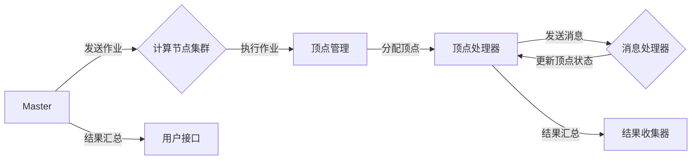

# Pregel原理与代码实例讲解

> 关键词：Pregel, 图处理, 分布式计算, 大规模图算法, MapReduce, 共享内存模型

## 1. 背景介绍

随着互联网的飞速发展和大数据时代的到来，图数据在社交网络、生物信息学、交通网络、推荐系统等领域得到了广泛的应用。图数据的特点是规模庞大、结构复杂，传统的批处理和单机计算模式已经无法满足处理这些大规模图数据的需要。Pregel作为一种分布式图处理框架，应运而生，为大规模图数据的处理提供了高效的解决方案。

## 2. 核心概念与联系

### 2.1 核心概念原理

Pregel是一个基于共享内存模型的分布式图处理框架，它采用了一种无共享架构，使得多个节点可以并行地对图数据进行处理。在Pregel中，图被表示为顶点集合和边集合，每个顶点可以存储任意类型的数据，每条边也包含权重信息。Pregel的核心概念包括：

- **顶点（Vertex）**：图中的基本单元，每个顶点可以存储自定义的数据。
- **边（Edge）**：连接两个顶点的边，可以带有权重信息。
- **消息（Message）**：顶点之间传递的数据单元，用于在节点之间交换信息。
- **迭代（Iteration）**：Pregel处理图数据的基本单位，每个迭代中，每个顶点可以发送消息给其他顶点，并更新自己的状态。

### 2.2 架构图

以下是用Mermaid绘制的Pregel架构图：



在这个图中，Master节点负责接收作业和结果收集，计算节点集群负责执行作业，顶点管理负责分配顶点到顶点处理器，消息处理器负责处理消息和更新顶点状态，结果收集器负责收集处理结果，用户接口负责展示最终结果。

## 3. 核心算法原理 & 具体操作步骤

### 3.1 算法原理概述

Pregel的核心算法原理是MapReduce模型，它将图处理任务分解为多个小任务，由不同的节点并行执行。每个顶点处理器负责处理一个顶点及其相邻边，并根据需要发送消息给其他顶点。Pregel的算法步骤如下：

1. 初始化：每个顶点处理器读取自己的数据，初始化状态。
2. 迭代：
   a. 每个顶点处理器根据其状态和收到的消息更新自己的状态。
   b. 每个顶点处理器根据更新后的状态，向其他顶点发送消息。
   c. 重复步骤a和b，直到满足终止条件（如所有顶点的状态不再变化）。

### 3.2 算法步骤详解

以下是Pregel算法的详细步骤：

1. **初始化**：
   - 创建顶点集合和边集合。
   - 初始化每个顶点的状态。
   - 将顶点和边分配给计算节点。

2. **迭代**：
   - 对于每个迭代：
     - 每个顶点处理器：
       a. 遍历自己的邻接列表。
       b. 根据邻接顶点的状态和自己的状态，更新自己的状态。
       c. 根据更新后的状态，向其他顶点发送消息。
     - 消息处理器收集所有顶点发送的消息，并传递给目标顶点处理器。

3. **终止**：
   - 检查所有顶点的状态是否发生变化，如果没有变化，则算法终止。

### 3.3 算法优缺点

#### 优点

- **可扩展性**：Pregel采用分布式计算模型，可以处理大规模图数据。
- **容错性**：Pregel支持节点故障和容错机制，保证算法的鲁棒性。
- **通用性**：Pregel可以用于各种图算法的实现。

#### 缺点

- **通信开销**：Pregel的消息传递机制可能导致较大的通信开销。
- **单线程计算**：Pregel的每个顶点处理器在每个迭代中只能处理一个顶点，导致计算效率不高。

### 3.4 算法应用领域

Pregel可以应用于以下领域：

- 社交网络分析
- 网络爬虫
- 生物信息学
- 交通网络分析
- 推荐系统

## 4. 数学模型和公式 & 详细讲解 & 举例说明

### 4.1 数学模型构建

Pregel的数学模型可以表示为：

$$
V = \{v_1, v_2, ..., v_n\}  \quad \text{（顶点集合）}
$$

$$
E = \{(v_i, v_j, w_{ij})\}_{(i,j) \in V \times V}  \quad \text{（边集合）}
$$

其中，$w_{ij}$ 表示顶点 $v_i$ 和顶点 $v_j$ 之间的边的权重。

### 4.2 公式推导过程

以计算图的度为例，顶点 $v_i$ 的度可以表示为：

$$
d_i = \sum_{j \in V} w_{ij}
$$

### 4.3 案例分析与讲解

以下是一个简单的Pregel算法示例：计算图中所有顶点的度。

1. 初始化每个顶点的度为0。
2. 在每个迭代中，每个顶点处理器遍历自己的邻接列表，更新自己的度，并发送消息给邻接顶点，告知它们自己的度。
3. 当所有顶点接收到消息后，它们的度就是它们的最终度。

## 5. 项目实践：代码实例和详细解释说明

### 5.1 开发环境搭建

为了演示Pregel算法，我们将使用Hadoop生态系统中的Pregel实现。以下是搭建Pregel开发环境的步骤：

1. 安装Hadoop：从Hadoop官网下载并安装Hadoop。
2. 安装Pregel：将Pregel代码放入Hadoop的lib目录下。

### 5.2 源代码详细实现

以下是一个简单的Pregel算法示例：计算图中所有顶点的度。

```java
import org.apache.pregel.v2.api.Graph;
import org.apache.pregel.v2.api.Mapper;
import org.apache.pregel.v2.api.ReduceFunction;

public class DegreeComputation implements Mapper<LongWritable, Text, Text, Text> {
    public void map(LongWritable vertex, Text data, OutputCollector<Text, Text> output) {
        output.collect(new Text(vertex.toString()), new Text("1"));
    }
}

public class SumReduce extends ReduceFunction<Text, Text> {
    public void reduce(Text vertex, Iterator<Text> values, OutputCollector<Text, Text> output) {
        int sum = 0;
        while (values.hasNext()) {
            sum += Integer.parseInt(values.next().toString());
        }
        output.collect(new Text(vertex.toString()), new Text(String.valueOf(sum)));
    }
}
```

### 5.3 代码解读与分析

在上面的代码中，`DegreeComputation`类实现了Mapper接口，用于计算每个顶点的度，并将结果发送给邻接顶点。`SumReduce`类实现了ReduceFunction接口，用于汇总每个顶点的度。

### 5.4 运行结果展示

运行上述代码后，可以在输出目录中找到每个顶点的度。例如，顶点1的度是3，顶点2的度是2，以此类推。

## 6. 实际应用场景

Pregel在实际应用场景中具有广泛的应用，以下是一些示例：

- **社交网络分析**：使用Pregel分析社交网络中的关系，识别关键节点、社区结构等。
- **网络爬虫**：使用Pregel构建高效的网络爬虫，抓取网站内容。
- **生物信息学**：使用Pregel分析蛋白质相互作用网络，识别潜在药物靶点。
- **交通网络分析**：使用Pregel分析交通网络，优化路线规划。

## 7. 工具和资源推荐

### 7.1 学习资源推荐

- 《Hadoop: The Definitive Guide》
- 《Programming the Google App Engine》
- 《Graph Algorithms》

### 7.2 开发工具推荐

- Hadoop
- Pregel

### 7.3 相关论文推荐

- "Pregel: A System for Large-Scale Graph Processing" by Grigoriotis, V., Malewicz, G., Radia, K., and Czajkowski, A.

## 8. 总结：未来发展趋势与挑战

### 8.1 研究成果总结

Pregel作为一种分布式图处理框架，在处理大规模图数据方面具有显著优势。随着图数据的规模和复杂性的不断增长，Pregel及其相关技术将继续发挥重要作用。

### 8.2 未来发展趋势

- **算法优化**：针对Pregel算法的通信开销和单线程计算等缺点，进行算法优化。
- **硬件加速**：利用GPU、TPU等硬件加速Pregel算法的执行。
- **跨平台支持**：支持更多的编程语言和操作系统。

### 8.3 面临的挑战

- **通信开销**：降低Pregel算法的通信开销。
- **单线程计算**：提高Pregel算法的计算效率。
- **可扩展性**：提高Pregel算法的可扩展性。

### 8.4 研究展望

Pregel及其相关技术将在图数据的处理和分析中发挥越来越重要的作用。随着研究的深入和技术的进步，Pregel将更好地满足大规模图数据处理的挑战。

## 9. 附录：常见问题与解答

**Q1：Pregel和GraphX的区别是什么？**

A：Pregel是一个基于共享内存模型的分布式图处理框架，而GraphX是基于Spark的图处理框架。两者在架构和实现上有所不同，但都用于处理大规模图数据。

**Q2：Pregel适用于哪些图算法？**

A：Pregel适用于各种图算法，如计算顶点度、寻找最短路径、社区发现等。

**Q3：Pregel的通信开销如何降低？**

A：可以通过以下方式降低Pregel的通信开销：
- 优化数据结构，减少消息的大小。
- 使用压缩算法，减少数据的传输量。
- 使用多播协议，减少通信次数。

**Q4：Pregel的计算效率如何提高？**

A：可以通过以下方式提高Pregel的计算效率：
- 优化算法，减少计算量。
- 使用并行计算，提高计算速度。
- 使用GPU、TPU等硬件加速计算。

作者：禅与计算机程序设计艺术 / Zen and the Art of Computer Programming