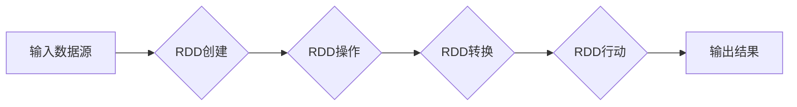

> 关键词：RDD，弹性分布式数据集，Hadoop，Apache Spark，分布式计算，大数据处理，Spark SQL，Spark Streaming

# RDD 原理与代码实例讲解

Apache Spark 是一个快速、通用、可扩展的大数据处理平台，它提供了一个称为 RDD（弹性分布式数据集）的抽象数据结构，用于在分布式集群上高效处理大规模数据集。RDD 提供了丰富的操作和优化机制，使得 Spark 成为大数据处理的首选框架之一。

## 1. 背景介绍

随着互联网和物联网的快速发展，数据量呈爆炸式增长，传统的数据处理方法已经难以满足需求。分布式计算框架应运而生，其中 Hadoop 是最著名的框架之一。然而，Hadoop 的 MapReduce 模型在迭代计算和实时处理方面存在局限性。Apache Spark 作为一种新兴的分布式计算框架，以其弹性、高效、易用的特点，逐渐取代了 MapReduce，成为大数据处理的首选。

## 2. 核心概念与联系

### 2.1 RDD：弹性分布式数据集

RDD（Resilient Distributed Dataset，弹性分布式数据集）是 Spark 中的核心抽象，它代表了一个不可变、可分区、可并行操作的分布式数据集。RDD 可以存储在内存中，也可以持久化到磁盘上，以实现高效的计算和容错。

Mermaid 流程图如下：



### 2.2 RDD 的特性

- **不可变性**：RDD 中的数据一旦创建，就不能被修改。
- **分区**：RDD 可以被分成多个分区，以便在分布式环境中并行处理。
- **并行操作**：RDD 的操作可以并行地在多个分区上执行。
- **容错性**：Spark 会自动检测和恢复丢失的数据分区。
- **持久化**：RDD 可以被持久化到内存或磁盘上，以加快后续计算速度。

## 3. 核心算法原理 & 具体操作步骤

### 3.1 算法原理概述

RDD 的核心算法原理是基于内存计算，它将数据集划分为多个分区，并将分区分配到分布式集群的各个节点上进行并行处理。Spark 使用了弹性调度算法来优化资源的分配和任务的执行。

### 3.2 算法步骤详解

1. **创建 RDD**：从外部数据源（如 HDFS、Hive、Cassandra 等）中创建 RDD。
2. **转换操作**：对 RDD 进行转换操作，如 map、filter、flatMap、reduceByKey 等。
3. **行动操作**：触发 RDD 的计算，如 collect、count、saveAsTextFile 等。
4. **结果输出**：将计算结果输出到外部存储或控制台。

### 3.3 算法优缺点

**优点**：

- 高效：Spark 的内存计算和弹性调度算法，使得 Spark 在大数据处理方面比 Hadoop 快 100 倍。
- 易用：Spark 提供了丰富的 API 和丰富的操作，使得开发人员可以轻松地编写分布式程序。
- 扩展性强：Spark 可以无缝地与其他大数据技术（如 Hadoop、Hive、Cassandra 等）集成。

**缺点**：

- 资源开销大：Spark 需要较大的内存资源来存储 RDD，对于资源受限的环境来说可能不太适用。
- 学习曲线陡峭：Spark 的 API 和概念相对复杂，需要一定的时间来学习和掌握。

### 3.4 算法应用领域

- 数据分析
- 数据挖掘
- 机器学习
- 图处理
- 实时计算

## 4. 数学模型和公式 & 详细讲解 & 举例说明

### 4.1 数学模型构建

RDD 的操作可以分为两种类型：转换操作和行动操作。

**转换操作**：

- map：对 RDD 中的每个元素进行映射操作。
- filter：过滤 RDD 中的元素，只保留满足条件的元素。
- flatMap：将 RDD 中的元素映射为一个元素列表。

**行动操作**：

- collect：将 RDD 中的所有元素收集到一个数组中。
- count：返回 RDD 中的元素数量。
- saveAsTextFile：将 RDD 保存为文本文件。

### 4.2 公式推导过程

以下是一个简单的例子，展示了如何使用 map 和 reduce 操作来计算一个列表中所有元素的和。

```python
def sum_list(lst):
    result = 0
    for x in lst:
        result += x
    return result

lst = [1, 2, 3, 4, 5]
result = lst.map(sum_list).collect()
print(result)  # 输出: [15]
```

在上面的例子中，map 操作将每个元素映射到 sum_list 函数的输出，而 reduce 操作则将所有输出累加得到最终结果。

### 4.3 案例分析与讲解

以下是一个使用 PySpark 进行数据处理的例子：

```python
from pyspark import SparkContext

# 创建 SparkContext
sc = SparkContext("local", "RDD Example")

# 创建 RDD
data = [1, 2, 3, 4, 5]
rdd = sc.parallelize(data)

# 应用转换操作
mapped_rdd = rdd.map(lambda x: x * 2)

# 应用行动操作
result = mapped_rdd.collect()

# 打印结果
print(result)  # 输出: [2, 4, 6, 8, 10]

# 关闭 SparkContext
sc.stop()
```

在上面的例子中，我们创建了一个包含数字 1 到 5 的 RDD，然后使用 map 操作将每个元素乘以 2，最后使用 collect 操作将结果收集到本地内存中。

## 5. 项目实践：代码实例和详细解释说明

### 5.1 开发环境搭建

要使用 PySpark 进行 RDD 编程，你需要先安装 Python 和 PySpark。以下是在 macOS 上安装 PySpark 的步骤：

1. 安装 Python 3.7 或更高版本。
2. 安装 pip：
   ```
   /usr/bin易pip3 install --user pip
   ```
3. 安装 PySpark：
   ```
   pip3 install pyspark
   ```

### 5.2 源代码详细实现

以下是一个使用 PySpark 进行数据处理的完整例子：

```python
from pyspark import SparkContext

# 创建 SparkContext
sc = SparkContext("local", "RDD Example")

# 创建 RDD
data = [1, 2, 3, 4, 5]
rdd = sc.parallelize(data)

# 应用转换操作
mapped_rdd = rdd.map(lambda x: x * 2)

# 应用行动操作
result = mapped_rdd.collect()

# 打印结果
print(result)  # 输出: [2, 4, 6, 8, 10]

# 关闭 SparkContext
sc.stop()
```

### 5.3 代码解读与分析

在上面的例子中，我们首先创建了一个 SparkContext 对象，它是 PySpark 的入口点。然后，我们使用 parallelize 函数创建了一个包含数字 1 到 5 的 RDD。接下来，我们使用 map 函数对 RDD 中的每个元素进行映射操作，将其乘以 2。最后，我们使用 collect 函数将映射后的 RDD 收集到本地内存中，并打印结果。

### 5.4 运行结果展示

运行上述代码，你将看到以下输出：

```
[2, 4, 6, 8, 10]
```

这表明我们的代码成功地将每个元素乘以 2，并收集了结果。

## 6. 实际应用场景

Spark RDD 在许多实际场景中都有广泛的应用，以下是一些例子：

- **日志分析**：处理和分析网站访问日志，以了解用户行为和性能指标。
- **社交网络分析**：分析社交网络数据，以了解用户关系和社区结构。
- **机器学习**：使用 Spark 进行大规模机器学习模型的训练和预测。
- **数据科学**：进行大规模数据分析和可视化。

## 7. 工具和资源推荐

### 7.1 学习资源推荐

- [Spark 官方文档](https://spark.apache.org/docs/latest/)
- [Spark 教程](https://spark.apache.org/tutorials/)
- [《Learning Spark》](https://learning-spark-the-definitive-guide-to-lda-spark-ecosystem/)：Spark 官方教程
- [《Spark: The Definitive Guide》](https://www.manning.com/books/spark-the-definitive-guide)

### 7.2 开发工具推荐

- [PySpark](https://spark.apache.org/downloads/)
- [Spark Notebook](https://sparknotebook.org/)
- [Databricks](https://databricks.com/)

### 7.3 相关论文推荐

- [The Lambda Architecture](http://www.slideshare.net/tonyshampine/the-lambda-architecture)
- [Spark: Spark: The Definitive Guide](https://www.manning.com/books/spark-the-definitive-guide)

## 8. 总结：未来发展趋势与挑战

### 8.1 研究成果总结

Spark RDD 作为一种强大的分布式数据处理框架，已经在大数据处理领域取得了显著的成果。它为开发人员提供了丰富的 API 和操作，使得分布式数据处理变得更加简单和高效。

### 8.2 未来发展趋势

- **更强大的弹性调度算法**：优化资源分配和任务执行，进一步提高性能。
- **更丰富的 API**：扩展 Spark 的功能，支持更多类型的数据处理任务。
- **更易用的界面**：提供更直观的界面，降低学习和使用门槛。

### 8.3 面临的挑战

- **资源消耗**：Spark 需要较大的内存资源，对于资源受限的环境来说可能不太适用。
- **学习曲线**：Spark 的 API 和概念相对复杂，需要一定的时间来学习和掌握。

### 8.4 研究展望

未来，Spark RDD 将继续发展，并与其他大数据技术（如 Hadoop、Hive、Cassandra 等）进一步集成，以提供更加强大、易用、高效的分布式数据处理能力。

---

作者：禅与计算机程序设计艺术 / Zen and the Art of Computer Programming