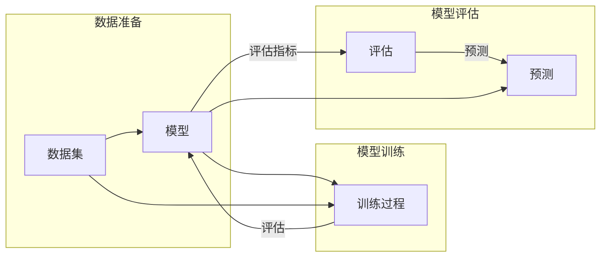

# Supervised Learning

> 关键词：监督学习，机器学习，训练算法，特征工程，分类，回归，模型评估

## 1. 背景介绍

监督学习是机器学习领域最基础和最广泛使用的算法之一。它通过使用标记的数据集来训练模型，使模型能够对新的、未标记的数据进行预测。这种学习方式在图像识别、自然语言处理、医学诊断等领域有着广泛的应用。

### 1.1 问题的由来

在现实生活中，我们面临着各种需要从数据中提取有用信息的问题。例如，在金融领域，我们需要识别欺诈交易；在医疗领域，我们需要预测疾病风险；在零售领域，我们需要预测客户购买行为。这些问题都可以通过机器学习算法来解决，而监督学习则是其中的一种有效方法。

### 1.2 研究现状

近年来，随着计算能力的提升和数据量的激增，监督学习取得了显著进展。深度学习技术的发展，使得监督学习模型能够处理更复杂的任务，并在许多领域取得了突破性的成果。

### 1.3 研究意义

监督学习的研究意义在于：

- 提高数据分析和决策的准确性。
- 自动化数据分析流程，提高工作效率。
- 应用于各个领域，解决实际问题。

### 1.4 本文结构

本文将分为以下几个部分：

- 核心概念与联系
- 核心算法原理与具体操作步骤
- 数学模型与公式
- 项目实践
- 实际应用场景
- 工具和资源推荐
- 总结与展望
- 附录：常见问题与解答

## 2. 核心概念与联系

### 2.1 核心概念

**监督学习**是一种利用标记数据来训练模型的机器学习算法。在监督学习中，我们有一个包含输入数据（特征）和输出标签的数据集。模型的目的是学习输入和输出之间的映射关系。

**特征**是用于描述输入数据的属性。例如，在图像识别任务中，特征可以是图像的像素值。

**标签**是输入数据对应的输出结果。例如，在分类任务中，标签可以是类别名称。

**模型**是监督学习算法的核心，它负责学习输入和输出之间的映射关系。

### 2.2 架构的 Mermaid 流程图



## 3. 核心算法原理与具体操作步骤

### 3.1 算法原理概述

监督学习算法通过以下步骤进行：

1. 使用标记数据集训练模型。
2. 使用训练好的模型对新的数据进行预测。
3. 使用评估指标评估模型性能。

### 3.2 算法步骤详解

**步骤 1：数据准备**

- 收集数据。
- 对数据进行清洗和预处理。
- 将数据划分为训练集、验证集和测试集。

**步骤 2：模型选择**

- 选择合适的模型。
- 初始化模型参数。

**步骤 3：模型训练**

- 使用训练集数据训练模型。
- 使用验证集数据调整模型参数。

**步骤 4：模型评估**

- 使用测试集数据评估模型性能。

**步骤 5：模型预测**

- 使用训练好的模型对新的数据进行预测。

### 3.3 算法优缺点

**优点：**

- 能够处理复杂的非线性问题。
- 预测准确率高。
- 应用于各个领域。

**缺点：**

- 需要大量的标记数据。
- 模型可解释性差。

### 3.4 算法应用领域

- 分类：例如，垃圾邮件检测、情感分析。
- 回归：例如，房价预测、股票价格预测。
- 欺诈检测。
- 医学诊断。
- 自然语言处理。

## 4. 数学模型与公式

### 4.1 数学模型构建

监督学习模型的数学模型通常由以下部分组成：

- 输入层：接收输入特征。
- 隐藏层：对输入特征进行处理。
- 输出层：输出预测结果。

### 4.2 公式推导过程

以下是一个简单的线性回归模型的公式推导过程：

$$
y = \theta_0 + \theta_1 x_1 + \theta_2 x_2 + ... + \theta_n x_n
$$

其中，$y$ 是输出，$x_i$ 是第 $i$ 个特征，$\theta_i$ 是第 $i$ 个特征的权重。

### 4.3 案例分析与讲解

以房价预测为例，我们可以使用线性回归模型来预测房价。在这个例子中，输入特征可以是房屋面积、房间数量、位置等，输出是房价。

## 5. 项目实践：代码实例和详细解释说明

### 5.1 开发环境搭建

在Python中，我们可以使用`scikit-learn`库来实现线性回归。

### 5.2 源代码详细实现

```python
from sklearn.linear_model import LinearRegression
from sklearn.model_selection import train_test_split
from sklearn.metrics import mean_squared_error

# 加载数据
X = [[1, 1], [1, 2], [2, 2], [2, 3]]  # 输入特征
y = [1, 2, 2, 3]  # 输出

# 划分训练集和测试集
X_train, X_test, y_train, y_test = train_test_split(X, y, test_size=0.2, random_state=0)

# 创建线性回归模型
model = LinearRegression()

# 训练模型
model.fit(X_train, y_train)

# 预测
y_pred = model.predict(X_test)

# 计算损失
mse = mean_squared_error(y_test, y_pred)
print(f"Mean Squared Error: {mse}")
```

### 5.3 代码解读与分析

这段代码首先从`sklearn.linear_model`模块中导入`LinearRegression`类。然后，从`sklearn.model_selection`模块中导入`train_test_split`函数用于划分训练集和测试集。接下来，从`sklearn.metrics`模块中导入`mean_squared_error`函数用于计算均方误差。

在代码主体部分，首先加载数据，然后划分训练集和测试集。接着，创建一个线性回归模型，并使用训练集数据对其进行训练。最后，使用训练好的模型对测试集数据进行预测，并计算预测值和真实值之间的均方误差。

## 6. 实际应用场景

### 6.1 金融领域

在金融领域，监督学习可以用于以下任务：

- 风险评估：预测客户信用风险。
- 欺诈检测：识别可疑交易。
- 股票市场预测：预测股票价格走势。

### 6.2 医疗领域

在医疗领域，监督学习可以用于以下任务：

- 疾病诊断：预测患者病情。
- 药物研发：预测药物的有效性。
- 病理图像分析：识别病理图像中的异常。

### 6.3 自然语言处理

在自然语言处理领域，监督学习可以用于以下任务：

- 文本分类：对文本进行分类，如情感分析、主题分类。
- 机器翻译：将一种语言翻译成另一种语言。
- 语音识别：将语音信号转换为文本。

## 7. 工具和资源推荐

### 7.1 学习资源推荐

- 《机器学习》（周志华著）
- 《统计学习方法》（李航著）
- Coursera上的《机器学习》课程

### 7.2 开发工具推荐

- Scikit-learn
- TensorFlow
- PyTorch

### 7.3 相关论文推荐

- "The Hundred-Page Machine Learning Book" by Andriy Burkov
- "Understanding Deep Learning" by Shai Shalev-Shwartz and Shai Ben-David

## 8. 总结：未来发展趋势与挑战

### 8.1 研究成果总结

监督学习是机器学习领域最基础和最广泛使用的算法之一。它通过使用标记数据来训练模型，使模型能够对新的、未标记的数据进行预测。近年来，随着深度学习技术的发展，监督学习取得了显著进展。

### 8.2 未来发展趋势

- 深度学习模型的进一步发展。
- 模型可解释性的提高。
- 无监督学习和半监督学习的发展。
- 模型压缩和加速。

### 8.3 面临的挑战

- 数据标注成本高。
- 模型可解释性差。
- 模型泛化能力不足。
- 模型安全性和隐私保护。

### 8.4 研究展望

监督学习将在未来继续发展，并在各个领域发挥更大的作用。随着技术的不断进步，相信监督学习能够解决更多实际问题，为人类社会带来更多便利。

## 9. 附录：常见问题与解答

**Q1：什么是监督学习？**

A：监督学习是一种利用标记数据来训练模型的机器学习算法。在监督学习中，我们有一个包含输入数据（特征）和输出标签的数据集。模型的目的是学习输入和输出之间的映射关系。

**Q2：监督学习有哪些应用场景？**

A：监督学习可以应用于各个领域，如金融、医疗、自然语言处理等。例如，它可以用于分类、回归、欺诈检测、疾病诊断等任务。

**Q3：如何选择合适的监督学习算法？**

A：选择合适的监督学习算法需要考虑以下因素：

- 数据特点：数据量、特征维度、数据分布等。
- 任务类型：分类、回归、聚类等。
- 模型复杂度：模型的计算复杂度和内存占用。

**Q4：如何评估监督学习模型的性能？**

A：可以使用多种评估指标来评估监督学习模型的性能，如准确率、召回率、F1分数、均方误差等。

**Q5：监督学习有哪些局限性？**

A：监督学习有以下局限性：

- 需要大量的标记数据。
- 模型可解释性差。
- 模型泛化能力不足。

作者：禅与计算机程序设计艺术 / Zen and the Art of Computer Programming