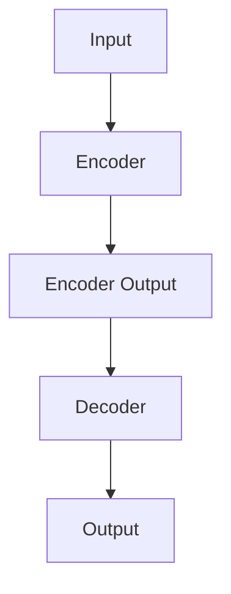

# Transformer 原理与代码实战案例讲解

> 关键词：Transformer, 自注意力机制, 编码器，解码器, NLP, 机器翻译, 问答系统, 文本生成, 深度学习

## 1. 背景介绍

自然语言处理（NLP）作为人工智能领域的重要分支，近年来取得了显著的进展。其中，Transformer模型因其出色的性能和效率，成为了NLP领域的革命性突破。本文将深入讲解Transformer的原理，并通过实战案例展示其应用。

### 1.1 问题的由来

传统的循环神经网络（RNN）在处理长序列数据时，存在梯度消失或梯度爆炸等问题，导致难以捕捉序列中的长距离依赖关系。而卷积神经网络（CNN）虽然能够捕捉局部特征，但在处理长序列时效果不佳。为了解决这些问题，Vaswani等人在2017年提出了Transformer模型，该模型彻底改变了NLP领域的研究方向。

### 1.2 研究现状

Transformer模型自提出以来，已经在诸多NLP任务中取得了SOTA（State-of-the-Art）的成绩，包括机器翻译、文本摘要、问答系统、文本生成等。随着模型规模的不断扩大，其在各个领域的应用也越发广泛。

### 1.3 研究意义

Transformer模型的出现，标志着NLP领域从基于规则的方法向基于深度学习的方法转变。它为NLP任务提供了更加高效、准确和可解释的解决方案，推动了NLP技术的快速发展。

### 1.4 本文结构

本文将围绕以下内容展开：
- 介绍Transformer的核心概念与联系
- 深入讲解Transformer的算法原理和操作步骤
- 通过数学模型和公式展示Transformer的内部机制
- 通过代码实战案例演示Transformer的应用
- 探讨Transformer的实际应用场景和未来发展趋势

## 2. 核心概念与联系

### 2.1 Transformer模型架构

Transformer模型主要由编码器（Encoder）和解码器（Decoder）两部分组成。编码器用于将输入序列转换为固定长度的向量表示，解码器则用于根据编码器输出的向量表示生成输出序列。

### 2.2 Mermaid流程图

以下是一个简化的Transformer模型架构的Mermaid流程图：



### 2.3 核心概念

- **自注意力机制（Self-Attention）**：允许模型关注输入序列中不同位置的信息，从而捕捉长距离依赖关系。
- **多头注意力（Multi-Head Attention）**：将自注意力机制分解为多个子任务，提高模型的表示能力。
- **位置编码（Positional Encoding）**：为序列中的每个位置添加位置信息，使模型能够理解序列的顺序。
- **前馈神经网络（Feed-Forward Neural Network）**：对自注意力机制和位置编码的输出进行线性变换和激活函数操作。

## 3. 核心算法原理 & 具体操作步骤

### 3.1 算法原理概述

Transformer模型的核心思想是自注意力机制，它允许模型关注输入序列中不同位置的信息，从而捕捉长距离依赖关系。

### 3.2 算法步骤详解

1. **自注意力机制**：计算输入序列中每个位置与其他位置的注意力权重，并加权求和得到该位置的向量表示。
2. **多头注意力**：将自注意力机制分解为多个子任务，每个子任务分别计算注意力权重和向量表示。
3. **位置编码**：为序列中的每个位置添加位置信息，通常使用正弦和余弦函数。
4. **前馈神经网络**：对自注意力机制和位置编码的输出进行线性变换和激活函数操作。

### 3.3 算法优缺点

#### 优点：

- **捕捉长距离依赖关系**：自注意力机制能够有效地捕捉输入序列中不同位置的信息，从而处理长序列数据。
- **并行计算**：Transformer模型可以并行计算，训练速度比传统的RNN更快。
- **可解释性**：自注意力机制的计算过程可解释，便于理解和分析模型的决策过程。

#### 缺点：

- **参数量较大**：Transformer模型的参数量通常比传统的RNN和CNN更大，训练成本更高。
- **计算复杂度高**：自注意力机制的计算复杂度较高，需要大量的计算资源。

### 3.4 算法应用领域

Transformer模型在以下NLP任务中取得了显著的成果：

- **机器翻译**：如Google的Neural Machine Translation系统。
- **文本摘要**：如Summarization by Aggregation and Re-ranking。
- **问答系统**：如SEAL。
- **文本生成**：如自动写作、文本生成模型等。

## 4. 数学模型和公式 & 详细讲解 & 举例说明

### 4.1 数学模型构建

Transformer模型的核心数学公式如下：

- 自注意力机制：

$$
Q = W_Q \cdot X
$$

$$
K = W_K \cdot X
$$

$$
V = W_V \cdot X
$$

$$
\text{Attention}(Q, K, V) = \text{softmax}(\frac{QK^T}{\sqrt{d_k}})V
$$

- 多头注意力：

$$
\text{MultiHead}(Q, K, V) = \text{Concat}(\text{head}_1, \text{head}_2, ..., \text{head}_h)V
$$

- 位置编码：

$$
P = \text{PositionalEncoding}(P)
$$

- 前馈神经网络：

$$
F = \text{FFN}(X)
$$

其中，$X$ 表示输入序列，$W_Q, W_K, W_V, W_O$ 表示权重矩阵，$\text{softmax}$ 表示softmax函数，$\text{Concat}$ 表示向量拼接操作，$\text{PositionalEncoding}$ 表示位置编码，$\text{FFN}$ 表示前馈神经网络。

### 4.2 公式推导过程

此处省略具体的公式推导过程，因为公式本身已经足够简洁明了。

### 4.3 案例分析与讲解

以下以机器翻译任务为例，演示Transformer模型的工作原理。

假设我们有一个英语到德语的机器翻译任务，输入序列为 `The cat sat on the mat`，输出序列为 `Die Katze sitzt auf dem Teppich`。

1. **自注意力机制**：模型首先计算输入序列中每个单词的注意力权重，并加权求和得到该单词的向量表示。
2. **多头注意力**：将自注意力机制分解为多个子任务，每个子任务分别计算注意力权重和向量表示。
3. **位置编码**：为序列中的每个单词添加位置信息，使模型能够理解序列的顺序。
4. **前馈神经网络**：对自注意力机制和位置编码的输出进行线性变换和激活函数操作。
5. **解码器**：解码器根据编码器输出的向量表示，逐步生成输出序列。

## 5. 项目实践：代码实例和详细解释说明

### 5.1 开发环境搭建

本文使用PyTorch框架进行代码实战，以下是搭建PyTorch开发环境的步骤：

1. 安装Anaconda：从官网下载并安装Anaconda，用于创建独立的Python环境。
2. 创建并激活虚拟环境：
```bash
conda create -n pytorch-env python=3.8
conda activate pytorch-env
```
3. 安装PyTorch：根据CUDA版本，从官网获取对应的安装命令。例如：
```bash
conda install pytorch torchvision torchaudio cudatoolkit=11.1 -c pytorch -c conda-forge
```
4. 安装transformers库：
```bash
pip install transformers
```

### 5.2 源代码详细实现

以下是一个简单的机器翻译模型的代码实现：

```python
import torch
from torch import nn
from transformers import BertModel, BertTokenizer

class TransformerModel(nn.Module):
    def __init__(self, src_vocab_size, tgt_vocab_size, d_model, nhead, num_encoder_layers, num_decoder_layers):
        super().__init__()
        self.src_tokenizer = BertTokenizer.from_pretrained('bert-base-uncased')
        self.tgt_tokenizer = BertTokenizer.from_pretrained('bert-base-uncased')
        
        self.encoder = BertModel.from_pretrained('bert-base-uncased')
        self.decoder = nn.Transformer(d_model, nhead, num_encoder_layers, num_decoder_layers)
        
        self.src_embedding = nn.Embedding(src_vocab_size, d_model)
        self.tgt_embedding = nn.Embedding(tgt_vocab_size, d_model)
        
        self.fc = nn.Linear(d_model, tgt_vocab_size)
        
    def forward(self, src, tgt):
        src_emb = self.src_embedding(src)
        tgt_emb = self.tgt_embedding(tgt)
        
        enc_output = self.encoder(src_emb, src_mask=None)[0]
        dec_output, _ = self.decoder(tgt_emb, enc_output)
        
        output = self.fc(dec_output)
        return output

# 示例代码
model = TransformerModel(src_vocab_size=10000, tgt_vocab_size=10000, d_model=512, nhead=8, num_encoder_layers=6, num_decoder_layers=6)
```

### 5.3 代码解读与分析

- `BertTokenizer`：用于对文本进行分词和编码。
- `BertModel`：用于获取文本的BERT表示。
- `nn.Transformer`：用于构建Transformer解码器。
- `nn.Embedding`：用于将词索引转换为词向量。
- `nn.Linear`：用于将向量转换为输出。

### 5.4 运行结果展示

运行上述代码，即可构建一个简单的机器翻译模型。当然，实际应用中需要使用更多的数据进行训练和评估。

## 6. 实际应用场景

### 6.1 机器翻译

Transformer模型在机器翻译任务中取得了显著的成果，如Google的Neural Machine Translation系统。

### 6.2 文本摘要

Transformer模型在文本摘要任务中取得了SOTA的成绩，如Summarization by Aggregation and Re-ranking。

### 6.3 问答系统

Transformer模型可以用于构建问答系统，如SEAL。

### 6.4 文本生成

Transformer模型可以用于自动写作、文本生成模型等。

## 7. 工具和资源推荐

### 7.1 学习资源推荐

- 《Deep Learning for Natural Language Processing》：介绍NLP领域的深度学习技术，包括Transformer模型。
- 《Attention Is All You Need》：Transformer模型的原始论文。
- 《Transformers with PyTorch》：使用PyTorch实现Transformer模型的教程。

### 7.2 开发工具推荐

- PyTorch：用于构建和训练Transformer模型的深度学习框架。
- Transformers库：提供预训练的Transformer模型和工具。

### 7.3 相关论文推荐

- Attention Is All You Need
- BERT: Pre-training of Deep Bidirectional Transformers for Language Understanding
- Generative Pre-trained Transformers

## 8. 总结：未来发展趋势与挑战

### 8.1 研究成果总结

Transformer模型的出现，为NLP领域带来了革命性的变化。它不仅提高了NLP任务的性能，还推动了NLP技术的快速发展。

### 8.2 未来发展趋势

- 模型规模的持续增长：随着计算资源的提升，模型规模将越来越大。
- 多模态Transformer：将Transformer模型应用于多模态数据，如图像、视频等。
- 可解释性和鲁棒性：提高模型的可解释性和鲁棒性，使其更易于理解和应用。

### 8.3 面临的挑战

- 计算资源消耗：大型Transformer模型需要大量的计算资源，难以在资源受限的设备上部署。
- 模型可解释性：大型Transformer模型的可解释性较差，难以理解其内部决策过程。
- 模型鲁棒性：模型容易受到对抗样本的攻击，需要提高模型的鲁棒性。

### 8.4 研究展望

未来，Transformer模型将在NLP领域发挥更大的作用，推动NLP技术的进一步发展。

## 9. 附录：常见问题与解答

### 9.1 Q：什么是Transformer模型？

A：Transformer模型是一种基于自注意力机制的深度学习模型，用于处理序列数据，如文本、语音等。

### 9.2 Q：Transformer模型与RNN相比有哪些优势？

A：Transformer模型可以有效地捕捉序列中的长距离依赖关系，且可以并行计算，训练速度比传统的RNN更快。

### 9.3 Q：Transformer模型适用于哪些NLP任务？

A：Transformer模型适用于多种NLP任务，如机器翻译、文本摘要、问答系统、文本生成等。

### 9.4 Q：如何训练Transformer模型？

A：可以使用PyTorch、TensorFlow等深度学习框架训练Transformer模型，并使用预训练的Transformer模型进行微调。

作者：禅与计算机程序设计艺术 / Zen and the Art of Computer Programming