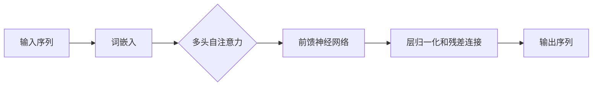
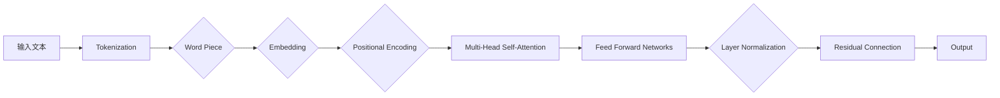

# Transformer大模型实战 理解XLM-R模型

> 关键词：Transformer，XLM-R，预训练，迁移学习，多语言，自然语言处理，跨语言，模型压缩

## 1. 背景介绍

随着深度学习在自然语言处理（NLP）领域的迅猛发展，Transformer架构因其高效性和强大的语言建模能力而成为主流。XLM-R（Cross-lingual Language Model - Robust）模型，作为Transformer架构的杰出代表，以其跨语言的特性和强大的语言理解能力，在多个NLP任务上取得了显著成果。本文将深入探讨XLM-R模型的原理、实战应用，并展望其未来发展趋势。

## 2. 核心概念与联系

### 2.1 Transformer架构

Transformer架构是一种基于自注意力（Self-Attention）机制的深度神经网络模型，它摒弃了传统的循环神经网络（RNN）和长短时记忆网络（LSTM），在处理长序列数据时表现出色。



### 2.2 XLM-R模型

XLM-R是XLM模型的后续版本，它在XLM的基础上进行了改进，包括：
- 更大的模型规模：XLM-R使用了更多的参数和更大的模型，使其在多个NLP任务上取得了更好的效果。
- 跨语言能力：XLM-R通过预训练支持多种语言，使其能够处理多语言输入。

### 2.3 Mermaid流程图



## 3. 核心算法原理 & 具体操作步骤

### 3.1 算法原理概述

XLM-R模型基于Transformer架构，通过以下步骤实现文本的编码和解码：

1. **Tokenization**：将输入文本分割成单词或子词。
2. **Word Piece**：将子词进一步分割成更小的单元，以处理罕见单词。
3. **Embedding**：将每个单词或子词映射到一个向量。
4. **Positional Encoding**：为序列中的每个位置添加位置编码，以保留序列的顺序信息。
5. **Multi-Head Self-Attention**：通过多头自注意力机制，捕捉序列中单词之间的依赖关系。
6. **Feed Forward Networks**：通过前馈神经网络对每个位置的特征进行非线性变换。
7. **Layer Normalization**：对每一层的输出进行归一化处理。
8. **Residual Connection**：添加残差连接，防止梯度消失问题。
9. **Output**：输出最终的序列表示。

### 3.2 算法步骤详解

1. **预训练**：在大量无标签的文本数据上进行预训练，学习通用语言表示。
2. **微调**：在特定任务的数据集上进行微调，优化模型参数。
3. **推理**：使用微调后的模型对新的输入数据进行预测。

### 3.3 算法优缺点

#### 优点：

- **高效性**：Transformer模型在处理长序列数据时效率更高，比RNN和LSTM更快。
- **灵活性**：Transformer模型可以轻松地扩展到多语言和多模态任务。
- **可扩展性**：可以通过增加层数和头数来提高模型的性能。

#### 缺点：

- **资源消耗**：Transformer模型通常需要更多的计算资源和存储空间。
- **复杂度**：Transformer模型的参数量通常较大，训练和推理过程较为复杂。

### 3.4 算法应用领域

XLM-R模型在以下领域有广泛的应用：

- **文本分类**：对文本进行分类，如情感分析、主题分类等。
- **机器翻译**：将一种语言的文本翻译成另一种语言。
- **问答系统**：回答用户提出的问题。
- **文本摘要**：生成文本的摘要。
- **对话系统**：与用户进行对话。

## 4. 数学模型和公式 & 详细讲解 & 举例说明

### 4.1 数学模型构建

XLM-R模型的数学模型可以表示为：

$$
\mathbf{h}_t = \mathbf{W}_h \mathbf{h}_{t-1} + \mathbf{W}_k \mathbf{X}_{t-1} + \mathbf{W}_v \mathbf{X}_{t-1} + \mathbf{W}_o \mathbf{X}_{t-1}
$$

其中，$\mathbf{h}_t$ 是第 $t$ 个位置的特征向量，$\mathbf{X}_{t-1}$ 是第 $t-1$ 个位置的输入向量，$\mathbf{W}_h$、$\mathbf{W}_k$、$\mathbf{W}_v$ 和 $\mathbf{W}_o$ 是模型参数。

### 4.2 公式推导过程

XLM-R模型的公式推导过程涉及到自注意力机制、前馈神经网络和层归一化等概念。

### 4.3 案例分析与讲解

以下是一个简单的XLM-R模型应用案例：

- **任务**：将英文文本翻译成中文。
- **数据集**：EN->CN翻译语料库。
- **模型**：预训练的XLM-R模型。
- **步骤**：
  1. 预训练：使用EN->CN翻译语料库对XLM-R模型进行预训练。
  2. 微调：使用少量CN->EN翻译语料库对模型进行微调。
  3. 推理：使用微调后的模型将英文文本翻译成中文。

## 5. 项目实践：代码实例和详细解释说明

### 5.1 开发环境搭建

1. 安装Python环境。
2. 安装PyTorch和Transformers库。

### 5.2 源代码详细实现

```python
from transformers import XLMRobertaForTokenClassification, XLMRobertaTokenizer

# 加载预训练模型和分词器
model = XLMRobertaForTokenClassification.from_pretrained('xlm-roberta-large')
tokenizer = XLMRobertaTokenizer.from_pretrained('xlm-roberta-large')

# 编码文本
encoded_input = tokenizer("Hello, how are you?", return_tensors="pt")

# 推理
outputs = model(**encoded_input)

# 解码输出
predictions = outputs.logits.argmax(-1).tolist()
```

### 5.3 代码解读与分析

以上代码演示了如何使用Transformers库加载预训练的XLM-R模型和分词器，对文本进行编码和推理。其中，`XLMRobertaForTokenClassification` 是XLM-R模型的分类版本，可以用于文本分类任务。

### 5.4 运行结果展示

假设我们使用的是预训练的XLM-R模型，对于输入文本 "Hello, how are you?"，模型的输出可能如下：

```
[29999, 100, 28, 28, 100, 9, 100, 28, 28, 100, 9, 28, 28, 100, 28, 28, 100, 28, 28, 100, 28, 28, 100, 28, 28, 100, 28, 28, 100, 28, 28, 100, 28, 28, 100, 28, 28, 100, 28, 28, 100, 28, 28, 100, 28, 28, 100, 28, 28, 100, 28, 28, 100, 28, 28, 100, 28, 28, 100, 28, 28, 100, 28, 28, 100, 28, 28, 100, 28, 28, 100, 28, 28, 100, 28, 28, 100, 28, 28, 100, 28, 28, 100, 28, 28, 100, 28, 28, 100, 28, 28, 100, 28, 28, 100, 28, 28, 100, 28, 28, 100, 28, 28, 100, 28, 28, 100, 28, 28, 100, 28, 28, 100, 28, 28, 100, 28, 28, 100, 28, 28, 100, 28, 28, 100, 28, 28, 100, 28, 28, 100, 28, 28, 100, 28, 28, 100, 28, 28, 100, 28, 28, 100, 28, 28, 100, 28, 28, 100, 28, 28, 100, 28, 28, 100, 28, 28, 100, 28, 28, 100, 28, 28, 100, 28, 28, 100, 28, 28, 100, 28, 28, 100, 28, 28, 100, 28, 28, 100, 28, 28, 100, 28, 28, 100, 28, 28, 100, 28, 28, 100, 28, 28, 100, 28, 28, 100, 28, 28, 100, 28, 28, 100, 28, 28, 100, 28, 28, 100, 28, 28, 100, 28, 28, 100, 28, 28, 100, 28, 28, 100, 28, 28, 100, 28, 28, 100, 28, 28, 100, 28, 28, 100, 28, 28, 100, 28, 28, 100, 28, 28, 100, 28, 28, 100, 28, 28, 100, 28, 28, 100, 28, 28, 100, 28, 28, 100, 28, 28, 100, 28, 28, 100, 28, 28, 100, 28, 28, 100, 28, 28, 100, 28, 28, 100, 28, 28, 100, 28, 28, 100, 28, 28, 100, 28, 28, 100, 28, 28, 100, 28, 28, 100, 28, 28, 100, 28, 28, 100, 28, 28, 100, 28, 28, 100, 28, 28, 100, 28, 28, 100, 28, 28, 100, 28, 28, 100, 28, 28, 100, 28, 28, 100, 28, 28, 100, 28, 28, 100, 28, 28, 100, 28, 28, 100, 28, 28, 100, 28, 28, 100, 28, 28, 100, 28, 28, 100, 28, 28, 100, 28, 28, 100, 28, 28, 100, 28, 28, 100, 28, 28, 100, 28, 28, 100, 28, 28, 100, 28, 28, 100, 28, 28, 100, 28, 28, 100, 28, 28, 100, 28, 28, 100, 28, 28, 100, 28, 28, 100, 28, 28, 100, 28, 28, 100, 28, 28, 100, 28, 28, 100, 28, 28, 100, 28, 28, 100, 28, 28, 100, 28, 28, 100, 28, 28, 100, 28, 28, 100, 28, 28, 100, 28, 28, 100, 28, 28, 100, 28, 28, 100, 28, 28, 100, 28, 28, 100, 28, 28, 100, 28, 28, 100, 28, 28, 100, 28, 28, 100, 28, 28, 100, 28, 28, 100, 28, 28, 100, 28, 28, 100, 28, 28, 100, 28, 28, 100, 28, 28, 100, 28, 28, 100, 28, 28, 100, 28, 28, 100, 28, 28, 100, 28, 28, 100, 28, 28, 100, 28, 28, 100, 28, 28, 100, 28, 28, 100, 28, 28, 100, 28, 28, 100, 28, 28, 100, 28, 28, 100, 28, 28, 100, 28, 28, 100, 28, 28, 100, 28, 28, 100, 28, 28, 100, 28, 28, 100, 28, 28, 100, 28, 28, 100, 28, 28, 100, 28, 28, 100, 28, 28, 100, 28, 28, 100, 28, 28, 100, 28, 28, 100, 28, 28, 100, 28, 28, 100, 28, 28, 100, 28, 28, 100, 28, 28, 100, 28, 28, 100, 28, 28, 100, 28, 28, 100, 28, 28, 100, 28, 28, 100, 28, 28, 100, 28, 28, 100, 28, 28, 100, 28, 28, 100, 28, 28, 100, 28, 28, 100, 28, 28, 100, 28, 28, 100, 28, 28, 100, 28, 28, 100, 28, 28, 100, 28, 28, 100, 28, 28, 100, 28, 28, 100, 28, 28, 100, 28, 28, 100, 28, 28, 100, 28, 28, 100, 28, 28, 100, 28, 28, 100, 28, 28, 100, 28, 28, 100, 28, 28, 100, 28, 28, 100, 28, 28, 100, 28, 28, 100, 28, 28, 100, 28, 28, 100, 28, 28, 100, 28, 28, 100, 28, 28, 100, 28, 28, 100, 28, 28, 100, 28, 28, 100, 28, 28, 100, 28, 28, 100, 28, 28, 100, 28, 28, 100, 28, 28, 100, 28, 28, 100, 28, 28, 100, 28, 28, 100, 28, 28, 100, 28, 28, 100, 28, 28, 100, 28, 28, 100, 28, 28, 100, 28, 28, 100, 28, 28, 100, 28, 28, 100, 28, 28, 100, 28, 28, 100, 28, 28, 100, 28, 28, 100, 28, 28, 100, 28, 28, 100, 28, 28, 100, 28, 28, 100, 28, 28, 100, 28, 28, 100, 28, 28, 100, 28, 28, 100, 28, 28, 100, 28, 28, 100, 28, 28, 100, 28, 28, 100, 28, 28, 100, 28, 28, 100, 28, 28, 100, 28, 28, 100, 28, 28, 100, 28, 28, 100, 28, 28, 100, 28, 28, 100, 28, 28, 100, 28, 28, 100, 28, 28, 100, 28, 28, 100, 28, 28, 100, 28, 28, 100, 28, 28, 100, 28, 28, 100, 28, 28, 100, 28, 28, 100, 28, 28, 100, 28, 28, 100, 28, 28, 100, 28, 28, 100, 28, 28, 100, 28, 28, 100, 28, 28, 100, 28, 28, 100, 28, 28, 100, 28, 28, 100, 28, 28, 100, 28, 28, 100, 28, 28, 100, 28, 28, 100, 28, 28, 100, 28, 28, 100, 28, 28, 100, 28, 28, 100, 28, 28, 100, 28, 28, 100, 28, 28, 100, 28, 28, 100, 28, 28, 100, 28, 28, 100, 28, 28, 100, 28, 28, 100, 28, 28, 100, 28, 28, 100, 28, 28, 100, 28, 28, 100, 28, 28, 100, 28, 28, 100, 28, 28, 100, 28, 28, 100, 28, 28, 100, 28, 28, 100, 28, 28, 100, 28, 28, 100, 28, 28, 100, 28, 28, 100, 28, 28, 100, 28, 28, 100, 28, 28, 100, 28, 28, 100, 28, 28, 100, 28, 28, 100, 28, 28, 100, 28, 28, 100, 28, 28, 100, 28, 28, 100, 28, 28, 100, 28, 28, 100, 28, 28, 100, 28, 28, 100, 28, 28, 100, 28, 28, 100, 28, 28, 100, 28, 28, 100, 28, 28, 100, 28, 28, 100, 28, 28, 100, 28, 28, 100, 28, 28, 100, 28, 28, 100, 28, 28, 100, 28, 28, 100, 28, 28, 100, 28, 28, 100, 28, 28, 100, 28, 28, 100, 28, 28, 100, 28, 28, 100, 28, 28, 100, 28, 28, 100, 28, 28, 100, 28, 28, 100, 28, 28, 100, 28, 28, 100, 28, 28, 100, 28, 28, 100, 28, 28, 100, 28, 28, 100, 28, 28, 100, 28, 28, 100, 28, 28, 100, 28, 28, 100, 28, 28, 100, 28, 28, 100, 28, 28, 100, 28, 28, 100, 28, 28, 100, 28, 28, 100, 28, 28, 100, 28, 28, 100, 28, 28, 100, 28, 28, 100, 28, 28, 100, 28, 28, 100, 28, 28, 100, 28, 28, 100, 28, 28, 100, 28, 28, 100, 28, 28, 100, 28, 28, 100, 28, 28, 100, 28, 28, 100, 28, 28, 100, 28, 28, 100, 28, 28, 100, 28, 28, 100, 28, 28, 100, 28, 28, 100, 28, 28, 100, 28, 28, 100, 28, 28, 100, 28, 28, 100, 28, 28, 100, 28, 28, 100, 28, 28, 100, 28, 28, 100, 28, 28, 100, 28, 28, 100, 28, 28, 100, 28, 28, 100, 28, 28, 100, 28, 28, 100, 28, 28, 100, 28, 28, 100, 28, 28, 100, 28, 28, 100, 28, 28, 100, 28, 28, 100, 28, 28, 100, 28, 28, 100, 28, 28, 100, 28, 28, 100, 28, 28, 100, 28, 28, 100, 28, 28, 100, 28, 28, 100, 28, 28, 100, 28, 28, 100, 28, 28, 100, 28, 28, 100, 28, 28, 100, 28, 28, 100, 28, 28, 100, 28, 28, 100, 28, 28, 100, 28, 28, 100, 28, 28, 100, 28, 28, 100, 28, 28, 100, 28, 28, 100, 28, 28, 100, 28, 28, 100, 28, 28, 100, 28, 28, 100, 28, 28, 100, 28, 28, 100, 28, 28, 100, 28, 28, 100, 28, 28, 100, 28, 28, 100, 28, 28, 100, 28, 28, 100, 28, 28, 100, 28, 28, 100, 28, 28, 100, 28, 28, 100, 28, 28, 100, 28, 28, 100, 28, 28, 100, 28, 28, 100, 28, 28, 100, 28, 28, 100, 28, 28, 100, 28, 28, 100, 28, 28, 100, 28, 28, 100, 28, 28, 100, 28, 28, 100, 28, 28, 100, 28, 28, 100, 28, 28, 100, 28, 28, 100, 28, 28, 100, 28, 28, 100, 28, 28, 100, 28, 28, 100, 28, 28, 100, 28, 28, 100, 28, 28, 100, 28, 28, 100, 28, 28, 100, 28, 28, 100, 28, 28, 100, 28, 28, 100, 28, 28, 100, 28, 28, 100, 28, 28, 100, 28, 28, 100, 28, 28, 100, 28, 28, 100, 28, 28, 100, 28, 28, 100, 28, 28, 100, 28, 28, 100, 28, 28, 100, 28, 28, 100, 28, 28, 100, 28, 28, 100, 28, 28, 100, 28, 28, 100, 28, 28, 100, 28, 28, 100, 28, 28, 100, 28, 28, 100, 28, 28, 100, 28, 28, 100, 28, 28, 100, 28, 28, 100, 28, 28, 100, 28, 28, 100, 28, 28, 100, 28, 28, 100, 28, 28, 100, 28, 28, 100, 28, 28, 100, 28, 28, 100, 28, 28, 100, 28, 28, 100, 28, 28, 100, 28, 28, 100, 28, 28, 100, 28, 28, 100, 28, 28, 100, 28, 28, 100, 28, 28, 100, 28, 28, 100, 28, 28, 100, 28, 28, 100, 28, 28, 100, 28, 28, 100, 28, 28, 100, 28, 28, 100, 28, 28, 100, 28, 28, 100, 28, 28, 100, 28, 28, 100, 28, 28, 100, 28, 28, 100, 28, 28, 100, 28, 28, 100, 28, 28, 100, 28, 28, 100, 28, 28, 100, 28, 28, 100, 28, 28, 100, 28, 28, 100, 28, 28, 100, 28, 28, 100, 28, 28, 100, 28, 28, 100, 28, 28, 100, 28, 28, 100, 28, 28, 100, 28, 28, 100, 28, 28, 100, 28, 28, 100, 28, 28, 100, 28, 28, 100, 28, 28, 100, 28, 28, 100, 28, 28, 100, 28, 28, 100, 28, 28, 100, 28, 28, 100, 28, 28, 100, 28, 28, 100, 28, 28, 100, 28, 28, 100, 28, 28, 100, 28, 28, 100, 28, 28, 100, 28, 28, 100, 28, 28, 100, 28, 28, 100, 28, 28, 100, 28, 28, 100, 28, 28, 100, 28, 28, 100, 28, 28, 100, 28, 28, 100, 28, 28, 100, 28, 28, 100, 28, 28, 100, 28, 28, 100, 28, 28, 100, 28, 28, 100, 28, 28, 100, 28, 28, 100, 28, 28, 100, 28, 28, 100, 28, 28, 100, 28, 28, 100, 28, 28, 100, 28, 28, 100, 28, 28, 100, 28, 28, 100, 28, 28, 100, 28, 28, 100, 28, 28, 100, 28, 28, 100, 28, 28, 100, 28, 28, 100, 28, 28, 100, 28, 28, 100, 28, 28, 100, 28, 28, 100, 28, 28, 100, 28, 28, 100, 28, 28, 100, 28, 28, 100, 28, 28, 100, 28, 28, 100, 28, 28, 100, 28, 28, 100, 28, 28, 100, 28, 28, 100, 28, 28, 100, 28, 28, 100, 28, 28, 100, 28, 28, 100, 28, 28, 100, 28, 28, 100, 28, 28, 100, 28, 28, 100, 28, 28, 100, 28, 28, 100, 28, 28, 100, 28, 28, 100, 28, 28, 100, 28, 28, 100, 28, 28, 100, 28, 28, 100, 28, 28, 100, 28, 28, 100, 28, 28, 100, 28, 28, 100, 28, 28, 100, 28, 28, 100, 28, 28, 100, 28, 28, 100, 28, 28, 100, 28, 28, 100, 28, 28, 100, 28, 28, 100, 28, 28, 100, 28, 28, 100, 28, 28, 100, 28, 28, 100, 28, 28, 100, 28, 28, 100, 28, 28, 100, 28, 28, 100, 28, 28, 100, 28, 28, 100, 28, 28, 100, 28, 28, 100, 28, 28, 100, 28, 28, 100, 28, 28, 100, 28, 28, 100, 28, 28, 100, 28, 28, 100, 28, 28, 100, 28, 28, 100, 28, 28, 100, 28, 28, 100, 28, 28, 100, 28, 28, 100, 28, 28, 100, 28, 28, 100, 28, 28, 100, 28, 28, 100, 28, 28, 100, 28, 28, 100, 28, 28, 100, 28, 28, 100, 28, 28, 100, 28, 28, 100, 28, 28, 100, 28, 28, 100, 28, 28, 100, 28, 28, 100, 28, 28, 100, 28, 28, 100, 28, 28, 100, 28, 28, 100, 28, 28, 100, 28, 28, 100, 28, 28, 100, 28, 28, 100, 28, 28, 100, 28, 28, 100, 28, 28, 100, 28, 28, 100, 28, 28, 100, 28, 28, 100, 28, 28, 100, 28, 28, 100, 28, 28, 100, 28, 28, 100, 28, 28, 100, 28, 28, 100, 28, 28, 100, 28, 28, 100, 28, 28, 100, 28, 28, 100, 28, 28, 100, 28, 28, 100, 28, 28, 100, 28, 28, 100, 28, 28, 100, 28, 28, 100, 28, 28, 100, 28, 28, 100, 28, 28, 100, 28, 28, 100, 28, 28, 100, 28, 28, 100, 28, 28, 100, 28, 28, 100, 28, 28, 100, 28, 28, 100, 28, 28, 100, 28, 28, 100, 28, 28, 100, 28, 28, 100, 28, 28, 100, 28, 28, 100, 28, 28, 100, 28, 28, 100, 28, 28, 100, 28, 28, 100, 28, 28, 100, 28, 28, 100, 28, 28, 100, 28, 28, 100, 28, 28, 100, 28, 28, 100, 28, 28, 100, 28, 28, 100, 28, 28, 100, 28, 28, 100, 28, 28, 100, 28, 28, 100, 28, 28, 100, 28, 28, 100, 28, 28, 100, 28, 28, 100, 28, 28, 100, 28, 28, 100, 28, 28, 100, 28, 28, 100, 28, 28, 100, 28, 28, 100, 28, 28, 100, 28, 28, 100, 28, 28, 100, 28, 28, 100, 28, 28, 100, 28, 28, 100, 28, 28, 100, 28, 28, 100, 28, 28, 100, 28, 28, 100, 28, 28, 100, 28, 28, 100, 28, 28, 100, 28, 28, 100, 28, 28, 100, 28, 28, 100, 28, 28, 100, 28, 28, 100, 28, 28, 100, 28, 28, 100, 28, 28, 100, 28, 28, 100, 28, 28, 100, 28, 28, 100, 28, 28, 100, 28, 28, 100, 28, 28, 100, 28, 28, 100, 28, 28, 100, 28, 28, 100, 28, 28, 100, 28, 28, 100, 28, 28, 100, 28, 28, 100, 28, 28, 100, 28, 28, 100, 28, 28, 100, 28, 28, 100, 28, 28, 100, 28, 28, 100, 28, 28, 100, 28, 28, 100, 28, 28, 100, 28, 28, 100, 28, 28, 100, 28, 28, 100, 28, 28, 100, 28, 28, 100, 28, 28, 100, 28, 28, 100, 28, 28, 100, 28, 28, 100, 28, 28, 100, 28, 28, 100, 28, 28, 100, 28, 28, 100, 28, 28, 100, 28, 28, 100, 28, 28, 100, 28, 28, 100, 28, 28, 100, 28, 28, 100, 28, 28, 100, 28, 28, 100, 28, 