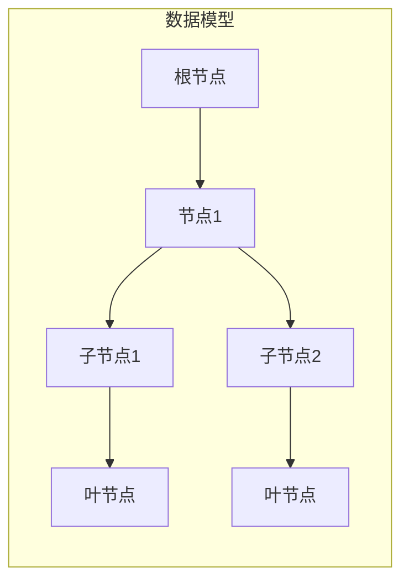

# Zookeeper分布式协调服务原理与代码实例讲解

> 关键词：Zookeeper，分布式协调，ZAB协议，集群，会话管理，数据模型，Zookeeper客户端，应用场景

## 1. 背景介绍

随着云计算和分布式系统的普及，分布式协调服务成为了构建可靠、高效分布式应用的关键技术。Zookeeper 是由 Apache 软件基金会开发的一个开源分布式协调服务，它提供了简单的 API 和高性能的分布式应用协调机制，广泛应用于分布式锁、分布式队列、配置管理、分布式选举等领域。本文将深入讲解 Zookeeper 的原理和代码实例，帮助读者全面理解和使用 Zookeeper。

### 1.1 问题的由来

在分布式系统中，节点之间需要协调一致地完成任务，如选举主节点、同步状态、分配任务等。传统的同步机制如轮询、广播等，存在效率低下、难以维护等问题。Zookeeper 通过其独特的架构和协议，为分布式系统提供了一种高效、可靠的协调服务。

### 1.2 研究现状

Zookeeper 的核心是 ZAB（Zookeeper Atomic Broadcast）协议，它确保了分布式系统中所有服务器之间的数据一致性。Zookeeper 支持跨语言客户端库，包括 Java、Python、C++ 等，使其在各种分布式系统中得到广泛应用。

### 1.3 研究意义

掌握 Zookeeper 的原理和使用方法，对于开发高性能、可扩展的分布式系统具有重要意义。本文将帮助读者：

- 理解 Zookeeper 的架构和 ZAB 协议。
- 掌握 Zookeeper 的基本操作和高级特性。
- 学习使用 Zookeeper 解决分布式系统的协调问题。
- 分析 Zookeeper 的应用场景和未来发展趋势。

### 1.4 本文结构

本文将按照以下结构展开：

- 第2章介绍 Zookeeper 的核心概念与联系，包括数据模型、会话管理、命名空间等。
- 第3章讲解 Zookeeper 的核心算法原理和具体操作步骤，包括 ZAB 协议、数据节点、事务处理等。
- 第4章通过数学模型和公式，详细讲解 Zookeeper 中的关键概念和算法。
- 第5章提供 Zookeeper 的代码实例，并进行详细解释说明。
- 第6章探讨 Zookeeper 的实际应用场景和未来发展趋势。
- 第7章推荐学习资源、开发工具和参考文献。
- 第8章总结研究成果，展望未来发展趋势和挑战。
- 第9章提供常见问题与解答。

## 2. 核心概念与联系

### 2.1 数据模型

Zookeeper 的数据模型是一个类似于文件系统的树形结构，称为 Zookeeper 数据模型。每个节点（Node）可以包含数据和一个或多个子节点。



### 2.2 会话管理

Zookeeper 客户端与服务器之间通过会话（Session）进行交互。会话包括会话超时、会话创建、会话结束等操作。

### 2.3 命名空间

Zookeeper 的命名空间是一组节点和节点的集合，它可以是整个 ZNode 树，也可以是树的一部分。

## 3. 核心算法原理 & 具体操作步骤

### 3.1 算法原理概述

Zookeeper 使用 ZAB（Zookeeper Atomic Broadcast）协议来保证分布式系统中所有服务器之间的数据一致性。

### 3.2 算法步骤详解

ZAB 协议包括以下步骤：

1. **崩溃恢复**：当发生服务器故障时，Zookeeper 集群进行崩溃恢复，选出一个新的领导者。
2. **领导选举**：领导者负责处理客户端请求，其他服务器称为跟随者。
3. **数据同步**：跟随者与领导者同步数据，保证数据一致性。
4. **事务处理**：客户端请求被封装为事务，领导者负责处理事务。

### 3.3 算法优缺点

**优点**：

- 高效：ZAB 协议保证了一致性，同时提供了高效的并发处理能力。
- 可靠：Zookeeper 集群具有高可用性，即使部分服务器故障，系统也能正常运行。

**缺点**：

- 扩展性：Zookeeper 集群扩展性有限，不适合非常大的分布式系统。
- 性能：Zookeeper 的性能受限于网络延迟和服务器负载。

### 3.4 算法应用领域

Zookeeper 在以下领域有广泛应用：

- 分布式锁
- 分布式队列
- 配置管理
- 分布式选举
- 数据同步

## 4. 数学模型和公式 & 详细讲解 & 举例说明

### 4.1 数学模型构建

ZAB 协议的核心是事务日志和状态机。事务日志记录了所有事务操作，状态机根据事务日志恢复状态。

### 4.2 公式推导过程

ZAB 协议中，每个事务都有一个唯一的 TID（事务ID），事务操作包括创建、删除、修改节点等。

### 4.3 案例分析与讲解

以创建节点为例，客户端发送创建请求，领导者记录事务到日志，广播到跟随者，跟随者同步数据，完成创建操作。

## 5. 项目实践：代码实例和详细解释说明

### 5.1 开发环境搭建

使用 Java 或 Python 等语言，安装 Zookeeper 客户端库。

### 5.2 源代码详细实现

以下是一个简单的 Java Zookeeper 客户端示例，用于创建、读取和删除节点。

```java
import org.apache.zookeeper.ZooKeeper;
import org.apache.zookeeper.CreateMode;

public class ZookeeperExample {
    private static final String ZOOKEEPER_SERVERS = "localhost:2181";
    private static final String PATH = "/test-node";

    public static void main(String[] args) throws Exception {
        ZooKeeper zk = new ZooKeeper(ZOOKEEPER_SERVERS, 3000);
        String nodeData = "This is a test node";

        // 创建节点
        String createdNode = zk.create(PATH, nodeData.getBytes(), ZooKeeper.CreateMode.PERSISTENT);
        System.out.println("Created node: " + createdNode);

        // 读取节点数据
        byte[] data = zk.getData(createdNode, false);
        System.out.println("Node data: " + new String(data));

        // 删除节点
        zk.delete(createdNode, -1);
        System.out.println("Deleted node: " + createdNode);

        zk.close();
    }
}
```

### 5.3 代码解读与分析

以上代码演示了如何使用 Zookeeper 客户端库创建、读取和删除节点。首先，创建一个 ZooKeeper 实例，然后使用 create 方法创建节点，使用 getData 方法读取节点数据，最后使用 delete 方法删除节点。

## 6. 实际应用场景

### 6.1 分布式锁

Zookeeper 可以用于实现分布式锁，确保多个客户端对同一资源的独占访问。

### 6.2 分布式队列

Zookeeper 可以用于实现分布式队列，实现任务的分发和消费。

### 6.3 配置管理

Zookeeper 可以用于管理分布式系统的配置信息，如数据库连接串、日志配置等。

### 6.4 分布式选举

Zookeeper 可以用于实现分布式选举，选出主节点或其他特定节点。

## 7. 工具和资源推荐

### 7.1 学习资源推荐

- Apache ZooKeeper 官方文档
- 《ZooKeeper实战》
- 《分布式系统原理与范型》

### 7.2 开发工具推荐

- Zookeeper 客户端库（Java、Python、C++ 等）
- Zookeeper 集群管理工具（ZooKeeper-Manager、ZooKeeper-Explorer 等）

### 7.3 相关论文推荐

- The Design of the ZooKeeper Distributed Coordination Service
- Understanding ZooKeeper’s Internal Implementation

## 8. 总结：未来发展趋势与挑战

### 8.1 研究成果总结

本文深入讲解了 Zookeeper 的原理和代码实例，帮助读者理解和使用 Zookeeper 进行分布式系统的协调。

### 8.2 未来发展趋势

Zookeeper 将继续优化性能和稳定性，并扩展其应用场景。

### 8.3 面临的挑战

Zookeeper 需要解决扩展性、性能和安全性等问题。

### 8.4 研究展望

Zookeeper 将与其他分布式技术（如 Kubernetes、Consul 等）进行整合，为分布式系统提供更加完善的协调服务。

## 9. 附录：常见问题与解答

**Q1：Zookeeper 和 ZooKeeper-Manager 有什么区别？**

A1：Zookeeper 是 Apache 软件基金会开源的分布式协调服务，而 ZooKeeper-Manager 是一个图形化界面工具，用于管理和监控 Zookeeper 集群。

**Q2：Zookeeper 的数据模型和文件系统有什么区别？**

A2：Zookeeper 的数据模型是一个树形结构，类似于文件系统，但节点可以包含数据，而文件系统只包含文件。

**Q3：Zookeeper 的 ZAB 协议是如何保证数据一致性的？**

A3：ZAB 协议通过领导者选举、数据同步和事务处理，确保分布式系统中所有服务器之间的数据一致性。

**Q4：Zookeeper 有哪些应用场景？**

A4：Zookeeper 在分布式锁、分布式队列、配置管理、分布式选举等领域有广泛应用。

**Q5：如何提高 Zookeeper 的性能？**

A5：可以通过优化网络配置、使用合适的 Zookeeper 集群架构、调整配置参数等方式提高 Zookeeper 的性能。

---

作者：禅与计算机程序设计艺术 / Zen and the Art of Computer Programming