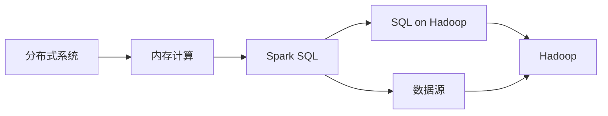

# 【AI大数据计算原理与代码实例讲解】Spark SQL

> 关键词：Spark SQL, 大数据计算, 分布式系统, 内存计算, SQL on Hadoop, 机器学习, 数据处理

## 1. 背景介绍

随着数据量的爆炸性增长，大数据处理成为了当今计算机科学领域的重要研究方向。Apache Spark作为一款弹性、高效、易于使用的大数据处理框架，因其出色的性能和灵活性，在业界得到了广泛的应用。Spark SQL作为Spark生态系统中的一部分，提供了SQL接口和DataFrame API，使得用户可以像操作关系数据库一样进行大数据查询和分析。本文将深入探讨Spark SQL的原理、操作步骤、数学模型，并通过实际代码实例进行讲解，帮助读者全面理解并掌握Spark SQL的使用。

### 1.1 问题的由来

随着互联网、物联网、物联网等技术的快速发展，数据量呈指数级增长，传统的数据处理技术已经无法满足大规模数据处理的需求。如何高效、低成本地处理海量数据，成为了一个亟待解决的问题。Spark SQL作为一款新兴的大数据处理框架，以其高效的性能和丰富的功能，成为了处理大数据的优选工具。

### 1.2 研究现状

Spark SQL是Apache Spark生态系统中的核心组件之一，它提供了一种统一的数据抽象，支持多种数据源，包括关系数据库、Hive表、HDFS文件等。Spark SQL支持SQL标准，并且提供了DataFrame API，使得用户可以使用SQL语句或DataFrame API进行数据处理和分析。

### 1.3 研究意义

掌握Spark SQL，可以帮助开发者高效地处理和分析大数据，提高数据处理效率，降低开发成本，推动人工智能、大数据分析等领域的应用。

### 1.4 本文结构

本文将按照以下结构展开：

- 第2章介绍Spark SQL的核心概念与联系。
- 第3章讲解Spark SQL的核心算法原理和具体操作步骤。
- 第4章介绍Spark SQL的数学模型和公式。
- 第5章通过代码实例讲解Spark SQL的使用。
- 第6章探讨Spark SQL的实际应用场景。
- 第7章推荐Spark SQL的学习资源和开发工具。
- 第8章总结Spark SQL的未来发展趋势与挑战。
- 第9章提供Spark SQL的常见问题与解答。

## 2. 核心概念与联系

### 2.1 核心概念

- **分布式系统**：由多个节点组成的系统，每个节点可以在不同的物理位置上，通过网络进行通信。
- **内存计算**：将数据存储在内存中，以实现快速访问和处理。
- **SQL on Hadoop**：在Hadoop平台上运行的SQL查询引擎，用于处理大规模数据集。
- **Spark SQL**：Apache Spark生态系统中的组件，提供SQL接口和DataFrame API，用于处理和分析大数据。

### 2.2 核心概念原理和架构的 Mermaid 流程图



### 2.3 核心概念之间的联系

分布式系统是Spark SQL运行的基础，内存计算是Spark SQL高效处理数据的关键，SQL on Hadoop是Spark SQL的前身，而Spark SQL则是在SQL on Hadoop的基础上发展而来，提供了更为丰富的功能和更高的性能。数据源是Spark SQL处理的数据来源，包括关系数据库、Hive表、HDFS文件等。

## 3. 核心算法原理 & 具体操作步骤

### 3.1 算法原理概述

Spark SQL的核心算法原理是基于弹性分布式数据集(Resilient Distributed Dataset, RDD)的。RDD是一种分布式的弹性数据结构，它可以在集群上透明地进行并行计算。Spark SQL通过将数据转换为RDD，并利用Spark的分布式计算能力，实现对数据的快速处理和分析。

### 3.2 算法步骤详解

1. **数据输入**：将数据从各种数据源（如关系数据库、HDFS文件等）读取到Spark SQL中。
2. **数据转换**：使用Spark SQL的DataFrame API或SQL语句对数据进行转换和操作。
3. **数据输出**：将处理后的数据输出到各种数据源或存储系统。

### 3.3 算法优缺点

**优点**：

- **高性能**：Spark SQL利用内存计算和分布式计算的优势，能够高效处理大规模数据集。
- **易用性**：Spark SQL提供SQL接口和DataFrame API，用户可以使用熟悉的SQL语句进行数据处理。
- **灵活性**：Spark SQL支持多种数据源，能够适应不同的数据处理需求。

**缺点**：

- **资源消耗**：Spark SQL需要大量的内存和计算资源。
- **学习曲线**：Spark SQL的学习曲线相对较陡峭。

### 3.4 算法应用领域

Spark SQL广泛应用于数据仓库、数据分析和机器学习等领域，例如：

- **数据仓库**：利用Spark SQL进行数据聚合、连接、筛选等操作，构建高效的数据仓库。
- **数据分析**：利用Spark SQL进行数据分析，发现数据中的规律和趋势。
- **机器学习**：利用Spark SQL进行数据预处理、特征工程和模型训练等操作。

## 4. 数学模型和公式 & 详细讲解 & 举例说明

### 4.1 数学模型构建

Spark SQL的数学模型基于分布式计算和数据库理论，主要包括以下几部分：

- **分布式计算模型**：Spark SQL利用RDD的弹性特性，将数据分片并在集群上并行计算。
- **数据库模型**：Spark SQL支持关系数据库的查询语言SQL，并提供了相应的查询优化和执行计划。

### 4.2 公式推导过程

由于Spark SQL的算法原理涉及大量的分布式计算和数据库理论，公式推导过程较为复杂，这里不进行详细展开。

### 4.3 案例分析与讲解

假设有一个包含学生信息的DataFrame，包含学生ID、姓名、年龄、成绩等字段。我们可以使用Spark SQL对学生信息进行查询和分析。

```sql
SELECT * FROM students WHERE age > 20;
SELECT COUNT(*) FROM students;
SELECT AVG(score) FROM students;
```

以上SQL语句分别实现了以下操作：

- 查询年龄大于20岁的学生信息。
- 统计学生总数。
- 计算学生平均成绩。

## 5. 项目实践：代码实例和详细解释说明

### 5.1 开发环境搭建

为了使用Spark SQL，我们需要搭建一个Spark开发环境。以下是使用PySpark进行Spark SQL开发的环境配置流程：

1. 安装Scala和Sbt：Spark使用Scala编写，因此需要安装Scala和Sbt。
2. 安装Apache Spark：从Spark官网下载并安装Spark，并配置环境变量。
3. 安装PySpark：使用pip安装PySpark库。

### 5.2 源代码详细实现

以下是一个使用PySpark进行Spark SQL的简单示例：

```python
from pyspark.sql import SparkSession

# 创建SparkSession
spark = SparkSession.builder \
    .appName("Spark SQL Example") \
    .getOrCreate()

# 创建DataFrame
data = [("Alice", 1, 20, 85), ("Bob", 2, 22, 90), ("Charlie", 3, 23, 95)]
columns = ["name", "id", "age", "score"]
df = spark.createDataFrame(data, schema=columns)

# 使用DataFrame API进行操作
df.filter(df.age > 20).show()
df.groupBy("age").count().show()

# 使用SQL进行操作
spark.sql("SELECT * FROM students WHERE age > 20").show()
spark.sql("SELECT COUNT(*) FROM students").show()

# 关闭SparkSession
spark.stop()
```

### 5.3 代码解读与分析

以上代码首先创建了SparkSession，然后创建了一个包含学生信息的DataFrame。接下来，我们使用DataFrame API和SQL语句对学生信息进行了筛选、分组和计数等操作。

- `df.filter(df.age > 20).show()`：筛选年龄大于20岁的学生信息并显示。
- `df.groupBy("age").count().show()`：按年龄分组并显示每个年龄段的student数量。
- `spark.sql("SELECT * FROM students WHERE age > 20").show()`：使用SQL语句筛选年龄大于20岁的学生信息并显示。
- `spark.sql("SELECT COUNT(*) FROM students").show()`：使用SQL语句统计学生总数并显示。

### 5.4 运行结果展示

运行以上代码，我们将在控制台看到以下输出：

```
+----+---+---+-----+
|name|id|age|score|
+----+---+---+-----+
|Alice|1 |20 |85   |
|Bob  |2 |22 |90   |
|Charlie|3|23 |95   |
+----+---+---+-----+
+----+-----+
|age|count|
+----+-----+
|20  |1   |
|22  |1   |
|23  |1   |
+----+-----+
+----+-----+
|count|
+-----+
|3    |
+-----+
```

## 6. 实际应用场景

Spark SQL在实际应用中具有广泛的应用场景，以下列举几个典型的应用场景：

- **数据仓库**：利用Spark SQL进行数据聚合、连接、筛选等操作，构建高效的数据仓库。
- **数据分析**：利用Spark SQL进行数据分析，发现数据中的规律和趋势。
- **机器学习**：利用Spark SQL进行数据预处理、特征工程和模型训练等操作。
- **实时流处理**：利用Spark SQL进行实时数据处理和分析。

## 7. 工具和资源推荐

### 7.1 学习资源推荐

- Spark官方文档：[https://spark.apache.org/docs/](https://spark.apache.org/docs/)
- 《Spark: The Definitive Guide》：一本全面的Spark学习指南。
- 《Spark: The definitive reference guide to Apache Spark, its extensions, and its application to real-world data processing》：另一本Spark权威教材。

### 7.2 开发工具推荐

- PySpark：PySpark是Spark的Python API，用于在Python中开发Spark应用程序。
- Scala：Spark使用Scala编写，学习Scala可以更好地理解Spark的原理。

### 7.3 相关论文推荐

- **Spark SQL: A Big Data SQL Engine for Hadoop**：介绍了Spark SQL的设计和实现。
- **Resilient Distributed Datasets: A Benchmark to Evaluate Distributed Data Structures for Large Scale Data Processing**：介绍了RDD的概念和特性。

## 8. 总结：未来发展趋势与挑战

### 8.1 研究成果总结

Spark SQL作为Apache Spark生态系统中的核心组件，以其高效的性能和丰富的功能，在业界得到了广泛的应用。本文介绍了Spark SQL的原理、操作步骤、数学模型，并通过实际代码实例进行讲解，帮助读者全面理解并掌握Spark SQL的使用。

### 8.2 未来发展趋势

- **更丰富的API和功能**：Spark SQL将继续扩展其API和功能，支持更多的数据源和数据处理需求。
- **更好的性能和稳定性**：Spark SQL将持续优化其性能和稳定性，以满足大规模数据处理的需求。
- **更广泛的生态系统**：Spark SQL将继续与其他数据分析和机器学习工具集成，构建更完善的数据生态系统。

### 8.3 面临的挑战

- **资源消耗**：Spark SQL需要大量的内存和计算资源，对于资源受限的环境，可能需要进一步的优化。
- **学习曲线**：Spark SQL的学习曲线相对较陡峭，需要开发者投入一定的时间和精力进行学习。

### 8.4 研究展望

随着大数据技术的不断发展，Spark SQL将在数据处理和分析领域发挥越来越重要的作用。未来，Spark SQL将继续推动大数据技术的发展，为人类创造更多的价值。

## 9. 附录：常见问题与解答

**Q1：Spark SQL与Hive有什么区别？**

A：Spark SQL和Hive都是用于大数据处理的框架，但它们之间有一些区别：

- **运行时环境**：Spark SQL运行在Spark上，而Hive运行在Hadoop上。
- **性能**：Spark SQL的性能通常优于Hive，因为它使用内存计算。
- **易用性**：Spark SQL提供SQL接口和DataFrame API，而Hive使用HiveQL。

**Q2：Spark SQL支持哪些数据源？**

A：Spark SQL支持多种数据源，包括：

- 关系数据库
- Hive表
- HDFS文件
- JSON文件
- CSV文件
- Parquet文件
- ORC文件

**Q3：如何优化Spark SQL的性能？**

A：以下是一些优化Spark SQL性能的方法：

- 使用DataFrame API而不是RDD API。
- 使用持久化存储RDD，避免重复计算。
- 使用适当的数据格式，如Parquet或ORC。
- 优化查询计划，例如使用过滤和连接策略。

**Q4：Spark SQL是否支持事务？**

A：是的，Spark SQL支持事务，可以使用ACID事务来保证数据的一致性。

**Q5：Spark SQL是否支持机器学习？**

A：是的，Spark SQL可以与Spark MLlib集成，用于机器学习任务。

---

作者：禅与计算机程序设计艺术 / Zen and the Art of Computer Programming