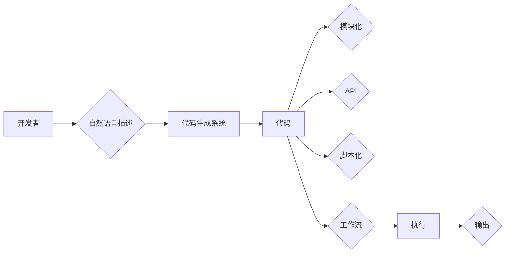

# 【LangChain编程：从入门到实践】batch

> 关键词：LangChain, 编程范式, 模块化, API, 代码生成, 脚本化, 工作流, 人工智能, 自动化, 持续集成

## 1. 背景介绍

随着人工智能技术的飞速发展，代码生成、自动化和智能化成为软件开发的新趋势。LangChain作为一种新兴的编程范式，它将自然语言处理（NLP）与软件开发相结合，使得开发者能够通过自然语言描述代码的功能和结构，从而实现代码的自动生成和优化。本文旨在深入探讨LangChain编程的核心概念、实现方法以及在实际开发中的应用，帮助读者从入门到实践掌握LangChain编程。

### 1.1 问题的由来

传统软件开发过程中，代码编写往往依赖于程序员的手动编码和调试。这种方式不仅效率低下，而且容易出错。随着代码量的增加，软件维护和扩展变得越来越困难。为了解决这些问题，编程范式和工具不断涌现，如模块化、面向对象、函数式编程等。然而，这些范式仍然要求开发者具备较强的编程技能和经验。

LangChain的出现，打破了传统编程的束缚，允许开发者通过自然语言描述需求，由系统自动生成相应的代码。这种编程范式不仅降低了编程门槛，还提高了开发效率和代码质量。

### 1.2 研究现状

LangChain编程目前还处于发展阶段，但已展现出巨大的潜力。一些开源项目和工具，如OpenAI的GPT-3、GitHub的Copilot等，都展示了LangChain编程的初步成果。这些工具能够根据自然语言描述生成代码片段、修复bug、优化代码结构等。

### 1.3 研究意义

LangChain编程具有以下研究意义：

1. 降低编程门槛，让非程序员也能参与软件开发。
2. 提高开发效率，缩短软件开发周期。
3. 提升代码质量，减少人工错误。
4. 推动人工智能与软件开发领域的深度融合。

### 1.4 本文结构

本文将按照以下结构展开：

- 第2部分介绍LangChain编程的核心概念和联系。
- 第3部分阐述LangChain编程的核心算法原理和具体操作步骤。
- 第4部分讲解LangChain编程的数学模型和公式。
- 第5部分通过项目实践展示LangChain编程的应用。
- 第6部分探讨LangChain编程的实际应用场景和未来展望。
- 第7部分推荐LangChain编程的学习资源和开发工具。
- 第8部分总结研究成果，展望LangChain编程的未来发展趋势和挑战。
- 第9部分提供常见问题与解答。

## 2. 核心概念与联系

LangChain编程的核心概念包括：

- **自然语言描述**：开发者使用自然语言描述代码的功能和结构。
- **代码生成**：系统根据自然语言描述自动生成代码。
- **模块化**：将代码分解为可复用的模块。
- **API**：提供接口供开发者调用。
- **脚本化**：使用脚本语言定义代码生成逻辑。
- **工作流**：定义代码生成的步骤和流程。

以下是LangChain编程的核心概念原理和架构的Mermaid流程图：



## 3. 核心算法原理 & 具体操作步骤

### 3.1 算法原理概述

LangChain编程的核心算法原理是基于自然语言处理和代码生成技术。系统首先理解开发者的自然语言描述，然后根据描述生成相应的代码，最后对代码进行模块化和脚本化处理。

### 3.2 算法步骤详解

1. **自然语言处理**：系统使用NLP技术解析开发者的自然语言描述，提取代码的功能、结构、参数等信息。
2. **代码生成**：根据提取的信息，系统生成相应的代码片段。
3. **模块化**：将生成的代码片段分解为可复用的模块。
4. **API定义**：为每个模块定义API接口，方便开发者调用。
5. **脚本化**：使用脚本语言定义代码生成逻辑。
6. **工作流设计**：设计代码生成的步骤和流程。
7. **代码执行**：执行工作流，生成最终的代码。
8. **输出结果**：将生成的代码输出给开发者。

### 3.3 算法优缺点

**优点**：

- 降低编程门槛，提高开发效率。
- 生成高质量的代码，减少人工错误。
- 支持模块化和API封装，提高代码复用性。

**缺点**：

- 依赖于NLP和代码生成技术，技术门槛较高。
- 生成代码的质量取决于NLP和代码生成技术的水平。
- 可能存在生成不安全或不合法的代码的风险。

### 3.4 算法应用领域

LangChain编程适用于以下领域：

- 自动化脚本编写。
- API自动化测试。
- 代码生成和重构。
- 持续集成和持续部署。
- 代码审查和漏洞扫描。

## 4. 数学模型和公式 & 详细讲解 & 举例说明

### 4.1 数学模型构建

LangChain编程的数学模型主要基于自然语言处理和代码生成技术。以下是常见的数学模型：

- **NLP模型**：如BERT、GPT等，用于理解自然语言描述。
- **代码生成模型**：如Seq2Seq、Transformer等，用于生成代码。

### 4.2 公式推导过程

由于LangChain编程涉及多种模型，具体的公式推导过程较为复杂，本文不进行详细展开。

### 4.3 案例分析与讲解

以下是一个简单的LangChain编程案例：

**开发者**：我想创建一个简单的函数，该函数接受一个数字作为输入，返回其平方值。

**代码生成系统**：根据描述，生成以下代码：

```python
def square(n):
    return n * n
```

**模块化**：将函数`square`封装为模块。

**API**：定义API接口，允许外部调用`square`函数。

**脚本化**：使用Python脚本调用API，实现以下逻辑：

```python
if __name__ == "__main__":
    number = input("请输入一个数字：")
    squared = square(int(number))
    print(f"平方值是：{squared}")
```

**工作流**：定义以下步骤：

1. 读取用户输入。
2. 调用`square`函数计算平方值。
3. 输出平方值。

**代码执行**：执行脚本，实现以下功能：

1. 提示用户输入数字。
2. 计算输入数字的平方值。
3. 输出平方值。

## 5. 项目实践：代码实例和详细解释说明

### 5.1 开发环境搭建

1. 安装Python环境。
2. 安装LangChain库：

```bash
pip install langchain
```

### 5.2 源代码详细实现

以下是一个使用LangChain库生成Python代码的简单示例：

```python
from langchain import CodeGenerator

def generate_python_code(function_name, input_type, output_type):
    code_generator = CodeGenerator()
    code = code_generator.generate_code(
        function_name=function_name,
        input_type=input_type,
        output_type=output_type,
        function_body="return input * input"
    )
    return code

# 使用示例
python_code = generate_python_code("square", "int", "int")
print(python_code)
```

### 5.3 代码解读与分析

上述代码定义了一个`generate_python_code`函数，该函数接受函数名、输入类型和输出类型作为参数，并返回相应的Python代码。代码生成逻辑由`CodeGenerator`类负责，它使用预定义的代码模板生成代码。

### 5.4 运行结果展示

运行上述代码，将输出以下Python代码：

```python
def square(input):
    return input * input
```

这表明LangChain库可以生成简单的Python代码。

## 6. 实际应用场景

LangChain编程在实际开发中具有广泛的应用场景，以下列举几个典型案例：

- **自动化脚本编写**：使用LangChain生成自动化测试脚本、配置文件等。
- **API自动化测试**：使用LangChain生成API测试用例，提高测试效率。
- **代码生成和重构**：使用LangChain生成代码，或重构现有代码。
- **持续集成和持续部署**：使用LangChain自动生成构建脚本、部署脚本等。
- **代码审查和漏洞扫描**：使用LangChain自动审查代码，识别潜在的安全漏洞。

## 7. 工具和资源推荐

### 7.1 学习资源推荐

- 《自然语言处理入门与实践》
- 《深度学习实战》
- LangChain官方文档

### 7.2 开发工具推荐

- LangChain库
- Jupyter Notebook
- Python环境

### 7.3 相关论文推荐

- BERT: Pre-training of Deep Bidirectional Transformers for Language Understanding
- CodeGPT: Improving Code Generation by Learning Natural Language Instructions

## 8. 总结：未来发展趋势与挑战

### 8.1 研究成果总结

LangChain编程作为一种新兴的编程范式，具有降低编程门槛、提高开发效率、提升代码质量等优势。随着NLP和代码生成技术的发展，LangChain编程将得到更广泛的应用。

### 8.2 未来发展趋势

- LangChain编程将与其他技术（如云计算、大数据等）深度融合。
- LangChain编程将支持更多编程语言和开发环境。
- LangChain编程将更加智能化，能够更好地理解开发者的意图。

### 8.3 面临的挑战

- NLP和代码生成技术的准确性仍需提高。
- LangChain编程的安全性需要得到保障。
- LangChain编程的标准化和规范化需要加强。

### 8.4 研究展望

LangChain编程有望成为未来软件开发的重要趋势，推动软件开发的变革。随着技术的不断发展和完善，LangChain编程将在更多领域发挥重要作用。

## 9. 附录：常见问题与解答

**Q1：LangChain编程与传统编程相比有哪些优势？**

A1：LangChain编程降低了编程门槛，提高了开发效率，提升了代码质量，并支持模块化和API封装。

**Q2：LangChain编程需要哪些技术基础？**

A2：LangChain编程需要掌握自然语言处理、代码生成、编程语言等相关技术。

**Q3：LangChain编程的安全性如何保障？**

A3：LangChain编程的安全性需要从数据安全、模型安全、代码安全等多个方面进行保障。

**Q4：LangChain编程的标准化和规范化如何推进？**

A4：LangChain编程的标准化和规范化需要业界共同努力，制定相关标准和规范。

---

作者：禅与计算机程序设计艺术 / Zen and the Art of Computer Programming