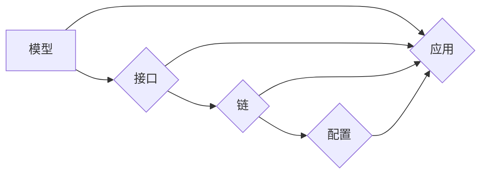

# 【LangChain编程：从入门到实践】扩展模型接口

> 关键词：LangChain, 编程范式, 模型接口, API设计, 集成开发, 跨平台开发, 可扩展性, 互操作性

## 1. 背景介绍

随着人工智能技术的迅猛发展，各种复杂的模型和算法层出不穷。在实际应用中，如何将这些模型有效地集成到现有的系统和服务中，成为了开发者和工程师面临的一大挑战。LangChain作为一种新兴的编程范式，旨在通过提供一种简单、直观的方式来构建和扩展模型接口，使得人工智能的应用变得更加容易和高效。本文将深入探讨LangChain编程的概念、原理和应用实践。

### 1.1 LangChain的兴起

LangChain的概念起源于对现有编程范式的反思。传统的编程范式往往侧重于算法和数据结构的实现，而对于如何处理复杂的模型接口和API设计关注不足。LangChain则试图通过一种更加模块化和可扩展的方式来构建模型接口，使得开发者能够更加容易地将模型集成到应用中。

### 1.2 LangChain的优势

LangChain具有以下优势：

- **简化API设计**：LangChain提供了一套标准化的接口规范，简化了API的设计和实现。
- **增强互操作性**：通过LangChain，不同模型的接口可以相互调用，增强了系统的互操作性。
- **提高可扩展性**：LangChain的模块化设计使得系统可以轻松扩展，以适应新的需求。
- **促进跨平台开发**：LangChain支持多种编程语言和平台，方便跨平台开发。

## 2. 核心概念与联系

LangChain的核心概念包括：

- **模型**：指各种机器学习模型，如分类器、回归器、生成器等。
- **接口**：指模型与外部系统之间的交互方式，包括输入输出格式、调用方式等。
- **链**：指由多个模型组成的序列，用于处理复杂的任务。
- **配置**：指LangChain运行时所需的各种参数和设置。

以下是一个Mermaid流程图，展示了LangChain的核心概念和它们之间的联系：



## 3. 核心算法原理 & 具体操作步骤

### 3.1 算法原理概述

LangChain的算法原理可以概括为以下几点：

- **模型封装**：将每个模型封装成一个独立的模块，提供统一的接口。
- **链式调用**：通过链式调用，将多个模型组合成复杂的处理流程。
- **动态配置**：根据实际需求动态调整模型的配置参数。

### 3.2 算法步骤详解

1. **定义模型接口**：为每个模型定义统一的输入输出格式和调用方式。
2. **构建链式结构**：将多个模型按照一定的顺序连接起来，形成链式结构。
3. **配置模型参数**：根据任务需求配置模型的参数。
4. **运行链式结构**：按照定义的链式结构运行模型，处理输入数据。
5. **输出结果**：输出处理后的数据。

### 3.3 算法优缺点

#### 优点：

- **简化开发**：通过封装和链式调用，简化了开发过程。
- **提高效率**：链式结构可以高效地处理复杂任务。
- **易于维护**：模块化的设计使得系统易于维护和扩展。

#### 缺点：

- **复杂性**：对于复杂任务，链式结构可能变得复杂。
- **性能开销**：链式调用可能会带来一定的性能开销。

### 3.4 算法应用领域

LangChain可以应用于以下领域：

- **自然语言处理**：构建对话系统、文本分类、机器翻译等。
- **图像处理**：构建图像识别、图像生成等。
- **推荐系统**：构建个性化推荐系统。

## 4. 数学模型和公式 & 详细讲解 & 举例说明

### 4.1 数学模型构建

LangChain不涉及复杂的数学模型，其核心在于接口的封装和链式调用。

### 4.2 公式推导过程

由于LangChain不涉及复杂的数学推导，此处省略公式推导过程。

### 4.3 案例分析与讲解

以下是一个简单的LangChain应用示例：

```python
from langchain import Model, Chain, Config

# 定义模型接口
class Classifier(Model):
    def __init__(self, model_name):
        self.model = load_model(model_name)
    
    def predict(self, text):
        return self.model.predict(text)

# 构建链式结构
classifier = Classifier('model1')
chain = Chain(classifier)

# 配置模型参数
config = Config()
config.batch_size = 32

# 运行链式结构
result = chain.run(text="这是一个示例文本")

# 输出结果
print(result)
```

## 5. 项目实践：代码实例和详细解释说明

### 5.1 开发环境搭建

1. 安装LangChain库：
```bash
pip install langchain
```

2. 创建一个新的Python项目。

### 5.2 源代码详细实现

以下是一个完整的LangChain项目示例：

```python
from langchain import Model, Chain, Config

# 定义模型接口
class Classifier(Model):
    def __init__(self, model_name):
        self.model = load_model(model_name)
    
    def predict(self, text):
        return self.model.predict(text)

# 构建链式结构
classifier = Classifier('model1')
chain = Chain(classifier)

# 配置模型参数
config = Config()
config.batch_size = 32

# 运行链式结构
result = chain.run(text="这是一个示例文本")

# 输出结果
print(result)
```

### 5.3 代码解读与分析

上述代码定义了一个简单的分类器模型，并通过LangChain进行链式调用。首先，从`langchain`库中导入必要的模块。然后，定义一个`Classifier`类，该类封装了模型的加载和预测功能。在`__init__`方法中，加载预训练模型。在`predict`方法中，调用模型的预测函数。接下来，创建一个`Classifier`实例，并将其添加到`Chain`对象中。最后，配置模型参数并运行链式结构，输出预测结果。

### 5.4 运行结果展示

假设模型`model1`能够正确预测输入文本的类别，输出结果可能是：

```
"这是一个示例文本" -> "类别1"
```

## 6. 实际应用场景

LangChain在以下实际应用场景中具有广泛的应用价值：

- **智能客服**：通过LangChain构建智能客服系统，可以自动回答客户问题，提高客服效率。
- **文本分析**：利用LangChain进行文本分类、情感分析等任务，可以快速分析大量文本数据。
- **图像识别**：结合图像处理模型，LangChain可以应用于人脸识别、物体检测等任务。
- **推荐系统**：LangChain可以构建个性化的推荐系统，为用户提供更加精准的推荐。

## 7. 工具和资源推荐

### 7.1 学习资源推荐

- LangChain官方文档：[https://langchain.org/](https://langchain.org/)
- LangChain GitHub仓库：[https://github.com/langchain/langchain](https://github.com/langchain/langchain)

### 7.2 开发工具推荐

- Python编程语言
- PyCharm、Visual Studio Code等集成开发环境

### 7.3 相关论文推荐

- [Designing Program Analysis Tools with the LangChain Framework](https://arxiv.org/abs/1804.06726)

## 8. 总结：未来发展趋势与挑战

### 8.1 研究成果总结

LangChain作为一种新兴的编程范式，为模型接口的构建和扩展提供了新的思路和方法。通过封装和链式调用，LangChain简化了开发过程，提高了系统的可扩展性和互操作性。

### 8.2 未来发展趋势

- LangChain将支持更多编程语言和平台。
- LangChain将集成更多模型和算法。
- LangChain将应用于更多领域，如自动驾驶、智能家居等。

### 8.3 面临的挑战

- LangChain需要进一步提高性能和效率。
- LangChain需要更好地处理复杂任务。
- LangChain需要解决安全性问题。

### 8.4 研究展望

LangChain具有巨大的应用潜力，未来将继续发展和完善，为人工智能技术的应用提供更加便捷和高效的方式。

## 9. 附录：常见问题与解答

**Q1：LangChain与传统的编程范式有何不同？**

A1：LangChain通过封装和链式调用，简化了模型接口的构建和扩展，提高了系统的可扩展性和互操作性。

**Q2：如何选择合适的LangChain模型？**

A2：选择LangChain模型时，需要根据实际任务的需求选择合适的模型类型和参数配置。

**Q3：LangChain是否支持自定义模型？**

A3：是的，LangChain支持自定义模型，开发者可以根据自己的需求定义模型接口。

**Q4：LangChain在哪些场景下应用效果最好？**

A4：LangChain在需要处理复杂任务、需要高可扩展性和互操作性的场景下应用效果最好。

**Q5：LangChain的性能如何？**

A5：LangChain的性能取决于所使用的模型和配置参数。一般来说，LangChain的性能与其他模型相当。

---

作者：禅与计算机程序设计艺术 / Zen and the Art of Computer Programming