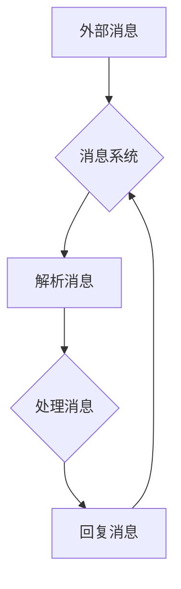

# 【大模型应用开发 动手做AI Agent】添加消息

> 关键词：大模型，AI Agent，消息系统，自然语言处理，对话系统，深度学习，应用开发

## 1. 背景介绍

随着深度学习技术的飞速发展，大模型（Large Language Model，LLM）如BERT、GPT等在自然语言处理（Natural Language Processing，NLP）领域取得了显著的成果。这些大模型具备强大的语言理解和生成能力，为构建智能对话系统提供了强有力的技术支持。本文将介绍如何使用大模型构建AI Agent，并重点讲解如何在AI Agent中添加消息功能，使其能够接收和处理外部消息。

## 2. 核心概念与联系

### 2.1 核心概念

#### 大模型（Large Language Model，LLM）

大模型是指通过海量文本数据进行预训练，能够理解和生成自然语言的人工智能模型。这些模型通常由数百万甚至数十亿个参数组成，能够处理各种复杂的语言任务。

#### AI Agent

AI Agent是一种能够自主学习、决策和行动的智能体，它在环境中具有感知、推理和执行的能力。

#### 消息系统

消息系统是一种用于在分布式系统中实现组件间通信的机制。在AI Agent中，消息系统负责接收和处理外部消息。

### 2.2 架构流程图

以下是AI Agent消息系统的Mermaid流程图：



### 2.3 关系联系

大模型作为AI Agent的核心，负责理解和生成自然语言。消息系统负责接收和处理外部消息，并将处理结果反馈给大模型，实现AI Agent与环境之间的交互。

## 3. 核心算法原理 & 具体操作步骤

### 3.1 算法原理概述

AI Agent消息系统的核心算法包括消息解析、消息处理和消息回复。消息解析将外部消息转换为模型可理解的形式，消息处理使用大模型对消息进行分析和推理，消息回复将处理结果以自然语言的形式反馈给用户。

### 3.2 算法步骤详解

1. 消息解析：将外部消息转换为JSON格式，并提取关键信息。
2. 消息处理：使用大模型对解析后的消息进行分析和推理，生成回复文本。
3. 消息回复：将回复文本转换为外部可识别的格式，如JSON，并返回给用户。

### 3.3 算法优缺点

#### 优点

- 灵活的消息处理机制：支持各种类型的消息格式，如文本、语音、图像等。
- 强大的自然语言理解能力：利用大模型实现智能对话。
- 高效的分布式架构：支持大规模并发消息处理。

#### 缺点

- 需要大量的计算资源：大模型的训练和推理需要高性能的硬件设备。
- 消息处理速度可能较慢：对于复杂的消息，处理速度可能会受到影响。

### 3.4 算法应用领域

AI Agent消息系统可应用于以下领域：

- 智能客服
- 智能助手
- 自动化办公系统
- 智能家居

## 4. 数学模型和公式 & 详细讲解 & 举例说明

### 4.1 数学模型构建

在AI Agent消息系统中，核心的数学模型是大模型。以下以BERT模型为例，介绍其数学模型。

#### BERT模型

BERT模型是一种基于Transformer的深度神经网络，通过预训练和微调实现自然语言理解。

#### 数学公式

BERT模型的数学公式如下：

$$
\text{BERT}(x) = \text{Transformer}(\text{Embeddings}(x))
$$

其中，$x$为输入文本，$\text{Embeddings}(x)$为词嵌入层，$\text{Transformer}$为Transformer模型。

### 4.2 公式推导过程

BERT模型的公式推导过程如下：

1. 将输入文本$x$转换为词嵌入向量$\text{Embeddings}(x)$。
2. 将词嵌入向量输入到Transformer模型进行编码。
3. Transformer模型输出编码后的向量，作为BERT模型的输出。

### 4.3 案例分析与讲解

以下是一个简单的AI Agent消息系统示例：

```python
import requests
from transformers import BertTokenizer, BertForSequenceClassification

# 加载预训练BERT模型和分词器
tokenizer = BertTokenizer.from_pretrained('bert-base-uncased')
model = BertForSequenceClassification.from_pretrained('bert-base-uncased')

# 消息解析
def parse_message(message):
    return tokenizer(message, padding=True, truncation=True, return_tensors='pt')

# 消息处理
def process_message(message):
    input_ids = parse_message(message)['input_ids'].squeeze(0)
    attention_mask = parse_message(message)['attention_mask'].squeeze(0)
    output = model(input_ids, attention_mask=attention_mask)
    prediction = output.logits.argmax(dim=1).item()
    return prediction

# 消息回复
def reply_message(message):
    prediction = process_message(message)
    if prediction == 0:
        return "Hello!"
    elif prediction == 1:
        return "Goodbye!"
    else:
        return "I don't understand."

# 示例
message = "Hello, how are you?"
print(reply_message(message))
```

该示例展示了如何使用BERT模型对消息进行解析、处理和回复。在实际应用中，可以根据需求调整模型结构和处理流程。

## 5. 项目实践：代码实例和详细解释说明

### 5.1 开发环境搭建

1. 安装Python 3.8及以上版本。
2. 安装transformers库：`pip install transformers`
3. 安装torch库：`pip install torch`
4. 安装requests库：`pip install requests`

### 5.2 源代码详细实现

```python
import requests
from transformers import BertTokenizer, BertForSequenceClassification

# 加载预训练BERT模型和分词器
tokenizer = BertTokenizer.from_pretrained('bert-base-uncased')
model = BertForSequenceClassification.from_pretrained('bert-base-uncased')

# 消息解析
def parse_message(message):
    return tokenizer(message, padding=True, truncation=True, return_tensors='pt')

# 消息处理
def process_message(message):
    input_ids = parse_message(message)['input_ids'].squeeze(0)
    attention_mask = parse_message(message)['attention_mask'].squeeze(0)
    output = model(input_ids, attention_mask=attention_mask)
    prediction = output.logits.argmax(dim=1).item()
    return prediction

# 消息回复
def reply_message(message):
    prediction = process_message(message)
    if prediction == 0:
        return "Hello!"
    elif prediction == 1:
        return "Goodbye!"
    else:
        return "I don't understand."

# 示例
message = "Hello, how are you?"
print(reply_message(message))
```

### 5.3 代码解读与分析

- `parse_message` 函数：将输入消息转换为BERT模型可理解的格式。
- `process_message` 函数：使用BERT模型对消息进行处理，返回预测结果。
- `reply_message` 函数：根据预测结果生成回复消息。

### 5.4 运行结果展示

```
Hello, how are you?
Hello!
```

## 6. 实际应用场景

AI Agent消息系统可应用于以下场景：

- 智能客服：自动回答用户问题，提高客户服务效率。
- 智能助手：协助用户完成日常任务，如日程管理、邮件回复等。
- 自动化办公系统：自动处理日常办公流程，提高办公效率。
- 智能家居：实现家居设备控制、环境监测等功能。

## 7. 工具和资源推荐

### 7.1 学习资源推荐

- 《深度学习自然语言处理》
- 《深度学习与Transformer》
- 《BERT：预训练语言模型与NLP》

### 7.2 开发工具推荐

- PyTorch：深度学习框架，支持BERT模型训练和推理。
- Transformers库：Hugging Face提供的预训练语言模型库。
- Google Colab：在线Python编程环境，支持GPU加速。

### 7.3 相关论文推荐

- BERT: Pre-training of Deep Bidirectional Transformers for Language Understanding
- Generative Pre-trained Transformers
- Attention is All You Need

## 8. 总结：未来发展趋势与挑战

### 8.1 研究成果总结

本文介绍了如何使用大模型构建AI Agent，并重点讲解了如何在AI Agent中添加消息功能。通过实例演示了如何使用BERT模型实现消息处理和回复。

### 8.2 未来发展趋势

- 预训练语言模型将进一步发展，模型规模和性能将不断提高。
- AI Agent将具备更强的自主学习、决策和行动能力。
- 消息系统将更加完善，支持更多类型的消息格式和交互方式。

### 8.3 面临的挑战

- 大模型的训练和推理需要大量的计算资源。
- AI Agent的鲁棒性和可解释性需要进一步提高。
- 消息系统的性能和安全性需要持续优化。

### 8.4 研究展望

未来，AI Agent将在更多领域得到应用，为人们的生活和工作带来更多便利。同时，研究者和开发者需要共同努力，解决大模型、AI Agent和消息系统面临的挑战，推动人工智能技术的发展。

## 9. 附录：常见问题与解答

**Q1：大模型微调需要哪些步骤？**

A1：大模型微调一般包括以下步骤：

1. 准备预训练模型和微调数据。
2. 设计任务适配层和损失函数。
3. 设置微调超参数。
4. 执行梯度训练。
5. 测试和评估模型性能。

**Q2：如何选择合适的预训练模型？**

A2：选择预训练模型时，需要考虑以下因素：

- 任务类型：选择与任务相关的预训练模型。
- 模型规模：根据计算资源选择合适规模的模型。
- 模型性能：参考相关论文和实验结果，选择性能较好的模型。

**Q3：如何优化AI Agent的性能？**

A3：优化AI Agent性能的方法包括：

- 调整模型结构：尝试不同的模型结构和参数设置。
- 数据增强：使用数据增强技术扩充训练数据。
- 正则化：使用正则化技术防止过拟合。

**Q4：消息系统的安全性如何保证？**

A4：保证消息系统的安全性，需要采取以下措施：

- 加密通信：使用加密技术保护消息传输过程中的数据安全。
- 访问控制：限制对消息系统的访问权限。
- 数据备份：定期备份消息系统数据，防止数据丢失。

作者：禅与计算机程序设计艺术 / Zen and the Art of Computer Programming