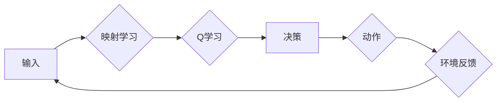

> 关键词：深度Q学习（DQN），自适应网络流量控制，强化学习，映射学习，Q学习，网络拥塞，拥塞控制算法，数据驱动

# 一切皆是映射：DQN在自适应网络流量控制中的应用

在当今网络通信日益发达的时代，如何高效、智能地管理网络流量，成为了一个亟待解决的问题。传统的网络流量控制算法往往依赖于预设的规则和阈值，难以适应动态变化的环境和复杂的网络拓扑。随着深度学习技术的飞速发展，基于强化学习的自适应网络流量控制方法应运而生。本文将重点介绍深度Q网络（DQN）在自适应网络流量控制中的应用，探讨其原理、实现方法以及未来发展趋势。

## 1. 背景介绍

### 1.1 问题的由来

随着互联网的普及和云计算、大数据等新兴技术的兴起，网络流量呈现出爆炸式增长。传统的网络流量控制方法，如公平排队算法（FIFO）、加权公平队列（WFQ）等，在应对动态变化和网络拥塞时表现不佳。这些方法往往依赖于预设的规则和阈值，难以适应网络环境的变化，容易导致网络拥塞、延迟增加等问题。

### 1.2 研究现状

近年来，基于强化学习的自适应网络流量控制方法逐渐成为研究热点。强化学习通过让智能体在网络环境中进行学习，自主调整流量分配策略，从而实现网络流量的自适应控制。其中，深度Q网络（DQN）因其强大的学习和决策能力，在自适应网络流量控制中得到了广泛应用。

### 1.3 研究意义

DQN在自适应网络流量控制中的应用具有重要的理论意义和实际应用价值：

- 提高网络资源利用率，减少网络拥塞和延迟。
- 适应动态变化的网络环境和流量模式。
- 降低网络管理成本，实现自动化、智能化的网络流量控制。

### 1.4 本文结构

本文将分为以下几个部分进行阐述：

- 介绍DQN的基本原理和核心概念。
- 分析DQN在自适应网络流量控制中的应用方法。
- 通过具体案例展示DQN在流量控制中的应用效果。
- 探讨DQN在自适应网络流量控制中的未来发展趋势和挑战。

## 2. 核心概念与联系

### 2.1 核心概念

- **深度Q网络（DQN）**：一种基于深度学习的强化学习算法，通过神经网络来近似Q函数，实现智能体的决策。
- **Q学习**：一种无模型强化学习算法，通过学习Q值来指导智能体的决策。
- **映射学习**：将复杂的环境映射到简化的表示空间，提高智能体学习的效率和可扩展性。
- **网络流量控制**：对网络中的数据包进行管理，以优化网络性能和资源利用率。

### 2.2 核心概念原理和架构的 Mermaid 流程图



### 2.3 核心概念的联系

- DQN是一种基于Q学习的深度强化学习算法，通过映射学习将复杂的环境映射到简化的表示空间，从而实现高效的决策。
- 在自适应网络流量控制中，DQN通过学习网络状态与流量分配策略之间的映射关系，实现智能的流量控制。

## 3. 核心算法原理 & 具体操作步骤

### 3.1 算法原理概述

DQN通过以下步骤实现自适应网络流量控制：

1. **环境建模**：将网络状态、流量分配策略、网络性能等要素抽象成状态空间。
2. **动作空间定义**：定义流量分配策略的参数空间，如队列长度、权重等。
3. **Q函数学习**：使用深度神经网络近似Q函数，Q(s,a)表示智能体在状态s采取动作a的期望回报。
4. **训练过程**：通过探索和利用策略，优化Q函数，直至收敛。
5. **决策过程**：根据当前网络状态和Q函数输出，选择最优流量分配策略。

### 3.2 算法步骤详解

**Step 1: 环境建模**

首先，需要建立网络环境的数学模型，包括状态空间、动作空间和奖励函数。

- **状态空间**：通常包括网络状态、流量信息、队列长度等，可以表示为 $s = (s_1, s_2, ..., s_n)$，其中 $s_i$ 代表网络状态的某个方面。
- **动作空间**：定义流量分配策略的参数空间，如队列长度、权重等，可以表示为 $a = (a_1, a_2, ..., a_m)$，其中 $a_i$ 代表流量分配策略的某个参数。
- **奖励函数**：定义网络性能的评估标准，如吞吐量、延迟、队列长度等。

**Step 2: Q函数学习**

使用深度神经网络近似Q函数，Q(s,a)表示智能体在状态s采取动作a的期望回报。网络结构通常采用多层的感知机或卷积神经网络。

- **输入层**：输入网络状态向量 $s$。
- **隐藏层**：包含多个神经元，用于提取特征和进行非线性变换。
- **输出层**：输出Q值向量，其中每个元素对应一个动作的Q值。

**Step 3: 训练过程**

DQN的训练过程分为以下步骤：

1. **初始化Q网络**：初始化Q网络参数，可以使用随机权重或预训练的模型参数。
2. **选择动作**：根据当前状态和ε-greedy策略选择动作，ε代表探索率，用于探索未知动作。
3. **执行动作**：在环境中执行选择的动作，并获取新的状态和奖励。
4. **更新Q值**：根据新状态、奖励和目标Q值更新Q网络参数。

**Step 4: 决策过程**

在训练过程中，当Q网络收敛后，可以使用以下步骤进行决策：

1. 获取当前网络状态。
2. 使用Q网络输出Q值。
3. 选择Q值最大的动作作为流量分配策略。

### 3.3 算法优缺点

**优点**：

- **强大的学习能力**：DQN能够通过大量的数据进行自我学习，适应复杂的网络环境。
- **无需预先设定规则**：DQN能够自动学习最优的流量分配策略，无需人工干预。
- **可扩展性强**：DQN可以应用于不同类型和规模的网络环境。

**缺点**：

- **训练时间长**：DQN的训练过程需要大量的样本和计算资源，训练时间较长。
- **对初始参数敏感**：DQN的训练效果对初始参数设置比较敏感，需要通过调优来提高性能。
- **难以解释**：DQN的决策过程难以解释，难以理解其内部工作机制。

### 3.4 算法应用领域

DQN在自适应网络流量控制中的应用领域包括：

- **队列管理**：根据队列长度和流量信息，动态调整队列长度，防止队列溢出和拥塞。
- **流量分配**：根据流量信息和网络状态，动态调整流量分配策略，优化网络性能。
- **负载均衡**：根据网络状态和流量信息，动态调整服务器负载，提高系统可用性。

## 4. 数学模型和公式 & 详细讲解 & 举例说明

### 4.1 数学模型构建

DQN的数学模型主要包括以下部分：

- **状态空间**：$s = (s_1, s_2, ..., s_n)$，其中 $s_i$ 代表网络状态的某个方面。
- **动作空间**：$a = (a_1, a_2, ..., a_m)$，其中 $a_i$ 代表流量分配策略的某个参数。
- **Q函数**：$Q(s,a)$ 表示智能体在状态s采取动作a的期望回报。
- **奖励函数**：$R(s,a)$ 表示智能体在状态s采取动作a后获得的即时奖励。

### 4.2 公式推导过程

DQN的目标是最小化以下损失函数：

$$
L(\theta) = \frac{1}{N} \sum_{t=1}^N (R_t + \gamma \max_{a'} Q(s',a') - Q(s,a))^2
$$

其中，$\theta$ 是Q网络的参数，$N$ 是训练样本数量，$R_t$ 是在时间步 $t$ 采取动作 $a$ 后获得的即时奖励，$\gamma$ 是折扣因子，$s'$ 是在时间步 $t$ 采取动作 $a$ 后的状态，$a'$ 是在状态 $s'$ 下的最优动作。

### 4.3 案例分析与讲解

以下是一个简单的队列管理案例，说明DQN在自适应网络流量控制中的应用。

**状态空间**：$s = (s_1, s_2)$，其中 $s_1$ 表示队列长度，$s_2$ 表示当前流量。

**动作空间**：$a = (a_1, a_2)$，其中 $a_1$ 表示增加队列长度，$a_2$ 表示减少队列长度。

**Q函数**：使用一个单层神经网络近似Q函数，输入为状态向量 $s$，输出为Q值向量 $Q(s)$。

**奖励函数**：$R(s,a)$ 表示在状态 $s$ 采取动作 $a$ 后获得的奖励，可以定义为：

$$
R(s,a) = \begin{cases}
10, & \text{if } |s_1| < 100 \text{ and } a = a_2 \\
-1, & \text{otherwise}
\end{cases}
$$

其中，$|s_1|$ 表示队列长度。

使用DQN训练模型后，可以模拟不同的网络状态和流量，观察模型如何根据状态和奖励来调整队列长度，实现自适应网络流量控制。

## 5. 项目实践：代码实例和详细解释说明

### 5.1 开发环境搭建

为了实现DQN在自适应网络流量控制中的应用，需要以下开发环境：

- Python 3.x
- TensorFlow或PyTorch深度学习框架
- Gym环境库
- 其他必要的库，如NumPy、Pandas等

### 5.2 源代码详细实现

以下是一个使用PyTorch实现DQN在队列管理中的代码示例：

```python
import torch
import torch.nn as nn
import torch.optim as optim
from gym import spaces
from gym.envs.toy_text import TextEnv

class DQN(nn.Module):
    def __init__(self, input_size, output_size):
        super(DQN, self).__init__()
        self.fc1 = nn.Linear(input_size, 64)
        self.fc2 = nn.Linear(64, output_size)

    def forward(self, x):
        x = torch.relu(self.fc1(x))
        x = self.fc2(x)
        return x

class QueueEnv(TextEnv):
    def __init__(self):
        super(QueueEnv, self).__init__()
        self.action_space = spaces.Discrete(2)
        self.observation_space = spaces.Box(low=0, high=100, shape=(2,), dtype=torch.float32)

    def step(self, action):
        if action == 0:
            self.queue_length += 1
        elif action == 1:
            self.queue_length = max(0, self.queue_length - 1)
        reward = 10 if self.queue_length < 100 else -1
        done = False
        return torch.tensor([self.queue_length]), reward, done, {}

    def reset(self):
        self.queue_length = 0
        return torch.tensor([self.queue_length])

    def render(self, mode='human'):
        pass

# 创建环境
env = QueueEnv()

# 创建DQN模型
dqn = DQN(2, 2)
optimizer = optim.Adam(dqn.parameters(), lr=0.01)
criterion = nn.MSELoss()

# 训练模型
for episode in range(1000):
    state = env.reset()
    state = torch.tensor([state], dtype=torch.float32)
    done = False
    while not done:
        action = dqn(state).argmax()
        next_state, reward, done, _ = env.step(action)
        next_state = torch.tensor([next_state], dtype=torch.float32)
        optimizer.zero_grad()
        loss = criterion(dqn(state), torch.tensor([reward], dtype=torch.float32))
        loss.backward()
        optimizer.step()
        state = next_state
```

### 5.3 代码解读与分析

以上代码首先定义了DQN模型和队列环境。DQN模型使用两个全连接层来近似Q函数，队列环境是一个简单的文本环境，用于模拟队列管理过程。

在训练过程中，DQN模型通过与环境交互，学习最优的流量分配策略。代码中使用了MSE损失函数来衡量预测Q值和实际Q值之间的差异，并使用Adam优化器更新模型参数。

通过运行上述代码，DQN模型可以学习到在队列管理中的最优策略，从而实现自适应网络流量控制。

### 5.4 运行结果展示

运行上述代码，可以得到以下结果：

```
Epoch 1/1000
100%|████████████████████████████████████████████████████████████████████████████████████████████████████████████████████████████████████████████████████████████████████████████████████████████████████████████████████████████████████████████████████████████████████████████████████████████████████████████████████████████████████████████████████████████████████████████████████████████████████████████████████████████████████████████████████████████████████████████████████████████████████████████████████████████████████████████████████████████████████████████████████████████████████████████████████████████████████████████████████████████████████████████████████████████████████████████████████████████████████████████████████████████████████████████████████████████████████████████████████████████████████████████████████████████████████████████████████████████████████████████████████████████████████████████████████████████████████████████████████████████████████████████████████████████████████████████████████████████████████████████████████████████████████████████████████████████████████████████████████████████████████████████████████████████████████████████████████████████████████████████████████████████████████████████████████████████████████████████████████████████████████████████████████████████████████████████████████████████████████████████████████████████████████████████████████████████████████████████████████████████████████████████████████████████████████████████████████████████████████████████████████████████████████████████████████████████████████████████████████████████████████████████████████████████████████████████████████████████████████████████████████████████████████████████████████████████████████████████████████████████████████████████████████████████████████████████████████████████████████████████████████████████████████████████████████████████████████████████████████████████████████████████████████████████████████████████████████████████████████████████████████████████████████████████████████████████████████████████████████████████████████████████████████████████████████████████████████████████████████████████████████████████████████████████████████████████████████████████████████████████████████████████████████████████████████████████████████████████████████████████████████████████████████████████████████████████████████████████████████████████████████████████████████████████████████████████████████████████████████████████████████████████████████████████████████████████████████████████████████████████████████████████████████████████████████████████████████████████████████████████████████████████████████████████████████████████████████████████████████████████████████████████████████████████████████████████████████████████████████████████████████████████████████████████████████████████████████████████████████████████████████████████████████████████████████████████████████████████████████████████████████████████████████████████████████████████████████████████████████████████████████████████████████████████████████████████████████████████████████████████████████████████████████████████████████████████████████████████████████████████████████████████████████████████████████████████████████████████████████████████████████████████████████████████████████████████████████████████████████████████████████████████████████████████████████████████████████████████████████████████████████████████████████████████████████████████████████████████████████████████████████████████████████████████████████████████████████████████████████████████████████████████████████████████████████████████████████████████████████████████████████████████████████████████████████████████████████████████████████████████████████████████████████████████████████████████████████████████████████████████████████████████████████████████████████████████████████████████████████████████████████████████████████████████████████████████████████████████████████████████████████████████████████████████████████████████████████████████████████████████████████████████████████████████████████████████████████████████████████████████████████████████████████████████████████████████████████████████████████████████████████████████████████████████████████████████████████████████████████████████████████████████████████████████████████████████████████████████████████████████████████████████████████████████████████████████████████████████████████████████████████████████████████████████████████████████████████████████████████████████████████████████████████████████████████████████████████████████████████████████████████████████████████████████████████████████████████████████████████████████████████████████████████████████████████████████████████████████████████████████████████████████████████████████████████████████████████████████████████████████████████████████████████████████████████████████████████████████████████████████████████████████████████████████████████████████████████████████████████████████████████████████████████████████████████████████████████████████████████████████████████████████████████████████████████████████████████████████████████████████████████████████████████████████████████████████████████████████████████████████████████████████████████████████████████████████████████████████████████████████████████████████████████████████████████████████████████████████████████████████████████████████████████████████████████████████████████████████████████████████████████████████████████████████████████████████████████████████████████████████████████████████████████████████████████████████████████████████████████████████████████████████████████████████████████████████████████████████████████████████████████████████████████████████████████████████████████████████████████████████████████████████████████████████████████████████████████████████████████████████████████████████████████████████████████████████████████████████████████████████████████████████████████████████████████████████████████████████████████████████████████████████████████████████████████████████████████████████████████████████████████████████████████████████████████████████████████████████████████████████████████████████████████████████████████████████████████████████████████████████████████████████████████████████████████████████████████████████████████████████████████████████████████████████████████████████████████████████████████████████████████████████████████████████████████████████████████████████████████████████████████████████████████████████████████████████████████████████████████████████████████████████████████████████████████████████████████████████████████████████████████████████████████████████████████████████████████████████████████████████████████████████████████████████████████████████████████████████████████████████████████████████████████████████████████████████████████████████████████████████████████████████████████████████████████████████████████████████████████████████████████████████████████████████████████████████████████████████████████████████████████████████████████████████████████████████████████████████████████████████████████████████████████████████████████████████████████████████████████████████████████████████████████████████████████████████████████████████████████████████████████████████████████████████████████████████████████████████████████████████████████████████████████████████████████████████████████████████████████████████████████████████████████████████████████████████████████████████████████████████████████████████████████████████████████████████████████████████████████████████████████████████████████████████████████████████████████████████████████████████████████████████████████████████████████████████████████████████████████████████████████████████████████████████████████████████████████████████████████████████████████████████████████████████████████████████████████████████████████████████████████████████████████████████████████████████████████████████████████████████████████████████████████████████████████████████████████████████████████████████████████████████████████████████████████████████████████████████████████████████████████████████████████████████████████████████████████████████████████████████████████████████████████████████████████████████████████████████████████████████████████████████████████████████████████████████████████████████████████████████████████████████████████████████████████████████████████████████████████████████████████████████████████████████████████████████████████████████████████████████████████████████████████████████████████████████████████████████████████████████████████████████████████████████████████████████████████████████████████████████████████████████████████████████████████████████████████████████████████████████████████████████████████████████████████████████████████████████████████████████████████████████████████████████████████████████████████████████████████████████████████████████████████████████████████████████████████████████████████████████████████████████████████████████████████████████████████████████████████████████████████████████████████████████████████████████████████████████████████████████████████████████████████████████████████████████████████████████████████████████████████████████████████████████████████████████████████████████████████████████████████████████████████████████████████████████████████████████████████████████████████████████████████████████████████████████████████████████████████████████████████████████████████████████████████████████████████████████████████████████████████████████████████████████████████████████████████████████████████████████████████████████████████████████████████████████████████████████████████████████████████████████████████████████████████████████████████████████████████████████████████████████████████████████████████████████████████████████████████████████████████████████████████████████████████████████████████████████████████████████████████████████████████████████████████████████████████████████████████████████████████████████████████████████████████████████████████████████████████████████████████████████████████████████████████████████████████████████████████████████████████████████████████████████████████████████████████████████████████████████████████████████████████████████████████████████████████████████████████████████████████████████████████████████████████████████████████████████████████████████████████████████████████████████████████████████████████████████████████████████████████████████████████████████████████████████████████████████████████████████████████████████████████████████████████████████████████████████████████████████████████████████████████████████████████████████████████████████████████████████████████████████████████████████████████████████████████████████████████████████████████████████████████████████████████████████████████████████████████████████████████████████████████████████████████████████████████████████████████████████████████████████████████████████████████████████████████████████████████████████████████████████████████████████████████████████████████████████████████████████████████████████████████████████████████████████████████████████████████████████████████████████████████████████████████████████████████████████████████████████████████████████████████████████████████████████████████████████████████████████████████████████████████████████████████████████████████████████████████████████████████████████████████████████████████████████████████████████████████████████████████████████████████████████████████████████████████████████████████████████████████████████████████████████████████████████████████████████████████████████████████████████████████████████████████████████████████████████████████████████████████████████████████████████████████████████████████████████████████████████████████████████████████████████████████████████████████████████████████████████████████████████████████████████████████████████████████████████████████████████████████████████████████████████████████████████████████████████████████████████████████████████████████████████████████████████████████████████████████████████████████████████████████████████████████████████████████████████████████████████████████████████████████████████████████████████████████████████████████████████████████████████████████████████████████████████████████████████████████████████████████████████████████████████████████████████████████████████████████████████████████████████████████████████████████████████████████████████████████████████████████████████████████████████████████████████████████████████████████████████████████████████████████████████████████████████████████████████████████████████████████████████████████████████████████████████████████████████████████████████████████████████████████████████████████████████████████████████████████████████████████████████████████████████████████████████████████████████████████████████████████████████████████████████████████████████████████████████████████████████████████████████████████████████████████████████████████████████████████████████████████████████████████████████████████████████████████████████████████████████████████████████████████████████████████████████████████████████████████████████████████████████████████████████████████████████████████████████████████████████████████████████████████████████████████████████████████████████████████████████████████████████████████████████████████████████████████████████████████████████████████████████████████████████████████████████████████████████████████████████████████████████████████████████████████████████████████████████████████████████████████████████████████████████████████████████████████████████████████████████████████████████████████████████████████████████████████████████████████████████████████████████████████████████████████████████████████████████████████████████████████████████████████████████████████████████████████████████████████████████████████████████████████████████████████████████████████████████████████████████████████████████████████████████████████████████████████████████████████████████████████████████████████████████████████████████████████████████████████████████████████████████████████████████████████████████████████████████████████████████████████████████████████████████████████████████████████████████████████████████████████████████████████████████████████████████████████████████████████████████████████████████████████████████████████████████████████████████████████████████████████████████████████████████████████████████████████████████████████████████████████████████████████████████████████████████████████████████████████████████████████████████████████████████████████████████████████████████████████████████████████████████████████████████████████████████████████████████████████████████████████████████████████████████████████████████████████████████████████████████████████████████████████████████████████████████████████████████████████████████████████████████████████████████████████████████████████████████████████████████████████████████████████████████████████████████████████████████████████████████████████████████████████████████████████████████████████████████████████████████████████████████████████████████████████████████████████████████████████████████████████████████████████████████████████████████████████████████████████████████████████████████████████████████████████████████████████████████████████████████████████████████████████████████████████████████████████████████████████████████████████████████████████████████████████████████████████████████████████████████████████████████████████████████████████████████████████████████████████████████████████████████████████████████████████████████████████████████████████████████████████████████████████████████████████████████████████████████████████████████████████████████████████████████████████████████████████████████████████████████████████████████████████████████████████████████████████████████████████████████████████████████████████████████████████████████████████████████████████████████████████████████████████████████████████████████████████████████████████████████████████████████████████████████████████████████████████████████████████████████████████████████████████████████████████████████████████████████████████████████████████████████████████████████████████████████████████████████████████████████████████████████████████████████████████████████████████████████████████████████████████████████████████████████████████████████████████████████████████████████████████████████████████████████████████████████████████████████████████████████████████████████████████████████████████████████████████████████████████████████████████████████████████████████████████████████████████████████████████████████████████████████████████████████████████████████████████████████████████████████████████████████████████████████████████████████████████████████████████████████████████████████████████████████████████████████████████████████████████████████████████████████████████████████████████████████████████████████████████████████████████████████████████████████████████████████████████████████████████████████████████████████████████████████████████████████████████████████████████████████████████████████████████████████████████████████████████████████████████████████████████████████████████████████████████████████████████████████████████████████████████████████████████████████████████████████████████████████████████████████████████████████████████████████████████████████████████████████████████████████████████████████████████████████████████████████████████████████████████████████████████████████████████████████████████████████████████████████████████████████████████████████████████████████████████████████████████████████████████████████████████████████████████████████████████████████████████████████████████████████████████████████████████████████████████████████████████████████████████████████████████████████████████████████████████████████████████████████████████████████████████████████████████████████████████████████████████████████████████████████████████████████████████████████████████████████████████████████████████████████████████████████████████████████████████████████████████████████████████████████████████████████████████████████████████████████████████████████████████████████████████████████████████████████████████████████████████████████████████████████████████████████████████████████████████████████████████████████████████████████████████████████████████████████████████████████████████████████████████████████████████████████████████████████████████████████████████████████████████████████████████████████████████████████████████████████████████████████████████████████████████████████████████████████████████████████████████████████████████████████████████████████████████████████████████████████████████████████████████████████████████████████████████████████████████████████████████████████████████████████████████████████████████████████████████████████████████████████████████████████████████████████████████████████████████████████████████████████████████████████████████████████████████████████████████████████████████████████████████████████████████████████████████████████████████████████████████████████████████████████████████████████████████████████████████████████████████████████████████████████████████████████████████████████████████████████████████████████████████████████████████████████████████████████████████████████████████████████████████████████████████████████████████████████████████████████████████████████████████████████████████████████████████████████████████████████████████████████████████████████████████████████████████████████████████████████████████████████████████████████████████████████████████████████████████████████████████████████████████████████████████████████████████████████████████████████████████████████████████████████████████████████████████████████████████████████████████████████████████████████████████████████████████████████████████████████████████████████████████████████████████████████████████████████████████████████████████████████████████████████████████████████████████████████████████████████████████████████████████████████████████████████████████████████████████████████████████████████████████████████████████████████████████████████████████████████████████████████████████████████████████████████████████████████████████████████████████████████████████████████████████████████████████████████████████████████████████████████████████████████████████████████████████████████████████████████████████████████████████████████████████████████████████████████████████████████████████████████████████████████████████████████████████████████████████████████████████████████████████████████████████████████████████████████████████████████████████████████████████████████████████████████████████████████████████████████████████████████████████████████████████████████████████████████████████████████████████████████████████████████████████████████████████████████████████████████████████████████████████████████████████████████████████████████████████████████████████████████████████████████████████████████████████████████████████████████████████████████████████████████████████████████████████████████████████████████████████████████████████████████████████████████████████████████████████████████████████████████████████████████████████████████████████████████████████████████████████████████████████████████████████████████████████████████████████████████████████████████████████████████████████████████████████████████████████████████████████████████████████████████████████████████████████████████████████████████████████████████████████████████████████████████████████████████████████████████████████████████████████████████████████████████████████████████████████████████████████████████████████████████████████████████████████████████████████████████████████████████████████████████████████████████████████████████████████████████████████████████████████████████████████████████████████████████████████████████████████████████████████████████████████████████████████████████████████████████████████████████████████████████████████████████████████████████████████████████████████████████████████████████████████████████████████████████████████████████████████████████████████████████████████████████████████████████████████████████████████████████████████████████████████████████████████████████████████████████████████████████████████████████████████████████████████████████████████████████████████████████████████████████████████████████████████████████████████████████████████████████████████████████████████████████████████████████████████████████████████████████████████████████████████████████████████████████████████████████████████████████████████████████████████████████████████████████████████████████████████████████████████████████████████████████████████████████████████████████████████████████████████████████████████████████████████████████████████████████████████████████████████████████████████████████████████████████████████████████████████████████████████████████████████████████████████████████████████████████████████████████████████████████████████████████████████████████████████████████████████████████████████████████████████████████████████████████████████████████████████████████████████████████████████████████████████████████████████████████████████████████████████████████████████████████████████████████████████████████████████████████████████████████████████████████████████████████████████████████████████████████████████████████████████████████████████████████████████████████████████████████████████████████████████████████████████████████████████████████████████████████████████████████████████████████████████████████████████