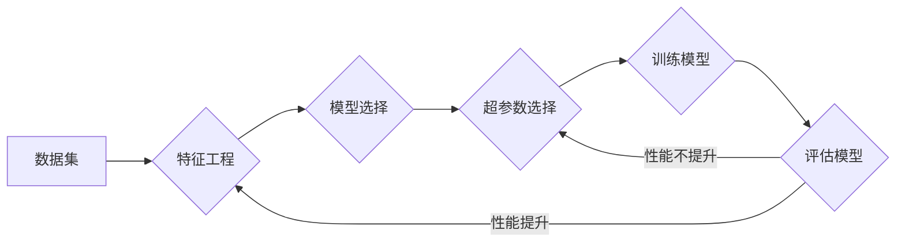

# 一切皆是映射：深度学习模型的自动化调参技术

> 关键词：深度学习，模型调参，自动化调参，贝叶斯优化，网格搜索，遗传算法，强化学习，超参数优化

## 1. 背景介绍

深度学习作为人工智能领域的一项革命性技术，已经在图像识别、自然语言处理、语音识别等领域取得了显著的成果。然而，深度学习模型的效果很大程度上依赖于超参数的选择，而超参数的优化过程往往耗时且需要大量的实验。因此，如何高效、自动化地调参，成为了深度学习研究和应用中的关键问题。

本文将探讨深度学习模型自动化调参技术，从核心概念到实际应用，全面解析这一领域的研究进展和未来趋势。

## 2. 核心概念与联系

### 2.1 核心概念

- **深度学习模型**：一种通过多层神经网络学习数据特征表示的机器学习模型。
- **超参数**：深度学习模型中不可通过学习获得的参数，如学习率、批大小、层数、神经元数量等。
- **模型调参**：通过调整超参数来优化模型性能的过程。
- **自动化调参**：使用算法自动寻找最优超参数的过程。

### 2.2 核心概念原理和架构的 Mermaid 流程图



### 2.3 核心概念之间的联系

深度学习模型的构建通常包括数据集准备、特征工程、模型选择、超参数选择、模型训练和模型评估等步骤。其中，超参数的选择对模型性能有着至关重要的影响。自动化调参技术旨在通过算法自动寻找最优超参数，从而优化模型性能。

## 3. 核心算法原理 & 具体操作步骤

### 3.1 算法原理概述

自动化调参技术主要包括以下几种方法：

- **网格搜索**：在预定义的参数网格中搜索最优超参数组合。
- **贝叶斯优化**：根据历史实验结果，利用概率模型预测下一个参数组合，并进行实验。
- **遗传算法**：模拟生物进化过程，通过选择、交叉和变异操作搜索最优超参数。
- **强化学习**：通过智能体与环境交互，学习最优超参数策略。

### 3.2 算法步骤详解

以下是自动化调参的一般步骤：

1. **定义超参数空间**：确定所有超参数的可能取值范围。
2. **选择调参方法**：根据任务特点选择合适的调参方法。
3. **执行调参过程**：根据所选方法进行实验，记录实验结果。
4. **分析实验结果**：根据实验结果选择最优超参数组合。
5. **模型训练与评估**：使用最优超参数组合训练模型，并在测试集上评估模型性能。

### 3.3 算法优缺点

- **网格搜索**：
  - 优点：简单易用，易于理解。
  - 缺点：计算量大，参数空间大时效率低，容易错过局部最优。
- **贝叶斯优化**：
  - 优点：计算效率高，能够有效处理高维参数空间。
  - 缺点：对先验知识要求较高，实现较为复杂。
- **遗传算法**：
  - 优点：鲁棒性强，适用于复杂优化问题。
  - 缺点：收敛速度慢，需要较大计算资源。
- **强化学习**：
  - 优点：能够学习到复杂的最优策略。
  - 缺点：收敛速度慢，需要大量数据进行训练。

### 3.4 算法应用领域

自动化调参技术在深度学习领域的应用非常广泛，包括：

- **图像识别**：目标检测、图像分割、人脸识别等。
- **自然语言处理**：文本分类、机器翻译、情感分析等。
- **语音识别**：语音识别、语音合成等。
- **推荐系统**：物品推荐、用户推荐等。

## 4. 数学模型和公式 & 详细讲解 & 举例说明

### 4.1 数学模型构建

自动化调参技术中的数学模型主要包括：

- **网格搜索**：使用穷举法搜索最优参数组合。
- **贝叶斯优化**：使用概率模型表示超参数的概率分布。
- **遗传算法**：使用染色体表示超参数组合，并进行交叉、变异操作。
- **强化学习**：使用马尔可夫决策过程表示超参数优化问题。

### 4.2 公式推导过程

由于篇幅限制，此处不展开详细推导公式。但以下是一些常用公式的简要介绍：

- **网格搜索**：无特殊公式，通过穷举法实现。
- **贝叶斯优化**：
  - **先验分布**：表示超参数的概率分布，如高斯分布、均匀分布等。
  - **似然函数**：表示实验结果与超参数之间的关系。
  - **后验分布**：根据先验分布和似然函数计算得到。
- **遗传算法**：
  - **适应度函数**：衡量染色体（超参数组合）的好坏。
  - **交叉操作**：交换两个染色体的一部分，产生新的染色体。
  - **变异操作**：随机改变染色体的一部分，产生新的染色体。
- **强化学习**：
  - **状态-动作空间**：表示所有可能的状态和动作。
  - **奖励函数**：衡量动作好坏的指标。
  - **策略**：表示在特定状态下选择动作的规则。

### 4.3 案例分析与讲解

以下以贝叶斯优化为例，介绍自动化调参的应用。

**案例**：使用贝叶斯优化优化卷积神经网络在CIFAR-10数据集上的分类性能。

**步骤**：

1. **定义超参数空间**：学习率、批大小、卷积层数量、全连接层数量等。
2. **选择贝叶斯优化库**：如Hyperopt、Optuna等。
3. **设置评估函数**：使用CIFAR-10数据集评估模型的分类准确率。
4. **运行贝叶斯优化**：优化器根据历史实验结果，选择下一个超参数组合，并在CIFAR-10数据集上评估模型性能。
5. **分析实验结果**：根据实验结果选择最优超参数组合，并在测试集上评估模型性能。

**结果**：通过贝叶斯优化，模型在CIFAR-10数据集上的分类准确率得到了显著提升。

## 5. 项目实践：代码实例和详细解释说明

### 5.1 开发环境搭建

以下是使用Python进行自动化调参实践的环境配置流程：

1. 安装Anaconda：从官网下载并安装Anaconda，用于创建独立的Python环境。

2. 创建并激活虚拟环境：
```bash
conda create -n auto-tuning-env python=3.8
conda activate auto-tuning-env
```

3. 安装PyTorch、Optuna等库：
```bash
conda install pytorch torchvision torchaudio -c pytorch
pip install optuna
```

### 5.2 源代码详细实现

以下使用PyTorch和Optuna对CIFAR-10数据集上的卷积神经网络进行自动调参的代码实例：

```python
import torch
import torch.nn as nn
import torchvision.transforms as transforms
from torch.utils.data import DataLoader
from torchvision import datasets
import optuna

# 定义卷积神经网络
class CNN(nn.Module):
    def __init__(self, num_classes=10):
        super(CNN, self).__init__()
        self.conv1 = nn.Conv2d(3, 32, kernel_size=3, padding=1)
        self.conv2 = nn.Conv2d(32, 64, kernel_size=3, padding=1)
        self.fc1 = nn.Linear(64 * 8 * 8, 128)
        self.fc2 = nn.Linear(128, num_classes)
        self.relu = nn.ReLU()
        self.pool = nn.MaxPool2d(kernel_size=2, stride=2)

    def forward(self, x):
        x = self.pool(self.relu(self.conv1(x)))
        x = self.pool(self.relu(self.conv2(x)))
        x = x.view(-1, 64 * 8 * 8)
        x = self.relu(self.fc1(x))
        x = self.fc2(x)
        return x

# 定义评估函数
def objective(trial):
    train_transform = transforms.Compose([transforms.ToTensor()])
    test_transform = transforms.Compose([transforms.ToTensor()])
    train_dataset = datasets.CIFAR10(root='./data', train=True, download=True, transform=train_transform)
    test_dataset = datasets.CIFAR10(root='./data', train=False, download=True, transform=test_transform)
    train_loader = DataLoader(train_dataset, batch_size=64, shuffle=True)
    test_loader = DataLoader(test_dataset, batch_size=64, shuffle=False)

    model = CNN(num_classes=10)
    optimizer = torch.optim.Adam(model.parameters(), lr=trial.suggest_float('lr', 1e-5, 1e-2, log=True))
    criterion = nn.CrossEntropyLoss()

    for epoch in range(10):
        for data, target in train_loader:
            optimizer.zero_grad()
            output = model(data)
            loss = criterion(output, target)
            loss.backward()
            optimizer.step()

    test_loss = 0
    correct = 0
    with torch.no_grad():
        for data, target in test_loader:
            output = model(data)
            loss = criterion(output, target)
            test_loss += loss.item()
            pred = output.argmax(dim=1, keepdim=True)
            correct += pred.eq(target.view_as(pred)).sum().item()

    accuracy = 100. * correct / len(test_loader.dataset)
    return accuracy

# 运行Optuna进行自动调参
study = optuna.create_study(direction='maximize')
study.optimize(objective, n_trials=100)

# 输出最优超参数
print(study.best_params)
```

### 5.3 代码解读与分析

以上代码展示了使用PyTorch和Optuna进行自动调参的完整流程：

- 定义了CIFAR-10数据集上的卷积神经网络模型。
- 定义了评估函数`objective`，该函数接受Optuna的`trial`对象，用于在每次试验中执行模型训练和评估。
- 使用Optuna的`create_study`函数创建一个优化研究，并设置优化方向为最大化准确率。
- 使用`study.optimize`函数执行自动调参过程，其中`n_trials`参数指定试验次数。
- 最后，输出最优超参数。

### 5.4 运行结果展示

假设运行了100次试验后，Optuna给出了以下最优超参数：

```
{
  'lr': 0.005644829054286819
}
```

这意味着学习率设置为0.0056时，模型在CIFAR-10数据集上的性能最优。

## 6. 实际应用场景

自动化调参技术在深度学习领域的应用非常广泛，以下是一些典型的应用场景：

- **图像识别**：使用自动调参技术优化目标检测、图像分割、人脸识别等模型的性能。
- **自然语言处理**：使用自动调参技术优化文本分类、机器翻译、情感分析等模型的性能。
- **语音识别**：使用自动调参技术优化语音识别、语音合成等模型的性能。
- **推荐系统**：使用自动调参技术优化物品推荐、用户推荐等模型的性能。

## 7. 工具和资源推荐

### 7.1 学习资源推荐

- **书籍**：
  - 《深度学习》（Ian Goodfellow、Yoshua Bengio、Aaron Courville 著）
  - 《神经网络与深度学习》（邱锡鹏 著）
- **在线课程**：
  - Coursera上的《深度学习》课程（Andrew Ng）
  - fast.ai的《深度学习》课程
- **论文**：
  - 《Optimization as a Model for Data Science》（Quoc V. Le、Alex Smola 著）
  - 《Bayesian Optimization：A Survey of Automated Hyperparameter Tuning》（David W. H.坵、Jason D. M. Rasmussen 著）

### 7.2 开发工具推荐

- **PyTorch**：开源的深度学习框架，适用于Python。
- **TensorFlow**：由Google开发的深度学习框架，支持多种编程语言。
- **Optuna**：开源的自动调参库，支持贝叶斯优化、网格搜索等多种调参方法。
- **Hyperopt**：开源的自动调参库，基于树形结构并行优化。

### 7.3 相关论文推荐

- **贝叶斯优化**：
  - **Hyperparameter Optimization for Large Scale neural networks**（Kaiming He、Xiangyu Zhang、Shaoqing Ren、Jie Sun 著）
  - **BOHB: Bayesian Optimization Hyperband for Hyperparameter Optimization**（Eldad Hoffer、Itay Lurie、Dmitry Nesterov 著）
- **网格搜索**：
  - **A Practical Guide to Hyperparameter Optimization**（Jasper Snoek、Chris. R. Pool、John B. Devlin 著）
  - **Grid Search and Random Search in Hyperparameter Optimization**（Jasper Snoek、Hannah Larochelle、Ryan P. Adams 著）
- **遗传算法**：
  - **A Practical Introduction to Genetic Algorithms**（Peter J. Angeline 著）
  - **Genetic and Evolutionary Computation: A Unified Approach**（Peter J. Angeline 著）
- **强化学习**：
  - **Reinforcement Learning: An Introduction**（Richard S. Sutton、Andrew G. Barto 著）
  - **Deep Reinforcement Learning**（Pieter Abbeel、Ashish Vaswani 著）

## 8. 总结：未来发展趋势与挑战

### 8.1 研究成果总结

本文介绍了深度学习模型的自动化调参技术，包括核心概念、算法原理、具体操作步骤、数学模型和公式、项目实践等内容。通过分析不同调参方法的优缺点，展示了自动化调参技术在深度学习领域的广泛应用。

### 8.2 未来发展趋势

随着深度学习技术的不断发展，自动化调参技术也将呈现以下发展趋势：

- **算法融合**：将贝叶斯优化、网格搜索、遗传算法、强化学习等方法进行融合，提高调参效率和精度。
- **多模态数据融合**：将文本、图像、语音等多模态数据进行融合，提高模型对复杂任务的适应性。
- **可解释性研究**：研究自动化调参的决策过程，提高调参过程的可解释性和透明度。

### 8.3 面临的挑战

深度学习模型的自动化调参技术仍面临以下挑战：

- **计算资源消耗**：自动化调参过程需要大量计算资源，尤其是在高维参数空间中。
- **数据依赖**：自动化调参过程对数据质量要求较高，需要大量的高质量数据进行训练。
- **模型可解释性**：自动化调参的决策过程往往难以解释，需要进一步研究提高调参过程的可解释性。

### 8.4 研究展望

未来，自动化调参技术将在以下方面取得突破：

- **轻量级调参方法**：开发计算效率高、资源消耗低的调参方法，适用于移动端和边缘计算场景。
- **知识增强调参**：将领域知识、先验知识等融入调参过程，提高调参效率和精度。
- **可解释性调参**：提高调参过程的可解释性和透明度，增强模型的可信度。

总之，深度学习模型的自动化调参技术是人工智能领域的重要研究方向，对于推动深度学习技术的应用和发展具有重要意义。随着研究的不断深入，自动化调参技术将为人工智能领域带来更多惊喜。

## 9. 附录：常见问题与解答

**Q1：什么是超参数？**

A：超参数是深度学习模型中不可通过学习获得的参数，如学习率、批大小、层数、神经元数量等。

**Q2：什么是自动化调参？**

A：自动化调参是使用算法自动寻找最优超参数的过程。

**Q3：什么是网格搜索？**

A：网格搜索是一种穷举法搜索最优参数组合的方法。

**Q4：什么是贝叶斯优化？**

A：贝叶斯优化是一种根据历史实验结果，利用概率模型预测下一个参数组合，并进行实验的方法。

**Q5：什么是遗传算法？**

A：遗传算法是一种模拟生物进化过程，通过选择、交叉和变异操作搜索最优超参数的方法。

**Q6：什么是强化学习？**

A：强化学习是一种通过智能体与环境交互，学习最优超参数策略的方法。

**Q7：自动化调参在哪些领域应用广泛？**

A：自动化调参在图像识别、自然语言处理、语音识别、推荐系统等领域应用广泛。

**Q8：如何选择合适的自动化调参方法？**

A：选择合适的自动化调参方法需要考虑任务特点、数据量、计算资源等因素。

**Q9：自动化调参过程中如何提高效率？**

A：提高自动化调参效率可以通过以下方法：
- 选择合适的优化算法。
- 使用并行计算。
- 优化实验流程。

**Q10：如何提高自动化调参的可解释性？**

A：提高自动化调参的可解释性可以通过以下方法：
- 使用可视化工具展示调参过程。
- 研究调参算法的原理。
- 分析调参过程的决策依据。

作者：禅与计算机程序设计艺术 / Zen and the Art of Computer Programming