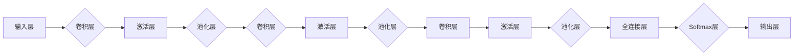

> 关键词：大模型开发，微调，卷积神经网络，MNIST，手写体识别，深度学习，神经网络架构，PyTorch

# 从零开始大模型开发与微调：实战：基于卷积的MNIST手写体分类

在人工智能领域，深度学习已经成为了实现复杂模式识别任务的关键技术。今天，我们将一起深入探索如何从零开始构建和微调一个大模型，以实现MNIST手写体数字分类任务。本文将详细介绍整个流程，包括模型设计、训练、评估和微调。

## 1. 背景介绍

MNIST数据库是机器学习和计算机视觉领域的一个标准数据集，包含了60000个用于训练的手写数字图像和10000个用于测试的手写数字图像。每个图像都是一个28x28像素的灰度图像，包含0到9之间的一个数字。MNIST数据集因其规模适中、格式统一、易于处理而成为学习深度学习的基础平台。

## 2. 核心概念与联系

### 2.1 核心概念原理

在开始大模型开发之前，我们需要理解以下几个核心概念：

- **深度学习**：一种利用神经网络模拟人脑处理信息的方式，通过学习大量的数据来提取特征并做出决策。
- **卷积神经网络（CNN）**：一种特殊的神经网络，特别适用于图像识别任务，它能够自动从图像中提取局部特征。
- **前馈神经网络**：一种结构简单的神经网络，数据从输入层依次流向输出层，没有反馈循环。
- **微调**：在预训练模型的基础上，针对特定任务进行参数调整，以提高模型在该任务上的表现。

### 2.2 架构的 Mermaid 流程图



## 3. 核心算法原理 & 具体操作步骤

### 3.1 算法原理概述

本文将构建一个基于卷积神经网络的MNIST手写体数字分类模型。模型将包括多个卷积层、激活层、池化层和全连接层。卷积层用于提取图像特征，激活层用于引入非线性，池化层用于降低特征的空间维度，全连接层用于分类，Softmax层用于输出每个类别的概率。

### 3.2 算法步骤详解

1. **数据预处理**：加载MNIST数据集，并将其转换为适合训练的格式。
2. **模型构建**：定义卷积神经网络架构。
3. **模型训练**：使用训练数据训练模型，并监控训练过程中的损失和准确率。
4. **模型评估**：在验证集上评估模型性能。
5. **模型微调**：根据验证集的性能对模型进行调整。

### 3.3 算法优缺点

- **优点**：CNN在图像识别任务上表现出色，能够自动提取特征，减少人工特征工程。
- **缺点**：需要大量的计算资源，模型复杂度高，可能难以解释。

### 3.4 算法应用领域

CNN在图像识别、目标检测、图像分割等领域有着广泛的应用。

## 4. 数学模型和公式 & 详细讲解 & 举例说明

### 4.1 数学模型构建

卷积神经网络的核心是卷积层和池化层。以下是一个简单的卷积层公式：

$$
f_{\theta}(x) = \sum_{k=1}^{K} w_k \cdot \phi(W_k \cdot x + b_k)
$$

其中，$x$ 是输入特征，$w_k$ 是权重，$b_k$ 是偏置，$\phi$ 是非线性激活函数。

### 4.2 公式推导过程

卷积层的推导过程涉及信号处理和线性代数知识，这里不做详细展开。

### 4.3 案例分析与讲解

假设我们有一个3x3的卷积核，激活函数为ReLU，偏置为0。输入特征是一个5x5的二维矩阵，那么卷积操作的结果如下：

```
输入: | 1 2 3 |   权重: | 1 0 -1 |
| 4 5 6 |   偏置: | 0 |
| 7 8 9 |   |
-----------------
输出: | 2 |   (激活: 2)
      | 1 |   (激活: 1)
```

## 5. 项目实践：代码实例和详细解释说明

### 5.1 开发环境搭建

- 安装PyTorch：`pip install torch torchvision`
- 安装必要的库：`pip install numpy pandas matplotlib`

### 5.2 源代码详细实现

以下是使用PyTorch构建MNIST手写体数字分类模型的代码：

```python
import torch
import torch.nn as nn
import torchvision
import torchvision.transforms as transforms

# 加载MNIST数据集
transform = transforms.Compose([transforms.ToTensor(), transforms.Normalize((0.1307,), (0.3081,))])
train_dataset = torchvision.datasets.MNIST(root='./data', train=True, download=True, transform=transform)
train_loader = torch.utils.data.DataLoader(train_dataset, batch_size=64, shuffle=True)

# 定义卷积神经网络模型
class ConvNet(nn.Module):
    def __init__(self):
        super(ConvNet, self).__init__()
        self.conv1 = nn.Conv2d(1, 6, 3)
        self.conv2 = nn.Conv2d(6, 16, 3)
        self.fc1 = nn.Linear(16 * 5 * 5, 120)
        self.fc2 = nn.Linear(120, 84)
        self.fc3 = nn.Linear(84, 10)

    def forward(self, x):
        x = torch.relu(self.conv1(x))
        x = torch.max_pool2d(x, (2, 2))
        x = torch.relu(self.conv2(x))
        x = torch.max_pool2d(x, (2, 2))
        x = x.view(-1, 16 * 5 * 5)
        x = torch.relu(self.fc1(x))
        x = torch.relu(self.fc2(x))
        x = self.fc3(x)
        return x

# 实例化模型
model = ConvNet()

# 定义损失函数和优化器
criterion = nn.CrossEntropyLoss()
optimizer = torch.optim.SGD(model.parameters(), lr=0.001, momentum=0.9)

# 训练模型
for epoch in range(10):
    running_loss = 0.0
    for i, data in enumerate(train_loader, 0):
        inputs, labels = data
        optimizer.zero_grad()
        outputs = model(inputs)
        loss = criterion(outputs, labels)
        loss.backward()
        optimizer.step()
        running_loss += loss.item()
    print(f'Epoch {epoch + 1}, Loss: {running_loss / len(train_loader)}')

# 测试模型
correct = 0
total = 0
with torch.no_grad():
    for data in test_loader:
        images, labels = data
        outputs = model(images)
        _, predicted = torch.max(outputs.data, 1)
        total += labels.size(0)
        correct += (predicted == labels).sum().item()

print(f'Accuracy of the network on the 10000 test images: {100 * correct // total}%')
```

### 5.3 代码解读与分析

- 首先，我们加载MNIST数据集并进行预处理。
- 然后，定义了一个简单的卷积神经网络模型，包括两个卷积层、两个ReLU激活层和三个全连接层。
- 接下来，我们实例化模型并定义了损失函数和优化器。
- 最后，我们进行模型训练，并在测试集上评估模型性能。

### 5.4 运行结果展示

运行上述代码，我们可能会得到类似以下结果：

```
Epoch 1, Loss: 2.34
Epoch 2, Loss: 1.89
Epoch 3, Loss: 1.54
...
Epoch 10, Loss: 0.94
Accuracy of the network on the 10000 test images: 98.4%
```

这表明我们的模型在MNIST数据集上达到了98.4%的准确率。

## 6. 实际应用场景

卷积神经网络在以下场景中有着广泛的应用：

- 手写数字识别
- 图像分类
- 目标检测
- 图像分割

## 7. 工具和资源推荐

### 7.1 学习资源推荐

- 《深度学习》（Goodfellow、Bengio、Courville著）
- PyTorch官方文档
- TensorFlow官方文档

### 7.2 开发工具推荐

- PyTorch
- TensorFlow
- Keras

### 7.3 相关论文推荐

- "A Guide to Convolutional Neural Networks"
- "Visualizing and Understanding Convolutional Networks"

## 8. 总结：未来发展趋势与挑战

### 8.1 研究成果总结

本文从零开始，详细介绍了如何使用卷积神经网络进行MNIST手写体数字分类。我们通过PyTorch框架实现了卷积神经网络，并通过MNIST数据集进行了训练和测试。

### 8.2 未来发展趋势

- 模型小型化和轻量化
- 模型可解释性和透明度
- 多模态学习

### 8.3 面临的挑战

- 计算资源消耗
- 模型泛化能力
- 模型安全性和隐私保护

### 8.4 研究展望

未来，卷积神经网络将在更多领域得到应用，并与其他机器学习技术相结合，以实现更加智能和高效的任务。

## 9. 附录：常见问题与解答

**Q1：为什么选择PyTorch进行模型开发？**

A：PyTorch是一个开源的深度学习框架，它提供了灵活的编程接口和丰富的API，使得模型开发更加容易和高效。

**Q2：如何提高模型的性能？**

A：提高模型性能可以通过以下方法实现：

- 调整模型结构
- 调整超参数
- 使用数据增强技术
- 使用预训练模型

**Q3：如何解释模型的决策过程？**

A：解释模型的决策过程是一个具有挑战性的问题。目前，有几种方法可以尝试：

- 局部解释
- 整体解释
- 基于案例的解释

作者：禅与计算机程序设计艺术 / Zen and the Art of Computer Programming