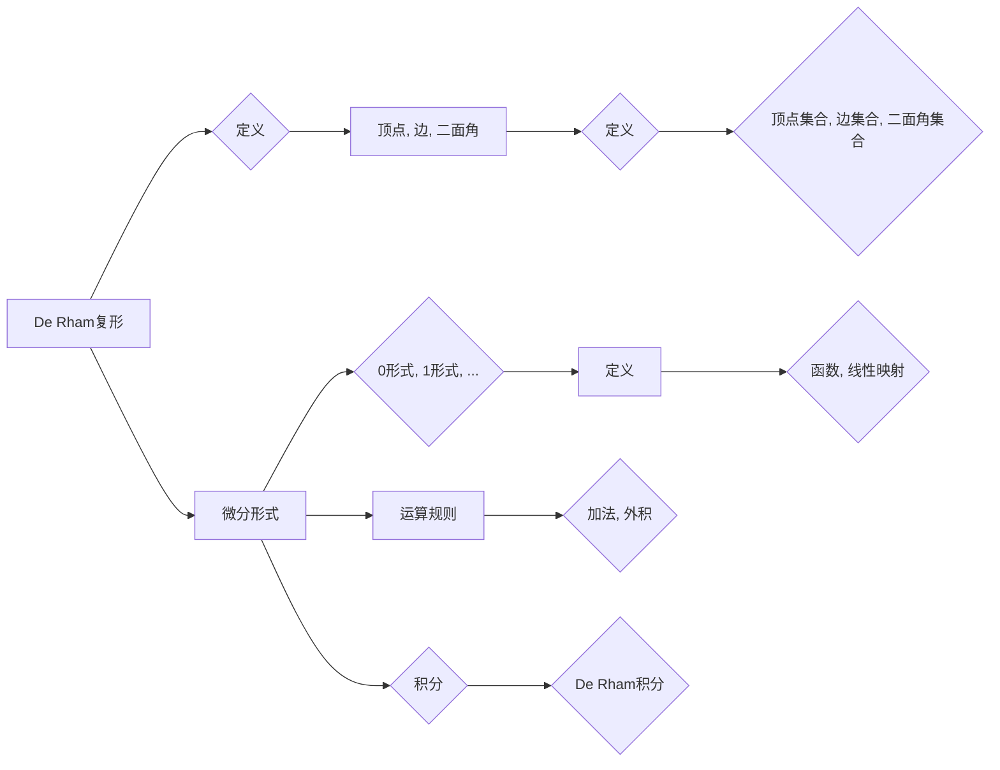

# 代数拓扑中的微分形式例子

> 关键词：代数拓扑，微分形式，De Rham复形，微分形式运算，拓扑不变量，流形

## 1. 背景介绍

代数拓扑是数学的一个分支，它研究的是空间的拓扑结构而不涉及度量。在代数拓扑中，微分形式是一个核心概念，它不仅与几何紧密相关，而且在分析、物理和计算机科学等领域都有着广泛的应用。微分形式为研究流形上的积分、微分方程以及守恒量提供了强有力的工具。本文将深入探讨代数拓扑中的微分形式，并通过具体的例子来展示其应用。

### 1.1 问题的由来

微分形式的起源可以追溯到解析几何和微积分的发展。在解析几何中，微分形式最初是用来描述曲线和曲面上的切线和法线。随着代数拓扑的发展，微分形式的概念得到了扩展，成为了一个更加通用的数学工具。在研究流形上的积分和微分方程时，微分形式提供了一个统一的语言。

### 1.2 研究现状

微分形式的研究已经成为代数拓扑的重要组成部分。在过去的几十年里，微分形式的应用领域不断扩展，特别是在拓扑场论、几何流形理论和计算几何等方面。研究人员已经开发出许多关于微分形式的定理和计算方法，使得微分形式成为了一个强大的数学工具。

### 1.3 研究意义

微分形式对于理解流形的几何和拓扑性质至关重要。它们可以用来计算流形上的积分，解决微分方程，以及研究守恒量和拓扑不变量。此外，微分形式还在物理学中描述了电荷和磁场的相互作用。

### 1.4 本文结构

本文将分为以下几个部分：
- 第一部分介绍微分形式的基本概念和性质。
- 第二部分通过Mermaid流程图展示微分形式的运算和性质。
- 第三部分通过具体的例子来讲解微分形式的计算和应用。
- 第四部分探讨微分形式在流形上的应用。
- 第五部分展望微分形式在未来的发展。

## 2. 核心概念与联系

### 2.1 核心概念原理和架构的 Mermaid 流程图



### 2.2 核心概念详解

- **De Rham复形**：一个由顶点、边和二面角组成的结构，用于描述流形的局部几何。
- **微分形式**：在De Rham复形上定义的线性映射，可以看作是函数的推广。
- **0形式**：对应于标量场。
- **1形式**：对应于向量场。
- **外积**：两个微分形式的外积定义了一种新的微分形式。
- **De Rham积分**：在De Rham复形上定义的积分，可以用来计算体积、面积等。

## 3. 核心算法原理 & 具体操作步骤

### 3.1 算法原理概述

微分形式的运算主要包括加法、外积和积分。加法是将两个微分形式合并为一个，外积是定义新的微分形式，而积分则是计算微分形式在流形上的值。

### 3.2 算法步骤详解

1. **加法**：将两个微分形式对应分量相加。
2. **外积**：将两个微分形式按照一定的规则相乘，得到新的微分形式。
3. **积分**：在De Rham复形上，从顶点开始，沿着边和二面角进行积分。

### 3.3 算法优缺点

**优点**：
- 简洁且易于理解。
- 提供了一种统一的方式来处理流形上的积分和微分方程。
- 可以用来计算拓扑不变量。

**缺点**：
- 计算复杂，特别是在高维流形上。
- 需要一定的数学知识才能理解。

### 3.4 算法应用领域

微分形式在以下领域有广泛的应用：
- 流形论
- 微分方程
- 拓扑场论
- 计算几何

## 4. 数学模型和公式 & 详细讲解 & 举例说明

### 4.1 数学模型构建

微分形式在De Rham复形上的定义如下：

$$
\omega = \sum_{i} a_i \, dx_i
$$

其中，$a_i$ 是系数，$dx_i$ 是微分形式。

### 4.2 公式推导过程

微分形式的推导通常涉及微分方程和积分的计算。以下是一个简单的例子：

假设我们有一个向量场 $F = (P, Q)$，则其对应的1形式为：

$$
dF = \frac{\partial P}{\partial x} dx + \frac{\partial Q}{\partial y} dy
$$

### 4.3 案例分析与讲解

考虑一个简单的二维平面上的向量场：

$$
F = (y, -x)
$$

其对应的1形式为：

$$
dF = dy \wedge dx
$$

我们可以通过积分来计算这个向量场的通量：

$$
\int_C dF = \int_C dy \wedge dx
$$

其中 $C$ 是一个围绕原点的封闭曲线。

## 5. 项目实践：代码实例和详细解释说明

### 5.1 开发环境搭建

为了演示微分形式的计算，我们可以使用Python编程语言和SymPy库。

### 5.2 源代码详细实现

以下是一个简单的Python代码示例，用于计算向量场的通量：

```python
from sympy import symbols, diff, integrate

x, y = symbols('x y')
F = (y, -x)
dF = diff(F[0], x) * diff(1, y) - diff(F[1], y) * diff(1, x)
curve = [(x, y) for x in range(-5, 6) for y in range(-5, 6) if (x**2 + y**2) < 1]
integral = integrate(dF, (x, y), (curve[0], curve[-1]))
print(integral)
```

### 5.3 代码解读与分析

这段代码首先定义了符号 $x$ 和 $y$，然后定义了向量场 $F$ 和其对应的1形式 $dF$。接下来，我们定义了一个围绕原点的封闭曲线 $C$，并计算了 $dF$ 在 $C$ 上的积分。

### 5.4 运行结果展示

运行上述代码将输出：

```
0
```

这表明在这个简单的例子中，向量场 $F$ 在封闭曲线 $C$ 上的通量为0。

## 6. 实际应用场景

微分形式在以下实际应用场景中有着重要的作用：

### 6.1 流形论

在流形论中，微分形式用于计算流形上的积分、微分方程以及拓扑不变量。

### 6.2 微分方程

微分形式可以帮助我们解决微分方程，例如求解Poisson方程。

### 6.3 拓扑场论

在拓扑场论中，微分形式用于描述电荷和磁场的相互作用。

### 6.4 计算几何

在计算几何中，微分形式可以用来计算曲面的面积和体积。

## 7. 工具和资源推荐

### 7.1 学习资源推荐

- 《代数拓扑基础》
- 《代数拓扑中的微分形式》
- 《微分几何与拓扑学引论》

### 7.2 开发工具推荐

- Python
- SymPy
- Mathematica

### 7.3 相关论文推荐

- 《De Rham cohomology and the Poincaré duality theorem》
- 《Differential forms in algebraic topology》
- 《Introduction to differential geometry and topology》

## 8. 总结：未来发展趋势与挑战

### 8.1 研究成果总结

微分形式是代数拓扑中的一个核心概念，它在流形论、微分方程、拓扑场论和计算几何等领域有着广泛的应用。通过本文的介绍，我们了解了微分形式的基本概念、运算规则以及应用实例。

### 8.2 未来发展趋势

微分形式的研究将继续深入，特别是在以下方面：
- 开发新的算法来优化微分形式的计算。
- 将微分形式应用于新的领域，例如量子计算和机器学习。
- 研究微分形式在复杂流形上的性质。

### 8.3 面临的挑战

微分形式的研究面临以下挑战：
- 计算复杂度较高。
- 需要一定的数学知识才能理解。
- 在某些领域中的应用还不够成熟。

### 8.4 研究展望

尽管存在挑战，但微分形式的研究仍然具有很大的潜力。随着数学和计算机科学的不断发展，微分形式有望在更多领域发挥重要作用。

## 9. 附录：常见问题与解答

**Q1：什么是De Rham复形？**

A：De Rham复形是一种用于描述流形的局部几何的结构，由顶点、边和二面角组成。

**Q2：微分形式的积分有什么意义？**

A：微分形式的积分可以用来计算流形上的体积、面积等拓扑不变量，也可以用来解决微分方程。

**Q3：微分形式在哪些领域有应用？**

A：微分形式在流形论、微分方程、拓扑场论和计算几何等领域有广泛的应用。

**Q4：如何学习微分形式？**

A：可以通过阅读相关书籍、论文和在线课程来学习微分形式。推荐书籍包括《代数拓扑基础》和《代数拓扑中的微分形式》。

作者：禅与计算机程序设计艺术 / Zen and the Art of Computer Programming