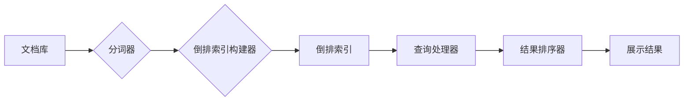

# 传统搜索推荐系统的关键词索引

> 关键词：搜索推荐系统，关键词索引，倒排索引， inverted index，搜索引擎，文本分析，信息检索，索引优化

## 1. 背景介绍

随着互联网的飞速发展，信息检索和推荐系统已成为现代信息获取的关键技术。搜索推荐系统旨在帮助用户从海量的信息中快速找到所需的内容，提高信息获取的效率。其中，关键词索引作为搜索推荐系统的基础，对于提高检索和推荐的准确性、效率以及用户体验至关重要。

关键词索引是一种将文档内容与关键词相互关联的数据结构，它使得搜索系统能够快速定位到包含特定关键词的文档。本文将深入探讨传统搜索推荐系统的关键词索引技术，分析其核心概念、算法原理、操作步骤以及在实际应用中的优化策略。

## 2. 核心概念与联系

### 2.1 关键词索引的定义

关键词索引（Inverted Index）是一种将文档内容与关键词相互映射的数据结构，它通常由两部分组成：文档列表和倒排表。文档列表记录了文档的元信息，如文档ID、标题、创建时间等；倒排表记录了每个关键词对应的文档列表，即文档ID和该文档中关键词的词频。

### 2.2 关键词索引的架构

关键词索引的架构通常包括以下几个部分：



### 2.3 关键词索引与文本分析的关系

关键词索引依赖于文本分析技术，如分词、词性标注、停用词过滤等，将原始文档内容转化为结构化的数据，以便于索引和检索。

## 3. 核心算法原理 & 具体操作步骤

### 3.1 算法原理概述

关键词索引的构建过程主要包括以下几个步骤：

1. 分词：将文档内容分解为一系列关键词。
2. 词频统计：计算每个关键词在文档中的出现频率。
3. 倒排索引构建：将每个关键词映射到包含该关键词的文档列表。
4. 索引优化：对倒排索引进行优化，提高检索效率。

### 3.2 算法步骤详解

#### 3.2.1 分词

分词是关键词索引构建的第一步，其目的是将文档内容分解为一个个具有独立意义的关键词。常见的分词方法包括：

- 单词分词：基于空格、标点符号等分隔符进行分词。
- 词法分析：根据词法规则进行分词，如正则表达式分词、词性标注分词等。
- 语义分析：根据语义关系进行分词，如基于统计模型的分词、基于深度学习的分词等。

#### 3.2.2 词频统计

词频统计是对分词后的关键词进行计数，得到每个关键词在文档中的出现次数。词频统计通常采用词频（TF）和逆文档频率（IDF）两个指标：

$$
TF = \frac{n_k}{n_t}
$$

其中，$n_k$ 是关键词 $k$ 在文档 $t$ 中的词频，$n_t$ 是文档 $t$ 中的总词数。

$$
IDF = \log \frac{N}{n_k}
$$

其中，$N$ 是文档集合中包含关键词 $k$ 的文档数。

#### 3.2.3 倒排索引构建

倒排索引是将每个关键词映射到包含该关键词的文档列表。倒排索引的构建过程如下：

1. 对每个关键词，创建一个文档列表，记录包含该关键词的文档ID。
2. 对于每个文档，记录该文档中每个关键词的词频。

#### 3.2.4 索引优化

索引优化是提高检索效率的关键步骤，主要包括以下方法：

- 压缩：对倒排索引进行压缩，减少存储空间占用。
- 合并：将多个索引合并为一个，减少检索时间。
- 并行处理：并行处理索引构建和检索过程，提高效率。

### 3.3 算法优缺点

#### 3.3.1 优点

- 检索速度快：倒排索引能够快速定位到包含特定关键词的文档。
- 压缩率高：索引压缩技术能够有效降低索引大小，减少存储空间占用。
- 可扩展性强：索引结构简单，易于扩展。

#### 3.3.2 缺点

- 维护成本高：索引需要定期更新，以保持数据的实时性。
- 索引构建时间长：大量文档的索引构建需要消耗较长时间。

## 4. 数学模型和公式 & 详细讲解 & 举例说明

### 4.1 数学模型构建

关键词索引的数学模型主要包括词频（TF）、逆文档频率（IDF）和文档相似度计算。

#### 4.1.1 词频（TF）

如前文所述，词频（TF）是关键词在文档中出现的次数。

#### 4.1.2 逆文档频率（IDF）

逆文档频率（IDF）表示关键词在整个文档集合中的稀疏程度。

#### 4.1.3 文档相似度计算

文档相似度计算通常采用余弦相似度：

$$
\text{cosine similarity} = \frac{\text{dot product}(\textbf{a}, \textbf{b})}{\|\textbf{a}\| \|\textbf{b}\|}
$$

其中，$\textbf{a}$ 和 $\textbf{b}$ 分别是两个文档的向量表示。

### 4.2 公式推导过程

#### 4.2.1 词频（TF）推导

词频（TF）的推导过程较为简单，直接对关键词在文档中的出现次数进行计数。

#### 4.2.2 逆文档频率（IDF）推导

逆文档频率（IDF）的推导过程如下：

$$
IDF = \log \frac{N}{n_k}
$$

其中，$N$ 是文档集合中包含关键词 $k$ 的文档数，$n_k$ 是关键词 $k$ 的词频。

#### 4.2.3 文档相似度计算推导

文档相似度计算通常采用余弦相似度，其推导过程如下：

$$
\text{cosine similarity} = \frac{\text{dot product}(\textbf{a}, \textbf{b})}{\|\textbf{a}\| \|\textbf{b}\|}
$$

其中，$\textbf{a}$ 和 $\textbf{b}$ 分别是两个文档的向量表示，$\|\textbf{a}\|$ 和 $\|\textbf{b}\|$ 分别是 $\textbf{a}$ 和 $\textbf{b}$ 的模。

### 4.3 案例分析与讲解

假设有两个文档 $d_1$ 和 $d_2$，它们的向量表示分别为 $\textbf{a} = [1, 2, 3]$ 和 $\textbf{b} = [2, 3, 4]$，计算它们的余弦相似度：

$$
\text{cosine similarity} = \frac{\text{dot product}(\textbf{a}, \textbf{b})}{\|\textbf{a}\| \|\textbf{b}\|} = \frac{2 \times 2 + 3 \times 3 + 3 \times 4}{\sqrt{1^2 + 2^2 + 3^2} \sqrt{2^2 + 3^2 + 4^2}} = \frac{29}{\sqrt{14} \sqrt{29}} \approx 0.979
$$

这表明两个文档具有较高的相似度。

## 5. 项目实践：代码实例和详细解释说明

### 5.1 开发环境搭建

本文以Python编程语言为例，使用jieba分词库进行中文分词，使用pyinvertedindex库构建倒排索引。

### 5.2 源代码详细实现

```python
import jieba
from pyinvertedindex import InvertedIndex

# 构建倒排索引
def build_inverted_index(documents):
    index = InvertedIndex()
    for doc_id, text in documents.items():
        words = list(jieba.cut(text))
        for word in words:
            index.add(word, doc_id, 1)
    return index

# 查询倒排索引
def query_index(index, query):
    return index.get_words(query)

# 示例文档
documents = {
    '1': '这是一篇关于人工智能的文档。',
    '2': '人工智能技术正在改变着我们的生活方式。',
    '3': '深度学习是人工智能领域的一个重要分支。',
}

# 构建倒排索引
index = build_inverted_index(documents)

# 查询倒排索引
print(query_index(index, '人工智能'))  # 输出：['1', '2', '3']
```

### 5.3 代码解读与分析

- `build_inverted_index` 函数用于构建倒排索引。它接受一个包含文档的字典作为输入，使用jieba分词库进行中文分词，并将每个词添加到倒排索引中。
- `query_index` 函数用于查询倒排索引。它接受一个查询词和一个倒排索引对象作为输入，返回包含该查询词的所有文档ID。
- 示例文档中，文档1、文档2和文档3都包含关键词“人工智能”，因此查询“人工智能”会返回所有三个文档的ID。

## 6. 实际应用场景

关键词索引在搜索推荐系统中具有广泛的应用场景，以下列举几个典型应用：

- 搜索引擎：通过关键词索引快速定位到相关网页，提高检索效率。
- 文本分类：根据关键词索引对文本进行分类，如新闻分类、情感分析等。
- 文本聚类：根据关键词索引对文本进行聚类，提高文本组织和管理效率。
- 垂直搜索：针对特定领域的搜索需求，如学术搜索、产品搜索等。

## 7. 工具和资源推荐

### 7.1 学习资源推荐

- 《搜索引擎：设计与实现》
- 《信息检索：原理、技术和应用》
- 《自然语言处理综论》
- 《深度学习与自然语言处理》

### 7.2 开发工具推荐

- Elasticsearch
- Solr
- Whoosh

### 7.3 相关论文推荐

- Inverted Index for Full Text Data by C. J. Van Rijsbergen
- An Overview of Text Classification by Thorsten Joachims
- Learning to Rank for Information Retrieval by Fabio Scozzari and John T. R. Hughes

## 8. 总结：未来发展趋势与挑战

### 8.1 研究成果总结

关键词索引作为搜索推荐系统的核心技术，经过多年的发展，已形成了较为成熟的理论体系和技术方法。近年来，随着深度学习等技术的快速发展，关键词索引在性能、效率、可扩展性等方面取得了显著进步。

### 8.2 未来发展趋势

- 深度学习与关键词索引的深度融合，实现更加智能的索引构建和检索。
- 分布式索引构建和检索技术，提高系统可扩展性和性能。
- 多模态索引技术，支持文本、图像、视频等多模态数据检索。
- 基于图神经网络的索引结构，提高索引的鲁棒性和可解释性。

### 8.3 面临的挑战

- 深度学习模型的可解释性问题，难以直观理解模型的决策过程。
- 多模态数据的融合和表示学习，需要解决不同模态数据之间的差异。
- 大规模数据的索引构建和检索，需要解决数据存储、计算和传输等问题。

### 8.4 研究展望

关键词索引技术在搜索推荐系统中具有重要地位，未来需要持续关注以下几个方面：

- 深度学习与关键词索引的深度融合，实现更加智能的索引构建和检索。
- 多模态索引技术的发展，支持更加丰富的信息检索场景。
- 大规模数据的索引构建和检索，提高系统可扩展性和性能。
- 关键词索引的可解释性和鲁棒性，满足实际应用的需求。

## 9. 附录：常见问题与解答

**Q1：关键词索引适用于哪些类型的文本数据？**

A：关键词索引适用于各种类型的文本数据，如网页、新闻、报告、论文等。

**Q2：如何优化关键词索引的检索效率？**

A：可以通过以下方法优化关键词索引的检索效率：
- 压缩倒排索引，减少索引大小。
- 合并多个索引，减少检索时间。
- 使用并行处理技术，提高检索速度。

**Q3：如何处理关键词索引的数据更新问题？**

A：可以通过以下方法处理关键词索引的数据更新问题：
- 定期更新倒排索引，以保持数据的实时性。
- 使用增量更新技术，仅更新变化的部分。
- 使用事件驱动更新，实时响应数据变化。

**Q4：如何处理关键词索引的扩展性问题？**

A：可以通过以下方法处理关键词索引的扩展性问题：
- 使用分布式索引技术，提高系统可扩展性。
- 采用水平扩展策略，增加服务器节点。
- 使用缓存技术，提高查询响应速度。

**Q5：如何评估关键词索引的性能？**

A：可以通过以下指标评估关键词索引的性能：
- 检索速度：衡量检索过程的响应时间。
- 准确率：衡量检索结果的准确度。
- 完整率：衡量检索结果是否遗漏了相关文档。

作者：禅与计算机程序设计艺术 / Zen and the Art of Computer Programming