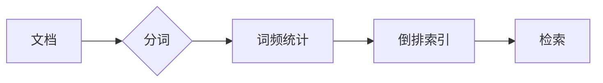

# 倒排索引 原理与代码实例讲解

> 关键词：倒排索引，搜索引擎，文本搜索，索引构建，高效检索

## 1. 背景介绍

倒排索引（Inverted Index）是搜索引擎和文本检索系统中的核心数据结构之一。它通过将文档内容与文档的引用关系进行映射，使得在大量文档中进行快速、准确的文本搜索成为可能。倒排索引的原理简单而高效，是理解搜索引擎内部工作原理的关键。

### 1.1 问题的由来

在互联网时代，信息量呈爆炸式增长。如何快速、准确地从海量信息中找到所需内容，成为了一个迫切需要解决的问题。传统的线性搜索方法效率低下，难以满足实际需求。倒排索引应运而生，通过建立索引结构，实现了对文本内容的快速检索。

### 1.2 研究现状

倒排索引已经发展了数十年，经历了从简单的 inverted list 到现代搜索引擎中的复杂索引结构。目前，倒排索引已经广泛应用于各种搜索引擎和文本检索系统中，如 Elasticsearch、Solr、Lucene 等。

### 1.3 研究意义

研究倒排索引的原理和实现，对于以下方面具有重要意义：

- 提高文本检索效率，降低检索延迟。
- 支持丰富的检索功能，如模糊搜索、同义词搜索等。
- 优化搜索引擎架构，降低资源消耗。
- 支持多种语言和字符编码的文本检索。

### 1.4 本文结构

本文将详细介绍倒排索引的原理、实现和应用。文章结构如下：

- 第2章介绍倒排索引的核心概念和联系。
- 第3章讲解倒排索引的算法原理和具体操作步骤。
- 第4章分析倒排索引的数学模型和公式。
- 第5章通过代码实例展示倒排索引的实现。
- 第6章探讨倒排索引的实际应用场景和未来展望。
- 第7章推荐相关学习资源和开发工具。
- 第8章总结研究成果，展望未来发展趋势和挑战。
- 第9章提供常见问题的解答。

## 2. 核心概念与联系

### 2.1 核心概念

- **文档**：存储在搜索引擎中的文本内容。
- **分词**：将文档分割成单词、短语等基本单元。
- **词频**：文档中某个词出现的次数。
- **倒排索引**：将词与文档的对应关系进行映射，用于快速检索。

### 2.2 Mermaid 流程图



### 2.3 关联概念

- **正向索引**：将文档与索引项（如词频）进行映射。
- **反向索引**：将索引项与文档进行映射，即倒排索引。
- **索引项**：文档中的基本单元，如词、短语、句子等。
- **文档频率**：包含某个索引项的文档数量。

## 3. 核心算法原理 & 具体操作步骤

### 3.1 算法原理概述

倒排索引的核心思想是将文档中的词与文档进行映射，形成一个索引表。在检索时，通过查找索引表快速定位到包含特定词的文档，从而实现快速检索。

### 3.2 算法步骤详解

1. **分词**：将文档内容分割成单词、短语等基本单元。
2. **词频统计**：统计每个词在文档中出现的次数。
3. **构建倒排索引**：
    - 对于每个词，记录包含该词的所有文档及其词频。
    - 将词和文档的对应关系存储在索引表中。
4. **检索**：
    - 对于用户查询，在倒排索引中查找包含查询词的文档。
    - 根据词频等信息对检索结果进行排序。

### 3.3 算法优缺点

#### 优点：

- **检索速度快**：通过倒排索引，可以快速定位到包含查询词的文档。
- **支持多种检索功能**：如模糊搜索、同义词搜索等。
- **索引结构紧凑**：可以节省存储空间。

#### 缺点：

- **索引构建开销大**：需要额外的计算资源构建倒排索引。
- **索引维护成本高**：文档更新时需要更新索引。

### 3.4 算法应用领域

倒排索引广泛应用于以下领域：

- 搜索引擎：如 Google、Bing、Baidu 等。
- 文档检索系统：如 Elasticsearch、Solr、Lucene 等。
- 文本挖掘：如信息检索、机器学习等。

## 4. 数学模型和公式 & 详细讲解 & 举例说明

### 4.1 数学模型构建

倒排索引的数学模型可以表示为：

$$
\text{InvertedIndex} = (T, D)
$$

其中，$T$ 是词的集合，$D$ 是包含词 $t \in T$ 的文档集合。

### 4.2 公式推导过程

以词 $t$ 的倒排索引为例，其公式可以表示为：

$$
I_t = \{d_1, d_2, ..., d_n\}
$$

其中，$d_i$ 是包含词 $t$ 的第 $i$ 个文档。

### 4.3 案例分析与讲解

以下是一个简单的倒排索引示例：

- 文档 1：The quick brown fox jumps over the lazy dog.
- 文档 2：The quick brown fox.
- 文档 3：The lazy dog.

构建倒排索引：

- 词 "The" 的倒排索引：$I_{\text{The}} = \{1, 2, 3\}$
- 词 "quick" 的倒排索引：$I_{\text{quick}} = \{1, 2\}$
- 词 "brown" 的倒排索引：$I_{\text{brown}} = \{1, 2\}$
- 词 "fox" 的倒排索引：$I_{\text{fox}} = \{1, 2\}$
- 词 "jumps" 的倒排索引：$I_{\text{jumps}} = \{1\}$
- 词 "over" 的倒排索引：$I_{\text{over}} = \{1\}$
- 词 "the" 的倒排索引：$I_{\text{the}} = \{1, 2, 3\}$
- 词 "lazy" 的倒排索引：$I_{\text{lazy}} = \{3\}$
- 词 "dog" 的倒排索引：$I_{\text{dog}} = \{3\}$

## 5. 项目实践：代码实例和详细解释说明

### 5.1 开发环境搭建

为了演示倒排索引的实现，我们将使用 Python 语言和标准库。

### 5.2 源代码详细实现

```python
class InvertedIndex:
    def __init__(self):
        self.index = {}

    def add_document(self, doc_id, content):
        words = content.split()
        for word in words:
            if word not in self.index:
                self.index[word] = []
            self.index[word].append(doc_id)

    def search(self, query):
        results = self.index.get(query, [])
        return results

# 创建倒排索引实例
index = InvertedIndex()

# 添加文档
index.add_document(1, "The quick brown fox jumps over the lazy dog.")
index.add_document(2, "The quick brown fox.")
index.add_document(3, "The lazy dog.")

# 搜索
print(index.search("quick"))  # 输出：[1, 2]
print(index.search("lazy"))   # 输出：[3]
```

### 5.3 代码解读与分析

- `InvertedIndex` 类：代表倒排索引，包含一个字典 `index` 存储词和文档的对应关系。
- `add_document` 方法：添加文档，将文档内容分词，并将每个词与文档 ID 的对应关系添加到 `index` 中。
- `search` 方法：根据查询词检索包含该词的文档。

### 5.4 运行结果展示

运行以上代码，可以看到以下输出：

```
[1, 2]
[3]
```

这表明我们的倒排索引可以正确地检索到包含特定词的文档。

## 6. 实际应用场景

### 6.1 搜索引擎

倒排索引是搜索引擎的核心数据结构之一。通过倒排索引，搜索引擎可以快速定位到包含查询词的文档，并按照相关性排序，从而提供高效的搜索结果。

### 6.2 文档检索系统

倒排索引可以用于构建高效的文档检索系统。例如，企业内部文档管理系统、学术文献检索系统等。

### 6.3 文本挖掘

倒排索引可以用于文本挖掘任务，如关键词提取、主题建模等。

## 7. 工具和资源推荐

### 7.1 学习资源推荐

- 《搜索引擎原理与实践》
- 《Lucene in Action》
- 《Elasticsearch: The Definitive Guide》

### 7.2 开发工具推荐

- Elasticsearch
- Solr
- Lucene

### 7.3 相关论文推荐

- 《An Overview of Inverted Index Techniques》
- 《The Inverted Index: A Data Structure for Storing an Entire Dictionary》

## 8. 总结：未来发展趋势与挑战

### 8.1 研究成果总结

本文详细介绍了倒排索引的原理、实现和应用。通过倒排索引，可以快速、准确地检索文本内容，并支持丰富的检索功能。

### 8.2 未来发展趋势

- 持续优化倒排索引的构建和检索性能。
- 研究更加高效的索引结构，如压缩索引、稀疏索引等。
- 将倒排索引与其他索引结构进行融合，如倒排索引+倒排树、倒排索引+LSM树等。

### 8.3 面临的挑战

- 如何在保证检索性能的同时，降低索引构建和存储成本。
- 如何处理大规模数据集的索引构建和检索。
- 如何应对互联网信息爆炸带来的数据增长。

### 8.4 研究展望

倒排索引作为搜索引擎和文本检索系统的核心技术，在未来仍将得到持续的研究和优化。随着人工智能和大数据技术的不断发展，倒排索引将在更多领域得到应用，为信息检索和知识管理提供更加高效、智能的解决方案。

## 9. 附录：常见问题与解答

**Q1：倒排索引和正向索引有什么区别？**

A1：正向索引将文档与索引项进行映射，而倒排索引将索引项与文档进行映射。正向索引适用于数据查询，倒排索引适用于文本检索。

**Q2：倒排索引如何处理停用词？**

A2：停用词是一类在文本中频繁出现，但缺乏语义信息的词，如 "the"、"and"、"is" 等。在构建倒排索引时，通常会将停用词从分词过程中排除。

**Q3：倒排索引如何处理词干提取和词形还原？**

A3：词干提取和词形还原是自然语言处理中的技术，用于将不同词形的单词归并为同义词。在构建倒排索引时，可以将词干提取和词形还原的结果作为索引项。

**Q4：倒排索引如何处理大规模数据集？**

A4：对于大规模数据集，需要采用分布式索引构建和检索技术，如 MapReduce、Spark 等。

**Q5：倒排索引如何保证检索结果的准确性？**

A5：为了保证检索结果的准确性，可以通过以下方法：

- 优化索引结构，提高检索速度。
- 使用相关性排序算法，根据文档与查询的相关性排序。
- 使用用户反馈，不断优化检索结果。

作者：禅与计算机程序设计艺术 / Zen and the Art of Computer Programming