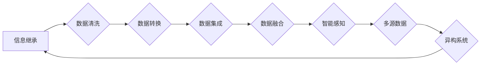

# 原生世界信息的高效继承

> 关键词：原生世界，信息继承，数据融合，智能感知，多源数据，异构系统

## 1. 背景介绍

在信息爆炸的时代，数据已经成为现代社会的重要资产。然而，数据往往存在于多个异构系统中，这些系统可能由不同的技术平台、不同的数据处理方式构成，导致信息难以有效共享和利用。原生世界信息的高效继承，即是如何将这些分散的、异构的信息源整合为一个统一的信息架构，以便更好地服务于数据分析、决策支持等应用。

### 1.1 问题的由来

随着物联网、智能设备等技术的普及，数据来源日益多样化，包括但不限于传感器数据、社交媒体数据、企业内部数据等。这些数据通常以结构化、半结构化和非结构化形式存在，且分布在不同的数据库、文件系统、云存储平台中。如何将这些来自原生世界的信息高效地继承和整合，成为了当前信息技术领域面临的重大挑战。

### 1.2 研究现状

目前，关于原生世界信息的高效继承，学术界和工业界已经提出了一系列解决方案，主要包括：

- **数据集成技术**：通过数据清洗、转换、集成等手段，将不同来源的数据转换为统一的格式，便于后续处理和分析。
- **数据仓库技术**：通过数据仓库构建统一的数据存储平台，实现数据的集中管理和统一访问。
- **大数据技术**：利用分布式存储和处理技术，处理海量异构数据，并支持实时分析和挖掘。
- **知识图谱技术**：通过实体、关系和属性构建知识图谱，实现知识表示、推理和融合。

### 1.3 研究意义

原生世界信息的高效继承具有以下重要意义：

- **提升数据利用率**：通过整合分散的数据，可以挖掘出更多有价值的信息，为决策支持提供更全面的依据。
- **降低开发成本**：统一的数据架构可以减少重复开发，提高开发效率。
- **提高数据质量**：通过数据清洗和集成，可以提高数据的准确性和一致性。
- **促进数据治理**：统一的数据架构可以更好地实现数据的管理和控制。

### 1.4 本文结构

本文将围绕原生世界信息的高效继承展开讨论，内容安排如下：

- **第2章**：介绍核心概念与联系，包括信息继承、数据融合、智能感知等。
- **第3章**：阐述核心算法原理，包括数据集成、数据仓库、大数据和知识图谱技术。
- **第4章**：讲解数学模型和公式，并举例说明。
- **第5章**：提供项目实践，包括开发环境搭建、代码实例和详细解释。
- **第6章**：分析实际应用场景，并展望未来应用。
- **第7章**：推荐相关工具和资源。
- **第8章**：总结研究成果，展望未来发展趋势和挑战。
- **第9章**：提供常见问题与解答。

## 2. 核心概念与联系

### 2.1 核心概念

#### 2.1.1 信息继承

信息继承是指将来自不同来源、不同格式的信息进行整合和转换，使其能够被统一的数据架构所支持。信息继承的关键技术包括数据清洗、数据转换和数据集成。

#### 2.1.2 数据融合

数据融合是指将多个数据源中的数据合并为一个统一的数据集，以便进行进一步的分析和处理。数据融合的目标是消除数据冗余，提高数据的一致性和可用性。

#### 2.1.3 智能感知

智能感知是指利用传感器、摄像头等设备获取环境信息，并通过智能算法进行理解和处理的过程。智能感知是信息继承的重要数据来源。

#### 2.1.4 多源数据

多源数据是指来自不同来源、不同格式、不同类型的数据。多源数据是信息继承和融合的基础。

#### 2.1.5 异构系统

异构系统是指由不同硬件、软件、网络等技术平台构成的系统。异构系统是信息继承的复杂背景。

### 2.2 Mermaid 流程图

## 3. 核心算法原理 & 具体操作步骤

### 3.1 算法原理概述

原生世界信息的高效继承涉及多个算法和技术，以下将分别进行概述。

#### 3.1.1 数据集成

数据集成是通过一系列操作将多个数据源中的数据合并为一个统一的数据集的过程。数据集成的主要步骤包括：

1. 数据源识别：识别和描述数据源。
2. 数据映射：将数据源中的数据转换为统一的数据模型。
3. 数据清洗：处理缺失值、异常值等数据质量问题。
4. 数据转换：将数据转换为统一的格式。
5. 数据加载：将转换后的数据加载到统一的数据存储平台。

#### 3.1.2 数据仓库

数据仓库是一个支持企业级数据管理的数据存储平台。数据仓库的主要功能包括：

1. 数据存储：存储和管理企业级数据。
2. 数据集成：将来自不同来源的数据集成到数据仓库中。
3. 数据查询：提供强大的数据查询和报表功能。
4. 数据分析：支持数据挖掘和分析。

#### 3.1.3 大数据

大数据是指规模庞大、数据类型多样的数据集合。大数据技术的主要特点包括：

1. 分布式存储：利用分布式存储技术存储海量数据。
2. 分布式处理：利用分布式计算技术处理海量数据。
3. 实时分析：支持实时数据处理和分析。
4. 高度自动化：自动完成数据采集、处理、分析和展示。

#### 3.1.4 知识图谱

知识图谱是通过实体、关系和属性构建的知识体系。知识图谱的主要功能包括：

1. 知识表示：以图的形式表示知识。
2. 知识推理：利用图结构进行知识推理。
3. 知识融合：将不同来源的知识融合到知识图谱中。

### 3.2 算法步骤详解

#### 3.2.1 数据集成

数据集成的主要步骤如下：

1. **数据源识别**：通过调研和文档分析，识别和描述数据源。
2. **数据映射**：根据统一的数据模型，将数据源中的数据映射到统一的数据模型中。
3. **数据清洗**：识别和处理数据中的缺失值、异常值等质量问题。
4. **数据转换**：将数据源中的数据转换为统一的数据格式，如CSV、JSON等。
5. **数据加载**：将转换后的数据加载到数据仓库、大数据平台或知识图谱中。

#### 3.2.2 数据仓库

数据仓库的主要步骤如下：

1. **数据采集**：从不同的数据源采集数据。
2. **数据清洗**：清洗和转换采集到的数据。
3. **数据存储**：将清洗后的数据存储到数据仓库中。
4. **数据查询**：提供强大的数据查询和报表功能。
5. **数据分析**：支持数据挖掘和分析。

#### 3.2.3 大数据

大数据的主要步骤如下：

1. **数据采集**：从不同的数据源采集数据。
2. **数据存储**：将采集到的数据存储到分布式存储平台中。
3. **数据处理**：对数据进行分布式处理和分析。
4. **数据展示**：将分析结果展示给用户。

#### 3.2.4 知识图谱

知识图谱的主要步骤如下：

1. **数据采集**：从不同的数据源采集知识。
2. **知识表示**：将知识表示为图结构。
3. **知识推理**：利用图结构进行知识推理。
4. **知识融合**：将不同来源的知识融合到知识图谱中。

### 3.3 算法优缺点

#### 3.3.1 数据集成

优点：

- 提高数据利用率。
- 降低开发成本。
- 提高数据质量。

缺点：

- 数据源识别和描述复杂。
- 数据清洗和转换工作量大。

#### 3.3.2 数据仓库

优点：

- 支持企业级数据管理。
- 提供强大的数据查询和报表功能。
- 支持数据挖掘和分析。

缺点：

- 数据采集和清洗成本高。
- 需要专业的数据仓库管理团队。

#### 3.3.3 大数据

优点：

- 支持海量数据处理。
- 支持实时数据处理和分析。
- 自动化程度高。

缺点：

- 对硬件和软件的要求高。
- 数据安全风险较大。

#### 3.3.4 知识图谱

优点：

- 支持知识表示、推理和融合。
- 提高数据利用率和可解释性。

缺点：

- 构建和维护成本高。
- 知识推理能力有限。