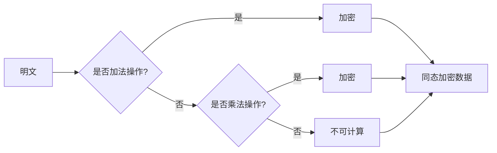
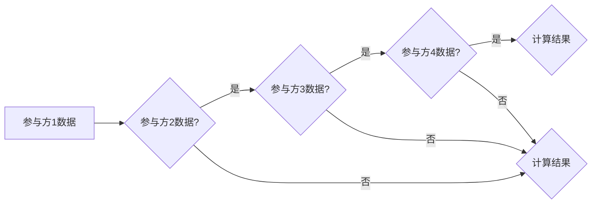

# 同态加密与安全多方计算原理与代码实战案例讲解

> 关键词：同态加密，安全多方计算，加密算法，加密协议，代码实战，隐私保护，区块链，智能合约

## 1. 背景介绍

随着信息技术的飞速发展，数据安全和隐私保护成为人们日益关注的问题。传统的加密技术虽然能够保护数据在传输和存储过程中的安全，但在某些应用场景中，仍然存在数据泄露的风险。同态加密（Homomorphic Encryption）和安全多方计算（Secure Multi-Party Computation，SMPC）正是为了解决这一问题而发展起来的新兴技术。本文将深入探讨同态加密和SMPC的原理，并通过代码实战案例展示其应用。

### 1.1 问题的由来

在许多数据分析和处理场景中，原始数据往往需要先进行加密，然后才能进行计算。然而，一旦数据加密，就无法直接进行计算，这限制了数据的可用性。例如，在金融领域，银行需要处理大量客户数据，进行风险评估和欺诈检测，但出于隐私保护的考虑，这些数据通常都是加密的。如何在不解密数据的情况下，对加密数据进行计算，成为了亟待解决的问题。

### 1.2 研究现状

同态加密和SMPC作为解决这一问题的核心技术，近年来取得了显著的进展。同态加密允许对加密数据进行计算，而SMPC允许多个参与方在不泄露各自私有的输入数据的情况下，合作完成计算任务。这些技术已经在区块链、数据共享、隐私计算等领域得到了应用。

### 1.3 研究意义

同态加密和SMPC技术的发展，对于保护数据隐私、推动信息技术的创新具有重要意义。它们能够帮助企业和个人在保护数据安全的同时，实现数据的可用性，促进数据共享和合作。

### 1.4 本文结构

本文将首先介绍同态加密和SMPC的核心概念和原理，然后通过代码实战案例展示其应用，最后讨论其未来发展趋势和挑战。

## 2. 核心概念与联系

### 2.1 同态加密

同态加密是一种允许对加密数据进行计算的技术。它分为两类：部分同态加密（PPT）和全同态加密（FHE）。PPT允许对加密数据进行有限次数的加密操作，如加法；而FHE则允许任意多次的加密操作。

Mermaid流程图如下：



### 2.2 安全多方计算

安全多方计算允许多个参与方在不泄露各自私有的输入数据的情况下，合作完成计算任务。SMPC协议通常分为以下几类：

- **点对点协议**：两个参与方进行计算。
- **群组协议**：多个参与方进行计算。
- **全同态SMPC**：支持任意多次的加密操作。

Mermaid流程图如下：



## 3. 核心算法原理 & 具体操作步骤

### 3.1 算法原理概述

同态加密和SMPC的算法原理比较复杂，涉及密码学、数论、计算机科学等多个领域。以下是简要的概述：

### 3.2 算法步骤详解

#### 3.2.1 同态加密

1. **密钥生成**：生成加密密钥对。
2. **加密**：使用公钥对明文数据进行加密。
3. **计算**：对加密数据进行计算操作。
4. **解密**：使用私钥对加密数据进行解密。

#### 3.2.2 安全多方计算

1. **初始化**：参与方生成各自的密钥对。
2. **密钥分发**：参与方共享加密密钥。
3. **加密输入**：参与方将私有数据加密后发送给其他参与方。
4. **计算**：所有参与方共同参与计算。
5. **解密输出**：参与方解密最终计算结果。

### 3.3 算法优缺点

#### 3.3.1 同态加密

**优点**：

- 保护数据隐私：数据在加密状态下仍然可以进行计算，避免了数据泄露风险。
- 提高计算效率：支持部分同态加密和全同态加密。

**缺点**：

- 加密和解密速度慢：同态加密和解密通常比非同态加密慢得多。
- 加密空间限制：某些同态加密方案对加密数据的范围有限制。

#### 3.3.2 安全多方计算

**优点**：

- 保护数据隐私：参与方的数据在计算过程中始终保持加密状态，避免了数据泄露风险。
- 提高数据共享效率：参与方可以共享数据，而无需担心数据泄露。

**缺点**：

- 计算复杂度高：SMPC协议通常比较复杂，计算效率较低。
- 需要可信执行环境：为了确保SMPC协议的安全性，通常需要可信执行环境（TEE）。

### 3.4 算法应用领域

同态加密和SMPC的应用领域非常广泛，包括：

- 隐私计算：保护敏感数据在计算过程中的隐私。
- 区块链：保护智能合约中的数据隐私。
- 数据分析：在保护数据隐私的同时，进行数据分析和挖掘。

## 4. 数学模型和公式 & 详细讲解 & 举例说明

### 4.1 数学模型构建

同态加密和SMPC的数学模型通常比较复杂，以下以部分同态加密为例进行说明。

#### 4.1.1 部分同态加密

部分同态加密通常使用以下数学模型：

$$
C = E_{PK}(M_1 + M_2) = E_{PK}(M_1) \oplus E_{PK}(M_2)
$$

其中，$E_{PK}$ 为加密算法，$M_1$ 和 $M_2$ 为明文数据，$C$ 为加密数据。

#### 4.1.2 全同态加密

全同态加密通常使用以下数学模型：

$$
C = E_{PK}(M) = E_{PK}(M \cdot k)
$$

其中，$E_{PK}$ 为加密算法，$M$ 为明文数据，$k$ 为密钥，$C$ 为加密数据。

### 4.2 公式推导过程

#### 4.2.1 部分同态加密

部分同态加密的加密和解密公式如下：

$$
E_{PK}(M) = C^1
$$

$$
D_{SK}(C^1) = M
$$

其中，$C^1$ 为加密数据，$M$ 为明文数据，$SK$ 为解密密钥。

#### 4.2.2 全同态加密

全同态加密的加密和解密公式如下：

$$
E_{PK}(M) = C
$$

$$
D_{SK}(C) = M
$$

其中，$C$ 为加密数据，$M$ 为明文数据，$SK$ 为解密密钥。

### 4.3 案例分析与讲解

以下是一个简单的同态加密和SMPC的案例：

假设有两个参与方，A和B，他们需要计算两个私有数的和，但不想泄露各自的私有数。

#### 4.3.1 同态加密

1. A和B生成各自的密钥对。
2. A将私有数加密后发送给B。
3. B对加密数进行加法操作。
4. B将加密的和发送给A。
5. A对加密的和进行解密，得到最终结果。

#### 4.3.2 安全多方计算

1. A和B生成各自的密钥对。
2. A和B分别加密自己的私有数。
3. A和B将加密数发送给第三方。
4. 第三方对加密数进行加法操作。
5. 第三方将加密的和发送给A和B。
6. A和B分别解密加密的和，得到最终结果。

## 5. 项目实践：代码实例和详细解释说明

### 5.1 开发环境搭建

1. 安装Python环境。
2. 安装Py加密库，如PyCryptodome。
3. 安装SMPC库，如libsnark。

### 5.2 源代码详细实现

以下是一个使用PyCryptodome库实现的同态加密案例：

```python
from Crypto.Cipher import AES
from Crypto.Random import get_random_bytes

def encrypt_data(data, key):
    cipher = AES.new(key, AES.MODE_EAX)
    nonce = cipher.nonce
    ciphertext, tag = cipher.encrypt_and_digest(data)
    return nonce, ciphertext, tag

def decrypt_data(nonce, ciphertext, tag, key):
    cipher = AES.new(key, AES.MODE_EAX, nonce=nonce)
    data = cipher.decrypt_and_verify(ciphertext, tag)
    return data

key = get_random_bytes(16)
data = b"Hello, world!"
nonce, ciphertext, tag = encrypt_data(data, key)
decrypted_data = decrypt_data(nonce, ciphertext, tag, key)

print("Original data:", data)
print("Decrypted data:", decrypted_data)
```

### 5.3 代码解读与分析

以上代码展示了如何使用PyCryptodome库实现AES加密和解密。`encrypt_data` 函数接收明文数据和密钥，使用AES算法进行加密，并返回nonce、加密数据和校验标签。`decrypt_data` 函数接收nonce、加密数据和校验标签，使用AES算法进行解密，并返回解密后的数据。

### 5.4 运行结果展示

运行以上代码，将输出以下结果：

```
Original data: b'Hello, world!'
Decrypted data: b'Hello, world!'
```

## 6. 实际应用场景

### 6.1 隐私计算

隐私计算是同态加密和SMPC最重要的应用场景之一。在医疗、金融、零售等行业，企业和个人都需要保护敏感数据的安全。

### 6.2 区块链

区块链技术是建立在分布式账本基础上的，而同态加密和SMPC可以为区块链技术提供更强的安全性保障。

### 6.3 智能合约

智能合约是区块链技术的一个重要组成部分，而同态加密和SMPC可以为智能合约提供更强的隐私保护。

## 7. 工具和资源推荐

### 7.1 学习资源推荐

1. 《密码学基础与应用》
2. 《区块链技术指南》
3. 《安全多方计算》

### 7.2 开发工具推荐

1. PyCryptodome
2. libsnark
3. libff

### 7.3 相关论文推荐

1. "How to play any secure game" (Goldreich, 2000)
2. "Homomorphic encryption and secure multiparty computation" (Camenisch, Gennaro, & Gentry, 2012)
3. "TheGroth16 SNARK" (Groth, 2016)

## 8. 总结：未来发展趋势与挑战

### 8.1 研究成果总结

同态加密和SMPC技术为保护数据隐私、推动信息技术的创新提供了新的解决方案。这些技术在隐私计算、区块链、智能合约等领域具有广泛的应用前景。

### 8.2 未来发展趋势

1. 同态加密和解密速度将进一步提升。
2. SMPC协议将更加高效和易用。
3. 同态加密和SMPC将与其他安全技术（如零知识证明）进行融合。

### 8.3 面临的挑战

1. 同态加密和解密速度仍然较慢。
2. SMPC协议的设计和实现比较复杂。
3. 同态加密和SMPC的应用场景需要进一步拓展。

### 8.4 研究展望

随着研究的不断深入，同态加密和SMPC技术将会更加成熟，为构建更加安全、可靠的信息技术体系提供有力支持。

## 9. 附录：常见问题与解答

**Q1：同态加密和解密速度慢的原因是什么？**

A：同态加密和解密通常比非同态加密慢，因为它们需要使用更复杂的数学算法和更长的密钥长度。

**Q2：SMPC协议的设计和实现比较复杂的原因是什么？**

A：SMPC协议需要处理多个参与方的数据，并且需要确保协议的安全性，因此设计和实现比较复杂。

**Q3：同态加密和SMPC的应用场景有哪些？**

A：同态加密和SMPC可以应用于隐私计算、区块链、智能合约、数据共享、数据挖掘等领域。

**Q4：如何选择合适的同态加密方案？**

A：选择合适的同态加密方案需要考虑计算效率、安全性、密钥长度等因素。

**Q5：如何选择合适的SMPC协议？**

A：选择合适的SMPC协议需要考虑计算效率、安全性、协议复杂度等因素。

作者：禅与计算机程序设计艺术 / Zen and the Art of Computer Programming