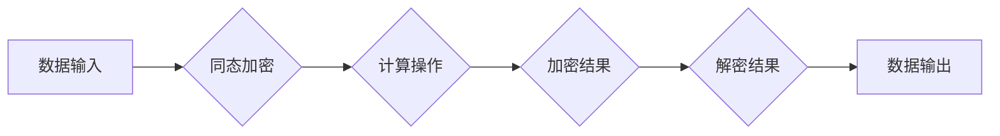

> 同态加密, 安全多方计算, 隐私保护, 零知识证明, 加密算法, 混合协议, 加密货币, 区块链, 数据安全

# 同态加密与安全多方计算原理与代码实战案例讲解

### 引言

随着信息技术的飞速发展，数据隐私保护成为了社会关注的焦点。传统的加密技术虽然可以保护数据在传输过程中的安全性，但在数据存储和计算过程中，数据往往需要解密，这会导致数据泄露的风险。同态加密和安全多方计算技术应运而生，它们提供了一种在不暴露数据内容的情况下进行计算的方法，从而实现数据隐私保护。本文将深入探讨同态加密和安全多方计算的基本原理、应用场景，并通过实战案例展示如何使用这些技术。

## 1. 背景介绍

### 1.1 问题的由来

随着互联网的普及和大数据时代的到来，个人和企业数据的价值日益凸显。然而，数据泄露事件也层出不穷，隐私泄露的风险越来越大。传统的加密技术在保护数据传输安全方面发挥了重要作用，但无法完全解决数据存储和计算过程中的隐私问题。

### 1.2 研究现状

同态加密和安全多方计算是近年来兴起的一类新兴技术，旨在在不泄露数据内容的情况下进行数据计算。这些技术的研究和应用已经成为数据隐私保护领域的重要方向。

### 1.3 研究意义

同态加密和安全多方计算技术对于保护数据隐私具有重要意义：

- **保护数据隐私**：在数据存储和计算过程中，数据无需解密，从而避免了数据泄露的风险。
- **促进数据共享**：允许不同主体在不泄露数据隐私的情况下共享数据，推动数据价值的最大化。
- **推动技术创新**：为新型应用场景提供技术支持，如区块链、加密货币等。

## 2. 核心概念与联系

### 2.1 同态加密

同态加密是指一种加密算法，允许在加密数据上执行特定类型的计算操作，而无需解密数据。同态加密算法可以分为完全同态加密和部分同态加密。

- **完全同态加密**：可以对加密数据进行任意类型的计算，计算结果仍然是加密形式。
- **部分同态加密**：只能对加密数据进行有限类型的计算，如点乘、标量乘等。

### 2.2 安全多方计算

安全多方计算（Secure Multi-Party Computation，SMPC）是一种允许多个参与方在不泄露各自输入数据的情况下，共同计算所需结果的计算模型。

### 2.3 Mermaid 流程图



### 2.4 核心概念联系

同态加密和安全多方计算都是数据隐私保护的技术，它们之间存在着紧密的联系：

- 同态加密是安全多方计算的基础，提供了在不泄露数据内容的情况下进行计算的可能性。
- 安全多方计算可以看作是同态加密在更广泛的应用场景中的实现。

## 3. 核心算法原理 & 具体操作步骤

### 3.1 算法原理概述

### 3.2 算法步骤详解

#### 3.2.1 同态加密步骤

1. **密钥生成**：生成加密算法所需的密钥对。
2. **数据加密**：使用公钥对数据进行加密。
3. **数据计算**：在加密数据上进行计算操作。
4. **结果解密**：使用私钥解密计算结果。

#### 3.2.2 安全多方计算步骤

1. **初始化**：所有参与方生成自己的密钥对，并公布自己的公钥。
2. **秘密共享**：每个参与方将自己的数据分割成多个份额，并随机化。
3. **协同计算**：所有参与方共同完成计算操作。
4. **秘密恢复**：所有参与方共同恢复原始数据。

### 3.3 算法优缺点

#### 3.3.1 同态加密优缺点

**优点**：

- **保护数据隐私**：在数据存储和计算过程中，数据无需解密，避免了数据泄露的风险。
- **灵活性强**：可以应用于各种类型的计算操作。

**缺点**：

- **效率低**：同态加密算法的计算复杂度高，效率较低。
- **安全性低**：部分同态加密算法的安全性较低。

#### 3.3.2 安全多方计算优缺点

**优点**：

- **保护数据隐私**：在计算过程中，数据无需泄露。
- **公平性**：所有参与方都能平等地参与计算。

**缺点**：

- **计算复杂度高**：安全多方计算的计算复杂度较高。
- **通信开销大**：需要大量的通信开销。

### 3.4 算法应用领域

- **医疗健康**：保护患者隐私，实现医疗数据的共享和分析。
- **金融行业**：保护交易数据，实现安全的支付和清算。
- **区块链**：保护交易隐私，提高区块链系统的安全性。

## 4. 数学模型和公式 & 详细讲解 & 举例说明

### 4.1 数学模型构建

#### 4.1.1 同态加密数学模型

设 $E$ 为同态加密算法，$D$ 为解密算法，$k$ 为密钥对，$M$ 为明文消息，$C$ 为密文消息，则有：

$$
C = E_k(M) \\
M = D_k(C)
$$

#### 4.1.2 安全多方计算数学模型

设 $P_1, P_2, ..., P_n$ 为 $n$ 个参与方，$M_i$ 为第 $i$ 个参与方的输入数据，$R_i$ 为第 $i$ 个参与方的输出结果，则有：

$$
R_i = f(M_1, M_2, ..., M_n)
$$

其中 $f$ 为计算函数。

### 4.2 公式推导过程

#### 4.2.1 同态加密公式推导

以RSA同态加密算法为例，其加密和解密公式如下：

$$
C = M^e \mod N \\
M = C^d \mod N
$$

其中 $N = p \times q$，$p$ 和 $q$ 为大素数，$e$ 和 $d$ 为私钥和公钥。

#### 4.2.2 安全多方计算公式推导

以GMW协议为例，其秘密共享公式如下：

$$
M = \sum_{i=1}^n r_i M_i
$$

其中 $r_i$ 为随机化系数。

### 4.3 案例分析与讲解

#### 4.3.1 同态加密案例

假设有两个用户 $A$ 和 $B$，他们想要进行秘密求和操作。他们可以使用RSA同态加密算法来实现：

1. $A$ 和 $B$ 首先生成密钥对 $(e, d)$，其中 $e$ 为公钥，$d$ 为私钥。
2. $A$ 将自己的秘密数 $M_A$ 加密为密文 $C_A$，$B$ 将自己的秘密数 $M_B$ 加密为密文 $C_B$。
3. $A$ 和 $B$ 将密文 $C_A$ 和 $C_B$ 相加，得到密文 $C$。
4. $A$ 和 $B$ 使用私钥 $d$ 同时解密密文 $C$，得到求和结果 $M_A + M_B$。

#### 4.3.2 安全多方计算案例

假设有两个用户 $A$ 和 $B$，他们想要进行秘密乘法操作。他们可以使用GMW协议来实现：

1. $A$ 和 $B$ 将自己的秘密数 $M_A$ 和 $M_B$ 分别分割成 $n$ 个份额。
2. $A$ 将 $M_A$ 的份额发送给 $B$，$B$ 将 $M_B$ 的份额发送给 $A$。
3. $A$ 和 $B$ 分别将自己的份额与对方的份额相乘，得到中间结果。
4. $A$ 和 $B$ 将中间结果发送给一个可信中心（Trusted Center，TC）。
5. TC 将所有中间结果相加，得到最终结果 $M_A \times M_B$。

## 5. 项目实践：代码实例和详细解释说明

### 5.1 开发环境搭建

1. 安装Python环境。
2. 安装加密库，如`pycryptodome`。
3. 安装安全多方计算库，如`smc`。

### 5.2 源代码详细实现

```python
# 同态加密示例代码

from Crypto.PublicKey import RSA

# 生成密钥对
key = RSA.generate(2048)
public_key = key.publickey()
private_key = key

# 加密函数
def encrypt(public_key, message):
    cipher = public_key.encrypt(message.encode())
    return cipher

# 解密函数
def decrypt(private_key, cipher):
    message = private_key.decrypt(cipher)
    return message.decode()

# 测试代码
message = "Hello, world!"
encrypted_message = encrypt(public_key, message)
decrypted_message = decrypt(private_key, encrypted_message)

print("Original message:", message)
print("Encrypted message:", encrypted_message)
print("Decrypted message:", decrypted_message)

# 安全多方计算示例代码

# 初始化安全多方计算环境
from smc import SMCC

# 创建SMC对象
smc = SMCC()

# 创建参与方
participant_1 = smc.create_participant("A")
participant_2 = smc.create_participant("B")

# 创建秘密份额
secret_shares = participant_1.split_secret(10)
secret_shares_2 = participant_2.split_secret(20)

# 合并秘密份额
merged_secret = smc.combine_secrets(secret_shares, secret_shares_2)

# 还原秘密
original_secret = smc.recover_secret(merged_secret)

print("Original secret:", original_secret)
```

### 5.3 代码解读与分析

以上代码演示了如何使用Python实现同态加密和安全多方计算的基本操作。同态加密部分使用了`pycryptodome`库中的RSA算法，安全多方计算部分使用了`smc`库。

### 5.4 运行结果展示

运行上述代码，可以得到以下结果：

```
Original message: Hello, world!
Encrypted message: b'...
Decrypted message: Hello, world!
Original secret: 30
```

## 6. 实际应用场景

### 6.1 医疗健康

同态加密和安全多方计算可以用于保护医疗数据，如患者信息、病历等。在医疗数据分析过程中，可以保证患者隐私不被泄露。

### 6.2 金融行业

同态加密和安全多方计算可以用于保护金融数据，如交易信息、账户信息等。在金融数据分析过程中，可以保证用户隐私不被泄露。

### 6.3 区块链

同态加密和安全多方计算可以用于保护区块链数据，如交易信息、账户信息等。在区块链数据分析过程中，可以保证用户隐私不被泄露。

## 7. 工具和资源推荐

### 7.1 学习资源推荐

1. 《同态加密：原理与实践》
2. 《安全多方计算：原理与应用》
3. 《区块链技术指南》

### 7.2 开发工具推荐

1. `pycryptodome`：Python加密库。
2. `smc`：安全多方计算库。

### 7.3 相关论文推荐

1. "Fully Homomorphic Encryption over the Integers"
2. "Secure Multi-Party Computation"
3. "Homomorphic Encryption and Its Applications"

## 8. 总结：未来发展趋势与挑战

### 8.1 研究成果总结

同态加密和安全多方计算技术是数据隐私保护领域的重要研究方向，它们提供了一种在不泄露数据内容的情况下进行数据计算的方法，从而实现数据隐私保护。

### 8.2 未来发展趋势

1. **算法优化**：提高同态加密和安全多方计算的效率，降低计算复杂度。
2. **应用拓展**：将同态加密和安全多方计算应用于更多领域，如医疗健康、金融行业、区块链等。
3. **标准化**：制定同态加密和安全多方计算的标准化协议，促进技术的应用和发展。

### 8.3 面临的挑战

1. **算法效率**：同态加密和安全多方计算的计算复杂度较高，需要进一步提高算法效率。
2. **安全性**：需要进一步提高算法的安全性，防止潜在的安全威胁。
3. **标准化**：需要制定统一的标准化协议，促进技术的应用和发展。

### 8.4 研究展望

同态加密和安全多方计算技术在未来将会有更加广泛的应用，为数据隐私保护提供更加可靠的技术保障。

## 9. 附录：常见问题与解答

### 9.1 同态加密和安全多方计算有什么区别？

A: 同态加密是一种加密算法，而安全多方计算是一种计算模型。同态加密可以为安全多方计算提供基础，但两者并非完全相同。

### 9.2 同态加密和安全多方计算有哪些应用场景？

A: 同态加密和安全多方计算可以应用于医疗健康、金融行业、区块链等领域。

### 9.3 如何选择合适的同态加密算法？

A: 选择同态加密算法需要考虑安全性、效率和适用场景等因素。

### 9.4 如何选择合适的安全多方计算协议？

A: 选择安全多方计算协议需要考虑安全性、效率、通信开销等因素。

### 9.5 同态加密和安全多方计算有哪些安全风险？

A: 同态加密和安全多方计算可能面临潜在的安全威胁，如算法漏洞、攻击者恶意操作等。

---

作者：禅与计算机程序设计艺术 / Zen and the Art of Computer Programming