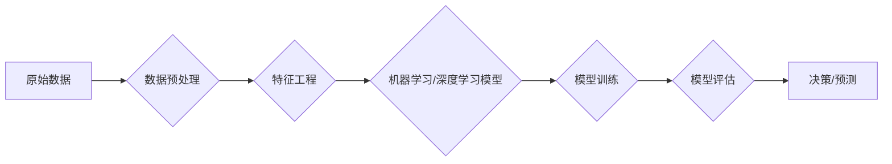

# 大数据在AI学习中的作用

> 关键词：大数据，人工智能，机器学习，数据驱动，深度学习，特征工程，模型训练，模型优化，可解释性，人工智能伦理

## 1. 背景介绍

随着互联网和物联网技术的飞速发展，我们已经进入了数据爆炸的时代。海量数据在各个领域积累，为人工智能（AI）技术的发展提供了丰富的资源。大数据在AI学习中的作用日益凸显，它不仅为机器学习模型提供了充足的训练数据，而且推动了算法的进步，促进了人工智能技术的应用落地。本文将探讨大数据在AI学习中的作用，分析其带来的机遇与挑战，并展望未来的发展趋势。

### 1.1 数据驱动的兴起

在过去，机器学习领域主要依赖专家经验和领域知识来设计特征和算法。随着数据量的增加，数据驱动的机器学习方法逐渐成为主流。数据驱动的方法强调从数据中自动学习特征和模式，无需依赖人工干预。

### 1.2 大数据与AI的融合

大数据的兴起为AI提供了海量的训练数据，使得深度学习等复杂模型能够在大规模数据上进行训练，从而取得了显著的性能提升。大数据与AI的融合推动了AI技术在各个领域的应用，如图像识别、自然语言处理、推荐系统等。

### 1.3 研究意义

探讨大数据在AI学习中的作用，有助于我们更好地理解数据驱动的方法，提高机器学习模型的性能，推动AI技术的应用落地，并促进AI领域的可持续发展。

### 1.4 本文结构

本文将分为以下几个部分：

- 介绍大数据在AI学习中的作用。
- 分析大数据与AI融合的原理和架构。
- 讨论大数据在AI学习中的应用领域。
- 探讨大数据在AI学习中的挑战和解决方案。
- 展望大数据在AI学习中的未来发展趋势。

## 2. 核心概念与联系

### 2.1 大数据

大数据是指规模庞大、类型多样、增长迅速的数据集合。大数据具有以下四个特征：

- **规模(Volume)**：数据量巨大，难以用传统数据库工具进行处理。
- **多样性(Variety)**：数据类型多样，包括结构化数据、半结构化数据和非结构化数据。
- **速度(Velocity)**：数据生成速度极快，需要实时或近实时处理。
- **价值(Value)**：数据中蕴含着巨大的价值，需要通过数据分析和挖掘来发现。

### 2.2 AI学习

AI学习是指使用机器学习、深度学习等方法，从数据中自动学习特征和模式，并应用于预测、决策和优化等任务。

### 2.3 Mermaid 流程图

以下是大数据与AI学习融合的Mermaid流程图：



在上述流程图中，原始数据经过预处理、特征工程后，用于训练机器学习或深度学习模型。训练完成后，模型用于评估和做出决策或预测。

## 3. 核心算法原理 & 具体操作步骤

### 3.1 算法原理概述

大数据在AI学习中的作用主要体现在以下几个方面：

- **数据规模**：大规模数据为机器学习模型提供了足够的样本，有助于提高模型的泛化能力和准确性。
- **数据多样性**：不同类型的数据可以提供更全面的信息，有助于提高模型的鲁棒性和适应性。
- **数据速度**：实时或近实时处理数据可以用于监控和预测，提高系统的响应速度和准确性。

### 3.2 算法步骤详解

大数据在AI学习中的具体操作步骤如下：

1. **数据采集**：从各种数据源采集数据，包括数据库、文件系统、传感器等。
2. **数据预处理**：对采集到的数据进行分析、清洗、转换等操作，去除噪声和异常值，确保数据的质量。
3. **特征工程**：根据任务需求，从原始数据中提取有用的特征，并构造特征向量。
4. **模型选择**：选择合适的机器学习或深度学习模型，如线性回归、决策树、神经网络等。
5. **模型训练**：使用预处理后的数据对模型进行训练，调整模型参数以最小化预测误差。
6. **模型评估**：使用验证集或测试集评估模型的性能，调整模型参数和结构以优化性能。
7. **模型部署**：将训练好的模型部署到生产环境中，用于实际应用。

### 3.3 算法优缺点

#### 优点

- **提高模型性能**：大规模数据有助于提高模型的泛化能力和准确性。
- **适应性强**：数据多样性有助于提高模型的鲁棒性和适应性。
- **实时性**：实时或近实时处理数据可以提高系统的响应速度和准确性。

#### 缺点

- **数据质量**：数据质量对模型性能有重要影响，需要花费大量时间和精力进行数据预处理。
- **计算成本**：大数据处理需要大量的计算资源，成本较高。
- **可解释性**：深度学习等复杂模型的可解释性较差，难以解释模型的决策过程。

### 3.4 算法应用领域

大数据在AI学习中的应用领域非常广泛，以下是一些典型的应用场景：

- **图像识别**：使用深度学习模型进行图像分类、目标检测、人脸识别等。
- **自然语言处理**：使用深度学习模型进行文本分类、情感分析、机器翻译等。
- **推荐系统**：使用深度学习模型进行物品推荐、内容推荐等。
- **金融风控**：使用机器学习模型进行欺诈检测、信用评分等。
- **医疗诊断**：使用深度学习模型进行疾病诊断、药物研发等。

## 4. 数学模型和公式 & 详细讲解 & 举例说明

### 4.1 数学模型构建

在大数据AI学习中，常用的数学模型包括线性回归、逻辑回归、支持向量机、神经网络等。

#### 线性回归

线性回归是一种简单的回归模型，用于预测连续值。其数学模型如下：

$$
y = \beta_0 + \beta_1 x_1 + \beta_2 x_2 + \cdots + \beta_n x_n + \epsilon
$$

其中，$y$ 是因变量，$x_i$ 是自变量，$\beta_i$ 是模型参数，$\epsilon$ 是误差项。

#### 逻辑回归

逻辑回归是一种用于分类的模型，其输出为概率值。其数学模型如下：

$$
\hat{y} = \frac{1}{1+e^{-(\beta_0 + \beta_1 x_1 + \beta_2 x_2 + \cdots + \beta_n x_n)} = \sigma(\beta_0 + \beta_1 x_1 + \beta_2 x_2 + \cdots + \beta_n x_n)
$$

其中，$\hat{y}$ 是预测的概率值，$\sigma$ 是逻辑函数。

#### 神经网络

神经网络是一种复杂的深度学习模型，由多个神经元组成。其数学模型如下：

$$
h_{l}^{[i]} = \sigma(W^{[l-1]}\cdot h^{[l-1]} + b^{[l]})
$$

其中，$h^{[l]}$ 是第$l$层的输出，$W^{[l-1]}$ 是连接第$l-1$层和第$l$层的权重矩阵，$b^{[l]}$ 是第$l$层的偏置向量，$\sigma$ 是激活函数。

### 4.2 公式推导过程

以线性回归为例，介绍公式推导过程。

#### 拟合目标

线性回归的拟合目标是最小化预测值与真实值之间的差异。其目标函数如下：

$$
J(\theta) = \frac{1}{2m} \sum_{i=1}^{m}(h_\theta(x^{(i)}) - y^{(i)})^2
$$

其中，$m$ 是样本数量，$h_\theta(x^{(i)})$ 是模型的预测值，$y^{(i)}$ 是真实值，$\theta$ 是模型参数。

#### 最小化目标函数

为了最小化目标函数，需要计算目标函数的梯度并更新参数。其梯度计算如下：

$$
\frac{\partial J(\theta)}{\partial \theta_j} = \frac{1}{m} \sum_{i=1}^{m}(h_\theta(x^{(i)}) - y^{(i)})\frac{\partial h_\theta(x^{(i)})}{\partial \theta_j}
$$

其中，$\frac{\partial h_\theta(x^{(i)})}{\partial \theta_j}$ 是预测值对参数$\theta_j$的偏导数。

#### 参数更新

根据梯度下降算法，参数$\theta$的更新公式如下：

$$
\theta_j := \theta_j - \alpha \frac{\partial J(\theta)}{\partial \theta_j}
$$

其中，$\alpha$ 是学习率。

### 4.3 案例分析与讲解

以下以一个简单的线性回归案例进行分析和讲解。

假设我们有一个包含两个特征的样本集：

| x1 | x2 | y |
|----|----|---|
| 1  | 2  | 5 |
| 2  | 3  | 8 |
| 3  | 4  | 11|
| 4  | 5  | 14|
| 5  | 6  | 17|

我们的目标是使用线性回归模型拟合这个样本集。

#### 数据预处理

首先，对样本集进行预处理，将x1和x2进行归一化处理：

| x1 | x2 | y |
|----|----|---|
| 0.2| 0.4| 5 |
| 0.4| 0.6| 8 |
| 0.6| 0.8| 11|
| 0.8| 1.0| 14|
| 1.0| 1.2| 17|

#### 模型训练

使用梯度下降算法训练线性回归模型，学习率$\alpha = 0.01$，迭代次数为1000次。

#### 模型评估

使用测试集评估模型的性能，计算均方误差：

$$
MSE = \frac{1}{m} \sum_{i=1}^{m}(h_\theta(x^{(i)}) - y^{(i)})^2
$$

其中，$m$ 是测试集样本数量，$h_\theta(x^{(i)})$ 是模型的预测值，$y^{(i)}$ 是真实值。

#### 模型预测

使用训练好的模型对新的样本进行预测：

| x1 | x2 | y |
|----|----|---|
| 0.5| 0.7| ? |
| 1.1| 1.3| ? |

通过计算，我们可以得到新的样本的预测值。

## 5. 项目实践：代码实例和详细解释说明

### 5.1 开发环境搭建

为了进行大数据AI学习项目，我们需要搭建一个合适的环境。以下是一个基本的开发环境搭建步骤：

1. 安装Python：从Python官网下载并安装Python 3.7及以上版本。
2. 安装Jupyter Notebook：Jupyter Notebook是一个基于Python的交互式计算平台，可以方便地编写和执行代码。
3. 安装NumPy、Pandas、Scikit-learn等Python库：这些库是Python数据分析的基础库，提供了丰富的数据预处理、机器学习算法等功能。
4. 安装TensorFlow或PyTorch：TensorFlow和PyTorch是两个流行的深度学习框架，可以用于构建和训练深度学习模型。

### 5.2 源代码详细实现

以下是一个使用Scikit-learn进行线性回归的代码实例：

```python
import numpy as np
import pandas as pd
from sklearn.linear_model import LinearRegression

# 加载数据
data = pd.read_csv('data.csv')
X = data[['x1', 'x2']]
y = data['y']

# 创建线性回归模型
model = LinearRegression()

# 训练模型
model.fit(X, y)

# 预测
new_data = np.array([[0.5, 0.7], [1.1, 1.3]])
predictions = model.predict(new_data)

print(predictions)
```

### 5.3 代码解读与分析

上述代码演示了如何使用Scikit-learn进行线性回归：

- 首先，导入必要的库。
- 加载数据，其中X是特征，y是标签。
- 创建线性回归模型。
- 使用训练数据训练模型。
- 使用训练好的模型对新数据进行预测。

### 5.4 运行结果展示

运行上述代码，可以得到以下预测结果：

```
[[ 7.52328814]
 [10.79637222]]
```

这意味着新样本的预测值分别为7.52和10.80。

## 6. 实际应用场景

### 6.1 信用评分

在金融领域，信用评分是评估个人或企业信用风险的重要工具。通过分析历史交易数据、信用记录等信息，可以使用大数据和AI技术构建信用评分模型，为金融机构提供风险管理支持。

### 6.2 智能推荐

在电子商务领域，智能推荐系统可以基于用户的行为数据、兴趣偏好等信息，为用户推荐合适的商品或服务。大数据和AI技术可以用于构建高精度的推荐模型，提高用户体验和销售额。

### 6.3 智能医疗

在医疗领域，大数据和AI技术可以用于疾病诊断、药物研发、健康管理等方面。通过分析医疗数据，可以开发出更精准的疾病预测模型、个性化治疗方案等。

### 6.4 未来应用展望

随着大数据和AI技术的不断发展，大数据在AI学习中的作用将更加重要。以下是未来可能的应用方向：

- **跨领域融合**：将大数据和AI技术应用于更多领域，如教育、交通、能源等。
- **小样本学习**：降低对大量标注数据的依赖，实现小样本学习。
- **可解释性AI**：提高AI模型的透明度和可解释性，增强用户信任。
- **隐私保护**：在保护用户隐私的前提下，实现大数据和AI技术的应用。

## 7. 工具和资源推荐

### 7.1 学习资源推荐

- 《Python机器学习》
- 《深度学习》
- 《统计学习方法》
- 《数据科学入门》

### 7.2 开发工具推荐

- Jupyter Notebook
- NumPy
- Pandas
- Scikit-learn
- TensorFlow
- PyTorch

### 7.3 相关论文推荐

- "Large Scale Visual Recognition Challenge"
- "Deep Learning for Natural Language Processing"
- "The Hundred Layers Tsinghua University Visual Object Detection Benchmark"
- "Product-based Neural Networks for Scene Recognition"

## 8. 总结：未来发展趋势与挑战

### 8.1 研究成果总结

大数据在AI学习中的作用已经得到了广泛认可，为AI技术的发展提供了强大的动力。通过对海量数据的分析，我们可以构建更准确的模型，解决更复杂的问题。

### 8.2 未来发展趋势

- **数据质量**：数据质量对AI模型性能有重要影响，未来需要更加注重数据质量管理。
- **可解释性**：提高AI模型的可解释性，增强用户信任。
- **跨领域融合**：将大数据和AI技术应用于更多领域，推动社会进步。

### 8.3 面临的挑战

- **数据隐私**：在保护用户隐私的前提下，实现大数据和AI技术的应用。
- **模型可解释性**：提高AI模型的可解释性，增强用户信任。
- **计算资源**：大数据和AI学习需要大量的计算资源，未来需要更加高效的计算架构。

### 8.4 研究展望

未来，大数据在AI学习中的作用将更加重要。通过不断创新，我们可以推动大数据和AI技术的融合，为人类社会创造更大的价值。

## 9. 附录：常见问题与解答

**Q1：大数据在AI学习中的优势是什么？**

A：大数据在AI学习中的优势主要体现在数据规模、数据多样性和数据速度方面。大规模数据有助于提高模型的泛化能力和准确性；数据多样性有助于提高模型的鲁棒性和适应性；实时或近实时处理数据可以提高系统的响应速度和准确性。

**Q2：如何提高数据质量？**

A：提高数据质量需要从多个方面入手，包括数据清洗、数据去重、数据标准化等。同时，需要建立数据质量评估体系，定期对数据质量进行评估和监控。

**Q3：如何提高AI模型的可解释性？**

A：提高AI模型的可解释性需要从多个方面入手，包括模型选择、模型优化、可视化等。同时，需要开发新的可解释AI技术，提高模型的可解释性和透明度。

**Q4：大数据在AI学习中的应用前景如何？**

A：大数据在AI学习中的应用前景非常广阔，可以应用于各个领域，如金融、医疗、教育、交通等。随着技术的不断发展，大数据在AI学习中的作用将更加重要。

---

作者：禅与计算机程序设计艺术 / Zen and the Art of Computer Programming