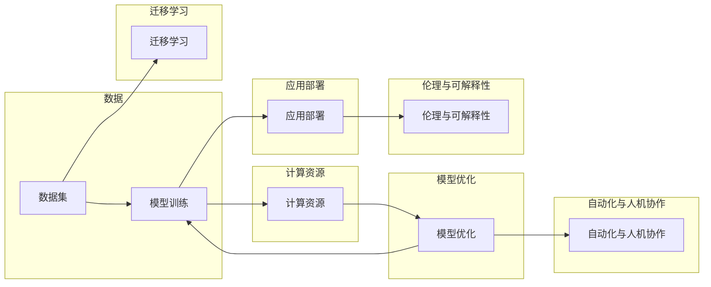

# 大模型开发者的挑战与机遇

> 关键词：大模型，深度学习，人工智能，计算资源，数据集，可解释性，伦理，迁移学习，自动化，人机协作

## 1. 背景介绍

随着深度学习技术的飞速发展，大模型（Large Models）逐渐成为人工智能领域的明星。这些模型在图像识别、自然语言处理、语音识别等领域取得了令人瞩目的成果。然而，大模型的开发并非易事，它面临着诸多挑战和机遇。本文将深入探讨大模型开发过程中的挑战与机遇，为开发者提供有益的指导和启示。

## 2. 核心概念与联系

### 2.1 核心概念

#### 深度学习

深度学习是人工智能领域中的一种重要技术，它通过模拟人脑神经网络的结构和功能，使计算机能够从数据中自动学习和提取特征。

#### 人工智能

人工智能是指使计算机系统能够执行原本需要人类智能才能完成的任务的学科。大模型是人工智能领域的一个重要分支。

#### 大模型

大模型是指具有数十亿甚至数千亿参数的深度学习模型。它们在训练过程中使用了海量数据，能够模拟人类的认知过程。

#### 计算资源

计算资源是指用于执行计算任务的硬件设备，如CPU、GPU、TPU等。

#### 数据集

数据集是指用于训练和测试模型的数据集合。

#### 可解释性

可解释性是指模型决策过程的透明度和可理解性。

#### 伦理

伦理是指关于正确和错误、善与恶的道德原则。

#### 迁移学习

迁移学习是指将一个领域学习到的知识应用到另一个领域。

#### 自动化

自动化是指通过编程和算法使任务自动执行。

#### 人机协作

人机协作是指人与机器共同完成任务的模式。

### 2.2 核心概念原理和架构的 Mermaid 流程图



## 3. 核心算法原理 & 具体操作步骤

### 3.1 算法原理概述

大模型的开发涉及多个环节，包括数据准备、模型设计、训练、优化、测试和部署等。

### 3.2 算法步骤详解

1. **数据准备**：收集和清洗数据集，确保数据质量和多样性。
2. **模型设计**：选择合适的模型架构，如CNN、RNN、Transformer等。
3. **训练**：使用计算资源对模型进行训练，优化模型参数。
4. **优化**：通过调整超参数、正则化等技术优化模型性能。
5. **测试**：在测试集上评估模型性能，确保模型泛化能力。
6. **部署**：将模型部署到生产环境中，实现实际应用。
7. **伦理与可解释性**：确保模型输出符合伦理道德，提高模型的可解释性。
8. **迁移学习**：将模型应用于新的领域，提高模型的适应性。
9. **自动化与人机协作**：实现模型训练、优化和部署的自动化，实现人机协作。

### 3.3 算法优缺点

#### 优点

- **高性能**：大模型通常具有更高的准确性和泛化能力。
- **通用性**：大模型可以应用于多个领域，具有广泛的适用性。
- **自动化**：模型训练和优化可以自动化，提高开发效率。

#### 缺点

- **计算资源消耗**：大模型需要大量的计算资源进行训练。
- **数据需求**：大模型需要大量的高质量数据。
- **可解释性差**：大模型的决策过程通常难以解释。

### 3.4 算法应用领域

大模型可以应用于以下领域：

- **自然语言处理**：文本分类、机器翻译、情感分析等。
- **计算机视觉**：图像识别、物体检测、图像生成等。
- **语音识别**：语音合成、语音识别、语音情感分析等。
- **推荐系统**：个性化推荐、内容推荐等。

## 4. 数学模型和公式 & 详细讲解 & 举例说明

### 4.1 数学模型构建

大模型的数学模型通常基于深度学习的理论基础，包括损失函数、优化算法等。

### 4.2 公式推导过程

由于篇幅限制，此处不进行详细的公式推导过程。

### 4.3 案例分析与讲解

以Transformer模型为例，讲解其数学模型和训练过程。

## 5. 项目实践：代码实例和详细解释说明

### 5.1 开发环境搭建

使用Python和PyTorch等工具搭建开发环境。

### 5.2 源代码详细实现

以下是一个简单的Transformer模型实现示例：

```python
import torch
import torch.nn as nn

class Transformer(nn.Module):
    def __init__(self, input_dim, hidden_dim, num_heads, num_layers):
        super(Transformer, self).__init__()
        self.embedding = nn.Embedding(input_dim, hidden_dim)
        self.transformer = nn.Transformer(hidden_dim, num_heads, num_layers)
        self.fc = nn.Linear(hidden_dim, input_dim)

    def forward(self, x):
        x = self.embedding(x)
        x = self.transformer(x)
        x = self.fc(x)
        return x
```

### 5.3 代码解读与分析

以上代码实现了一个简单的Transformer模型，包括嵌入层、Transformer层和输出层。

### 5.4 运行结果展示

运行模型进行训练和测试，观察模型性能。

## 6. 实际应用场景

大模型可以应用于以下实际应用场景：

- **智能问答系统**：根据用户提问，给出准确的答案。
- **智能客服**：自动回答客户咨询，提高服务效率。
- **自动驾驶**：辅助车辆进行决策，确保行车安全。
- **医疗诊断**：辅助医生进行诊断，提高诊断准确率。

## 7. 工具和资源推荐

### 7.1 学习资源推荐

- 《深度学习》
- 《Python深度学习》
- 《动手学深度学习》

### 7.2 开发工具推荐

- PyTorch
- TensorFlow
- Jupyter Notebook

### 7.3 相关论文推荐

- "Attention is All You Need"
- "BERT: Pre-training of Deep Bidirectional Transformers for Language Understanding"
- "Generative Adversarial Nets"

## 8. 总结：未来发展趋势与挑战

### 8.1 研究成果总结

大模型开发取得了显著的成果，但在性能、可解释性、可扩展性等方面仍面临挑战。

### 8.2 未来发展趋势

- **模型轻量化**：减少模型参数量和计算量，提高模型在移动设备和边缘计算设备上的应用能力。
- **可解释性**：提高模型的可解释性，使模型的决策过程更加透明。
- **自动化**：实现模型训练、优化和部署的自动化，提高开发效率。

### 8.3 面临的挑战

- **计算资源消耗**：大模型需要大量的计算资源进行训练。
- **数据需求**：大模型需要大量的高质量数据。
- **可解释性差**：大模型的决策过程通常难以解释。
- **伦理问题**：如何确保大模型的输出符合伦理道德，避免歧视和偏见。

### 8.4 研究展望

未来，大模型开发将朝着更加高效、可解释、可扩展和安全的方向发展，为人类社会创造更大的价值。

## 9. 附录：常见问题与解答

### 9.1 常见问题

**Q1：大模型需要多少数据？**

A1：大模型需要大量的高质量数据，具体数量取决于任务和数据集。

**Q2：大模型需要多少计算资源？**

A2：大模型需要大量的计算资源，包括GPU、TPU等。

**Q3：如何提高大模型的可解释性？**

A3：可以通过注意力机制可视化、梯度分析方法等方法提高大模型的可解释性。

**Q4：大模型存在哪些伦理问题？**

A4：大模型可能存在偏见、歧视、隐私泄露等伦理问题。

**Q5：如何确保大模型的输出符合伦理道德？**

A5：可以通过数据清洗、模型训练过程中引入约束条件、人工审核等方法确保大模型的输出符合伦理道德。

---

作者：禅与计算机程序设计艺术 / Zen and the Art of Computer Programming