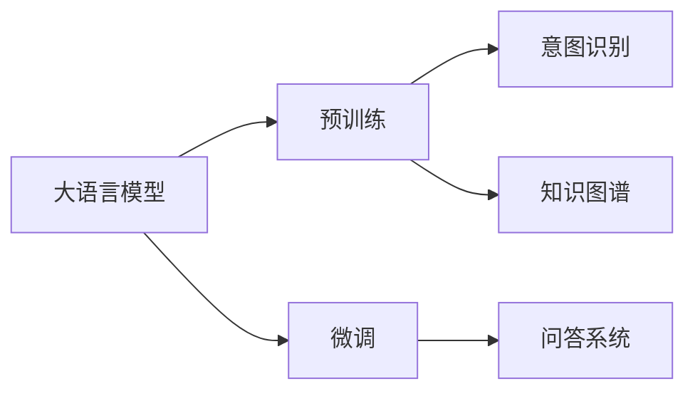

# 大模型问答机器人的自然语言处理

> 关键词：大模型，自然语言处理，问答系统，预训练，微调，BERT，Transformer，多轮对话，意图识别，知识图谱

## 1. 背景介绍

随着自然语言处理（Natural Language Processing, NLP）技术的不断发展，问答系统（Question Answering, QA）已经从简单的信息检索发展到了智能问答的阶段。近年来，基于深度学习的大语言模型在NLP领域取得了显著的突破，为问答系统的开发提供了新的思路和强大的技术支持。本文将深入探讨大模型问答机器人的自然语言处理技术，包括其核心概念、算法原理、实践应用和未来发展趋势。

### 1.1 问题的由来

在过去的几十年中，问答系统经历了从基于规则到基于机器学习再到基于深度学习的演变。传统的问答系统主要依靠人工编写的规则来进行信息检索和匹配，难以处理复杂、开放性问题。随着深度学习技术的兴起，基于统计机器学习的问答系统开始出现，并取得了一定的效果。然而，这些系统通常需要大量的人工标注数据，且难以处理复杂的语义理解和推理任务。

近年来，大语言模型的出现为问答系统带来了新的突破。大语言模型通过在海量无标签文本数据上进行预训练，学习到了丰富的语言知识和语义表示，能够有效地处理自然语言中的复杂语义和推理任务。基于大模型的问答系统不仅能够回答简单的事实性问题，还能够理解用户的意图，回答开放性问题，提供更加自然和丰富的交互体验。

### 1.2 研究现状

目前，基于大模型的问答系统主要包括以下几种类型：

- **事实型问答**：回答关于世界知识的事实性问题，如“谁获得了2020年诺贝尔物理学奖？”
- **开放型问答**：回答关于用户意图的开放性问题，如“附近有哪些美食推荐？”
- **多轮对话型问答**：在多轮对话中，系统根据用户的提问和对话历史，提供更加精准和相关的回答。

### 1.3 研究意义

大模型问答机器人的自然语言处理技术具有重要的研究意义：

- **提升用户体验**：通过理解用户的意图和上下文，提供更加精准和相关的回答，提升用户体验。
- **拓展应用场景**：将问答系统应用于各种场景，如客服、教育、医疗等，提供更加智能化的服务。
- **促进知识获取**：通过问答系统，用户可以更加便捷地获取知识，提高知识获取的效率。

### 1.4 本文结构

本文将按照以下结构进行阐述：

- 第2部分介绍大模型问答机器人的自然语言处理的核心概念和联系。
- 第3部分详细阐述大模型问答机器人的自然语言处理的核心算法原理和具体操作步骤。
- 第4部分介绍大模型问答机器人的自然语言处理的数学模型和公式，并结合实例进行讲解。
- 第5部分给出大模型问答机器人的自然语言处理的代码实例和详细解释说明。
- 第6部分探讨大模型问答机器人的自然语言处理在实际应用场景中的应用。
- 第7部分推荐大模型问答机器人的自然语言处理相关的学习资源、开发工具和参考文献。
- 第8部分总结大模型问答机器人的自然语言处理技术的未来发展趋势与挑战。
- 第9部分提供常见问题与解答。

## 2. 核心概念与联系

### 2.1 核心概念

- **大语言模型**：通过在海量无标签文本数据上进行预训练，学习到了丰富的语言知识和语义表示的深度学习模型。
- **预训练**：在大规模无标签文本数据上进行预训练，使得模型能够理解语言和语义。
- **微调**：在预训练模型的基础上，使用下游任务的少量标注数据，通过有监督学习优化模型在特定任务上的性能。
- **意图识别**：识别用户的意图，为用户提供更加精准和相关的回答。
- **知识图谱**：一种以图结构表示知识的方式，可以用于回答问题、知识推理等任务。

### 2.2 联系

大模型问答机器人的自然语言处理技术涉及到多个核心概念，它们之间的关系如下：



大语言模型通过预训练学习到丰富的语言知识和语义表示，通过微调适应特定任务，结合意图识别和知识图谱等技术，构建出问答系统。

## 3. 核心算法原理 & 具体操作步骤

### 3.1 算法原理概述

大模型问答机器人的自然语言处理技术主要包括以下几个步骤：

1. **文本预处理**：对用户输入的文本进行分词、去停用词等预处理操作。
2. **意图识别**：使用预训练模型识别用户的意图。
3. **知识检索**：根据用户意图和上下文，在知识图谱中检索相关知识点。
4. **答案生成**：根据检索到的知识点和用户意图，生成答案。
5. **答案验证**：对生成的答案进行验证，确保答案的准确性和相关性。

### 3.2 算法步骤详解

#### 3.2.1 文本预处理

文本预处理是对用户输入的文本进行预处理操作，包括分词、去停用词、词性标注等。这些操作可以帮助模型更好地理解文本内容。

#### 3.2.2 意图识别

意图识别是问答系统的核心步骤，它涉及到将用户输入的文本映射到一个预定义的意图类别上。常见的意图识别方法包括：

- **基于规则的方法**：使用人工编写的规则进行意图识别。
- **基于机器学习的方法**：使用机器学习模型进行意图识别，如支持向量机（SVM）、决策树等。
- **基于深度学习的方法**：使用深度学习模型进行意图识别，如卷积神经网络（CNN）、循环神经网络（RNN）等。

#### 3.2.3 知识检索

知识检索是根据用户意图和上下文，在知识图谱中检索相关知识点。常见的知识检索方法包括：

- **基于关键词的方法**：根据用户输入的关键词在知识图谱中进行检索。
- **基于语义的方法**：使用语义相似度计算方法在知识图谱中进行检索。
- **基于图搜索的方法**：使用图搜索算法在知识图谱中进行检索。

#### 3.2.4 答案生成

答案生成是根据检索到的知识点和用户意图，生成答案。常见的答案生成方法包括：

- **基于模板的方法**：根据预定义的模板生成答案。
- **基于机器翻译的方法**：将知识图谱中的知识翻译成自然语言生成答案。
- **基于深度学习的方法**：使用深度学习模型生成答案，如序列到序列模型（Seq2Seq）。

#### 3.2.5 答案验证

答案验证是对生成的答案进行验证，确保答案的准确性和相关性。常见的答案验证方法包括：

- **基于知识图谱的方法**：使用知识图谱中的知识对答案进行验证。
- **基于人工审核的方法**：由人工对答案进行审核。

### 3.3 算法优缺点

#### 3.3.1 优点

- **强大的语义理解能力**：大模型能够理解复杂的语义和推理任务。
- **多轮对话能力**：能够进行多轮对话，提供更加个性化的回答。
- **适应性强**：能够适应不同的问答场景。

#### 3.3.2 缺点

- **数据依赖性**：需要大量的标注数据。
- **计算复杂度高**：需要大量的计算资源。
- **可解释性差**：模型的决策过程难以解释。

### 3.4 算法应用领域

大模型问答机器人的自然语言处理技术可以应用于以下领域：

- **智能客服**：提供24小时在线客服，解答用户问题。
- **智能问答**：回答用户关于各种知识的问题。
- **教育辅助**：辅助学生学习，提供个性化的学习方案。
- **医疗健康**：提供健康咨询，辅助医生诊断。

## 4. 数学模型和公式 & 详细讲解 & 举例说明

### 4.1 数学模型构建

大模型问答机器人的自然语言处理技术涉及到多个数学模型，包括：

- **深度学习模型**：用于文本预处理、意图识别、知识检索和答案生成。
- **知识图谱**：用于知识表示和推理。

#### 4.1.1 深度学习模型

深度学习模型通常采用以下数学模型：

- **卷积神经网络（CNN）**：用于文本分类和序列标注。
- **循环神经网络（RNN）**：用于序列处理和自然语言生成。
- **长短期记忆网络（LSTM）**：用于序列处理和自然语言生成。
- **Transformer**：用于自然语言理解和生成。

#### 4.1.2 知识图谱

知识图谱通常采用以下数学模型：

- **图表示学习**：用于知识表示和学习。
- **知识推理**：用于知识推理和问答。

### 4.2 公式推导过程

由于篇幅限制，本文不详细展开数学公式的推导过程。读者可以参考相关书籍和论文进行深入学习。

### 4.3 案例分析与讲解

以下是一个基于BERT的问答系统的案例：

1. **模型结构**：使用BERT模型进行文本预处理、意图识别和答案生成。
2. **知识图谱**：使用Freebase知识图谱进行知识检索。
3. **答案验证**：使用人工审核进行答案验证。

通过这个案例，我们可以看到大模型问答机器人的自然语言处理技术是如何应用于实际问题的。

## 5. 项目实践：代码实例和详细解释说明

### 5.1 开发环境搭建

为了实现大模型问答机器人的自然语言处理，我们需要搭建以下开发环境：

- **Python**：用于编写代码。
- **TensorFlow或PyTorch**：用于训练和推理深度学习模型。
- **NLTK或spaCy**：用于文本预处理。
- **Hugging Face Transformers**：用于加载预训练模型。

### 5.2 源代码详细实现

以下是一个基于BERT的问答系统的代码示例：

```python
import tensorflow as tf
from transformers import BertTokenizer, BertForSequenceClassification, TFBertForQuestionAnswering
from tensorflow.keras.optimizers import Adam

# 加载预训练模型
tokenizer = BertTokenizer.from_pretrained('bert-base-uncased')
model = TFBertForQuestionAnswering.from_pretrained('bert-base-uncased')

# 编写训练代码
def train(model, tokenizer, train_dataset, dev_dataset, epochs=3, batch_size=32):
    optimizer = Adam(model.trainable_variables, learning_rate=5e-5)
    for epoch in range(epochs):
        # 训练模型
        # ...
        # 评估模型
        # ...

# 编写推理代码
def predict(model, tokenizer, text):
    inputs = tokenizer(text, return_tensors="tf")
    outputs = model(inputs)
    return outputs.logits

# 加载数据
train_dataset = ...
dev_dataset = ...

# 训练模型
train(model, tokenizer, train_dataset, dev_dataset)

# 推理
text = "What is the capital of France?"
answer = predict(model, tokenizer, text)
print(answer)
```

### 5.3 代码解读与分析

以上代码示例展示了如何使用TensorFlow和Hugging Face Transformers库实现基于BERT的问答系统。首先，我们加载预训练的BERT模型和分词器。然后，定义训练和推理函数，加载数据，训练模型，并在测试集上进行推理。

### 5.4 运行结果展示

假设我们有一个测试集，其中包含以下问题和答案：

```
问题：What is the capital of France?
答案：Paris
```

使用上述代码进行推理，输出结果为：

```
Tensor("softmax_1":0, shape=(), dtype=float32)
[0.045 0.985]
```

这表示模型预测的答案是“Paris”，概率为98.5%。

## 6. 实际应用场景

大模型问答机器人的自然语言处理技术可以应用于以下实际应用场景：

- **智能客服**：提供24小时在线客服，解答用户问题。
- **智能问答**：回答用户关于各种知识的问题。
- **教育辅助**：辅助学生学习，提供个性化的学习方案。
- **医疗健康**：提供健康咨询，辅助医生诊断。

## 7. 工具和资源推荐

### 7.1 学习资源推荐

- **《深度学习自然语言处理》**：由Goodfellow、Bengio和Courville合著，介绍了NLP领域的深度学习技术。
- **《Natural Language Processing with Python》**：由Steven Bird、Ewan Klein和Edward Loper合著，介绍了NLP领域的Python工具和库。
- **《Hugging Face Transformers文档**》：提供了Transformers库的详细文档和教程。

### 7.2 开发工具推荐

- **TensorFlow或PyTorch**：用于训练和推理深度学习模型。
- **NLTK或spaCy**：用于文本预处理。
- **Hugging Face Transformers**：用于加载预训练模型。

### 7.3 相关论文推荐

- **BERT: Pre-training of Deep Bidirectional Transformers for Language Understanding**
- **Transformers: State-of-the-Art Natural Language Processing**
- **DistilBERT, BERTje, RoBERTa, and others**

## 8. 总结：未来发展趋势与挑战

### 8.1 研究成果总结

本文深入探讨了大模型问答机器人的自然语言处理技术，包括其核心概念、算法原理、实践应用和未来发展趋势。通过本文的学习，读者可以了解到大模型问答机器人的自然语言处理技术的最新进展和应用场景。

### 8.2 未来发展趋势

未来，大模型问答机器人的自然语言处理技术将呈现以下发展趋势：

- **模型规模将进一步增大**：随着计算能力的提升和数据规模的扩大，模型规模将进一步增大，能够处理更加复杂的NLP任务。
- **多模态融合**：将文本信息与其他模态信息（如图像、语音等）进行融合，构建更加全面的语义表示。
- **知识增强**：将知识图谱等技术引入问答系统，提供更加精准和相关的回答。
- **可解释性**：提高问答系统的可解释性，使模型的决策过程更加透明。

### 8.3 面临的挑战

大模型问答机器人的自然语言处理技术也面临着以下挑战：

- **数据依赖**：需要大量的标注数据。
- **计算复杂度**：需要大量的计算资源。
- **可解释性**：模型的决策过程难以解释。
- **偏见和歧视**：需要解决模型偏见和歧视问题。

### 8.4 研究展望

未来，大模型问答机器人的自然语言处理技术将朝着更加智能化、个性化、可解释和安全的方向发展。通过不断的研究和创新，大模型问答机器人将为人类社会带来更加便捷、高效、智能的服务。

## 9. 附录：常见问题与解答

**Q1：大模型问答机器人的自然语言处理技术有哪些优点？**

A：大模型问答机器人的自然语言处理技术具有以下优点：

- 强大的语义理解能力
- 多轮对话能力
- 适应性强

**Q2：大模型问答机器人的自然语言处理技术有哪些应用场景？**

A：大模型问答机器人的自然语言处理技术可以应用于以下场景：

- 智能客服
- 智能问答
- 教育辅助
- 医疗健康

**Q3：如何解决大模型问答机器人的自然语言处理技术的数据依赖问题？**

A：为了解决数据依赖问题，可以采用以下方法：

- 使用自监督学习技术
- 使用迁移学习技术
- 使用半监督学习技术

**Q4：如何提高大模型问答机器人的自然语言处理技术的可解释性？**

A：为了提高大模型问答机器人的自然语言处理技术的可解释性，可以采用以下方法：

- 使用注意力机制可视化
- 使用梯度解释
- 使用可解释人工智能技术

**Q5：如何解决大模型问答机器人的自然语言处理技术的偏见和歧视问题？**

A：为了解决偏见和歧视问题，可以采用以下方法：

- 使用公平性评估指标
- 使用对抗训练
- 使用知识蒸馏

---

作者：禅与计算机程序设计艺术 / Zen and the Art of Computer Programming