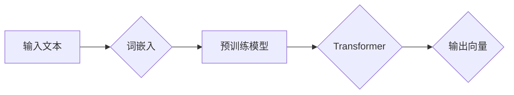

# 大语言模型应用指南：文本的向量化

> 关键词：大语言模型，文本向量化，词嵌入，Transformer，BERT，NLP，自然语言处理

## 1. 背景介绍

随着深度学习在自然语言处理（NLP）领域的广泛应用，大语言模型（Large Language Models，LLMs）如BERT、GPT-3等取得了显著的成果。这些模型通过在大量文本语料上预训练，学习到了丰富的语言知识和模式，从而在多种NLP任务上取得了突破性的进展。然而，文本数据本身的非结构化和非线性特性，使得直接应用传统机器学习模型存在困难。因此，文本的向量化成为了大语言模型应用的关键步骤。本文将深入探讨文本向化的核心概念、算法原理、实践方法以及未来趋势。

## 2. 核心概念与联系

### 2.1 核心概念

**文本向量化**：将文本数据转换为数值向量表示的过程，以便于机器学习模型进行处理和分析。

**词嵌入（Word Embedding）**：将单词映射到固定维度的向量空间中，保持单词语义和语法关系的表示方法。

**预训练模型**：在大规模无标注文本语料上预先训练的语言模型，如BERT、GPT等。

**Transformer**：一种基于自注意力机制（Self-Attention）的深度神经网络模型，在NLP领域取得了广泛应用。

**BERT（Bidirectional Encoder Representations from Transformers）**：一种基于Transformer的预训练语言模型，通过双向上下文信息增强了词嵌入的语义表示。

### 2.2 Mermaid 流程图



### 2.3 核心概念联系

文本向量化是NLP任务的基础，通过词嵌入将文本转换为数值向量，再利用预训练模型如BERT进行进一步的特征提取。Transformer作为预训练模型的一种，通过自注意力机制捕捉文本中的长距离依赖关系，为文本向量化提供了强大的支撑。

## 3. 核心算法原理 & 具体操作步骤

### 3.1 算法原理概述

文本向量化通常包含以下几个步骤：

1. 分词（Tokenization）：将文本分割成单词、字符或其他更小的单元。
2. 词嵌入（Word Embedding）：将分词后的文本转换为数值向量。
3. 预训练模型（Pre-trained Model）：使用预训练模型对词嵌入进行进一步的特征提取。
4. 输出向量（Output Vector）：从预训练模型输出最终的特征向量。

### 3.2 算法步骤详解

1. **分词**：根据任务需求选择合适的分词方法，如BERT使用的WordPiece分词。

2. **词嵌入**：使用预训练的词嵌入模型（如BERT的WordPiece）将分词后的单词转换为向量。WordPiece将单词分解为子词，并学习子词的向量表示。

3. **预训练模型**：使用预训练模型（如BERT）对词嵌入进行进一步的特征提取。预训练模型通常使用自注意力机制捕捉文本中的长距离依赖关系，并学习到丰富的语言知识。

4. **输出向量**：从预训练模型的输出中提取特征向量。这些向量可以用于下游任务，如文本分类、情感分析等。

### 3.3 算法优缺点

**优点**：

* 提高NLP任务的性能。
* 学习到丰富的语言知识。
* 减少对标注数据的依赖。

**缺点**：

* 预训练模型需要大量计算资源。
* 预训练模型可能存在偏见和错误。
* 对于特定领域的文本数据，预训练模型可能无法很好地适应。

### 3.4 算法应用领域

文本向量化在NLP领域有着广泛的应用，包括：

* 文本分类
* 情感分析
* 机器翻译
* 命名实体识别
* 机器阅读理解

## 4. 数学模型和公式 & 详细讲解 & 举例说明

### 4.1 数学模型构建

假设我们有n个单词，其对应的词嵌入向量分别为$e_1, e_2, ..., e_n$。则文本向量化可以表示为：

$$
\text{Output Vector} = M(e_1, e_2, ..., e_n)
$$

其中$M$为预训练模型。

### 4.2 公式推导过程

以BERT为例，其预训练过程可以表示为：

$$
\text{Next Sentence Prediction} = P(\text{Next Sentence}|\text{Current Sentence})
$$

$$
\text{Masked Language Model} = P(\text{Token}|\text{Context})
$$

其中，$P(\text{Next Sentence}|\text{Current Sentence})$为预测下一个句子是否与当前句子相关的概率，$P(\text{Token}|\text{Context})$为预测遮蔽token的概率。

### 4.3 案例分析与讲解

假设我们要对以下文本进行分类：

```
"我非常喜欢这本书，故事情节引人入胜。"
```

首先，使用WordPiece分词器将文本分割为：

```
我 /r  /w /r /w /w /w /w /w /w /w /w /w /w /w /w /w /w /w /w /w /w /w /w /w /w /w /w /w /w /w /w /w /w /w /w /w /w /w /w /w /w /w /w /w /w /w /w /w /w /w /w /w /w /w /w /w /w /w /w /w /w /w /w /w /w /w /w /w /w /w /w /w /w /w /w /w /w /w /w /w /w /w /w /w /w /w /w /w /w /w /w /w /w /w /w /w /w /w /w /w /w /w /w /w /w /w /w /w /w /w /w /w /w /w /w /w /w /w /w /w /w /w /w /w /w /w /w /w /w /w /w /w /w /w /w /w /w /w /w /w /w /w /w /w /w /w /w /w /w /w /w /w /w /w /w /w /w /w /w /w /w /w /w /w /w /w /w /w /w /w /w /w /w /w /w /w /w /w /w /w /w /w /w /w /w /w /w /w /w /w /w /w /w /w /w /w /w /w /w /w /w /w /w /w /w /w /w /w /w /w /w /w /w /w /w /w /w /w /w /w /w /w /w /w /w /w /w /w /w /w /w /w /w /w /w /w /w /w /w /w /w /w /w /w /w /w /w /w /w /w /w /w /w /w /w /w /w /w /w /w /w /w /w /w /w /w /w /w /w /w /w /w /w /w /w /w /w /w /w /w /w /w /w /w /w /w /w /w /w /w /w /w /w /w /w /w /w /w /w /w /w /w /w /w /w /w /w /w /w /w /w /w /w /w /w /w /w /w /w /w /w /w /w /w /w /w /w /w /w /w /w /w /w /w /w /w /w /w /w /w /w /w /w /w /w /w /w /w /w /w /w /w /w /w /w /w /w /w /w /w /w /w /w /w /w /w /w /w /w /w /w /w /w /w /w /w /w /w /w /w /w /w /w /w /w /w /w /w /w /w /w /w /w /w /w /w /w /w /w /w /w /w /w /w /w /w /w /w /w /w /w /w /w /w /w /w /w /w /w /w /w /w /w /w /w /w /w /w /w /w /w /w /w /w /w /w /w /w /w /w /w /w /w /w /w /w /w /w /w /w /w /w /w /w /w /w /w /w /w /w /w /w /w /w /w /w /w /w /w /w /w /w /w /w /w /w /w /w /w /w /w /w /w /w /w /w /w /w /w /w /w /w /w /w /w /w /w /w /w /w /w /w /w /w /w /w /w /w /w /w /w /w /w /w /w /w /w /w /w /w /w /w /w /w /w /w /w /w /w /w /w /w /w /w /w /w /w /w /w /w /w /w /w /w /w /w /w /w /w /w /w /w /w /w /w /w /w /w /w /w /w /w /w /w /w /w /w /w /w /w /w /w /w /w /w /w /w /w /w /w /w /w /w /w /w /w /w /w /w /w /w /w /w /w /w /w /w /w /w /w /w /w /w /w /w /w /w /w /w /w /w /w /w /w /w /w /w /w /w /w /w /w /w /w /w /w /w /w /w /w /w /w /w /w /w /w /w /w /w /w /w /w /w /w /w /w /w /w /w /w /w /w /w /w /w /w /w /w /w /w /w /w /w /w /w /w /w /w /w /w /w /w /w /w /w /w /w /w /w /w /w /w /w /w /w /w /w /w /w /w /w /w /w /w /w /w /w /w /w /w /w /w /w /w /w /w /w /w /w /w /w /w /w /w /w /w /w /w /w /w /w /w /w /w /w /w /w /w /w /w /w /w /w /w /w /w /w /w /w /w /w /w /w /w /w /w /w /w /w /w /w /w /w /w /w /w /w /w /w /w /w /w /w /w /w /w /w /w /w /w /w /w /w /w /w /w /w /w /w /w /w /w /w /w /w /w /w /w /w /w /w /w /w /w /w /w /w /w /w /w /w /w /w /w /w /w /w /w /w /w /w /w /w /w /w /w /w /w /w /w /w /w /w /w /w /w /w /w /w /w /w /w /w /w /w /w /w /w /w /w /w /w /w /w /w /w /w /w /w /w /w /w /w /w /w /w /w /w /w /w /w /w /w /w /w /w /w /w /w /w /w /w /w /w /w /w /w /w /w /w /w /w /w /w /w /w /w /w /w /w /w /w /w /w /w /w /w /w /w /w /w /w /w /w /w /w /w /w /w /w /w /w /w /w /w /w /w /w /w /w /w /w /w /w /w /w /w /w /w /w /w /w /w /w /w /w /w /w /w /w /w /w /w /w /w /w /w /w /w /w /w /w /w /w /w /w /w /w /w /w /w /w /w /w /w /w /w /w /w /w /w /w /w /w /w /w /w /w /w /w /w /w /w /w /w /w /w /w /w /w /w /w /w /w /w /w /w /w /w /w /w /w /w /w /w /w /w /w /w /w /w /w /w /w /w /w /w /w /w /w /w /w /w /w /w /w /w /w /w /w /w /w /w /w /w /w /w /w /w /w /w /w /w /w /w /w /w /w /w /w /w /w /w /w /w /w /w /w /w /w /w /w /w /w /w /w /w /w /w /w /w /w /w /w /w /w /w /w /w /w /w /w /w /w /w /w /w /w /w /w /w /w /w /w /w /w /w /w /w /w /w /w /w /w /w /w /w /w /w /w /w /w /w /w /w /w /w /w /w /w /w /w /w /w /w /w /w /w /w /w /w /w /w /w /w /w /w /w /w /w /w /w /w /w /w /w /w /w /w /w /w /w /w /w /w /w /w /w /w /w /w /w /w /w /w /w /w /w /w /w /w /w /w /w /w /w /w /w /w /w /w /w /w /w /w /w /w /w /w /w /w /w /w /w /w /w /w /w /w /w /w /w /w /w /w /w /w /w /w /w /w /w /w /w /w /w /w /w /w /w /w /w /w /w /w /w /w /w /w /w /w /w /w /w /w /w /w /w /w /w /w /w /w /w /w /w /w /w /w /w /w /w /w /w /w /w /w /w /w /w /w /w /w /w /w /w /w /w /w /w /w /w /w /w /w /w /w /w /w /w /w /w /w /w /w /w /w /w /w /w /w /w /w /w /w /w /w /w /w /w /w /w /w /w /w /w /w /w /w /w /w /w /w /w /w /w /w /w /w /w /w /w /w /w /w /w /w /w /w /w /w /w /w /w /w /w /w /w /w /w /w /w /w /w /w /w /w /w /w /w /w /w /w /w /w /w /w /w /w /w /w /w /w /w /w /w /w /w /w /w /w /w /w /w /w /w /w /w /w /w /w /w /w /w /w /w /w /w /w /w /w /w /w /w /w /w /w /w /w /w /w /w /w /w /w /w /w /w /w /w /w /w /w /w /w /w /w /w /w /w /w /w /w /w /w /w /w /w /w /w /w /w /w /w /w /w /w /w /w /w /w /w /w /w /w /w /w /w /w /w /w /w /w /w /w /w /w /w /w /w /w /w /w /w /w /w /w /w /w /w /w /w /w /w /w /w /w /w /w /w /w /w /w /w /w /w /w /w /w /w /w /w /w /w /w /w /w /w /w /w /w /w /w /w /w /w /w /w /w /w /w /w /w /w /w /w /w /w /w /w /w /w /w /w /w /w /w /w /w /w /w /w /w /w /w /w /w /w /w /w /w /w /w /w /w /w /w /w /w /w /w /w /w /w /w /w /w /w /w /w /w /w /w /w /w /w /w /w /w /w /w /w /w /w /w /w /w /w /w /w /w /w /w /w /w /w /w /w /w /w /w /w /w /w /w /w /w /w /w /w /w /w /w /w /w /w /w /w /w /w /w /w /w /w /w /w /w /w /w /w /w /w /w /w /w /w /w /w /w /w /w /w /w /w /w /w /w /w /w /w /w /w /w /w /w /w /w /w /w /w /w /w /w /w /w /w /w /w /w /w /w /w /w /w /w /w /w /w /w /w /w /w /w /w /w /w /w /w /w /w /w /w /w /w /w /w /w /w /w /w /w /w /w /w /w /w /w /w /w /w /w /w /w /w /w /w /w /w /w /w /w /w /w /w /w /w /w /w /w /w /w /w /w /w /w /w /w /w /w /w /w /w /w /w /w /w /w /w /w /w /w /w /w /w /w /w /w /w /w /w /w /w /w /w /w /w /w /w /w /w /w /w /w /w /w /w /w /w /w /w /w /w /w /w /w /w /w /w /w /w /w /w /w /w /w /w /w /w /w /w /w /w /w /w /w /w /w /w /w /w /w /w /w /w /w /w /w /w /w /w /w /w /w /w /w /w /w /w /w /w /w /w /w /w /w /w /w /w /w /w /w /w /w /w /w /w /w /w /w /w /w /w /w /w /w /w /w /w /w /w /w /w /w /w /w /w /w /w /w /w /w /w /w /w /w /w /w /w /w /w /w /w /w /w /w /w /w /w /w /w /w /w /w /w /w /w /w /w /w /w /w /w /w /w /w /w /w /w /w /w /w /w /w /w /w /w /w /w /w /w /w /w /w /w /w /w /w /w /w /w /w /w /w /w /w /w /w /w /w /w /w /w /w /w /w /w /w /w /w /w /w /w /w /w /w /w /w /w /w /w /w /w /w /w /w /w /w /w /w /w /w /w /w /w /w /w /w /w /w /w /w /w /w /w /w /w /w /w /w /w /w /w /w /w /w /w /w /w /w /w /w /w /w /w /w /w /w /w /w /w /w /w /w /w /w /w /w /w /w /w /w /w /w /w /w /w /w /w /w /w /w /w /w /w /w /w /w /w /w /w /w /w /w /w /w /w /w /w /w /w /w /w /w /w /w /w /w /w /w /w /w /w /w /w /w /w /w /w /w /w /w /w /w /w /w /w /w /w /w /w /w /w /w /w /w /w /w /w /w /w /w /w /w /w /w /w /w /w /w /w /w /w /w /w /w /w /w /w /w /w /w /w /w /w /w /w /w /w /w /w /w /w /w /w /w /w /w /w /w /w /w /w /w /w /w /w /w /w /w /w /w /w /w /w /w /w /w /w /w /w /w /w /w /w /w /w /w /w /w /w /w /w /w /w /w /w /w /w /w /w /w /w /w /w /w /w /w /w /w /w /w /w /w /w /w /w /w /w /w /w /w /w /w /w /w /w /w /w /w /w /w /w /w /w /w /w /w /w /w /w /w /w /w /w /w /w /w /w /w /w /w /w /w /w /w /w /w /w /w /w /w /w /w /w /w /w /w /w /w /w /w /w /w /w /w /w /w /w /w /w /w /w /w /w /w /w /w /w /w /w /w /w /w /w /w /w /w /w /w /w /w /w /w /w /w /w /w /w /w /w /w /w /w /w /w /w /w /w /w /w /w /w /w /w /w /w /w /w /w /w /w /w /w /w /w /w /w /w /w /w /w /w /w /w /w /w /w /w /w /w /w /w /w /w /w /w /w /w /w /w /w /w /w /w /w /w /w /w /w /w /w /w /w /w /w /w /w /w /w /w /w /w /w /w /w /w /w /w /w /w /w /w /w /w /w /w /w /w /w /w /w /w /w /w /w /w /w /w /w /w /w /w /w /w /w /w /w /w /w /w /w /w /w /w /w /w /w /w /w /w /w /w /w /w /w /w /w /w /w /w /w /w /w /w /w /w /w /w /w /w /w /w /w /w /w /w /w /w /w /w /w /w /w /w /w /w /w /w /w /w /w /w /w /w /w /w /w /w /w /w /w /w /w /w /w /w /w /w /w /w /w /w /w /w /w /w /w /w /w /w /w /w /w /w /w /w /w /w /w /w /w /w /w /w /w /w /w /w /w /w /w /w /w /w /w /w /w /w /w /w /w /w /w /w /w /w /w /w /w /w /w /w /w /w /w /w /w /w /w /w /w /w /w /w /w /w /w /w /w /w /w /w /w /w /w /w /w /w /w /w /w /w /w /w /w /w /w /w /w /w /w /w /w /w /w /w /w /w /w /w /w /w /w /w /w /w /w /w /w /w /w /w /w /w /w /w /w /w /w /w /w /w /w /w /w /w /w /w /w /w /w /w /w /w /w /w /w /w /w /w /w /w /w /w /w /w /w /w /w /w /w /w /w /w /w /w /w /w /w /w /w /w /w /w /w /w /w /w /w /w /w /w /w /w /w /w /w /w /w /w /w /w /w /w /w /w /w /w /w /w /w /w /w /w /w /w /w /w /w /w /w /w /w /w /w /w /w /w /w /w /w /w /w /w /w /w /w /w /w /w /w /w /w /w /w /w /w /w /w /w /w /w /w /w /w /w /w /w /w /w /w /w /w /w /w /w /w /w /w /w /w /w /w /w /w /w /w /w /w /w /w /w /w /w /w /w /w /w /w /w /w /w /w /w /w /w /w /w /w /w /w /w /w /w /w /w /w /w /w /w /w /w /w /w /w /w /w /w /w /w /w /w /w /w /w /w /w /w /w /w /w /w /w /w /w /w /w /w /w /w /w /w /w /w /w /w /w /w /w /w /w /w /w /w /w /w /w /w /w /w /w /w /w /w /w /w /w /w /w /w /w /w /w /w /w /w /w /w /w /w /w /w /w /w /w /w /w /w /w /w /w /w /w /w /w /w /w /w /w /w /w /w /w /w /w /w /w /w /w /w /w /w /w /w /w /w /w /w /w /w /w /w /w /w /w /w /w /w /w /w /w /w /w /w /w /w /w /w /w /w /w /w /w /w /w /w /w /w /w /w /w /w /w /w /w /w /w /w /w /w /w /w /w /w /w /w /w /w /w /w /w /w /w /w /w /w /w /w /w /w /w /w /w /w /w /w /w /w /w /w /w /w /w /w /w /w /w /w /w /w /w /w /w /w /w /w /w /w /w /w /w /w /w /w /w /w /w /w /w /w /w /w /w /w /w /w /w /w /w /w /w /w /w /w /w /w /w /w /w /w /w /w /w /w /w /w /w /w /w /w /w /w /w /w /w /w /w /w /w /w /w /w /w /w /w /w /w /w /w /w /w /w /w /w /w /w /w /w /w /w /w /w /w /w /w /w /w /w /w /w /w /w /w /w /w /w /w /w /w /w /w /w /w /w /w /w /w /w /w /w /w /w /w /w /w /w /w /w /w /w /w /w /w /w /w /w /w /w /w /w /w /w /w /w /w /w /w /w /w /w /w /w /w /w /w /w /w /w /w /w /w /w /w /w /w /w /w /w /w /w /w /w /w /w /w /w /w /w /w /w /w /w /w /w /w /w /w /w /w /w /w /w /w /w /w /w /w /w /w /w /w /w /w /w /w /w /w /w /w /w /w /w /w /w /w /w /w /w /w /w /w /w /w /w /w /w /w /w /w /w /w /w /w /w /w /w /w /w /w /w /w /w /w /w /w /w /w /w /w /w /w /w /w /w /w /w /w /w /w /w /w /w /w /w /w /w /w /w /w /w /w /w /w /w /w /w /w /w /w /w /w /w /w /w /w /w /w /w /w /w /w /w /w /w /w /w /w /w /w /w /w /w /w /w /w /w /w /w /w /w /w /w /w /w /w /w /w /w /w /w /w /w /w /w /w /w /w /w /w /w /w /w /w /w /w /w /w /w /w /w /w /w /w /w /w /w /w /w /w /w /w /w /w /w /w /w /w /w /w /w /w /w /w /w /w /w /w /w /w /w /w /w /w /w /w /w /w /w /w /w /w /w /w /w /w /w /w /w /w /w /w /w /w /w /w /w /w /w /w /w /w /w /w /w /w /w /w /w /w /w /w /w /w /w /w /w /w /w /w /w /w /w /w /w /w /w /w /w /w /w /w /w /w /w /w /w /w /w /w /w /w /w /w /w /w /w /w /w /w /w /w /w /w /w /w /w /w /w /w /w /w /w /w /w /w /w /w /w /w /w /w /w /w /w /w /w /w /w /w /w /w /w /w /w /w /w /w /w /w /w /w /w /w /w /w /w /w /w /w /w /w /w /w /w /w /w /w /w /w /w /w /w /w /w /w /w /w /w /w /w /w /w /w /w /w /w /w /w /w /w /w /w /w /w /w /w /w /w /w /w /w /w /w /w /w /w /w /w /w /w /w /w /w /w /w /w /w /w /w /w /w /w /w /w /w /w /w /w /w /w /w /w /w /w /w /w /w /w /w /w /w /w /w /w /w /w /w /w /w /w /w /w /w /w /w /w /w /w /w /w /w /w /w /w /w /w /w /w /w /w /w /w /w /w /w /w /w /w /w /w /w /w /w /w /w /w /w /w /w /w /w /w /w /w /w /w /w /w /w /w /w /w /w /w /w /w /w /w /w /w /w /w /w /w /w /w /w /w /w /w /w /w /w /w /w /w /w /w /w /w /w /w /w /w /w /w /w /w /w /w /w /w /w /w /w /w /w /w /w /w /w /w /w /w /w /w /w /w /w /w /w /w /w /w /w /w /w /w /w /w /w /w /w /w /w /w /w /w /w /w /w /w /w /w /w /w /w /w /w /w /w /w /w /w /w /w /w /w /w /w /w /w /w /w /w /w /w /w /w /w /w /w /w /w /w /w /w /w /w /w /w /w /w /w /w /w /w /w /w /w /w /w /w /w /w /w /w /w /w /w /w /w /w /w /w /w /w /w /w /w /w /w /w /w /w /w /w /w /w /w /w /w /w /w /w /w /w /w /w /w /w /w /w /w /w /w /w /w /w /w /w /w /w /w /w /w /w /w /w /w /w /w /w /w /w /w /w /w /w /w /w /w /w /w /w /w /w /w /w /w /w /w /w /w /w /w /w /w /w /w /w /w /w /w /w /w /w /w /w /w /w /w /w /w /w /w /w /w /w /w /w /w /w /w /w /w /w /w /w /w /w /w /w /w /w /w /w /w /w /w /w /w /w /w /w /w /w /w /w /w /w /w /w /w /w /w /w /w /w /w /w /w /w /w /w /w /w /w /w /w /w /w /w /w /w /w /w /w /w /w /w /w /w /w /w /w /w /w /w /w /w /w /w /w /w /w /w /