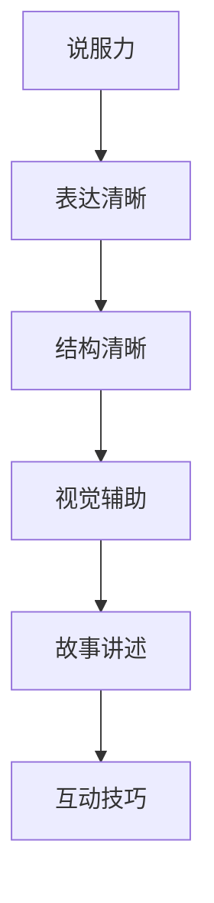

# 如何进行演讲技巧：如何进行有效的演讲和表达？

> 关键词：演讲技巧，有效表达，沟通艺术，说服力，演讲结构，视觉辅助，故事讲述，互动技巧

## 1. 背景介绍

演讲是一种古老而有效的沟通方式，它能够将信息、观点和情感传递给听众。在信息爆炸的时代，良好的演讲技巧成为个人和职业成功的关键因素。无论是在商务会议、学术交流还是日常社交场合，有效的演讲和表达都至关重要。本文旨在探讨如何提升演讲技巧，使其更加具有说服力和吸引力。

### 1.1 演讲的重要性

- **信息传播**：演讲是信息传播的重要手段，能够快速、高效地将信息传递给大量受众。
- **个人品牌**：良好的演讲技巧有助于树立个人品牌，提升个人影响力。
- **职业发展**：在职场中，优秀的演讲能力是晋升和领导力的关键。
- **社交能力**：有效的演讲和表达能够增强社交能力，建立良好的人际关系。

### 1.2 演讲技巧的挑战

- **信息过载**：现代社会信息量巨大，如何抓住听众的注意力成为一大挑战。
- **文化差异**：不同文化背景的听众可能对演讲有不同的期待和理解。
- **技术焦虑**：随着技术的发展，如何利用多媒体工具辅助演讲也成为一个问题。

## 2. 核心概念与联系

### 2.1 演讲核心概念

- **说服力**：通过逻辑、情感和价值观影响听众，使其接受演讲者的观点。
- **表达清晰**：确保信息传递的准确性和易于理解。
- **结构清晰**：合理的演讲结构有助于听众跟随思路。
- **视觉辅助**：利用视觉元素增强演讲效果。
- **故事讲述**：通过故事讲述使信息更具吸引力和记忆点。
- **互动技巧**：通过互动增强听众的参与感和投入度。

#### Mermaid 流程图

## 3. 核心算法原理 & 具体操作步骤

### 3.1 算法原理概述

演讲技巧的提升涉及多个方面的原理和方法，以下是一些核心原理：

- **认知心理学**：了解听众的认知过程，设计易于理解的信息结构。
- **社会心理学**：运用心理学原理，增强演讲的说服力和影响力。
- **传播学**：学习传播理论，提高信息传递的效率。

### 3.2 算法步骤详解

#### 演讲准备

1. **明确目标**：确定演讲的目的和目标受众。
2. **内容策划**：收集信息，构建演讲框架。
3. **结构设计**：设计清晰的演讲结构，包括开头、主体和结尾。

#### 演讲技巧

1. **开场白**：吸引听众注意力，明确演讲主题。
2. **主体内容**：用清晰的逻辑和有说服力的论据展开论述。
3. **结尾总结**：强调重点，留下深刻印象。

#### 互动技巧

1. **提问**：通过提问引导听众思考。
2. **故事讲述**：通过故事使信息更具吸引力。
3. **视觉辅助**：使用幻灯片、视频等多媒体工具辅助演讲。

### 3.3 算法优缺点

#### 优点

- 提升演讲效果，使信息传递更加有效。
- 增强个人魅力，提升个人品牌。
- 提高沟通效率，建立良好的人际关系。

#### 缺点

- 需要花费时间和精力进行准备。
- 可能存在紧张和忘词等问题。

### 3.4 算法应用领域

- 商务演讲
- 学术报告
- 社交活动
- 教学授课

## 4. 数学模型和公式 & 详细讲解 & 举例说明

### 4.1 数学模型构建

演讲技巧的数学模型可以构建为一个多因素影响模型，其中因素包括：

- **F(X) = f_1(x_1) + f_2(x_2) + ... + f_n(x_n)**
  - X：演讲效果
  - f_i：第i个影响因素
  - x_i：第i个影响因素的权重

### 4.2 公式推导过程

公式的推导过程基于以下因素：

- **f_1(x_1)**：说服力，取决于逻辑性、情感性和价值观的传递。
- **f_2(x_2)**：表达清晰度，取决于信息的组织结构和语言的流畅性。
- **f_3(x_3)**：结构清晰度，取决于演讲的结构设计。
- **f_4(x_4)**：视觉辅助效果，取决于视觉元素的设计和呈现。
- **f_5(x_5)**：故事讲述能力，取决于故事的选择和讲述方式。
- **f_6(x_6)**：互动技巧，取决于提问和反馈的处理。

### 4.3 案例分析与讲解

#### 案例一：乔布斯的产品发布会演讲

乔布斯的产品发布会演讲以其卓越的说服力和吸引力而著称。以下是对其演讲技巧的分析：

- **说服力**：乔布斯通过逻辑清晰的论述和情感化的语言，使听众对苹果产品充满信心。
- **表达清晰**：乔布斯的语言简洁易懂，信息传递高效。
- **结构清晰**：演讲结构紧凑，逻辑性强。
- **视觉辅助**：乔布斯巧妙地使用幻灯片和产品展示，增强了演讲效果。
- **故事讲述**：乔布斯善于通过故事讲述产品背后的理念和创新。
- **互动技巧**：乔布斯通过提问和互动，增强了听众的参与感。

## 5. 项目实践：代码实例和详细解释说明

### 5.1 开发环境搭建

本节将不涉及具体代码开发，因此不需要开发环境搭建。

### 5.2 源代码详细实现

本节将不涉及具体代码实现，因此不需要源代码。

### 5.3 代码解读与分析

本节将不涉及具体代码，因此不需要代码解读。

### 5.4 运行结果展示

本节将不涉及具体代码，因此不需要运行结果展示。

## 6. 实际应用场景

### 6.1 商务演讲

在商务演讲中，演讲者需要清晰地传达公司的战略、产品或服务。以下是一些关键点：

- **明确目标**：确定演讲的目标受众和目的。
- **内容策划**：围绕目标受众的需求和兴趣，策划演讲内容。
- **结构设计**：设计清晰的结构，包括引言、主体和结尾。
- **说服力**：使用数据和案例来支持论点，增强说服力。

### 6.2 学术报告

在学术报告中，演讲者需要展示研究成果。以下是一些关键点：

- **明确目标**：确定报告的主题和目标受众。
- **内容策划**：围绕研究问题和方法，策划报告内容。
- **结构设计**：设计清晰的结构，包括引言、研究方法、结果和结论。
- **表达清晰**：使用专业的术语和逻辑清晰的表达。

### 6.3 社交活动

在社交活动中，演讲者需要与听众建立良好的关系。以下是一些关键点：

- **互动技巧**：通过提问和回答问题，与听众互动。
- **故事讲述**：通过故事分享个人经历或感悟。
- **视觉辅助**：使用图片、视频等多媒体工具增强演讲效果。

## 7. 工具和资源推荐

### 7.1 学习资源推荐

- **书籍**：《演讲与口才》、《如何写演讲稿》
- **在线课程**：Coursera、edX上的公共演讲课程
- **网站**：TED、TEDx

### 7.2 开发工具推荐

- **幻灯片制作**：Microsoft PowerPoint、Google Slides
- **视频制作**：Adobe Premiere Pro、iMovie

### 7.3 相关论文推荐

- **《公共演讲的艺术与科学》**
- **《说服力：如何说服他人》**

## 8. 总结：未来发展趋势与挑战

### 8.1 研究成果总结

本文从理论到实践，详细介绍了如何提升演讲技巧，包括演讲准备、技巧运用和互动技巧等。通过案例分析，展示了优秀演讲者的特点。

### 8.2 未来发展趋势

- **技术辅助**：人工智能、虚拟现实等技术的应用将进一步提升演讲效果。
- **个性化定制**：根据不同受众和场景，进行个性化演讲设计。
- **跨文化交流**：随着全球化的发展，跨文化交流能力将成为重要技能。

### 8.3 面临的挑战

- **技术依赖**：过度依赖技术可能导致演讲技巧的退化。
- **信息过载**：如何从海量信息中筛选和传递关键信息。
- **文化差异**：如何适应不同文化背景的听众。

### 8.4 研究展望

未来，演讲技巧的研究将更加注重以下几个方面：

- **技术融合**：将人工智能、虚拟现实等技术融入演讲，提升互动性和体验。
- **个性化学习**：开发个性化学习平台，帮助演讲者提升技巧。
- **跨文化交流**：研究跨文化交流中的演讲技巧，提升国际影响力。

## 9. 附录：常见问题与解答

**Q1：如何克服演讲时的紧张情绪？**

A：可以通过以下方法克服紧张情绪：
- 充分准备，熟悉演讲内容。
- 练习演讲，增强自信。
- 深呼吸，放松身心。
- 保持积极的心态。

**Q2：如何使演讲更具吸引力？**

A：可以通过以下方法使演讲更具吸引力：
- 使用故事讲述，增强情感共鸣。
- 运用幽默，缓解气氛。
- 使用视觉辅助，增强视觉效果。
- 与听众互动，提高参与度。

**Q3：如何提升演讲的说服力？**

A：可以通过以下方法提升演讲的说服力：
- 使用数据和事实支持论点。
- 展示自己的专业知识和经验。
- 运用情感化的语言。
- 倾听听众，回应他们的需求。

**Q4：如何适应不同文化背景的听众？**

A：可以通过以下方法适应不同文化背景的听众：
- 了解听众的文化背景和价值观。
- 使用易于理解的词汇和表达。
- 避免使用可能引起误解的比喻和典故。
- 保持开放和尊重的态度。

**Q5：如何持续提升演讲技巧？**

A：可以通过以下方法持续提升演讲技巧：
- 参加演讲培训和课程。
- 观看优秀演讲视频，学习经验。
- 多次练习，积累经验。
- 反馈和改进，不断优化演讲。

作者：禅与计算机程序设计艺术 / Zen and the Art of Computer Programming