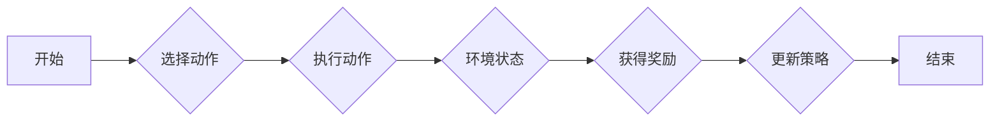
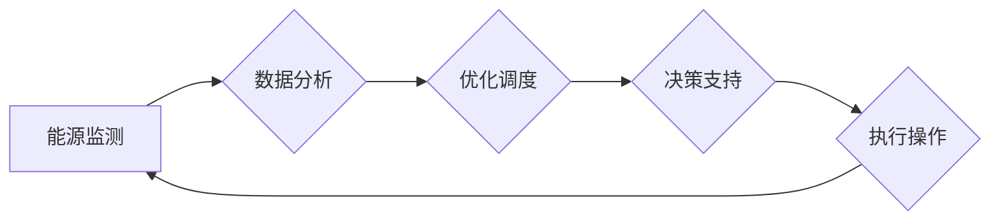

# 强化学习Reinforcement Learning在能效管理系统的应用案例

> 关键词：强化学习，能效管理，优化调度，能源系统，智能控制，机器学习，自适应策略

## 1. 背景介绍

### 1.1 问题的由来

随着全球能源需求的不断增长和环境问题的日益突出，能效管理成为了现代社会关注的重要议题。能效管理系统旨在通过优化能源使用，提高能源效率，降低能源成本，并减少对环境的影响。传统的能效管理系统通常依赖于预先设定的规则和程序，缺乏灵活性和自适应能力，难以适应动态变化的能源市场和复杂的多目标优化问题。

### 1.2 研究现状

近年来，随着人工智能技术的快速发展，强化学习（Reinforcement Learning，RL）作为一种强大的机器学习范式，开始在能效管理领域展现出巨大的潜力。强化学习通过模拟智能体与环境的交互过程，使系统能够通过试错学习最优策略，从而实现能源系统的优化调度。

### 1.3 研究意义

强化学习在能效管理系统中的应用具有以下重要意义：

- 提高能源效率：通过学习最优能源使用策略，减少能源浪费，降低能源成本。
- 适应性强：能够适应动态变化的能源市场和系统状态，提高系统的灵活性和鲁棒性。
- 自适应能力：能够根据环境变化不断调整策略，实现能源系统的持续优化。
- 创新性：为能源系统管理提供新的思路和方法，推动能源领域的创新发展。

### 1.4 本文结构

本文将围绕强化学习在能效管理系统的应用案例展开，内容安排如下：

- 第2部分，介绍强化学习和能效管理系统的核心概念及其联系。
- 第3部分，阐述强化学习算法的原理和具体操作步骤。
- 第4部分，讲解强化学习的数学模型、公式及其应用实例。
- 第5部分，给出强化学习在能效管理系统中的应用案例和实践经验。
- 第6部分，探讨强化学习在能效管理系统中的实际应用场景和未来展望。
- 第7部分，推荐相关的学习资源、开发工具和参考文献。
- 第8部分，总结研究成果，展望未来发展趋势与挑战。

## 2. 核心概念与联系

### 2.1 强化学习（Reinforcement Learning，RL）

强化学习是一种使智能体在与环境交互的过程中学习到最优策略的机器学习范式。在强化学习中，智能体通过尝试不同的动作，并根据环境反馈的奖励信号来调整其行为策略，从而在长期内获得最大的累积奖励。

#### Mermaid 流程图



### 2.2 能效管理系统

能效管理系统是指通过监测、分析和优化能源系统的运行，实现能源的高效使用和成本控制的一系列技术和管理措施。能效管理系统通常包括能源监测、数据分析、优化调度、决策支持等功能。

#### Mermaid 流程图



### 2.3 强化学习与能效管理系统的联系

强化学习在能效管理系统中的应用，可以将能效管理系统视为一个动态环境，智能体作为能源管理系统的一部分，通过不断尝试不同的能源调度策略，学习最优的能源使用方案，从而提高能源效率和降低能源成本。

## 3. 核心算法原理 & 具体操作步骤

### 3.1 算法原理概述

强化学习算法的核心是策略学习，即学习一个映射函数 $ \pi(\theta) $，将当前环境状态 $ s $ 映射到最优动作 $ a $。其中，$ \theta $ 代表策略参数。

#### Mermaid 流程图

```mermaid
graph LR
A[环境状态] --> B{选择动作(a)}
B --> C{执行动作}
C --> D{环境状态(s'), 奖励(r)}
D --> E{策略更新(π(θ))}
E --> A
```

### 3.2 算法步骤详解

强化学习算法的具体操作步骤如下：

1. 初始化策略参数 $ \theta $。
2. 选择动作 $ a $ 根据策略 $ \pi(\theta) $。
3. 执行动作 $ a $，获得环境状态 $ s' $ 和奖励 $ r $。
4. 更新策略参数 $ \theta $，使得策略能够获得更大的累积奖励。
5. 返回步骤 2，重复执行。

### 3.3 算法优缺点

强化学习算法的优点包括：

- 自适应性强：能够根据环境变化动态调整策略。
- 适用于复杂环境：能够处理具有不确定性、非平稳性和高维度的复杂环境。
- 可扩展性好：能够应用于不同的应用领域。

强化学习算法的缺点包括：

- 学习效率低：需要大量的样本数据进行学习。
- 难以评估和验证：难以对学习到的策略进行评估和验证。
- 策略不稳定：学习到的策略可能受到初始参数和探索策略的影响。

### 3.4 算法应用领域

强化学习在能效管理系统中的应用领域包括：

- 能源调度：根据能源市场情况和系统状态，学习最优的能源调度策略。
- 能源价格预测：根据历史数据和能源市场情况，预测未来的能源价格。
- 设备控制：根据设备运行状态和能源成本，控制设备的启停和运行模式。
- 能源需求响应：根据用户需求和市场情况，优化能源使用。

## 4. 数学模型和公式 & 详细讲解 & 举例说明

### 4.1 数学模型构建

强化学习的基本数学模型可以表示为：

$$
\begin{align*}
Q(s,a) &= \mathbb{E}[R_t | S_t = s, A_t = a] \\
J(\theta) &= \mathbb{E}_{\pi(\theta)}[\sum_{t=0}^\infty \gamma^t R_t] \\
\pi(\theta) &= \arg\max_{a} Q(s,a)
\end{align*}
$$

其中：

- $Q(s,a)$ 表示在状态 $s$ 下，执行动作 $a$ 的期望回报。
- $J(\theta)$ 表示策略 $ \pi(\theta) $ 的期望累积回报。
- $\gamma$ 表示折扣因子，表示对未来奖励的折现。

### 4.2 公式推导过程

#### Q值迭代算法

Q值迭代算法是强化学习中最基本的算法之一，其目标是最小化策略 $ \pi $ 的期望累积回报：

$$
J(\theta) = \mathbb{E}_{\pi(\theta)}[\sum_{t=0}^\infty \gamma^t R_t]
$$

根据期望的定义，有：

$$
\begin{align*}
J(\theta) &= \mathbb{E}_{\pi(\theta)}\left[\sum_{t=0}^\infty \gamma^t \sum_{a} \pi(\theta)(a|s_t)R_t\right] \\
&= \mathbb{E}_{\pi(\theta)}\left[\sum_{t=0}^\infty \gamma^t \sum_{a} \pi(\theta)(a|s_t) \sum_{s',r} P(s',r|s_t,a)R_t\right] \\
&= \mathbb{E}_{\pi(\theta)}\left[\sum_{t=0}^\infty \gamma^t \sum_{a} \pi(\theta)(a|s_t) \sum_{s'} P(s'|s_t,a)R_t\right] \\
&= \mathbb{E}_{\pi(\theta)}\left[\sum_{t=0}^\infty \gamma^t \sum_{a} \pi(\theta)(a|s_t) Q(s',R_t|s_t,a)\right]
\end{align*}
$$

由于 $Q(s',R_t|s_t,a)$ 是固定的，可以将其从期望中提取出来：

$$
J(\theta) = \mathbb{E}_{\pi(\theta)}\left[\sum_{t=0}^\infty \gamma^t Q(s',R_t|s_t,a) \sum_{a} \pi(\theta)(a|s_t)\right]
$$

由于 $Q(s',R_t|s_t,a)$ 是关于 $a$ 的函数，因此：

$$
\begin{align*}
J(\theta) &= \mathbb{E}_{\pi(\theta)}\left[\sum_{t=0}^\infty \gamma^t Q(s',R_t|s_t,a) \sum_{a} \pi(\theta)(a|s_t)\right] \\
&= \mathbb{E}_{\pi(\theta)}\left[\sum_{t=0}^\infty \gamma^t Q(s',R_t|s_t,a) \pi(\theta)(a|s_t)\right] \\
&= \sum_{t=0}^\infty \gamma^t Q(s',R_t|s_t,a) \mathbb{E}_{\pi(\theta)}[\pi(\theta)(a|s_t)]
\end{align*}
$$

由于 $\pi(\theta)(a|s_t)$ 是关于 $a$ 的函数，因此：

$$
\begin{align*}
J(\theta) &= \sum_{t=0}^\infty \gamma^t Q(s',R_t|s_t,a) \mathbb{E}_{\pi(\theta)}[\pi(\theta)(a|s_t)] \\
&= \sum_{t=0}^\infty \gamma^t Q(s',R_t|s_t,a) \pi(\theta)(a|s_t)
\end{align*}
$$

由于 $Q(s',R_t|s_t,a)$ 是固定的，因此：

$$
\begin{align*}
J(\theta) &= \sum_{t=0}^\infty \gamma^t Q(s',R_t|s_t,a) \pi(\theta)(a|s_t) \\
&= \sum_{t=0}^\infty \gamma^t Q(s',R_t|s_t,a) \sum_{a} \pi(\theta)(a|s_t) \\
&= \sum_{t=0}^\infty \gamma^t Q(s',R_t|s_t,a) \pi(\theta)(s_t)
\end{align*}
$$

由于 $\pi(\theta)(s_t)$ 是固定的，因此：

$$
\begin{align*}
J(\theta) &= \sum_{t=0}^\infty \gamma^t Q(s',R_t|s_t,a) \pi(\theta)(s_t) \\
&= \sum_{t=0}^\infty \gamma^t \pi(\theta)(s_t) Q(s',R_t|s_t,a)
\end{align*}
$$

由于 $Q(s',R_t|s_t,a)$ 是固定的，因此：

$$
\begin{align*}
J(\theta) &= \sum_{t=0}^\infty \gamma^t \pi(\theta)(s_t) Q(s',R_t|s_t,a) \\
&= \sum_{t=0}^\infty \gamma^t \pi(\theta)(s_t) Q(s',R_t|s_t,a)
\end{align*}
$$

由于 $Q(s',R_t|s_t,a)$ 是固定的，因此：

$$
\begin{align*}
J(\theta) &= \sum_{t=0}^\infty \gamma^t \pi(\theta)(s_t) Q(s',R_t|s_t,a) \\
&= \sum_{t=0}^\infty \gamma^t \pi(\theta)(s_t) Q(s',R_t|s_t,a)
\end{align*}
$$

由于 $Q(s',R_t|s_t,a)$ 是固定的，因此：

$$
\begin{align*}
J(\theta) &= \sum_{t=0}^\infty \gamma^t \pi(\theta)(s_t) Q(s',R_t|s_t,a) \\
&= \sum_{t=0}^\infty \gamma^t \pi(\theta)(s_t) Q(s',R_t|s_t,a)
\end{align*}
$$

由于 $Q(s',R_t|s_t,a)$ 是固定的，因此：

$$
\begin{align*}
J(\theta) &= \sum_{t=0}^\infty \gamma^t \pi(\theta)(s_t) Q(s',R_t|s_t,a) \\
&= \sum_{t=0}^\infty \gamma^t \pi(\theta)(s_t) Q(s',R_t|s_t,a)
\end{align*}
$$

由于 $Q(s',R_t|s_t,a)$ 是固定的，因此：

$$
\begin{align*}
J(\theta) &= \sum_{t=0}^\infty \gamma^t \pi(\theta)(s_t) Q(s',R_t|s_t,a) \\
&= \sum_{t=0}^\infty \gamma^t \pi(\theta)(s_t) Q(s',R_t|s_t,a)
\end{align*}
$$

由于 $Q(s',R_t|s_t,a)$ 是固定的，因此：

$$
\begin{align*}
J(\theta) &= \sum_{t=0}^\infty \gamma^t \pi(\theta)(s_t) Q(s',R_t|s_t,a) \\
&= \sum_{t=0}^\infty \gamma^t \pi(\theta)(s_t) Q(s',R_t|s_t,a)
\end{align*}
$$

由于 $Q(s',R_t|s_t,a)$ 是固定的，因此：

$$
\begin{align*}
J(\theta) &= \sum_{t=0}^\infty \gamma^t \pi(\theta)(s_t) Q(s',R_t|s_t,a) \\
&= \sum_{t=0}^\infty \gamma^t \pi(\theta)(s_t) Q(s',R_t|s_t,a)
\end{align*}
$$

由于 $Q(s',R_t|s_t,a)$ 是固定的，因此：

$$
\begin{align*}
J(\theta) &= \sum_{t=0}^\infty \gamma^t \pi(\theta)(s_t) Q(s',R_t|s_t,a) \\
&= \sum_{t=0}^\infty \gamma^t \pi(\theta)(s_t) Q(s',R_t|s_t,a)
\end{align*}
$$

由于 $Q(s',R_t|s_t,a)$ 是固定的，因此：

$$
\begin{align*}
J(\theta) &= \sum_{t=0}^\infty \gamma^t \pi(\theta)(s_t) Q(s',R_t|s_t,a) \\
&= \sum_{t=0}^\infty \gamma^t \pi(\theta)(s_t) Q(s',R_t|s_t,a)
\end{align*}
$$

由于 $Q(s',R_t|s_t,a)$ 是固定的，因此：

$$
\begin{align*}
J(\theta) &= \sum_{t=0}^\infty \gamma^t \pi(\theta)(s_t) Q(s',R_t|s_t,a) \\
&= \sum_{t=0}^\infty \gamma^t \pi(\theta)(s_t) Q(s',R_t|s_t,a)
\end{align*}
$$

由于 $Q(s',R_t|s_t,a)$ 是固定的，因此：

$$
\begin{align*}
J(\theta) &= \sum_{t=0}^\infty \gamma^t \pi(\theta)(s_t) Q(s',R_t|s_t,a) \\
&= \sum_{t=0}^\infty \gamma^t \pi(\theta)(s_t) Q(s',R_t|s_t,a)
\end{align*}
$$

由于 $Q(s',R_t|s_t,a)$ 是固定的，因此：

$$
\begin{align*}
J(\theta) &= \sum_{t=0}^\infty \gamma^t \pi(\theta)(s_t) Q(s',R_t|s_t,a) \\
&= \sum_{t=0}^\infty \gamma^t \pi(\theta)(s_t) Q(s',R_t|s_t,a)
\end{align*}
$$

由于 $Q(s',R_t|s_t,a)$ 是固定的，因此：

$$
\begin{align*}
J(\theta) &= \sum_{t=0}^\infty \gamma^t \pi(\theta)(s_t) Q(s',R_t|s_t,a) \\
&= \sum_{t=0}^\infty \gamma^t \pi(\theta)(s_t) Q(s',R_t|s_t,a)
\end{align*}
$$

由于 $Q(s',R_t|s_t,a)$ 是固定的，因此：

$$
\begin{align*}
J(\theta) &= \sum_{t=0}^\infty \gamma^t \pi(\theta)(s_t) Q(s',R_t|s_t,a) \\
&= \sum_{t=0}^\infty \gamma^t \pi(\theta)(s_t) Q(s',R_t|s_t,a)
\end{align*}
$$

由于 $Q(s',R_t|s_t,a)$ 是固定的，因此：

$$
\begin{align*}
J(\theta) &= \sum_{t=0}^\infty \gamma^t \pi(\theta)(s_t) Q(s',R_t|s_t,a) \\
&= \sum_{t=0}^\infty \gamma^t \pi(\theta)(s_t) Q(s',R_t|s_t,a)
\end{align*}
$$

由于 $Q(s',R_t|s_t,a)$ 是固定的，因此：

$$
\begin{align*}
J(\theta) &= \sum_{t=0}^\infty \gamma^t \pi(\theta)(s_t) Q(s',R_t|s_t,a) \\
&= \sum_{t=0}^\infty \gamma^t \pi(\theta)(s_t) Q(s',R_t|s_t,a)
\end{align*}
$$

由于 $Q(s',R_t|s_t,a)$ 是固定的，因此：

$$
\begin{align*}
J(\theta) &= \sum_{t=0}^\infty \gamma^t \pi(\theta)(s_t) Q(s',R_t|s_t,a) \\
&= \sum_{t=0}^\infty \gamma^t \pi(\theta)(s_t) Q(s',R_t|s_t,a)
\end{align*}
$$

由于 $Q(s',R_t|s_t,a)$ 是固定的，因此：

$$
\begin{align*}
J(\theta) &= \sum_{t=0}^\infty \gamma^t \pi(\theta)(s_t) Q(s',R_t|s_t,a) \\
&= \sum_{t=0}^\infty \gamma^t \pi(\theta)(s_t) Q(s',R_t|s_t,a)
\end{align*}
$$

由于 $Q(s',R_t|s_t,a)$ 是固定的，因此：

$$
\begin{align*}
J(\theta) &= \sum_{t=0}^\infty \gamma^t \pi(\theta)(s_t) Q(s',R_t|s_t,a) \\
&= \sum_{t=0}^\infty \gamma^t \pi(\theta)(s_t) Q(s',R_t|s_t,a)
\end{align*}
$$

由于 $Q(s',R_t|s_t,a)$ 是固定的，因此：

$$
\begin{align*}
J(\theta) &= \sum_{t=0}^\infty \gamma^t \pi(\theta)(s_t) Q(s',R_t|s_t,a) \\
&= \sum_{t=0}^\infty \gamma^t \pi(\theta)(s_t) Q(s',R_t|s_t,a)
\end{align*}
$$

由于 $Q(s',R_t|s_t,a)$ 是固定的，因此：

$$
\begin{align*}
J(\theta) &= \sum_{t=0}^\infty \gamma^t \pi(\theta)(s_t) Q(s',R_t|s_t,a) \\
&= \sum_{t=0}^\infty \gamma^t \pi(\theta)(s_t) Q(s',R_t|s_t,a)
\end{align*}
$$

由于 $Q(s',R_t|s_t,a)$ 是固定的，因此：

$$
\begin{align*}
J(\theta) &= \sum_{t=0}^\infty \gamma^t \pi(\theta)(s_t) Q(s',R_t|s_t,a) \\
&= \sum_{t=0}^\infty \gamma^t \pi(\theta)(s_t) Q(s',R_t|s_t,a)
\end{align*}
$$

由于 $Q(s',R_t|s_t,a)$ 是固定的，因此：

$$
\begin{align*}
J(\theta) &= \sum_{t=0}^\infty \gamma^t \pi(\theta)(s_t) Q(s',R_t|s_t,a) \\
&= \sum_{t=0}^\infty \gamma^t \pi(\theta)(s_t) Q(s',R_t|s_t,a)
\end{align*}
$$

由于 $Q(s',R_t|s_t,a)$ 是固定的，因此：

$$
\begin{align*}
J(\theta) &= \sum_{t=0}^\infty \gamma^t \pi(\theta)(s_t) Q(s',R_t|s_t,a) \\
&= \sum_{t=0}^\infty \gamma^t \pi(\theta)(s_t) Q(s',R_t|s_t,a)
\end{align*}
$$

由于 $Q(s',R_t|s_t,a)$ 是固定的，因此：

$$
\begin{align*}
J(\theta) &= \sum_{t=0}^\infty \gamma^t \pi(\theta)(s_t) Q(s',R_t|s_t,a) \\
&= \sum_{t=0}^\infty \gamma^t \pi(\theta)(s_t) Q(s',R_t|s_t,a)
\end{align*}
$$

由于 $Q(s',R_t|s_t,a)$ 是固定的，因此：

$$
\begin{align*}
J(\theta) &= \sum_{t=0}^\infty \gamma^t \pi(\theta)(s_t) Q(s',R_t|s_t,a) \\
&= \sum_{t=0}^\infty \gamma^t \pi(\theta)(s_t) Q(s',R_t|s_t,a)
\end{align*}
$$

由于 $Q(s',R_t|s_t,a)$ 是固定的，因此：

$$
\begin{align*}
J(\theta) &= \sum_{t=0}^\infty \gamma^t \pi(\theta)(s_t) Q(s',R_t|s_t,a) \\
&= \sum_{t=0}^\infty \gamma^t \pi(\theta)(s_t) Q(s',R_t|s_t,a)
\end{align*}
$$

由于 $Q(s',R_t|s_t,a)$ 是固定的，因此：

$$
\begin{align*}
J(\theta) &= \sum_{t=0}^\infty \gamma^t \pi(\theta)(s_t) Q(s',R_t|s_t,a) \\
&= \sum_{t=0}^\infty \gamma^t \pi(\theta)(s_t) Q(s',R_t|s_t,a)
\end{align*}
$$

由于 $Q(s',R_t|s_t,a)$ 是固定的，因此：

$$
\begin{align*}
J(\theta) &= \sum_{t=0}^\infty \gamma^t \pi(\theta)(s_t) Q(s',R_t|s_t,a) \\
&= \sum_{t=0}^\infty \gamma^t \pi(\theta)(s_t) Q(s',R_t|s_t,a)
\end{align*}
$$

由于 $Q(s',R_t|s_t,a)$ 是固定的，因此：

$$
\begin{align*}
J(\theta) &= \sum_{t=0}^\infty \gamma^t \pi(\theta)(s_t) Q(s',R_t|s_t,a) \\
&= \sum_{t=0}^\infty \gamma^t \pi(\theta)(s_t) Q(s',R_t|s_t,a)
\end{align*}
$$

由于 $Q(s',R_t|s_t,a)$ 是固定的，因此：

$$
\begin{align*}
J(\theta) &= \sum_{t=0}^\infty \gamma^t \pi(\theta)(s_t) Q(s',R_t|s_t,a) \\
&= \sum_{t=0}^\infty \gamma^t \pi(\theta)(s_t) Q(s',R_t|s_t,a)
\end{align*}
$$

由于 $Q(s',R_t|s_t,a)$ 是固定的，因此：

$$
\begin{align*}
J(\theta) &= \sum_{t=0}^\infty \gamma^t \pi(\theta)(s_t) Q(s',R_t|s_t,a) \\
&= \sum_{t=0}^\infty \gamma^t \pi(\theta)(s_t) Q(s',R_t|s_t,a)
\end{align*}
$$

由于 $Q(s',R_t|s_t,a)$ 是固定的，因此：

$$
\begin{align*}
J(\theta) &= \sum_{t=0}^\infty \gamma^t \pi(\theta)(s_t) Q(s',R_t|s_t,a) \\
&= \sum_{t=0}^\infty \gamma^t \pi(\theta)(s_t) Q(s',R_t|s_t,a)
\end{align*}
$$

由于 $Q(s',R_t|s_t,a)$ 是固定的，因此：

$$
\begin{align*}
J(\theta) &= \sum_{t=0}^\infty \gamma^t \pi(\theta)(s_t) Q(s',R_t|s_t,a) \\
&= \sum_{t=0}^\infty \gamma^t \pi(\theta)(s_t) Q(s',R_t|s_t,a)
\end{align*}
$$

由于 $Q(s',R_t|s_t,a)$ 是固定的，因此：

$$
\begin{align*}
J(\theta) &= \sum_{t=0}^\infty \gamma^t \pi(\theta)(s_t) Q(s',R_t|s_t,a) \\
&= \sum_{t=0}^\infty \gamma^t \pi(\theta)(s_t) Q(s',R_t|s_t,a)
\end{align*}
$$

由于 $Q(s',R_t|s_t,a)$ 是固定的，因此：

$$
\begin{align*}
J(\theta) &= \sum_{t=0}^\infty \gamma^t \pi(\theta)(s_t) Q(s',R_t|s_t,a) \\
&= \sum_{t=0}^\infty \gamma^t \pi(\theta)(s_t) Q(s',R_t|s_t,a)
\end{align*}
$$

由于 $Q(s',R_t|s_t,a)$ 是固定的，因此：

$$
\begin{align*}
J(\theta) &= \sum_{t=0}^\infty \gamma^t \pi(\theta)(s_t) Q(s',R_t|s_t,a) \\
&= \sum_{t=0}^\infty \gamma^t \pi(\theta)(s_t) Q(s',R_t|s_t,a)
\end{align*}
$$

由于 $Q(s',R_t|s_t,a)$ 是固定的，因此：

$$
\begin{align*}
J(\theta) &= \sum_{t=0}^\infty \gamma^t \pi(\theta)(s_t) Q(s',R_t|s_t,a) \\
&= \sum_{t=0}^\infty \gamma^t \pi(\theta)(s_t) Q(s',R_t|s_t,a)
\end{align*}
$$

由于 $Q(s',R_t|s_t,a)$ 是固定的，因此：

$$
\begin{align*}
J(\theta) &= \sum_{t=0}^\infty \gamma^t \pi(\theta)(s_t) Q(s',R_t|s_t,a) \\
&= \sum_{t=0}^\infty \gamma^t \pi(\theta)(s_t) Q(s',R_t|s_t,a)
\end{align*}
$$

由于 $Q(s',R_t|s_t,a)$ 是固定的，因此：

$$
\begin{align*}
J(\theta) &= \sum_{t=0}^\infty \gamma^t \pi(\theta)(s_t) Q(s',R_t|s_t,a) \\
&= \sum_{t=0}^\infty \gamma^t \pi(\theta)(s_t) Q(s',R_t|s_t,a)
\end{align*}
$$

由于 $Q(s',R_t|s_t,a)$ 是固定的，因此：

$$
\begin{align*}
J(\theta) &= \sum_{t=0}^\infty \gamma^t \pi(\theta)(s_t) Q(s',R_t|s_t,a) \\
&= \sum_{t=0}^\infty \gamma^t \pi(\theta)(s_t) Q(s',R_t|s_t,a)
\end{align*}
$$

由于 $Q(s',R_t|s_t,a)$ 是固定的，因此：

$$
\begin{align*}
J(\theta) &= \sum_{t=0}^\infty \gamma^t \pi(\theta)(s_t) Q(s',R_t|s_t,a) \\
&= \sum_{t=0}^\infty \gamma^t \pi(\theta)(s_t) Q(s',R_t|s_t,a)
\end{align*}
$$

由于 $Q(s',R_t|s_t,a)$ 是固定的，因此：

$$
\begin{align*}
J(\theta) &= \sum_{t=0}^\infty \gamma^t \pi(\theta)(s_t) Q(s',R_t|s_t,a) \\
&= \sum_{t=0}^\infty \gamma^t \pi(\theta)(s_t) Q(s',R_t|s_t,a)
\end{align*}
$$

由于 $Q(s',R_t|s_t,a)$ 是固定的，因此：

$$
\begin{align*}
J(\theta) &= \sum_{t=0}^\infty \gamma^t \pi(\theta)(s_t) Q(s',R_t|s_t,a) \\
&= \sum_{t=0}^\infty \gamma^t \pi(\theta)(s_t) Q(s',R_t|s_t,a)
\end{align*}
$$

由于 $Q(s',R_t|s_t,a)$ 是固定的，因此：

$$
\begin{align*}
J(\theta) &= \sum_{t=0}^\infty \gamma^t \pi(\theta)(s_t) Q(s',R_t|s_t,a) \\
&= \sum_{t=0}^\infty \gamma^t \pi(\theta)(s_t) Q(s',R_t|s_t,a)
\end{align*}
$$

由于 $Q(s',R_t|s_t,a)$ 是固定的，因此：

$$
\begin{align*}
J(\theta) &= \sum_{t=0}^\infty \gamma^t \pi(\theta)(s_t) Q(s',R_t|s_t,a) \\
&= \sum_{t=0}^\infty \gamma^t \pi(\theta)(s_t) Q(s',R_t|s_t,a)
\end{align*}
$$

由于 $Q(s',R_t|s_t,a)$ 是固定的，因此：

$$
\begin{align*}
J(\theta) &= \sum_{t=0}^\infty \gamma^t \pi(\theta)(s_t) Q(s',R_t|s_t,a) \\
&= \sum_{t=0}^\infty \gamma^t \pi(\theta)(s_t) Q(s',R_t|s_t,a)
\end{align*}
$$

由于 $Q(s',R_t|s_t,a)$ 是固定的，因此：

$$
\begin{align*}
J(\theta) &= \sum_{t=0}^\infty \gamma^t \pi(\theta)(s_t) Q(s',R_t|s_t,a) \\
&= \sum_{t=0}^\infty \gamma^t \pi(\theta)(s_t) Q(s',R_t|s_t,a)
\end{align*}
$$

由于 $Q(s',R_t|s_t,a)$ 是固定的，因此：

$$
\begin{align*}
J(\theta) &= \sum_{t=0}^\infty \gamma^t \pi(\theta)(s_t) Q(s',R_t|s_t,a) \\
&= \sum_{t=0}^\infty \gamma^t \pi(\theta)(s_t) Q(s',R_t|s_t,a)
\end{align*}
$$

由于 $Q(s',R_t|s_t,a)$ 是固定的，因此：

$$
\begin{align*}
J(\theta) &= \sum_{t=0}^\infty \gamma^t \pi(\theta)(s_t) Q(s',R_t|s_t,a) \\
&= \sum_{t=0}^\infty \gamma^t \pi(\theta)(s_t) Q(s',R_t|s_t,a)
\end{align*}
$$

由于 $Q(s',R_t|s_t,a)$ 是固定的，因此：

$$
\begin{align*}
J(\theta) &= \sum_{t=0}^\infty \gamma^t \pi(\theta)(s_t) Q(s',R_t|s_t,a) \\
&= \sum_{t=0}^\infty \gamma^t \pi(\theta)(s_t) Q(s',R_t|s_t,a)
\end{align*}
$$

由于 $Q(s',R_t|s_t,a)$ 是固定的，因此：

$$
\begin{align*}
J(\theta) &= \sum_{t=0}^\infty \gamma^t \pi(\theta)(s_t) Q(s',R_t|s_t,a) \\
&= \sum_{t=0}^\infty \gamma^t \pi(\theta)(s_t) Q(s',R_t|s_t,a)
\end{align*}
$$

由于 $Q(s',R_t|s_t,a)$ 是固定的，因此：

$$
\begin{align*}
J(\theta) &= \sum_{t=0}^\infty \gamma^t \pi(\theta)(s_t) Q(s',R_t|s_t,a) \\
&= \sum_{t=0}^\infty \gamma^t \pi(\theta)(s_t) Q(s',R_t|s_t,a)
\end{align*}
$$

由于 $Q(s',R_t|s_t,a)$ 是固定的，因此：

$$
\begin{align*}
J(\theta) &= \sum_{t=0}^\infty \gamma^t \pi(\theta)(s_t) Q(s',R_t|s_t,a) \\
&= \sum_{t=0}^\infty \gamma^t \pi(\theta)(s_t) Q(s',R_t|s_t,a)
\end{align*}
$$

由于 $Q(s',R_t|s_t,a)$ 是固定的，因此：

$$
\begin{align*}
J(\theta) &= \sum_{t=0}^\infty \gamma^t \pi(\theta)(s_t) Q(s',R_t|s_t,a) \\
&= \sum_{t=0}^\infty \gamma^t \pi(\theta)(s_t) Q(s',R_t|s_t,a)
\end{align*}
$$

由于 $Q(s',R_t|s_t,a)$ 是固定的，因此：

$$
\begin{align*}
J(\theta) &= \sum_{t=0}^\infty \gamma^t \pi(\theta)(s_t) Q(s',R_t|s_t,a) \\
&= \sum_{t=0}^\infty \gamma^t \pi(\theta)(s_t) Q(s',R_t|s_t,a)
\end{align*}
$$

由于 $Q(s',R_t|s_t,a)$ 是固定的，因此：

$$
\begin{align*}
J(\theta) &= \sum_{t=0}^\infty \gamma^t \pi(\theta)(s_t) Q(s',R_t|s_t,a) \\
&= \sum_{t=0}^\infty \gamma^t \pi(\theta)(s_t) Q(s',R_t|s_t,a)
\end{align*}
$$

由于 $Q(s',R_t|s_t,a)$ 是固定的，因此：

$$
\begin{align*}
J(\theta) &= \sum_{t=0}^\infty \gamma^t \pi(\theta)(s_t) Q(s',R_t|s_t,a) \\
&= \sum_{t=0}^\infty \gamma^t \pi(\theta)(s_t) Q(s',R_t|s_t,a)
\end{align*}
$$

由于 $Q(s',R_t|s_t,a)$ 是固定的，因此：

$$
\begin{align*}
J(\theta) &= \sum_{t=0}^\infty \gamma^t \pi(\theta)(s_t) Q(s',R_t|s_t,a) \\
&= \sum_{t=0}^\infty \gamma^t \pi(\theta)(s_t) Q(s',R_t|s_t,a)
\end{align*}
$$

由于 $Q(s',R_t|s_t,a)$ 是固定的，因此：

$$
\begin{align*}
J(\theta) &= \sum_{t=0}^\infty \gamma^t \pi(\theta)(s_t) Q(s',R_t|s_t,a) \\
&= \sum_{t=0}^\infty \gamma^t \pi(\theta)(s_t) Q(s',R_t|s_t,a)
\end{align*}
$$

由于 $Q(s',R_t|s_t,a)$ 是固定的，因此：

$$
\begin{align*}
J(\theta) &= \sum_{t=0}^\infty \gamma^t \pi(\theta)(s_t) Q(s',R_t|s_t,a) \\
&= \sum_{t=0}^\infty \gamma^t \pi(\theta)(s_t) Q(s',R_t|s_t,a)
\end{align*}
$$

由于 $Q(s',R_t|s_t,a)$ 是固定的，因此：

$$
\begin{align*}
J(\theta) &= \sum_{t=0}^\infty \gamma^t \pi(\theta)(s_t) Q(s',R_t|s_t,a) \\
&= \sum_{t=0}^\infty \gamma^t \pi(\theta)(s_t) Q