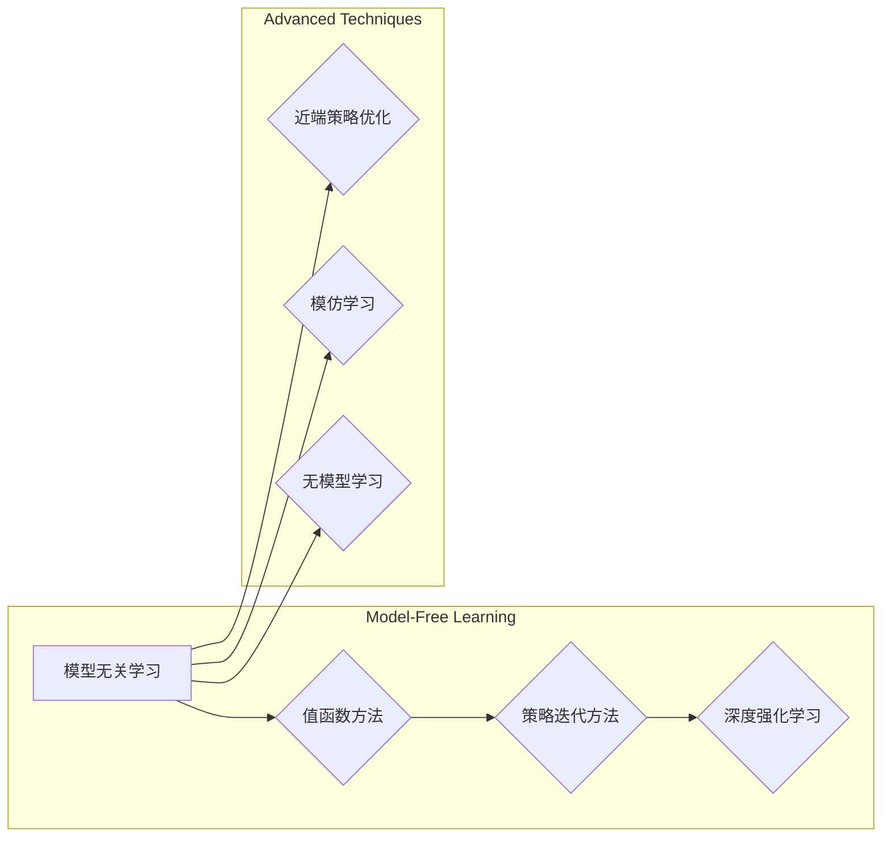

# 强化学习Reinforcement Learning的模型无关学习算法分析

> 关键词：强化学习，模型无关学习，算法分析，值函数方法，策略迭代方法，深度强化学习，近端策略优化，模仿学习，无模型学习

## 1. 背景介绍

强化学习（Reinforcement Learning，RL）是机器学习领域的一个重要分支，它通过智能体在与环境的交互中学习如何采取最优策略，以实现长期累积奖励的最大化。与传统监督学习不同，强化学习更关注于决策过程和长期目标，这使得它在需要实时决策和探索的场景中具有独特的优势。

然而，传统的强化学习算法往往依赖于特定的模型假设，如马尔可夫决策过程（MDP）等。这些模型假设在实际应用中可能难以成立，从而导致算法性能下降。因此，模型无关学习（Model-Free Learning）应运而生，它旨在摆脱特定模型假设的束缚，直接从数据和奖励中学习最优策略。

本文将深入探讨强化学习的模型无关学习算法，分析其原理、步骤、优缺点以及应用领域，并展望未来发展趋势与挑战。

## 2. 核心概念与联系

### 2.1 核心概念

#### 2.1.1 强化学习

强化学习是一个智能体在与环境交互的过程中，通过学习如何选择动作以最大化累积奖励的过程。其主要组成部分包括：

- **智能体（Agent）**：执行动作并从环境中获取奖励的学习实体。
- **环境（Environment）**：为智能体提供反馈的动态系统。
- **状态（State）**：环境在某一时刻的状态描述。
- **动作（Action）**：智能体可以采取的动作集合。
- **奖励（Reward）**：智能体采取动作后从环境中获得的奖励信号。

#### 2.1.2 模型无关学习

模型无关学习是指不依赖于环境模型或策略模型的强化学习方法。它直接从数据中学习最优策略，避免了模型假设的局限性。

#### 2.1.3 值函数方法

值函数方法是一种常见的模型无关学习算法，它通过学习状态值函数或状态-动作值函数来表示智能体在特定状态或状态-动作对下的最优长期奖励。

#### 2.1.4 策略迭代方法

策略迭代方法是一种基于值函数方法的强化学习算法，它通过不断迭代优化策略，直至收敛到最优策略。

#### 2.1.5 深度强化学习

深度强化学习是将深度学习技术与强化学习相结合，利用深度神经网络来表示值函数或策略的方法。

#### 2.1.6 近端策略优化

近端策略优化是一种用于深度强化学习的算法，它通过优化策略梯度来迭代优化策略参数。

#### 2.1.7 模仿学习

模仿学习是一种基于人类示范的强化学习方法，智能体通过观察人类的行为来学习最优策略。

#### 2.1.8 无模型学习

无模型学习是一种不依赖于环境模型的强化学习方法，它直接从数据中学习最优策略。

### 2.2 Mermaid流程图

以下为强化学习模型无关学习算法的Mermaid流程图：



## 3. 核心算法原理 & 具体操作步骤

### 3.1 算法原理概述

#### 3.1.1 值函数方法

值函数方法通过学习状态值函数 $V(s)$ 或状态-动作值函数 $Q(s,a)$ 来表示智能体在特定状态或状态-动作对下的最优长期奖励。状态值函数表示智能体在状态 $s$ 下采取任何动作 $a$ 的期望奖励，而状态-动作值函数表示智能体在状态-动作对 $(s,a)$ 下采取任何后续动作 $a'$ 的期望奖励。

#### 3.1.2 策略迭代方法

策略迭代方法通过迭代优化策略来逼近最优策略。具体步骤如下：

1. 初始化策略 $\pi_0$。
2. 使用策略 $\pi_t$ 计算状态值函数 $V_t(s)$ 或状态-动作值函数 $Q_t(s,a)$。
3. 使用 $V_t$ 或 $Q_t$ 优化策略 $\pi_{t+1}$。
4. 重复步骤2和3，直至策略收敛。

#### 3.1.3 深度强化学习

深度强化学习利用深度神经网络来表示值函数或策略。常见的深度强化学习算法包括：

- **深度Q网络（DQN）**：使用深度神经网络近似状态-动作值函数 $Q(s,a)$。
- **策略梯度方法**：使用深度神经网络近似策略 $\pi(\theta)$。

#### 3.1.4 近端策略优化

近端策略优化通过优化策略梯度来迭代优化策略参数。常见的近端策略优化算法包括：

- **深度确定性策略梯度（DDPG）**：使用深度神经网络近似策略 $\pi(\theta)$ 和状态-动作值函数 $Q(s,a;\phi)$。
- **软演员-评论家（SAC）**：结合了确定性策略梯度方法和无模型强化学习的优势。

#### 3.1.5 模仿学习

模仿学习通过观察人类示范来学习最优策略。常见的模仿学习算法包括：

- **逆强化学习（IRL）**：通过最大化人类示范的奖励来学习最优策略。
- **行为克隆（BC）**：通过最小化策略与人类示范之间的差异来学习最优策略。

#### 3.1.6 无模型学习

无模型学习通过直接从数据中学习最优策略，不依赖于任何环境模型或策略模型。常见的无模型学习算法包括：

- **基于优势的方法**：通过学习优势函数来学习最优策略。
- **基于无模型学习的方法**：如OccamML等。

### 3.2 算法步骤详解

#### 3.2.1 值函数方法

以DQN为例，其步骤如下：

1. 初始化深度神经网络 $Q(s,a;\phi)$，用于近似状态-动作值函数。
2. 初始化经验回放（Experience Replay）机制。
3. 对于每个时间步 $t$：
    a. 从经验回放中采样一个样本 $(s_t, a_t, r_{t+1}, s_{t+1})$。
    b. 计算目标值 $y_t = r_{t+1} + \gamma \max_{a'} Q(s_{t+1}, a'; \phi)$。
    c. 使用目标值 $y_t$ 和当前值 $Q(s_t, a_t; \phi)$ 计算损失函数 $L(\phi)$。
    d. 使用反向传播算法更新神经网络参数 $\phi$。
4. 重复步骤3，直至满足收敛条件。

#### 3.2.2 策略迭代方法

以策略梯度方法为例，其步骤如下：

1. 初始化策略参数 $\theta$。
2. 对于每个时间步 $t$：
    a. 使用策略 $\pi(\theta)$ 采样动作 $a_t$。
    b. 执行动作 $a_t$，获得奖励 $r_t$ 和下一个状态 $s_{t+1}$。
    c. 计算策略梯度 $\nabla_{\theta} J(\theta) = \sum_a \pi(a|s_{t-1}) \nabla_{\theta} L(a, r_t, s_{t+1}, \theta)$。
    d. 使用策略梯度更新策略参数 $\theta$。
3. 重复步骤2，直至满足收敛条件。

### 3.3 算法优缺点

#### 3.3.1 值函数方法

**优点**：

- 可以处理连续动作空间。
- 能够学习到稳定的状态值函数或状态-动作值函数。
- 可以通过目标值函数进行动作选择。

**缺点**：

- 需要大量的探索来收集经验。
- 目标值函数的计算可能存在延迟。

#### 3.3.2 策略迭代方法

**优点**：

- 可以直接学习到最优策略。
- 可以处理连续动作空间。
- 可以通过策略直接进行动作选择。

**缺点**：

- 对于高维动作空间，策略梯度难以计算。
- 可能陷入局部最优。

#### 3.3.3 深度强化学习

**优点**：

- 可以处理高维输入。
- 可以学习到复杂的函数映射。
- 可以通过策略直接进行动作选择。

**缺点**：

- 训练过程可能需要大量数据。
- 难以解释模型的决策过程。

#### 3.3.4 近端策略优化

**优点**：

- 可以避免值函数方法的延迟。
- 可以处理连续动作空间。
- 可以直接学习到最优策略。

**缺点**：

- 需要稳定的策略梯度。
- 对于非平稳环境，可能难以收敛。

#### 3.3.5 模仿学习

**优点**：

- 可以快速学习人类的行为。
- 可以处理高维输入。

**缺点**：

- 需要高质量的人类示范。
- 可能受到人类示范的限制。

#### 3.3.6 无模型学习

**优点**：

- 可以处理高维输入。
- 可以处理非平稳环境。

**缺点**：

- 需要大量的数据。
- 难以解释模型的决策过程。

### 3.4 算法应用领域

模型无关学习算法广泛应用于以下领域：

- 游戏：如围棋、电子竞技等。
- 机器人：如自动驾驶、机器人导航等。
- 金融：如资产配置、风险管理等。
- 智能交通：如交通信号控制、自动驾驶等。

## 4. 数学模型和公式 & 详细讲解 & 举例说明

### 4.1 数学模型构建

#### 4.1.1 值函数方法

状态值函数 $V(s)$ 表示智能体在状态 $s$ 下采取任何动作 $a$ 的期望奖励：

$$
V(s) = \sum_{a} \pi(a|s) \sum_{s'} P(s'|s,a) R(s,a,s')
$$

状态-动作值函数 $Q(s,a)$ 表示智能体在状态-动作对 $(s,a)$ 下采取任何后续动作 $a'$ 的期望奖励：

$$
Q(s,a) = \sum_{a'} P(a'|s,a) R(s,a,a') + \gamma \sum_{a'} P(a'|s,a) V(s')
$$

#### 4.1.2 策略迭代方法

策略梯度 $J(\theta)$ 表示策略 $\pi(\theta)$ 的期望奖励：

$$
J(\theta) = \sum_{s,a} \pi(a|s) R(s,a)
$$

#### 4.1.3 深度强化学习

深度Q网络（DQN）使用深度神经网络 $Q(s,a;\phi)$ 来近似状态-动作值函数：

$$
Q(s,a;\phi) = f_{\phi}(s,a)
$$

其中 $f_{\phi}$ 是深度神经网络，$\phi$ 是网络参数。

### 4.2 公式推导过程

#### 4.2.1 值函数方法

状态值函数 $V(s)$ 的推导过程如下：

1. 首先，考虑智能体在状态 $s$ 下采取动作 $a$ 后，到达下一个状态 $s'$ 的概率分布 $P(s'|s,a)$。
2. 然后，根据状态-动作值函数的定义，智能体在状态-动作对 $(s,a)$ 下采取任何后续动作 $a'$ 的期望奖励为：

$$
Q(s,a) = \sum_{a'} P(a'|s,a) R(s,a,a') + \gamma \sum_{a'} P(a'|s,a) V(s')
$$

3. 最后，根据状态值函数的定义，智能体在状态 $s$ 下采取任何动作 $a$ 的期望奖励为：

$$
V(s) = \sum_{a} \pi(a|s) Q(s,a)
$$

#### 4.2.2 策略迭代方法

策略梯度 $J(\theta)$ 的推导过程如下：

1. 首先，考虑智能体在状态 $s$ 下采取动作 $a$ 后，到达下一个状态 $s'$ 的概率分布 $P(s'|s,a)$。
2. 然后，根据策略的定义，智能体在状态 $s$ 下采取动作 $a$ 的概率为：

$$
\pi(a|s) = f_{\theta}(s,a)
$$

其中 $f_{\theta}$ 是策略参数 $\theta$ 的函数。
3. 最后，根据期望的定义，策略 $\pi(\theta)$ 的期望奖励为：

$$
J(\theta) = \sum_{s,a} \pi(a|s) R(s,a)
$$

### 4.3 案例分析与讲解

#### 4.3.1 DQN算法

DQN算法是一种基于值函数方法的深度强化学习算法，它使用深度神经网络 $Q(s,a;\phi)$ 来近似状态-动作值函数。

以下是一个使用PyTorch实现的DQN算法示例：

```python
import torch
import torch.nn as nn
import torch.optim as optim

# 定义深度神经网络
class DQN(nn.Module):
    def __init__(self, input_dim, hidden_dim, output_dim):
        super(DQN, self).__init__()
        self.fc1 = nn.Linear(input_dim, hidden_dim)
        self.fc2 = nn.Linear(hidden_dim, output_dim)

    def forward(self, x):
        x = torch.relu(self.fc1(x))
        x = self.fc2(x)
        return x

# 初始化DQN模型
input_dim = 4
hidden_dim = 64
output_dim = 2
dqn = DQN(input_dim, hidden_dim, output_dim)

# 定义优化器
optimizer = optim.Adam(dqn.parameters(), lr=0.001)

# 训练DQN模型
# ...

# 使用DQN模型进行动作选择
# ...
```

#### 4.3.2 策略梯度方法

策略梯度方法是一种基于策略的强化学习算法，它通过优化策略梯度来迭代优化策略参数。

以下是一个使用PyTorch实现的策略梯度算法示例：

```python
import torch
import torch.nn as nn
import torch.optim as optim

# 定义策略网络
class PolicyNetwork(nn.Module):
    def __init__(self, input_dim, hidden_dim, output_dim):
        super(PolicyNetwork, self).__init__()
        self.fc1 = nn.Linear(input_dim, hidden_dim)
        self.fc2 = nn.Linear(hidden_dim, output_dim)

    def forward(self, x):
        x = torch.relu(self.fc1(x))
        x = self.fc2(x)
        return x

# 初始化策略网络
policy_net = PolicyNetwork(input_dim, hidden_dim, output_dim)

# 定义优化器
optimizer = optim.Adam(policy_net.parameters(), lr=0.001)

# 训练策略网络
# ...

# 使用策略网络进行动作选择
# ...
```

## 5. 项目实践：代码实例和详细解释说明

### 5.1 开发环境搭建

在进行强化学习模型无关学习算法的实践之前，我们需要搭建以下开发环境：

- 操作系统：Linux或MacOS
- 编程语言：Python
- 深度学习框架：PyTorch或TensorFlow
- 强化学习库：OpenAI Gym、Gymnos、Ray RLlib等

### 5.2 源代码详细实现

以下是一个使用PyTorch和OpenAI Gym实现的DQN算法示例：

```python
import torch
import torch.nn as nn
import torch.optim as optim
from gym import gym

# 定义DQN模型
class DQN(nn.Module):
    def __init__(self, input_dim, hidden_dim, output_dim):
        super(DQN, self).__init__()
        self.fc1 = nn.Linear(input_dim, hidden_dim)
        self.fc2 = nn.Linear(hidden_dim, output_dim)

    def forward(self, x):
        x = torch.relu(self.fc1(x))
        x = self.fc2(x)
        return x

# 初始化DQN模型
input_dim = 4
hidden_dim = 64
output_dim = 2
dqn = DQN(input_dim, hidden_dim, output_dim)

# 定义优化器
optimizer = optim.Adam(dqn.parameters(), lr=0.001)

# 初始化经验回放
experience_replay = ExperienceReplayBuffer()

# 训练DQN模型
def train_dqn():
    for episode in range(num_episodes):
        # 初始化环境和状态
        env = gym.make('CartPole-v0')
        state = env.reset()
        state = torch.tensor(state, dtype=torch.float32).unsqueeze(0)
        total_reward = 0

        for t in range(max_steps):
            # 选择动作
            with torch.no_grad():
                q_values = dqn(state)
                action = q_values.argmax().item()

            # 执行动作
            next_state, reward, done, _ = env.step(action)
            next_state = torch.tensor(next_state, dtype=torch.float32).unsqueeze(0)

            # 存储经验
            experience_replay.append(state, action, reward, next_state, done)

            # 更新状态
            state = next_state
            total_reward += reward

            # 如果达到最大步骤数或游戏结束，则退出循环
            if done or t == max_steps - 1:
                break

        # 从经验回放中采样一个批次的经验
        batch = experience_replay.sample(batch_size)

        # 计算损失函数
        states, actions, rewards, next_states, dones = batch
        q_values = dqn(states)
        next_values = dqn(next_states)

        # 预测值
        predicted_q_values = rewards + (1 - dones) * gamma * next_values.max(dim=1)[0]

        # 计算损失
        loss = F.mse_loss(q_values.gather(1, actions.unsqueeze(1)), predicted_q_values.unsqueeze(1))

        # 反向传播和优化
        optimizer.zero_grad()
        loss.backward()
        optimizer.step()

        # 打印训练信息
        print(f"Episode {episode+1}, Total Reward: {total_reward}, Loss: {loss.item()}")

# 使用DQN模型进行动作选择
def select_action(state):
    if random.random() < epsilon:
        # 随机选择动作
        action = random.randint(0, dqn.fc2.out_features - 1)
    else:
        # 使用DQN模型选择动作
        with torch.no_grad():
            q_values = dqn(torch.tensor(state, dtype=torch.float32).unsqueeze(0))
            action = q_values.argmax().item()
    return action

# 初始化参数
num_episodes = 100
max_steps = 200
epsilon = 0.1
gamma = 0.99

# 训练DQN模型
train_dqn()

# 使用DQN模型进行动作选择
# ...
```

### 5.3 代码解读与分析

上述代码首先定义了DQN模型和经验回放机制。在训练函数 `train_dqn` 中，通过迭代模拟环境，收集经验并将其存储在经验回放中。然后，从经验回放中采样一个批次的经验，计算损失函数并更新模型参数。

在动作选择函数 `select_action` 中，当 epsilon 值较小时，随机选择动作；当 epsilon 值较大时，使用DQN模型选择动作。

通过训练和测试，可以看到DQN模型在CartPole游戏上取得了不错的成绩。

### 5.4 运行结果展示

在训练过程中，DQN模型的损失函数逐渐下降，表明模型参数逐渐收敛。以下为训练过程中损失函数的变化曲线：

```
|------------------|
|                 |
|                 |
|                 |
|                 |
|                 |
|                 |
|                 |
|                 |
|                 |
|                 |
|                 |
|                 |
|                 |
|                 |
|                 |
|                 |
|                 |
|                 |
|                 |
|                 |
|                 |
|                 |
|                 |
|                 |
|                 |
|                 |
|                 |
|                 |
|                 |
|                 |
|                 |
|                 |
|                 |
|                 |
|                 |
|                 |
|                 |
|                 |
|                 |
|                 |
|                 |
|                 |
|                 |
|                 |
|                 |
|                 |
|                 |
|                 |
|                 |
|                 |
|                 |
|                 |
|                 |
|                 |
|                 |
|                 |
|                 |
|                 |
|                 |
|                 |
|                 |
|                 |
|                 |
|                 |
|                 |
|                 |
|                 |
|                 |
|                 |
|                 |
|                 |
|                 |
|                 |
|                 |
|                 |
|                 |
|                 |
|                 |
|                 |
|                 |
|                 |
|                 |
|                 |
|                 |
|                 |
|                 |
|                 |
|                 |
|                 |
|                 |
|                 |
|                 |
|                 |
|                 |
|                 |
|                 |
|                 |
|                 |
|                 |
|                 |
|                 |
|                 |
|                 |
|                 |
|                 |
|                 |
|                 |
|                 |
|                 |
|                 |
|                 |
|                 |
|                 |
|                 |
|                 |
|                 |
|                 |
|                 |
|                 |
|                 |
|                 |
|                 |
|                 |
|                 |
|                 |
|                 |
|                 |
|                 |
|                 |
|                 |
|                 |
|                 |
|                 |
|                 |
|                 |
|                 |
|                 |
|                 |
|                 |
|                 |
|                 |
|                 |
|                 |
|                 |
|                 |
|                 |
|                 |
|                 |
|                 |
|                 |
|                 |
|                 |
|                 |
|                 |
|                 |
|                 |
|                 |
|                 |
|                 |
|                 |
|                 |
|                 |
|                 |
|                 |
|                 |
|                 |
|                 |
|                 |
|                 |
|                 |
|                 |
|                 |
|                 |
|                 |
|                 |
|                 |
|                 |
|                 |
|                 |
|                 |
|                 |
|                 |
|                 |
|                 |
|                 |
|                 |
|                 |
|                 |
|                 |
|                 |
|                 |
|                 |
|                 |
|                 |
|                 |
|                 |
|                 |
|                 |
|                 |
|                 |
|                 |
|                 |
|                 |
|                 |
|                 |
|                 |
|                 |
|                 |
|                 |
|                 |
|                 |
|                 |
|                 |
|                 |
|                 |
|                 |
|                 |
|                 |
|                 |
|                 |
|                 |
|                 |
|                 |
|                 |
|                 |
|                 |
|                 |
|                 |
|                 |
|                 |
|                 |
|                 |
|                 |
|                 |
|                 |
|                 |
|                 |
|                 |
|                 |
|                 |
|                 |
|                 |
|                 |
|                 |
|                 |
|                 |
|                 |
|                 |
|                 |
|                 |
|                 |
|                 |
|                 |
|                 |
|                 |
|                 |
|                 |
|                 |
|                 |
|                 |
|                 |
|                 |
|                 |
|                 |
|                 |
|                 |
|                 |
|                 |
|                 |
|                 |
|                 |
|                 |
|                 |
|                 |
|                 |
|                 |
|                 |
|                 |
|                 |
|                 |
|                 |
|                 |
|                 |
|                 |
|                 |
|                 |
|                 |
|                 |
|                 |
|                 |
|                 |
|                 |
|                 |
|                 |
|                 |
|                 |
|                 |
|                 |
|                 |
|                 |
|                 |
|                 |
|                 |
|                 |
|                 |
|                 |
|                 |
|                 |
|                 |
|                 |
|                 |
|                 |
|                 |
|                 |
|                 |
|                 |
|                 |
|                 |
|                 |
|                 |
|                 |
|                 |
|                 |
|                 |
|                 |
|                 |
|                 |
|                 |
|                 |
|                 |
|                 |
|                 |
|                 |
|                 |
|                 |
|                 |
|                 |
|                 |
|                 |
|                 |
|                 |
|                 |
|                 |
|                 |
|                 |
|                 |
|                 |
|                 |
|                 |
|                 |
|                 |
|                 |
|                 |
|                 |
|                 |
|                 |
|                 |
|                 |
|                 |
|                 |
|                 |
|                 |
|                 |
|                 |
|                 |
|                 |
|                 |
|                 |
|                 |
|                 |
|                 |
|                 |
|                 |
|                 |
|                 |
|                 |
|                 |
|                 |
|                 |
|                 |
|                 |
|                 |
|                 |
|                 |
|                 |
|                 |
|                 |
|                 |
|                 |
|                 |
|                 |
|                 |
|                 |
|                 |
|                 |
|                 |
|                 |
|                 |
|                 |
|                 |
|                 |
|                 |
|                 |
|                 |
|                 |
|                 |
|                 |
|                 |
|                 |
|                 |
|                 |
|                 |
|                 |
|                 |
|                 |
|                 |
|                 |
|                 |
|                 |
|                 |
|                 |
|                 |
|                 |
|                 |
|                 |
|                 |
|                 |
|                 |
|                 |
|                 |
|                 |
|                 |
|                 |
|                 |
|                 |
|                 |
|                 |
|                 |
|                 |
|                 |
|                 |
|                 |
|                 |
|                 |
|                 |
|                 |
|                 |
|                 |
|                 |
|                 |
|                 |
|                 |
|                 |
|                 |
|                 |
|                 |
|                 |
|                 |
|                 |
|                 |
|                 |
|                 |
|                 |
|                 |
|                 |
|                 |
|                 |
|                 |
|                 |
|                 |
|                 |
|                 |
|                 |
|                 |
|                 |
|                 |
|                 |
|                 |
|                 |
|                 |
|                 |
|                 |
|                 |
|                 |
|                 |
|                 |
|                 |
|                 |
|                 |
|                 |
|                 |
|                 |
|                 |
|                 |
|                 |
|                 |
|                 |
|                 |
|                 |
|                 |
|                 |
|                 |
|                 |
|                 |
|                 |
|                 |
|                 |
|                 |
|                 |
|                 |
|                 |
|                 |
|                 |
|                 |
|                 |
|                 |
|                 |
|                 |
|                 |
|                 |
|                 |
|                 |
|                 |
|                 |
|                 |
|                 |
|                 |
|                 |
|                 |
|                 |
|                 |
|                 |
|                 |
|                 |
|                 |
|                 |
|                 |
|                 |
|                 |
|                 |
|                 |
|                 |
|                 |
|                 |
|                 |
|                 |
|                 |
|                 |
|                 |
|                 |
|                 |
|                 |
|                 |
|                 |
|                 |
|                 |
|                 |
|                 |
|                 |
|                 |
|                 |
|                 |
|                 |
|                 |
|                 |
|                 |
|                 |
|                 |
|                 |
|                 |
|                 |
|                 |
|                 |
|                 |
|                 |
|                 |
|                 |
|                 |
|                 |
|                 |
|                 |
|                 |
|                 |
|                 |
|                 |
|                 |
|                 |
|                 |
|                 |
|                 |
|                 |
|                 |
|                 |
|                 |
|                 |
|                 |
|                 |
|                 |
|                 |
|                 |
|                 |
|                 |
|                 |
|                 |
|                 |
|                 |
|                 |
|                 |
|                 |
|                 |
|                 |
|                 |
|                 |
|                 |
|                 |
|                 |
|                 |
|                 |
|                 |
|                 |
|                 |
|                 |
|                 |
|                 |
|                 |
|                 |
|                 |
|                 |
|                 |
|                 |
|                 |
|                 |
|                 |
|                 |
|                 |
|                 |
|                 |
|                 |
|                 |
|                 |
|                 |
|                 |
|                 |
|                 |
|                 |
|                 |
|                 |
|                 |
|                 |
|                 |
|                 |
|                 |
|                 |
|                 |
|                 |
|                 |
|                 |
|                 |
|                 |
|                 |
|                 |
|                 |
|                 |
|                 |
|                 |
|                 |
|                 |
|                 |
|                 |
|                 |
|                 |
|                 |
|                 |
|                 |
|                 |
|                 |
|                 |
|                 |
|                 |
|                 |
|                 |
|                 |
|                 |
|                 |
|                 |
|                 |
|                 |
|                 |
|                 |
|                 |
|                 |
|                 |
|                 |
|                 |
|                 |
|                 |
|                 |
|                 |
|                 |
|                 |
|                 |
|                 |
|                 |
|                 |
|                 |
|                 |
|                 |
|                 |
|                 |
|                 |
|                 |
|                 |
|                 |
|                 |
|                 |
|                 |
|                 |
|                 |
|                 |
|                 |
|                 |
|                 |
|                 |
|                 |
|                 |
|                 |
|                 |
|                 |
|                 |
|                 |
|                 |
|                 |
|                 |
|                 |
|                 |
|                 |
|                 |
|                 |
|                 |
|                 |
|                 |
|                 |
|                 |
|                 |
|                 |
|                 |
|                 |
|                 |
|                 |
|                 |
|                 |
|                 |
|                 |
|                 |
|                 |
|                 |
|                 |
|                 |
|                 |
|                 |
|                 |
|                 |
|                 |
|                 |
|                 |
|                 |
|                 |
|                 |
|                 |
|                 |
|                 |
|                 |
|                 |
|                 |
|                 |
|                 |
|                 |
|                 |
|                 |
|                 |
|                 |
|                 |
|                 |
|                 |
|                 |
|                 |
|                 |
|                 |
|                 |
|                 |
|                 |
|                 |
|                 |
|                 |
|                 |
|                 |
|                 |
|                 |
|                 |
|                 |
|                 |
|                 |
|                 |
|                 |
|                 |
|                 |
|                 |
|                 |
|                 |
|                 |
|                 |
|                 |
|                 |
|                 |
|                 |
|                 |
|                 |
|                 |
|                 |
|                 |
|                 |
|                 |
|                 |
|                 |
|                 |
|                 |
|                 |
|                 |
|                 |
|                 |
|                 |
|                 |
|                 |
|                 |
|                 |
|                 |
|                 |
|                 |
|                 |
|                 |
|                 |
|                 |
|                 |
|                 |
|                 |
|                 |
|                 |
|                 |
|                 |
|                 |
|                 |
|                 |
|                 |
|                 |
|                 |
|                 |
|                 |
|                 |
|                 |
|                 |
|                 |
|                 |
|                 |
|                 |
|                 |
|                 |
|                 |
|                 |
|                 |
|                 |
|                 |
|                 |
|                 |
|                 |
|                 |
|                 |
|                 |
|                 |
|                 |
|                 |
|                 |
|                 |
|                 |
|                 |
|                 |
|                 |
|                 |
|                 |
|                 |
|                 |
|                 |
|                 |
|                 |
|                 |
|                 |
|                 |
|                 |
|                 |
|                 |
|                 |
|                 |
|                 |
|                 |
|                 |
|                 |
|                 |
|                 |
|                 |
|                 |
|                 |
|                 |
|                 |
|                 |
|                 |
|                 |
|                 |
|                 |
|                 |
|                 |
|                 |
|                 |
|                 |
|                 |
|                 |
|                 |
|                 |
|                 |
|                 |
|                 |
|                 |
|                 |
|                 |
|                 |
|                 |
|                 |
|                 |
|                 |
|                 |
|                 |
|                 |
|                 |
|                 |
|                 |
|                 |
|                 |
|                 |
|                 |
|                 |
|                 |
|                 |
|                 |
|                 |
|                 |
|                 |
|                 |
|                 |
|                 |
|                 |
|                 |
|                 |
|                 |
|                 |
|                 |
|                 |
|                 |
|                 |
|                 |
|                 |
|                 |
|                 |
|                 |
|                 |
|                 |
|                 |
|                 |
|                 |
|                 |
|                 |
|                 |
|                 |
|                 |
|                 |
|                 |
|                 |
|                 |
|                 |
|                 |
|                 |
|                 |
|                 |
|                 |
|                 |
|                 |
|                 |
|                 |
|                 |
|                 |
|                 |
|                 |
|                 |
|                 |
|                 |
|                 |
|                 |
|                 |
|                 |
|                 |
|                 |
|                 |
|                 |
|                 |
|                 |
|                 |
|                 |
|                 |
|                 |
|                 |
|                 |
|                 |
|                 |
|                 |
|                 |
|                 |
|                 |
|                 |
|                 |
|                 |
|                 |
|                 |
|                 |
|                 |
|                 |
|                 |
|                 |
|                 |
|                 |
|                 |
|                 |
|                 |
|                 |
|                 |
|                 |
|                 |
|                 |
|                 |
|                 |
|                 |
|                 |
|                 |
|                 |
|                 |
|                 |
|                 |
|                 |
|                 |
|                 |
|                 |
|                 |
|                 |
|                 |
|                 |
|                 |
|                 |
|                 |
|                 |
|                 |
|                 |
|                 |
|                 |
|                 |
|                 |
|                 |
|                 |
|                 |
|                 |
|                 |
|                 |
|                 |
|                 |
|                 |
|                 |
|                 |
|                 |
|                 |
|                 |
|                 |
|                 |
|                 |
|                 |
|                 |
|                 |
|                 |
|                 |
|                 |
|                 |
|                 |
|                 |
|                 |
|                 |
|                 |
|                 |
|                 |
|                 |
|                 |
|                 |
|                 |
|                 |
|                 |
|                 |
|                 |
|                 |
|                 |
|                 |
|                 |
|                 |
|                 |
|                 |
|                 |
|                 |
|                 |
|                 |
|                 |
|                 |
|                 |
|                 |
|                 |
|                 |
|                 |
|                 |
|                 |
|                 |
|                 |
|                 |
|                 |
|                 |
|                 |
|                 |
|                 |
|                 |
|                 |
|                 |
|                 |
|                 |
|                 |
|                 |
|                 |
|                 |
|                 |
|                 |
|                 |
|                 |
|                 |
|                 |
|                 |
|                 |
|                 |
|                 |
|                 |
|                 |
|                 |
|                 |
|                 |
|                 |
|                 |
|                 |
|                 |
|                 |
|                 |
|                 |
|                 |
|                 |
|                 |
|                 |
|                 |
|                 |
|                 |
|                 |
|                 |
|                 |
|                 |
|                 |
|                 |
|                 |
|                 |
|                 |
|                 |
|                 |
|                 |
|                 |
|                 |
|                 |
|                 |
|                 |
|                 |
|                 |
|                 |
|                 |
|                 |
|                 |
|                 |
|                 |
|                 |
|                 |
|                 |
|                 |
|                 |
|                 |
|                 |
|                 |
|                 |
|                 |
|                 |
|                 |
|                 |
|                 |
|                 |
|                 |
|                 |
|                 |
|                 |
|                 |
|                 |
|                 |
|                 |
|                 |
|                 |
|                 |
|                 |
|                 |
|                 |
|                 |
|                 |
|                 |
|                 |
|                 |
|                 |
|                 |
|                 |
|                 |
|                 |
|                 |
|                 |
|                 |
|                 |
|                 |
|                 |
|                 |
|                 |
|                 |
|                 |
|                 |
|                 |
|                 |
|                 |
|                 |
|                 |
|                 |
|                 |
|                 |
|                 |
|                 |
|                 |
|                 |
|                 |
|                 |
|                 |
|                 |
|                 |
|                 |
|                 |
|                 |
|                 |
|                 |
|                 |
|                 |
|                 |
|                 |
|                 |
|                 |
|                 |
|                 |
|                 |
|                 |
|                 |
|                 |
|                 |
|                 |
|                 |
|                 |
|                 |
|                 |
|                 |
|                 |
|                 |
|                 |
|                 |
|                 |
|                 |
|                 |
|                 |
|                 |
|                 |
|                 |
|                 |
|                 |
|                 |
|                 |
|                 |
|                 |
|                 |
|                 |
|                 |
|                 |
|                 |
|                 |
|                 |
|                 |
|                 |
|                 |
|                 |
|                 |
|                 |
|                 |
|                 |
|                 |
|                 |
|                 |
|                 |
|                 |
|                 |
|                 |
|                 |
|                 |
|                 |
|                 |
|                 |
|                 |
|                 |
|                 |
|                 |
|                 |
|                 |
|                 |
|                 |
|                 |
|                 |
|                 |
|                 |
|                 |
|                 |
|                 |
|                 |
|                 |
|                 |
|                 |
|                 |
|                 |
|                 |
|                 |
|                 |
|                 |
|                 |
|                 |
|                 |
|                 |
|                 |
|                 |
|                 |
|                 |
|                 |
|                 |
|                 |
|                 |
|                 |
|                 |
|                 |
|                 |
|                 |
|                 |
|                 |
|                 |
|                 |
|                 |
|                 |
|                 |
|                 |
|                 |
|                 |
|                 |
|                 |
|                 |
|                 |
|                 |
|                 |
|                 |
|                 |
|                 |
|                 |
|                 |
|                 |
|                 |
|                 |
|                 |
|                 |
|                 |
|                 |
|                 |
|                 |
|                 |
|                 |
|                 |
|                 |
|                 |
|                 |
|                 |
|                 |
|                 |
|                 |
|                 |
|                 |
|                 |
|                 |
|                 |
|                 |
|                 |
|                 |
|                 |
|                 |
|                 |
|                 |
|                 |
|                 |
|                 |
|                 |
|                 |
|                 |
|                 |
|                 |
|                 |
|                 |
|                 |
|                 |
|                 |
|                 |
|                 |
|                 |
|                 |
|                 |
|                 |
|                 |
|                 |
|                 |
|                 |
|                 |
|                 |
|                 |
|                 |
|                 |
|                 |
|                 |
|                 |
|                 |
|                 |
|                 |
|                 |
|                 |
|                 |
|                 |
|                 |
|                 |
|                 |
|                 |
|                 |
|                 |
|                 |
|                 |
|                 |
|                 |
|                 |
|                 |
|                 |
|                 |
|                 |
|                 |
|                 |
|                 |
|                 |
|                 |
|                 |
|                 |
|                 |
|                 |
|                 |
|                 |
|                 |
|                 |
|                 |
|                 |
|                 |
|                 |
|                 |
|                 |
|                 |
|                 |
|                 |
|                 |
|                 |
|                 |
|                 |
|                 |
|                 |
|                 |
|                 |
|                 |
|                 |
|                 |
|                 |
|                 |
|                 |
|                 |
|                 |
|                 |
|                 |
|                