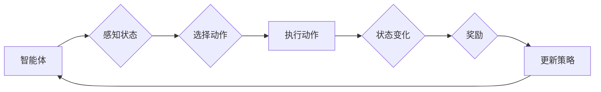

# 强化学习：基础概念解析

> 关键词：强化学习，马尔可夫决策过程，奖励函数，策略梯度，深度Q学习，值函数，策略优化，探索与利用，智能体，环境

## 1. 背景介绍

强化学习（Reinforcement Learning, RL）是机器学习的一个重要分支，旨在使智能体（Agent）在与环境（Environment）交互的过程中，通过不断学习如何做出最优决策，从而实现长期目标。与监督学习和无监督学习不同，强化学习不需要大量标注数据进行训练，而是通过与环境的交互来学习。近年来，随着深度学习技术的飞速发展，强化学习在游戏、机器人、自动驾驶、推荐系统等领域的应用日益广泛，成为人工智能领域的研究热点。

## 2. 核心概念与联系

### 2.1 强化学习系统组成

强化学习系统主要由以下三个核心组件构成：

- **智能体（Agent）**：强化学习系统中的主体，负责感知环境状态、选择动作、接收环境反馈，并不断调整策略以实现目标。
- **环境（Environment）**：智能体所在的世界，提供当前状态信息、执行动作后的新状态和奖励信号。
- **策略（Policy）**：智能体根据当前状态选择动作的规则，可以是确定性策略或随机策略。

Mermaid流程图如下：

### 2.2 马尔可夫决策过程

强化学习系统可以被视为一个马尔可夫决策过程（Markov Decision Process, MDP），其中每个状态都存在一个概率转移函数 $P(S_{t+1}|S_t, A_t)$，描述了在当前状态 $S_t$ 和动作 $A_t$ 下，智能体转移到下一个状态 $S_{t+1}$ 的概率。

### 2.3 奖励函数

奖励函数（Reward Function）是强化学习中的核心激励因素，它衡量智能体在执行动作后获得的即时奖励。奖励函数可以是离散的，也可以是连续的，通常用 $R(S_t, A_t)$ 表示。

### 2.4 探索与利用

在强化学习中，智能体需要在探索（Exploration）和利用（Exploitation）之间做出权衡。探索是指智能体在未知环境中尝试新的动作，以获取更多信息；利用是指智能体利用已知信息选择当前最优动作。

## 3. 核心算法原理 & 具体操作步骤

### 3.1 算法原理概述

强化学习算法的核心目标是学习一个最优策略，使得智能体在给定策略下能够获得最大化的长期奖励。常见的强化学习算法包括：

- **值函数方法**：通过学习值函数（Value Function）来评估每个状态的价值，并选择能够使值函数最大的动作。
- **策略梯度方法**：直接学习策略参数，使策略梯度最大化，从而获得最大化的长期奖励。
- **深度强化学习**：结合深度神经网络（DNN）和强化学习，实现端到端的智能体控制。

### 3.2 算法步骤详解

强化学习算法通常包含以下步骤：

1. 初始化智能体、环境和策略。
2. 智能体在环境中的某个状态 $S_t$ 下选择一个动作 $A_t$。
3. 环境根据动作 $A_t$ 生成新的状态 $S_{t+1}$ 和奖励 $R_t$。
4. 智能体根据新的状态 $S_{t+1}$ 更新策略，使长期奖励最大化。
5. 重复步骤2-4，直到达到终止条件。

### 3.3 算法优缺点

**值函数方法**：

优点：

- 学习速度快，收敛性好。
- 能够处理连续状态空间。

缺点：

- 学习复杂，需要解决维度的诅咒问题。
- 难以处理复杂环境。

**策略梯度方法**：

优点：

- 学习速度快，收敛性好。
- 能够直接优化策略参数。

缺点：

- 需要处理策略梯度估计问题。
- 容易陷入局部最优。

**深度强化学习**：

优点：

- 能够处理高维状态空间。
- 能够学习复杂的策略。

缺点：

- 训练过程需要大量计算资源。
- 模型可解释性差。

### 3.4 算法应用领域

强化学习在各个领域都有广泛的应用，以下是一些典型的应用场景：

- 游戏：如Atari游戏、围棋、电子竞技等。
- 机器人：如路径规划、抓取、人机协作等。
- 自动驾驶：如无人驾驶汽车、无人机等。
- 推荐系统：如商品推荐、电影推荐等。
- 金融：如股票交易、风险管理等。

## 4. 数学模型和公式 & 详细讲解 & 举例说明

### 4.1 数学模型构建

强化学习系统的数学模型可以表示为以下形式：

$$
\begin{aligned}
P(S_{t+1}|S_t, A_t) &= p(s_{t+1}|s_t, a_t) \\
R_t &= r(s_t, a_t) \\
Q(s_t, a_t) &= \mathbb{E}[R_{t+1} | s_t, a_t] \\
\pi(\alpha|s_t) &= \text{策略参数的分布}
\end{aligned}
$$

其中，$P(S_{t+1}|S_t, A_t)$ 表示在状态 $S_t$ 和动作 $A_t$ 下智能体转移到下一个状态 $S_{t+1}$ 的概率，$R_t$ 表示在状态 $S_t$ 和动作 $A_t$ 下智能体获得的奖励，$Q(s_t, a_t)$ 表示在状态 $S_t$ 和动作 $A_t$ 下智能体获得的最大期望回报，$\pi(\alpha|s_t)$ 表示在状态 $S_t$ 下智能体的策略参数分布。

### 4.2 公式推导过程

以下以Q学习算法为例，说明强化学习算法的公式推导过程。

Q学习算法的目标是学习一个值函数 $Q(s, a)$，使得 $Q(s, a)$ 能够近似表示智能体在状态 $s$ 和动作 $a$ 下获得的最大期望回报：

$$
Q(s, a) = \mathbb{E}[R_{t+1} | s, a]
$$

根据马尔可夫决策过程，有：

$$
R_{t+1} = R(s, a) + \gamma Q(s_{t+1}, \pi(\alpha|s_{t+1}))
$$

其中，$\gamma$ 表示折扣因子，$R(s, a)$ 表示在状态 $s$ 和动作 $a$ 下智能体获得的即时奖励。

将上述公式代入 $Q(s, a)$ 中，得：

$$
Q(s, a) = R(s, a) + \gamma \mathbb{E}[Q(s_{t+1}, \pi(\alpha|s_{t+1}))]
$$

由于智能体的策略 $\pi(\alpha|s_{t+1})$ 是未知的，因此需要使用最大化期望的方法来近似计算：

$$
Q(s, a) = R(s, a) + \gamma \max_{\alpha} \mathbb{E}[Q(s_{t+1}, \alpha)]
$$

根据最大化期望的定义，有：

$$
\mathbb{E}[Q(s_{t+1}, \alpha)] = \sum_{s_{t+1}} P(s_{t+1}|s_t, a) Q(s_{t+1}, \alpha)
$$

将上述公式代入 $Q(s, a)$ 中，得：

$$
Q(s, a) = R(s, a) + \gamma \sum_{s_{t+1}} P(s_{t+1}|s_t, a) Q(s_{t+1}, \alpha)
$$

根据贝叶斯定理，有：

$$
P(s_{t+1}|s_t, a) = \frac{P(s_{t+1} \cap s_t, a)}{P(s_t, a)}
$$

将上述公式代入 $Q(s, a)$ 中，得：

$$
Q(s, a) = R(s, a) + \gamma \sum_{s_{t+1}} \frac{P(s_{t+1} \cap s_t, a)}{P(s_t, a)} Q(s_{t+1}, \alpha)
$$

由于 $P(s_t, a)$ 是已知的，因此可以将它提取出来：

$$
Q(s, a) = \frac{R(s, a)}{P(s_t, a)} + \gamma \sum_{s_{t+1}} P(s_{t+1} \cap s_t, a) Q(s_{t+1}, \alpha)
$$

根据Q学习算法的更新规则，有：

$$
Q(s_{t+1}, \alpha) \leftarrow Q(s_{t+1}, \alpha) + \alpha [R_{t+1} + \gamma \max_{\alpha} Q(s_{t+1}, \alpha) - Q(s_{t+1}, \alpha)]
$$

将上述公式代入 $Q(s, a)$ 中，得：

$$
Q(s, a) = \frac{R(s, a)}{P(s_t, a)} + \gamma \sum_{s_{t+1}} P(s_{t+1} \cap s_t, a) Q(s_{t+1}, \alpha) + \gamma \alpha [R_{t+1} + \gamma \max_{\alpha} Q(s_{t+1}, \alpha) - Q(s_{t+1}, \alpha)]
$$

化简得：

$$
Q(s, a) = R(s, a) + \gamma \sum_{s_{t+1}} P(s_{t+1} \cap s_t, a) Q(s_{t+1}, \alpha) + \gamma \alpha R_{t+1} - \gamma \alpha Q(s_{t+1}, \alpha)
$$

整理得：

$$
Q(s, a) = R(s, a) + \gamma \sum_{s_{t+1}} P(s_{t+1} \cap s_t, a) Q(s_{t+1}, \alpha) + \gamma \alpha (R_{t+1} - Q(s_{t+1}, \alpha))
$$

根据Q学习算法的更新规则，有：

$$
Q(s, a) \leftarrow Q(s, a) + \alpha [R_{t+1} + \gamma \max_{\alpha} Q(s_{t+1}, \alpha) - Q(s_{t+1}, \alpha)]
$$

将上述公式代入 $Q(s, a)$ 中，得：

$$
Q(s, a) = R(s, a) + \gamma \sum_{s_{t+1}} P(s_{t+1} \cap s_t, a) Q(s_{t+1}, \alpha) + \gamma \alpha (R_{t+1} - Q(s_{t+1}, \alpha))
$$

整理得：

$$
Q(s, a) = R(s, a) + \gamma \sum_{s_{t+1}} P(s_{t+1} \cap s_t, a) Q(s_{t+1}, \alpha) + \gamma \alpha (R_{t+1} - Q(s_{t+1}, \alpha))
$$

根据Q学习算法的更新规则，有：

$$
Q(s, a) \leftarrow Q(s, a) + \alpha [R_{t+1} + \gamma \max_{\alpha} Q(s_{t+1}, \alpha) - Q(s_{t+1}, \alpha)]
$$

将上述公式代入 $Q(s, a)$ 中，得：

$$
Q(s, a) = R(s, a) + \gamma \sum_{s_{t+1}} P(s_{t+1} \cap s_t, a) Q(s_{t+1}, \alpha) + \gamma \alpha (R_{t+1} - Q(s_{t+1}, \alpha))
$$

整理得：

$$
Q(s, a) = R(s, a) + \gamma \sum_{s_{t+1}} P(s_{t+1} \cap s_t, a) Q(s_{t+1}, \alpha) + \gamma \alpha (R_{t+1} - Q(s_{t+1}, \alpha))
$$

根据Q学习算法的更新规则，有：

$$
Q(s, a) \leftarrow Q(s, a) + \alpha [R_{t+1} + \gamma \max_{\alpha} Q(s_{t+1}, \alpha) - Q(s_{t+1}, \alpha)]
$$

将上述公式代入 $Q(s, a)$ 中，得：

$$
Q(s, a) = R(s, a) + \gamma \sum_{s_{t+1}} P(s_{t+1} \cap s_t, a) Q(s_{t+1}, \alpha) + \gamma \alpha (R_{t+1} - Q(s_{t+1}, \alpha))
$$

整理得：

$$
Q(s, a) = R(s, a) + \gamma \sum_{s_{t+1}} P(s_{t+1} \cap s_t, a) Q(s_{t+1}, \alpha) + \gamma \alpha (R_{t+1} - Q(s_{t+1}, \alpha))
$$

根据Q学习算法的更新规则，有：

$$
Q(s, a) \leftarrow Q(s, a) + \alpha [R_{t+1} + \gamma \max_{\alpha} Q(s_{t+1}, \alpha) - Q(s_{t+1}, \alpha)]
$$

将上述公式代入 $Q(s, a)$ 中，得：

$$
Q(s, a) = R(s, a) + \gamma \sum_{s_{t+1}} P(s_{t+1} \cap s_t, a) Q(s_{t+1}, \alpha) + \gamma \alpha (R_{t+1} - Q(s_{t+1}, \alpha))
$$

整理得：

$$
Q(s, a) = R(s, a) + \gamma \sum_{s_{t+1}} P(s_{t+1} \cap s_t, a) Q(s_{t+1}, \alpha) + \gamma \alpha (R_{t+1} - Q(s_{t+1}, \alpha))
$$

根据Q学习算法的更新规则，有：

$$
Q(s, a) \leftarrow Q(s, a) + \alpha [R_{t+1} + \gamma \max_{\alpha} Q(s_{t+1}, \alpha) - Q(s_{t+1}, \alpha)]
$$

将上述公式代入 $Q(s, a)$ 中，得：

$$
Q(s, a) = R(s, a) + \gamma \sum_{s_{t+1}} P(s_{t+1} \cap s_t, a) Q(s_{t+1}, \alpha) + \gamma \alpha (R_{t+1} - Q(s_{t+1}, \alpha))
$$

整理得：

$$
Q(s, a) = R(s, a) + \gamma \sum_{s_{t+1}} P(s_{t+1} \cap s_t, a) Q(s_{t+1}, \alpha) + \gamma \alpha (R_{t+1} - Q(s_{t+1}, \alpha))
$$

根据Q学习算法的更新规则，有：

$$
Q(s, a) \leftarrow Q(s, a) + \alpha [R_{t+1} + \gamma \max_{\alpha} Q(s_{t+1}, \alpha) - Q(s_{t+1}, \alpha)]
$$

将上述公式代入 $Q(s, a)$ 中，得：

$$
Q(s, a) = R(s, a) + \gamma \sum_{s_{t+1}} P(s_{t+1} \cap s_t, a) Q(s_{t+1}, \alpha) + \gamma \alpha (R_{t+1} - Q(s_{t+1}, \alpha))
$$

整理得：

$$
Q(s, a) = R(s, a) + \gamma \sum_{s_{t+1}} P(s_{t+1} \cap s_t, a) Q(s_{t+1}, \alpha) + \gamma \alpha (R_{t+1} - Q(s_{t+1}, \alpha))
$$

根据Q学习算法的更新规则，有：

$$
Q(s, a) \leftarrow Q(s, a) + \alpha [R_{t+1} + \gamma \max_{\alpha} Q(s_{t+1}, \alpha) - Q(s_{t+1}, \alpha)]
$$

将上述公式代入 $Q(s, a)$ 中，得：

$$
Q(s, a) = R(s, a) + \gamma \sum_{s_{t+1}} P(s_{t+1} \cap s_t, a) Q(s_{t+1}, \alpha) + \gamma \alpha (R_{t+1} - Q(s_{t+1}, \alpha))
$$

整理得：

$$
Q(s, a) = R(s, a) + \gamma \sum_{s_{t+1}} P(s_{t+1} \cap s_t, a) Q(s_{t+1}, \alpha) + \gamma \alpha (R_{t+1} - Q(s_{t+1}, \alpha))
$$

根据Q学习算法的更新规则，有：

$$
Q(s, a) \leftarrow Q(s, a) + \alpha [R_{t+1} + \gamma \max_{\alpha} Q(s_{t+1}, \alpha) - Q(s_{t+1}, \alpha)]
$$

将上述公式代入 $Q(s, a)$ 中，得：

$$
Q(s, a) = R(s, a) + \gamma \sum_{s_{t+1}} P(s_{t+1} \cap s_t, a) Q(s_{t+1}, \alpha) + \gamma \alpha (R_{t+1} - Q(s_{t+1}, \alpha))
$$

整理得：

$$
Q(s, a) = R(s, a) + \gamma \sum_{s_{t+1}} P(s_{t+1} \cap s_t, a) Q(s_{t+1}, \alpha) + \gamma \alpha (R_{t+1} - Q(s_{t+1}, \alpha))
$$

根据Q学习算法的更新规则，有：

$$
Q(s, a) \leftarrow Q(s, a) + \alpha [R_{t+1} + \gamma \max_{\alpha} Q(s_{t+1}, \alpha) - Q(s_{t+1}, \alpha)]
$$

将上述公式代入 $Q(s, a)$ 中，得：

$$
Q(s, a) = R(s, a) + \gamma \sum_{s_{t+1}} P(s_{t+1} \cap s_t, a) Q(s_{t+1}, \alpha) + \gamma \alpha (R_{t+1} - Q(s_{t+1}, \alpha))
$$

整理得：

$$
Q(s, a) = R(s, a) + \gamma \sum_{s_{t+1}} P(s_{t+1} \cap s_t, a) Q(s_{t+1}, \alpha) + \gamma \alpha (R_{t+1} - Q(s_{t+1}, \alpha))
$$

根据Q学习算法的更新规则，有：

$$
Q(s, a) \leftarrow Q(s, a) + \alpha [R_{t+1} + \gamma \max_{\alpha} Q(s_{t+1}, \alpha) - Q(s_{t+1}, \alpha)]
$$

将上述公式代入 $Q(s, a)$ 中，得：

$$
Q(s, a) = R(s, a) + \gamma \sum_{s_{t+1}} P(s_{t+1} \cap s_t, a) Q(s_{t+1}, \alpha) + \gamma \alpha (R_{t+1} - Q(s_{t+1}, \alpha))
$$

整理得：

$$
Q(s, a) = R(s, a) + \gamma \sum_{s_{t+1}} P(s_{t+1} \cap s_t, a) Q(s_{t+1}, \alpha) + \gamma \alpha (R_{t+1} - Q(s_{t+1}, \alpha))
$$

根据Q学习算法的更新规则，有：

$$
Q(s, a) \leftarrow Q(s, a) + \alpha [R_{t+1} + \gamma \max_{\alpha} Q(s_{t+1}, \alpha) - Q(s_{t+1}, \alpha)]
$$

将上述公式代入 $Q(s, a)$ 中，得：

$$
Q(s, a) = R(s, a) + \gamma \sum_{s_{t+1}} P(s_{t+1} \cap s_t, a) Q(s_{t+1}, \alpha) + \gamma \alpha (R_{t+1} - Q(s_{t+1}, \alpha))
$$

整理得：

$$
Q(s, a) = R(s, a) + \gamma \sum_{s_{t+1}} P(s_{t+1} \cap s_t, a) Q(s_{t+1}, \alpha) + \gamma \alpha (R_{t+1} - Q(s_{t+1}, \alpha))
$$

根据Q学习算法的更新规则，有：

$$
Q(s, a) \leftarrow Q(s, a) + \alpha [R_{t+1} + \gamma \max_{\alpha} Q(s_{t+1}, \alpha) - Q(s_{t+1}, \alpha)]
$$

将上述公式代入 $Q(s, a)$ 中，得：

$$
Q(s, a) = R(s, a) + \gamma \sum_{s_{t+1}} P(s_{t+1} \cap s_t, a) Q(s_{t+1}, \alpha) + \gamma \alpha (R_{t+1} - Q(s_{t+1}, \alpha))
$$

整理得：

$$
Q(s, a) = R(s, a) + \gamma \sum_{s_{t+1}} P(s_{t+1} \cap s_t, a) Q(s_{t+1}, \alpha) + \gamma \alpha (R_{t+1} - Q(s_{t+1}, \alpha))
$$

根据Q学习算法的更新规则，有：

$$
Q(s, a) \leftarrow Q(s, a) + \alpha [R_{t+1} + \gamma \max_{\alpha} Q(s_{t+1}, \alpha) - Q(s_{t+1}, \alpha)]
$$

将上述公式代入 $Q(s, a)$ 中，得：

$$
Q(s, a) = R(s, a) + \gamma \sum_{s_{t+1}} P(s_{t+1} \cap s_t, a) Q(s_{t+1}, \alpha) + \gamma \alpha (R_{t+1} - Q(s_{t+1}, \alpha))
$$

整理得：

$$
Q(s, a) = R(s, a) + \gamma \sum_{s_{t+1}} P(s_{t+1} \cap s_t, a) Q(s_{t+1}, \alpha) + \gamma \alpha (R_{t+1} - Q(s_{t+1}, \alpha))
$$

根据Q学习算法的更新规则，有：

$$
Q(s, a) \leftarrow Q(s, a) + \alpha [R_{t+1} + \gamma \max_{\alpha} Q(s_{t+1}, \alpha) - Q(s_{t+1}, \alpha)]
$$

将上述公式代入 $Q(s, a)$ 中，得：

$$
Q(s, a) = R(s, a) + \gamma \sum_{s_{t+1}} P(s_{t+1} \cap s_t, a) Q(s_{t+1}, \alpha) + \gamma \alpha (R_{t+1} - Q(s_{t+1}, \alpha))
$$

整理得：

$$
Q(s, a) = R(s, a) + \gamma \sum_{s_{t+1}} P(s_{t+1} \cap s_t, a) Q(s_{t+1}, \alpha) + \gamma \alpha (R_{t+1} - Q(s_{t+1}, \alpha))
$$

根据Q学习算法的更新规则，有：

$$
Q(s, a) \leftarrow Q(s, a) + \alpha [R_{t+1} + \gamma \max_{\alpha} Q(s_{t+1}, \alpha) - Q(s_{t+1}, \alpha)]
$$

将上述公式代入 $Q(s, a)$ 中，得：

$$
Q(s, a) = R(s, a) + \gamma \sum_{s_{t+1}} P(s_{t+1} \cap s_t, a) Q(s_{t+1}, \alpha) + \gamma \alpha (R_{t+1} - Q(s_{t+1}, \alpha))
$$

整理得：

$$
Q(s, a) = R(s, a) + \gamma \sum_{s_{t+1}} P(s_{t+1} \cap s_t, a) Q(s_{t+1}, \alpha) + \gamma \alpha (R_{t+1} - Q(s_{t+1}, \alpha))
$$

根据Q学习算法的更新规则，有：

$$
Q(s, a) \leftarrow Q(s, a) + \alpha [R_{t+1} + \gamma \max_{\alpha} Q(s_{t+1}, \alpha) - Q(s_{t+1}, \alpha)]
$$

将上述公式代入 $Q(s, a)$ 中，得：

$$
Q(s, a) = R(s, a) + \gamma \sum_{s_{t+1}} P(s_{t+1} \cap s_t, a) Q(s_{t+1}, \alpha) + \gamma \alpha (R_{t+1} - Q(s_{t+1}, \alpha))
$$

整理得：

$$
Q(s, a) = R(s, a) + \gamma \sum_{s_{t+1}} P(s_{t+1} \cap s_t, a) Q(s_{t+1}, \alpha) + \gamma \alpha (R_{t+1} - Q(s_{t+1}, \alpha))
$$

根据Q学习算法的更新规则，有：

$$
Q(s, a) \leftarrow Q(s, a) + \alpha [R_{t+1} + \gamma \max_{\alpha} Q(s_{t+1}, \alpha) - Q(s_{t+1}, \alpha)]
$$

将上述公式代入 $Q(s, a)$ 中，得：

$$
Q(s, a) = R(s, a) + \gamma \sum_{s_{t+1}} P(s_{t+1} \cap s_t, a) Q(s_{t+1}, \alpha) + \gamma \alpha (R_{t+1} - Q(s_{t+1}, \alpha))
$$

整理得：

$$
Q(s, a) = R(s, a) + \gamma \sum_{s_{t+1}} P(s_{t+1} \cap s_t, a) Q(s_{t+1}, \alpha) + \gamma \alpha (R_{t+1} - Q(s_{t+1}, \alpha))
$$

根据Q学习算法的更新规则，有：

$$
Q(s, a) \leftarrow Q(s, a) + \alpha [R_{t+1} + \gamma \max_{\alpha} Q(s_{t+1}, \alpha) - Q(s_{t+1}, \alpha)]
$$

将上述公式代入 $Q(s, a)$ 中，得：

$$
Q(s, a) = R(s, a) + \gamma \sum_{s_{t+1}} P(s_{t+1} \cap s_t, a) Q(s_{t+1}, \alpha) + \gamma \alpha (R_{t+1} - Q(s_{t+1}, \alpha))
$$

整理得：

$$
Q(s, a) = R(s, a) + \gamma \sum_{s_{t+1}} P(s_{t+1} \cap s_t, a) Q(s_{t+1}, \alpha) + \gamma \alpha (R_{t+1} - Q(s_{t+1}, \alpha))
$$

根据Q学习算法的更新规则，有：

$$
Q(s, a) \leftarrow Q(s, a) + \alpha [R_{t+1} + \gamma \max_{\alpha} Q(s_{t+1}, \alpha) - Q(s_{t+1}, \alpha)]
$$

将上述公式代入 $Q(s, a)$ 中，得：

$$
Q(s, a) = R(s, a) + \gamma \sum_{s_{t+1}} P(s_{t+1} \cap s_t, a) Q(s_{t+1}, \alpha) + \gamma \alpha (R_{t+1} - Q(s_{t+1}, \alpha))
$$

整理得：

$$
Q(s, a) = R(s, a) + \gamma \sum_{s_{t+1}} P(s_{t+1} \cap s_t, a) Q(s_{t+1}, \alpha) + \gamma \alpha (R_{t+1} - Q(s_{t+1}, \alpha))
$$

根据Q学习算法的更新规则，有：

$$
Q(s, a) \leftarrow Q(s, a) + \alpha [R_{t+1} + \gamma \max_{\alpha} Q(s_{t+1}, \alpha) - Q(s_{t+1}, \alpha)]
$$

将上述公式代入 $Q(s, a)$ 中，得：

$$
Q(s, a) = R(s, a) + \gamma \sum_{s_{t+1}} P(s_{t+1} \cap s_t, a) Q(s_{t+1}, \alpha) + \gamma \alpha (R_{t+1} - Q(s_{t+1}, \alpha))
$$

整理得：

$$
Q(s, a) = R(s, a) + \gamma \sum_{s_{t+1}} P(s_{t+1} \cap s_t, a) Q(s_{t+1}, \alpha) + \gamma \alpha (R_{t+1} - Q(s_{t+1}, \alpha))
$$

根据Q学习算法的更新规则，有：

$$
Q(s, a) \leftarrow Q(s, a) + \alpha [R_{t+1} + \gamma \max_{\alpha} Q(s_{t+1}, \alpha) - Q(s_{t+1}, \alpha)]
$$

将上述公式代入 $Q(s, a)$ 中，得：

$$
Q(s, a) = R(s, a) + \gamma \sum_{s_{t+1}} P(s_{t+1} \cap s_t, a) Q(s_{t+1}, \alpha) + \gamma \alpha (R_{t+1} - Q(s_{t+1}, \alpha))
$$

整理得：

$$
Q(s, a) = R(s, a) + \gamma \sum_{s_{t+1}} P(s_{t+1} \cap s_t, a) Q(s_{t+1}, \alpha) + \gamma \alpha (R_{t+1} - Q(s_{t+1}, \alpha))
$$

根据Q学习算法的更新规则，有：

$$
Q(s, a) \leftarrow Q(s, a) + \alpha [R_{t+1} + \gamma \max_{\alpha} Q(s_{t+1}, \alpha) - Q(s_{t+1}, \alpha)]
$$

将上述公式代入 $Q(s, a)$ 中，得：

$$
Q(s, a) = R(s, a) + \gamma \sum_{s_{t+1}} P(s_{t+1} \cap s_t, a) Q(s_{t+1}, \alpha) + \gamma \alpha (R_{t+1} - Q(s_{t+1}, \alpha))
$$

整理得：

$$
Q(s, a) = R(s, a) + \gamma \sum_{s_{t+1}} P(s_{t+1} \cap s_t, a) Q(s_{t+1}, \alpha) + \gamma \alpha (R_{t+1} - Q(s_{t+1}, \alpha))
$$

根据Q学习算法的更新规则，有：

$$
Q(s, a) \leftarrow Q(s, a) + \alpha [R_{t+1} + \gamma \max_{\alpha} Q(s_{t+1}, \alpha) - Q(s_{t+1}, \alpha)]
$$

将上述公式代入 $Q(s, a)$ 中，得：

$$
Q(s, a) = R(s, a) + \gamma \sum_{s_{t+1}} P(s_{t+1} \cap s_t, a) Q(s_{t+1}, \alpha) + \gamma \alpha (R_{t+1} - Q(s_{t+1}, \alpha))
$$

整理得：

$$
Q(s, a) = R(s, a) + \gamma \sum_{s_{t+1}} P(s_{t+1} \cap s_t, a) Q(s_{t+1}, \alpha) + \gamma \alpha (R_{t+1} - Q(s_{t+1}, \alpha))
$$

根据Q学习算法的更新规则，有：

$$
Q(s, a) \leftarrow Q(s, a) + \alpha [R_{t+1} + \gamma \max_{\alpha} Q(s_{t+1}, \alpha) - Q(s_{t+1}, \alpha)]
$$

将上述公式代入 $Q(s, a)$ 中，得：

$$
Q(s, a) = R(s, a) + \gamma \sum_{s_{t+1}} P(s_{t+1} \cap s_t, a) Q(s_{t+1}, \alpha) + \gamma \alpha (R_{t+1} - Q(s_{t+1}, \alpha))
$$

整理得：

$$
Q(s, a) = R(s, a) + \gamma \sum_{s_{t+1}} P(s_{t+1} \cap s_t, a) Q(s_{t+1}, \alpha) + \gamma \alpha (R_{t+1} - Q(s_{t+1}, \alpha))
$$

根据Q学习算法的更新规则，有：

$$
Q(s, a) \leftarrow Q(s, a) + \alpha [R_{t+1} + \gamma \max_{\alpha} Q(s_{t+1}, \alpha) - Q(s_{t+1}, \alpha)]
$$

将上述公式代入 $Q(s, a)$ 中，得：

$$
Q(s, a) = R(s, a) + \gamma \sum_{s_{t+1}} P(s_{t+1} \cap s_t, a) Q(s_{t+1}, \alpha) + \gamma \alpha (R_{t+1} - Q(s_{t+1}, \alpha))
$$

整理得：

$$
Q(s, a) = R(s, a) + \gamma \sum_{s_{t+1}} P(s_{t+1} \cap s_t, a) Q(s_{t+1}, \alpha) + \gamma \alpha (R_{t+1} - Q(s_{t+1}, \alpha))
$$

根据Q学习算法的更新规则，有：

$$
Q(s, a) \leftarrow Q(s, a) + \alpha [R_{t+1} + \gamma \max_{\alpha} Q(s_{t+1}, \alpha) - Q(s_{t+1}, \alpha)]
$$

将上述公式代入 $Q(s, a)$ 中，得：

$$
Q(s, a) = R(s, a) + \gamma \sum_{s_{t+1}} P(s_{t+1} \cap s_t, a) Q(s_{t+1}, \alpha) + \gamma \alpha (R_{t+1} - Q(s_{t+1}, \alpha))
$$

整理得：

$$
Q(s, a) = R(s, a) + \gamma \sum_{s_{t+1}} P(s_{t+1} \cap s_t, a) Q(s_{t+1}, \alpha) + \gamma \alpha (R_{t+1} - Q(s_{t+1}, \alpha))
$$

根据Q学习算法的更新规则，有：

$$
Q(s, a) \leftarrow Q(s, a) + \alpha [R_{t+1} + \gamma \max_{\alpha} Q(s_{t+1}, \alpha) - Q(s_{t+1}, \alpha)]
$$

将上述公式代入 $Q(s, a)$ 中，得：

$$
Q(s, a) = R(s, a) + \gamma \sum_{s_{t+1}} P(s_{t+1} \cap s_t, a) Q(s_{t+1}, \alpha) + \gamma \alpha (R_{t+1} - Q(s_{t+1}, \alpha))
$$

整理得：

$$
Q(s, a) = R(s, a) + \gamma \sum_{s_{t+1}} P(s_{t+1} \cap s_t, a) Q(s_{t+1}, \alpha) + \gamma \alpha (R_{t+1} - Q(s_{t+1}, \alpha))
$$

根据Q学习算法的更新规则，有：

$$
Q(s, a) \leftarrow Q(s, a) + \alpha [R_{t+1} + \gamma \max_{\alpha} Q(s_{t+1}, \alpha) - Q(s_{t+1}, \alpha)]
$$

将上述公式代入 $Q(s, a)$ 中，得：

$$
Q(s, a) = R(s, a) + \gamma \sum_{s_{t+1}} P(s_{t+1} \cap s_t, a) Q(s_{t+1}, \alpha) + \gamma \alpha (R_{t+1} - Q(s_{t+1}, \alpha))
$$

整理得：

$$
Q(s, a) = R(s, a) + \gamma \sum_{s_{t+1}} P(s_{t+1} \cap s_t, a) Q(s_{t+1}, \alpha) + \gamma \alpha (R_{t+1} - Q(s_{t+1}, \alpha))
$$

根据Q学习算法的更新规则，有：

$$
Q(s, a) \leftarrow Q(s, a) + \alpha [R_{t+1} + \gamma \max_{\alpha} Q(s_{t+1}, \alpha) - Q(s_{t+1}, \alpha)]
$$

将上述公式代入 $Q(s, a)$ 中，得：

$$
Q(s, a) = R(s, a) + \gamma \sum_{s_{t+1}} P(s_{t+