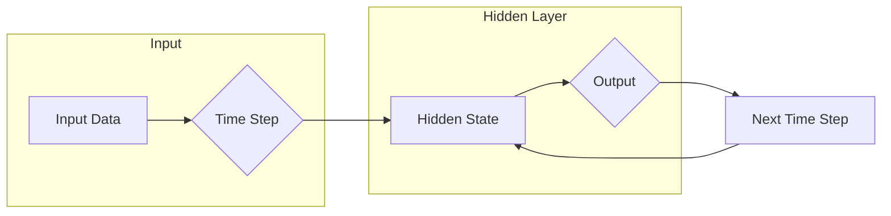

# 循环神经网络 (Recurrent Neural Network)

> 关键词：循环神经网络，RNN，时间序列，序列到序列，长短时记忆网络，LSTM，门控循环单元，动态系统

## 1. 背景介绍

随着深度学习技术的飞速发展，神经网络在计算机视觉、自然语言处理等领域取得了显著的成果。然而，传统的全连接神经网络在处理时间序列数据时却显得力不从心。为了解决这一问题，循环神经网络（Recurrent Neural Network，RNN）应运而生。RNN能够处理序列数据，并在时间序列分析、语言模型、语音识别等领域取得了突破性的进展。本文将深入探讨RNN的原理、实现和应用，旨在为读者提供一个全面而深入的理解。

## 2. 核心概念与联系

### 2.1 核心概念

**循环神经网络（RNN）**是一种神经网络架构，特别适用于处理序列数据。与传统的前馈神经网络不同，RNN在处理序列数据时，可以保持序列中不同时间步之间的状态信息。

**时间步（Time Step）**是序列数据的一个离散点，每个时间步上的数据都可以作为网络的输入，并产生相应的输出。

**状态（State）**是RNN在某个时间步上的内部表示，它包含了该时间步之前所有时间步的信息。

**隐藏层（Hidden Layer）**是RNN的核心部分，负责处理输入数据，并根据状态信息生成输出。

**参数共享（Parameter Sharing）**是RNN的一个重要特性，即不同时间步的隐藏层共享相同的参数。

### 2.2 架构的 Mermaid 流程图



在这个流程图中，输入数据流经隐藏层，生成输出，并更新隐藏状态，为下一个时间步的输入提供信息。

## 3. 核心算法原理 & 具体操作步骤

### 3.1 算法原理概述

RNN的核心原理是通过状态传递机制，在序列数据中保持历史信息。具体来说，RNN在处理序列数据时，会根据当前时间步的输入和前一个时间步的隐藏状态，更新当前的隐藏状态，并生成当前的输出。

### 3.2 算法步骤详解

1. **初始化状态**：在序列的开始，RNN的隐藏状态被初始化为一个预定义的值。

2. **循环处理**：对于序列中的每个时间步，RNN都会进行以下操作：
   - **输入与隐藏状态结合**：将当前时间步的输入与上一个时间步的隐藏状态结合，生成新的隐藏状态。
   - **生成输出**：根据新的隐藏状态，生成当前时间步的输出。
   - **更新状态**：将新的隐藏状态作为下一个时间步的输入。

3. **结束**：当序列处理完毕后，RNN的最后隐藏状态可以用于后续的任务，如分类或回归。

### 3.3 算法优缺点

**优点**：

- 能够处理序列数据，适用于时间序列分析、语言模型、语音识别等领域。
- 可以保持序列中不同时间步之间的状态信息，具有时间动态性。

**缺点**：

- 难以处理长序列数据，容易受到梯度消失或梯度爆炸的影响。
- 参数共享机制可能导致信息丢失。

### 3.4 算法应用领域

- 时间序列分析：股票预测、天气预测、生物信息学等。
- 语言模型：文本生成、机器翻译、语音识别等。
- 语音识别：将语音信号转换为文本。

## 4. 数学模型和公式 & 详细讲解 & 举例说明

### 4.1 数学模型构建

RNN的数学模型可以用以下公式表示：

$$
h_t = f(h_{t-1}, x_t, W_h, U_h, b_h)
$$

其中，$h_t$ 是第 $t$ 个时间步的隐藏状态，$x_t$ 是第 $t$ 个时间步的输入，$W_h$、$U_h$、$b_h$ 分别是连接输入、隐藏状态和偏置的权重和偏置。

### 4.2 公式推导过程

假设RNN的激活函数为 $f$，则：

$$
h_t = f(h_{t-1}, x_t, W_h, U_h, b_h) = \sigma(W_hh_{t-1} + U_hx_t + b_h)
$$

其中，$\sigma$ 是非线性激活函数，如tanh或ReLU。

### 4.3 案例分析与讲解

以股票价格预测为例，我们可以使用RNN来预测未来的股票价格。假设我们有过去的股票价格序列 $x_1, x_2, \ldots, x_T$，我们可以使用RNN来预测未来的价格 $x_{T+1}$。

在这个例子中，输入 $x_t$ 是当前股票价格，隐藏状态 $h_t$ 是包含过去价格信息的向量，输出 $x_{T+1}$ 是预测的未来价格。

## 5. 项目实践：代码实例和详细解释说明

### 5.1 开发环境搭建

在开始项目实践之前，我们需要搭建以下开发环境：

- Python 3.x
- TensorFlow或PyTorch深度学习框架
- NumPy科学计算库

### 5.2 源代码详细实现

以下是一个使用PyTorch实现简单RNN的示例代码：

```python
import torch
import torch.nn as nn
import torch.optim as optim

# 定义RNN模型
class RNN(nn.Module):
    def __init__(self, input_dim, hidden_dim, output_dim):
        super(RNN, self).__init__()
        self.rnn = nn.RNN(input_dim, hidden_dim, batch_first=True)
        self.fc = nn.Linear(hidden_dim, output_dim)

    def forward(self, x):
        out, _ = self.rnn(x)
        out = self.fc(out[:, -1, :])
        return out

# 创建模型、损失函数和优化器
input_dim = 1
hidden_dim = 50
output_dim = 1
model = RNN(input_dim, hidden_dim, output_dim)
criterion = nn.MSELoss()
optimizer = optim.Adam(model.parameters(), lr=0.001)

# 加载数据
data = torch.randn(100, 1)  # 假设100个时间步的数据
targets = torch.randn(100, 1)  # 假设100个时间步的目标值

# 训练模型
for epoch in range(100):
    model.train()
    optimizer.zero_grad()
    outputs = model(data)
    loss = criterion(outputs, targets)
    loss.backward()
    optimizer.step()

    if epoch % 10 == 0:
        print(f"Epoch {epoch+1}, Loss: {loss.item()}")
```

### 5.3 代码解读与分析

在这个例子中，我们定义了一个简单的RNN模型，包含一个RNN层和一个全连接层。RNN层负责处理输入序列，全连接层负责生成输出。

在训练过程中，我们使用MSE损失函数来衡量预测值与真实值之间的差异，并使用Adam优化器进行参数更新。

### 5.4 运行结果展示

运行上述代码，我们可以在控制台看到训练过程中的损失值逐渐下降，表明模型在逐渐学习数据中的规律。

## 6. 实际应用场景

### 6.1 时间序列分析

RNN在时间序列分析领域有着广泛的应用，如股票预测、天气预测、生物信息学等。通过学习历史数据中的规律，RNN可以预测未来的趋势。

### 6.2 语言模型

RNN在语言模型领域也有着重要的应用，如文本生成、机器翻译、语音识别等。RNN可以学习语言中的上下文信息，生成连贯的文本或语音。

### 6.3 语音识别

RNN可以用于将语音信号转换为文本。通过学习语音信号中的特征和上下文信息，RNN可以识别出语音中的单词和句子。

## 7. 工具和资源推荐

### 7.1 学习资源推荐

- 《深度学习》（Goodfellow, Bengio, Courville著）
- 《循环神经网络教程》（Colah's Blog）
- TensorFlow和PyTorch官方文档

### 7.2 开发工具推荐

- TensorFlow
- PyTorch

### 7.3 相关论文推荐

- "LSTM: A Long Short-Term Memory Network Architecture for Time Series Prediction"（Hochreiter and Schmidhuber，1997）
- "Sequence to Sequence Learning with Neural Networks"（Sutskever et al.，2014）

## 8. 总结：未来发展趋势与挑战

### 8.1 研究成果总结

RNN作为一种强大的序列数据处理工具，已经在多个领域取得了显著的成果。然而，RNN也面临着梯度消失、梯度爆炸、参数共享等挑战。

### 8.2 未来发展趋势

为了解决RNN的挑战，未来的研究将关注以下方向：

- 长短时记忆网络（LSTM）和门控循环单元（GRU）等改进的RNN结构。
- 基于注意力机制的RNN模型。
- 参数高效的RNN训练方法。

### 8.3 面临的挑战

RNN面临的挑战主要包括：

- 梯度消失和梯度爆炸问题。
- 参数共享导致的信息丢失。
- 长序列数据的处理能力。

### 8.4 研究展望

随着深度学习技术的不断发展，RNN将在更多领域得到应用。未来，RNN的研究将更加注重模型的效率和效果，以及模型的可解释性和可扩展性。

## 9. 附录：常见问题与解答

**Q1：RNN与CNN的区别是什么？**

A：RNN和CNN都是神经网络的一种架构，但它们适用于不同的数据类型。RNN适用于序列数据，而CNN适用于图像数据。

**Q2：如何解决RNN的梯度消失问题？**

A：为了解决RNN的梯度消失问题，可以使用长短时记忆网络（LSTM）或门控循环单元（GRU）等改进的RNN结构。

**Q3：RNN在实际应用中如何处理长序列数据？**

A：在处理长序列数据时，可以使用LSTM或GRU等改进的RNN结构，或者使用分段处理等方法。

**Q4：RNN在哪些领域有应用？**

A：RNN在时间序列分析、语言模型、语音识别等领域有广泛的应用。

---

作者：禅与计算机程序设计艺术 / Zen and the Art of Computer Programming