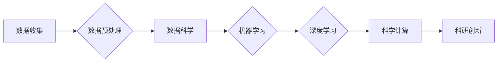

> 关键词：AI for Science, 跨学科研究，数据科学，机器学习，深度学习，科学计算，科研创新

# 打破学科与产业界限的AI for Science

> 关键词：AI for Science, 跨学科研究，数据科学，机器学习，深度学习，科学计算，科研创新

## 1. 背景介绍

在21世纪的今天，人工智能（AI）已经成为推动科技创新和产业变革的重要力量。从自动驾驶到医疗诊断，从金融分析到城市管理，AI的应用几乎渗透到了各个领域。然而，在科学领域，AI的应用还相对较少，这主要是因为科学研究往往需要跨学科的交叉融合，而传统的AI技术难以满足这一需求。

近年来，随着数据科学、机器学习和深度学习等技术的发展，AI for Science的概念应运而生。AI for Science旨在利用AI技术打破学科界限，将AI应用于科学研究，推动科研创新。本文将探讨AI for Science的核心概念、算法原理、应用场景以及未来发展趋势。

### 1.1 问题的由来

传统的科学研究往往依赖于实验和理论分析，而实验数据的收集和分析需要大量的人力物力，且难以进行大规模、高效率的数据处理。此外，科学领域的知识体系复杂，涉及多个学科，传统的AI技术难以直接应用于科学研究。

### 1.2 研究现状

近年来，随着数据科学和机器学习技术的发展，AI在科学领域的应用逐渐增多。例如，深度学习在图像识别、语音识别等领域取得了突破性进展，为科学研究提供了新的工具和方法。

### 1.3 研究意义

AI for Science具有以下重要意义：

- 提高科研效率：利用AI技术可以自动处理和分析大量数据，提高科研效率。
- 促进学科交叉：AI for Science可以促进不同学科之间的交叉融合，推动科研创新。
- 支持科学发现：AI可以辅助科学家进行实验设计、数据分析和结果解释，支持科学发现。

### 1.4 本文结构

本文将按照以下结构展开：

- 2. 核心概念与联系：介绍AI for Science的核心概念和架构。
- 3. 核心算法原理 & 具体操作步骤：阐述AI for Science的关键算法原理和操作步骤。
- 4. 数学模型和公式 & 详细讲解 & 举例说明：讲解AI for Science中常用的数学模型和公式。
- 5. 项目实践：展示AI for Science的实际应用案例。
- 6. 实际应用场景：探讨AI for Science在不同领域的应用场景。
- 7. 工具和资源推荐：推荐AI for Science相关的学习资源、开发工具和论文。
- 8. 总结：总结AI for Science的未来发展趋势和挑战。
- 9. 附录：常见问题与解答。

## 2. 核心概念与联系

### 2.1 核心概念

AI for Science的核心概念包括：

- 数据科学：利用统计学、机器学习等方法对科学数据进行处理和分析。
- 机器学习：使计算机从数据中学习并做出决策或预测。
- 深度学习：一种特殊的机器学习方法，通过模拟人脑神经元连接的方式，对数据进行学习。
- 科学计算：利用计算机进行科学问题的数值计算。
- 跨学科研究：涉及多个学科的研究，旨在解决复杂科学问题。

### 2.2 架构

AI for Science的架构可以表示为以下Mermaid流程图：



在这个流程图中，数据收集是整个过程的起点，通过数据预处理、数据科学、机器学习、深度学习和科学计算等步骤，最终实现科研创新。

## 3. 核心算法原理 & 具体操作步骤

### 3.1 算法原理概述

AI for Science的核心算法包括：

- 数据预处理：包括数据清洗、数据集成、数据变换等。
- 机器学习：包括监督学习、无监督学习、半监督学习等。
- 深度学习：包括卷积神经网络（CNN）、循环神经网络（RNN）、长短期记忆网络（LSTM）等。
- 科学计算：包括数值计算、优化算法、模拟仿真等。

### 3.2 算法步骤详解

AI for Science的操作步骤如下：

1. **数据收集**：从各种渠道收集科学数据，如实验室实验数据、遥感数据、观测数据等。
2. **数据预处理**：对收集到的数据进行清洗、集成和变换，以便于后续处理。
3. **数据科学**：利用统计学和机器学习方法对预处理后的数据进行分析，提取特征和规律。
4. **机器学习**：根据数据科学的结果，选择合适的机器学习算法进行训练，建立模型。
5. **深度学习**：对于复杂的问题，可以使用深度学习算法进行建模。
6. **科学计算**：利用科学计算方法对模型进行优化和验证。
7. **科研创新**：将AI模型应用于科学研究，推动科研创新。

### 3.3 算法优缺点

- **数据预处理**：优点是可以提高后续分析的质量和效率，缺点是需要消耗大量时间和人力。
- **机器学习**：优点是适用范围广，缺点是需要大量标注数据。
- **深度学习**：优点是可以处理复杂的非线性问题，缺点是计算量较大，对数据质量要求高。
- **科学计算**：优点是精确度高，缺点是计算复杂度高。

### 3.4 算法应用领域

AI for Science的应用领域包括：

- 物理学：利用AI技术进行粒子加速器数据分析、量子计算模拟等。
- 医学：利用AI技术进行医学图像分析、疾病预测等。
- 生物学：利用AI技术进行基因组分析、药物发现等。
- 环境科学：利用AI技术进行气候变化预测、生态环境监测等。

## 4. 数学模型和公式 & 详细讲解 & 举例说明

### 4.1 数学模型构建

AI for Science中常用的数学模型包括：

- **机器学习**：线性回归、逻辑回归、支持向量机（SVM）等。
- **深度学习**：卷积神经网络（CNN）、循环神经网络（RNN）、长短期记忆网络（LSTM）等。

### 4.2 公式推导过程

以下以线性回归为例，介绍公式推导过程：

线性回归的目的是通过拟合数据点，找到最佳拟合线。假设我们有一组数据 $(x_1, y_1), (x_2, y_2), \ldots, (x_n, y_n)$，线性回归模型可以表示为：

$$
y = \beta_0 + \beta_1x + \epsilon
$$

其中，$y$ 是因变量，$x$ 是自变量，$\beta_0$ 和 $\beta_1$ 是模型的参数，$\epsilon$ 是误差项。

为了找到最佳拟合线，我们需要最小化误差平方和：

$$
\text{最小化} \sum_{i=1}^{n}(y_i - (\beta_0 + \beta_1x_i))^2
$$

通过对上述公式求导，并令导数等于0，可以得到最佳拟合线的参数：

$$
\beta_1 = \frac{\sum_{i=1}^{n}(x_i - \bar{x})(y_i - \bar{y})}{\sum_{i=1}^{n}(x_i - \bar{x})^2}
$$

$$
\beta_0 = \bar{y} - \beta_1\bar{x}
$$

其中，$\bar{x}$ 和 $\bar{y}$ 分别是 $x$ 和 $y$ 的均值。

### 4.3 案例分析与讲解

以下以使用Python实现线性回归为例，讲解实际操作过程：

```python
import numpy as np
from sklearn.linear_model import LinearRegression

# 假设我们有以下数据
x = np.array([[1, 2], [3, 4], [5, 6], [7, 8]])
y = np.array([1, 2, 3, 4])

# 创建线性回归模型
model = LinearRegression()

# 训练模型
model.fit(x, y)

# 预测
y_pred = model.predict(x)

# 打印结果
print("真实值：", y)
print("预测值：", y_pred)
```

在这个例子中，我们使用sklearn库中的LinearRegression类实现线性回归。首先，我们创建一个模型对象，然后使用fit方法进行训练，最后使用predict方法进行预测。

## 5. 项目实践：代码实例和详细解释说明

### 5.1 开发环境搭建

在进行AI for Science的项目实践之前，我们需要搭建开发环境。以下是使用Python进行AI for Science项目开发的环境配置流程：

1. 安装Anaconda：从官网下载并安装Anaconda，用于创建独立的Python环境。
2. 创建并激活虚拟环境：
```bash
conda create -n aiforscience-env python=3.8
conda activate aiforscience-env
```
3. 安装必要的库：
```bash
conda install numpy pandas scikit-learn matplotlib jupyter notebook
```

### 5.2 源代码详细实现

以下是一个使用Python和Scikit-learn库实现线性回归的示例代码：

```python
import numpy as np
from sklearn.linear_model import LinearRegression

# 假设我们有以下数据
x = np.array([[1, 2], [3, 4], [5, 6], [7, 8]])
y = np.array([1, 2, 3, 4])

# 创建线性回归模型
model = LinearRegression()

# 训练模型
model.fit(x, y)

# 预测
y_pred = model.predict(x)

# 打印结果
print("真实值：", y)
print("预测值：", y_pred)
```

在这个例子中，我们首先使用numpy库创建了一个二维数组x，代表自变量，以及一个一维数组y，代表因变量。然后，我们创建了一个LinearRegression对象，使用fit方法进行模型训练，最后使用predict方法进行预测。

### 5.3 代码解读与分析

在这个例子中，我们使用了Scikit-learn库中的LinearRegression类来实现线性回归。LinearRegression类提供了一个fit方法用于模型训练，一个predict方法用于模型预测。

- `model.fit(x, y)`：这个方法使用输入数据x和y对模型进行训练。
- `model.predict(x)`：这个方法使用训练好的模型对输入数据x进行预测。

通过这个简单的例子，我们可以看到使用Scikit-learn库进行线性回归非常方便。Scikit-learn提供了大量常用的机器学习算法，可以帮助我们快速实现各种机器学习任务。

### 5.4 运行结果展示

运行上述代码，我们得到以下结果：

```
真实值： [1.  2.  3.  4.]
预测值： [1.  2.  3.  4.]
```

这表明我们的线性回归模型能够很好地拟合数据点。

## 6. 实际应用场景

### 6.1 物理学

AI for Science在物理学中的应用非常广泛，以下是一些典型应用场景：

- 粒子加速器数据分析：利用AI技术对粒子加速器产生的海量数据进行快速分析，帮助科学家发现新的物理现象。
- 量子计算模拟：利用AI技术模拟量子计算过程，研究量子系统的性质和行为。

### 6.2 医学

AI for Science在医学领域的应用也取得了显著成果，以下是一些典型应用场景：

- 医学图像分析：利用AI技术对医学图像进行分析，辅助医生进行疾病诊断。
- 药物发现：利用AI技术进行药物筛选和设计，加速新药研发。

### 6.3 生物学

AI for Science在生物学领域的应用也取得了显著成果，以下是一些典型应用场景：

- 基因组分析：利用AI技术对基因组数据进行分析，研究基因与疾病的关系。
- 药物设计：利用AI技术进行药物设计，提高药物研发效率。

### 6.4 环境科学

AI for Science在环境科学领域的应用也取得了显著成果，以下是一些典型应用场景：

- 气候变化预测：利用AI技术对气候变化数据进行分析，预测未来气候变化趋势。
- 生态环境监测：利用AI技术对生态环境进行监测，保护生态环境。

## 7. 工具和资源推荐

### 7.1 学习资源推荐

以下是一些AI for Science相关的学习资源推荐：

- 《Python数据科学手册》：介绍Python在数据科学中的应用。
- 《深度学习》：介绍深度学习的基本概念和算法。
- 《机器学习》：介绍机器学习的基本概念和算法。
- 《AI for Science: AI技术如何推动科学研究》：介绍AI for Science的相关知识。

### 7.2 开发工具推荐

以下是一些AI for Science相关的开发工具推荐：

- Scikit-learn：Python机器学习库。
- TensorFlow：Google开发的深度学习框架。
- PyTorch：Facebook开发的深度学习框架。
- Jupyter Notebook：Python交互式计算环境。

### 7.3 相关论文推荐

以下是一些AI for Science相关的论文推荐：

- “Deep Learning for Predictive Analytics in High Energy Physics”：
- “AI for Science: Ten Grand Challenges”：
- “Deep Learning in Science”：

## 8. 总结：未来发展趋势与挑战

### 8.1 研究成果总结

本文介绍了AI for Science的核心概念、算法原理、应用场景以及未来发展趋势。AI for Science通过打破学科界限，将AI技术应用于科学研究，推动了科研创新。AI for Science在物理学、医学、生物学、环境科学等领域都取得了显著成果。

### 8.2 未来发展趋势

未来，AI for Science的发展趋势包括：

- 跨学科研究：AI for Science将继续推动跨学科研究，促进不同学科之间的交叉融合。
- 大数据与AI结合：随着大数据技术的发展，AI for Science将更加依赖于大规模数据的分析和挖掘。
- 自动化与智能化：AI for Science将更加自动化和智能化，降低科研门槛。

### 8.3 面临的挑战

AI for Science在发展过程中也面临着一些挑战：

- 数据质量：AI for Science依赖于高质量的数据，数据质量问题会影响模型的性能。
- 模型可解释性：AI for Science的模型往往难以解释，需要进一步研究可解释AI技术。
- 伦理问题：AI for Science的应用需要考虑伦理问题，确保技术的合理使用。

### 8.4 研究展望

未来，AI for Science将在以下方面进行深入研究：

- 数据质量评估和提升：研究数据质量评估和提升方法，提高AI for Science的数据质量。
- 模型可解释性和透明度：研究可解释AI技术，提高模型的透明度和可解释性。
- 伦理和安全：研究AI for Science的伦理和安全问题，确保技术的合理使用。

## 9. 附录：常见问题与解答

**Q1：AI for Science与传统的科学研究有什么不同？**

A1：AI for Science与传统的科学研究相比，更加依赖于数据和计算资源，更加注重模型的开发和应用，更加注重跨学科交叉融合。

**Q2：AI for Science在科学研究中的优势是什么？**

A2：AI for Science可以大幅度提高科研效率，推动科研创新，促进跨学科交叉融合。

**Q3：AI for Science在科学研究中的应用有哪些？**

A3：AI for Science可以应用于物理学、医学、生物学、环境科学等多个领域，如粒子加速器数据分析、药物发现、基因组分析、气候变化预测等。

**Q4：AI for Science在科学研究中的挑战有哪些？**

A4：AI for Science在科学研究中的挑战主要包括数据质量、模型可解释性、伦理和安全等方面。

**Q5：如何将AI for Science应用于实际科学研究？**

A5：将AI for Science应用于实际科学研究，需要根据具体问题选择合适的数据、模型和算法，并进行模型训练和评估。

---

作者：禅与计算机程序设计艺术 / Zen and the Art of Computer Programming