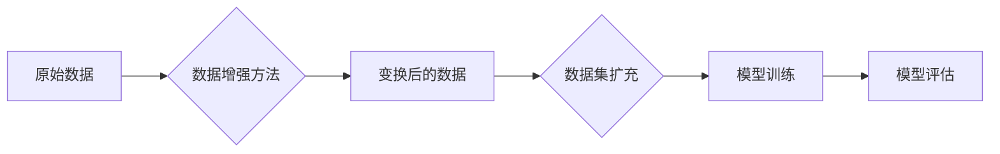

> 数据增强, Data Augmentation, 图像识别, 计算机视觉, 机器学习, 深度学习, 预训练, 鲁棒性, 性能提升

# 数据增强Data Augmentation原理与代码实例讲解

数据增强（Data Augmentation）是机器学习和深度学习领域的一种常用技术，旨在通过变换原始数据来扩充数据集，从而提高模型在训练过程中的鲁棒性和泛化能力。在图像识别、自然语言处理等视觉和语言任务中，数据增强被广泛应用，尤其在深度学习中，它帮助模型更好地学习数据的内在结构，减少对特定样本的依赖，提升模型的性能。

## 1. 背景介绍

### 1.1 问题的由来

随着深度学习的迅速发展，模型在图像识别、语音识别、自然语言处理等领域取得了显著的成果。然而，深度学习模型通常对数据的过度拟合问题比较敏感，即模型在训练数据上表现良好，但在未见过的测试数据上表现较差。这是因为模型在训练过程中过度依赖了训练数据的特征，对于数据的微小变化不够鲁棒。

数据增强作为一种数据预处理技术，通过变换原始数据来生成新的数据样本，从而增加数据集的多样性，减少模型对特定样本的依赖，提高模型的泛化能力。

### 1.2 研究现状

数据增强技术在图像识别和计算机视觉领域得到了广泛的研究和应用。目前，常见的数据增强方法包括旋转、缩放、裁剪、翻转、颜色变换等。随着深度学习的发展，还涌现出了一些基于深度学习的自适应数据增强方法，如GAN（生成对抗网络）生成的数据、风格迁移等。

### 1.3 研究意义

数据增强技术对于提升深度学习模型的性能具有重要意义：

- **提高模型的鲁棒性**：通过增加数据集的多样性，使模型能够更好地学习数据的内在结构，减少对特定样本的依赖，提高模型的泛化能力。
- **减少对标注数据的依赖**：数据增强可以帮助在标注数据有限的情况下，通过增加数据集的规模来提升模型的性能。
- **降低过拟合风险**：通过增加数据集的多样性，减少模型在训练过程中的过拟合现象。

### 1.4 本文结构

本文将首先介绍数据增强的核心概念和原理，然后讲解几种常见的数据增强方法，并通过代码实例展示如何实现数据增强。最后，我们将探讨数据增强的实际应用场景和未来发展趋势。

## 2. 核心概念与联系

### 2.1 核心概念

- **数据增强（Data Augmentation）**：通过变换原始数据来生成新的数据样本，从而扩充数据集的技术。
- **样本变换（Sample Transformation）**：对原始数据样本进行一系列操作，如旋转、缩放、裁剪等。
- **数据分布（Data Distribution）**：数据样本的分布情况，包括样本的多样性、分布的均匀性等。

### 2.2 Mermaid 流程图



### 2.3 核心概念联系

数据增强技术通过对原始数据进行变换，生成新的数据样本，从而扩充数据集。这些变换后的数据样本用于模型训练，可以帮助模型更好地学习数据的内在结构，提高模型的鲁棒性和泛化能力。

## 3. 核心算法原理 & 具体操作步骤

### 3.1 算法原理概述

数据增强的核心原理是通过变换原始数据来生成新的数据样本，从而扩充数据集。这些变换包括但不限于旋转、缩放、裁剪、翻转、颜色变换等。

### 3.2 算法步骤详解

1. **选择数据增强方法**：根据具体任务和模型的需求，选择合适的数据增强方法。
2. **对原始数据进行变换**：对原始数据样本进行一系列操作，如旋转、缩放、裁剪等。
3. **生成新的数据样本**：将变换后的数据作为新的数据样本，扩充数据集。
4. **模型训练**：使用扩充后的数据集对模型进行训练。
5. **模型评估**：使用测试数据评估模型的性能。

### 3.3 算法优缺点

#### 优点

- 提高模型的鲁棒性和泛化能力。
- 减少对标注数据的依赖。
- 降低过拟合风险。

#### 缺点

- 可能引入噪声，影响模型性能。
- 需要根据具体任务选择合适的数据增强方法。
- 增加计算成本。

### 3.4 算法应用领域

数据增强技术在图像识别、自然语言处理、语音识别等领域都有广泛的应用。

## 4. 数学模型和公式 & 详细讲解 & 举例说明

### 4.1 数学模型构建

数据增强的数学模型通常不涉及复杂的公式，其主要目的是通过变换操作来生成新的数据样本。

### 4.2 公式推导过程

数据增强的公式推导过程通常不涉及复杂的数学推导，其主要目的是通过变换操作来生成新的数据样本。

### 4.3 案例分析与讲解

以下是一个使用Python和OpenCV库进行图像旋转的数据增强实例：

```python
import cv2
import numpy as np

def rotate_image(image, angle):
    (h, w) = image.shape[:2]
    center = (w // 2, h // 2)
    M = cv2.getRotationMatrix2D(center, angle, 1.0)
    rotated = cv2.warpAffine(image, M, (w, h))
    return rotated

# 加载图像
image = cv2.imread('path_to_image.jpg')

# 旋转图像
rotated_image = rotate_image(image, 45)

# 保存旋转后的图像
cv2.imwrite('rotated_image.jpg', rotated_image)
```

## 5. 项目实践：代码实例和详细解释说明

### 5.1 开发环境搭建

要实现数据增强，你需要以下开发环境：

- Python 3.x
- OpenCV 4.0+
- NumPy 1.18+

### 5.2 源代码详细实现

以下是一个使用OpenCV和NumPy库进行数据增强的Python代码示例：

```python
import cv2
import numpy as np
from sklearn.utils import shuffle

def augment_data(images, labels, num_augmentations):
    augmented_images, augmented_labels = [], []
    for i in range(len(images)):
        image = images[i]
        label = labels[i]
        for _ in range(num_augmentations):
            # 随机选择一个变换
            transform_type = np.random.choice(['rotate', 'scale', 'crop'])
            if transform_type == 'rotate':
                angle = np.random.uniform(-10, 10)
                image = rotate_image(image, angle)
            elif transform_type == 'scale':
                scale = np.random.uniform(0.9, 1.1)
                image = cv2.resize(image, None, fx=scale, fy=scale, interpolation=cv2.INTER_AREA)
            elif transform_type == 'crop':
                x_offset = np.random.randint(0, image.shape[1] // 4)
                y_offset = np.random.randint(0, image.shape[0] // 4)
                image = image[y_offset:y_offset + image.shape[0] // 2, x_offset:x_offset + image.shape[1] // 2]
            augmented_images.append(image)
            augmented_labels.append(label)
    return np.array(augmented_images), np.array(augmented_labels)

# 加载数据
images = np.load('images.npy')
labels = np.load('labels.npy')

# 数据增强
augmented_images, augmented_labels = augment_data(images, labels, 2)

# 保存增强后的数据
np.save('augmented_images.npy', augmented_images)
np.save('augmented_labels.npy', augmented_labels)
```

### 5.3 代码解读与分析

该代码示例首先定义了一个`rotate_image`函数，用于对图像进行旋转变换。然后，定义了`augment_data`函数，该函数接受原始图像和标签，并对其进行数据增强。在`augment_data`函数中，随机选择一个变换类型，如旋转、缩放或裁剪，并应用相应的变换。最后，返回增强后的图像和标签。

### 5.4 运行结果展示

运行上述代码后，会在当前目录下生成两个文件：`augmented_images.npy`和`augmented_labels.npy`，分别存储增强后的图像和标签。

## 6. 实际应用场景

数据增强技术在以下实际应用场景中得到了广泛应用：

- **图像识别**：在图像识别任务中，数据增强可以帮助模型更好地识别图像中的物体，提高模型的鲁棒性和泛化能力。
- **自然语言处理**：在自然语言处理任务中，数据增强可以增加文本数据的多样性，提高模型的鲁棒性和泛化能力。
- **语音识别**：在语音识别任务中，数据增强可以帮助模型更好地识别不同说话人、不同语速的语音，提高模型的鲁棒性和泛化能力。

## 7. 工具和资源推荐

### 7.1 学习资源推荐

- 《深度学习》（Goodfellow, Bengio, Courville著）：介绍了深度学习的基本原理和应用，其中包括数据增强技术。
- 《Python图像处理实战》（Aditya Y. Bhargava著）：介绍了Python在图像处理领域的应用，其中包括数据增强技术。
- 《计算机视觉：算法与应用》（Richard Szeliski著）：介绍了计算机视觉的基本原理和应用，其中包括数据增强技术。

### 7.2 开发工具推荐

- OpenCV：一个开源的计算机视觉库，提供了丰富的图像处理功能，包括数据增强功能。
- NumPy：一个开源的Python科学计算库，提供了丰富的数学运算功能，可以用于数据增强。
- TensorFlow或PyTorch：两个流行的深度学习框架，提供了数据增强的API。

### 7.3 相关论文推荐

- Simonyan, K., & Zisserman, A. (2014). Very deep convolutional networks for large-scale image recognition. arXiv preprint arXiv:1409.1556.
- He, K., Zhang, X., Ren, S., & Sun, J. (2016). Deep residual learning for image recognition. In Proceedings of the IEEE conference on computer vision and pattern recognition (pp. 770-778).
- Zhang, H., Isola, P., & Efros, A. A. (2016). Colorful image colorization. In European conference on computer vision (pp. 649-666).

## 8. 总结：未来发展趋势与挑战

### 8.1 研究成果总结

数据增强技术在深度学习领域已经取得了显著的成果，为模型性能的提升做出了重要贡献。未来，数据增强技术将继续在以下方面取得进展：

- 开发更有效的数据增强方法，提高模型的鲁棒性和泛化能力。
- 将数据增强技术与其他深度学习技术（如GAN、知识蒸馏等）相结合，进一步提升模型性能。
- 将数据增强技术应用于更多领域，如自然语言处理、语音识别等。

### 8.2 未来发展趋势

- **自适应数据增强**：根据模型的训练过程和性能，动态调整数据增强策略，以实现更好的效果。
- **多模态数据增强**：将数据增强技术应用于多模态数据，如图像、文本、音频等，以实现更全面的特征学习。
- **可解释数据增强**：研究数据增强对模型性能的影响，提高数据增强的可解释性。

### 8.3 面临的挑战

- **数据增强的过拟合风险**：数据增强过程中可能引入噪声，导致模型过拟合。
- **数据增强方法的适用性**：不同的数据增强方法适用于不同的任务和数据类型。
- **计算成本**：数据增强过程需要大量的计算资源。

### 8.4 研究展望

数据增强技术是深度学习领域的一个重要研究方向，未来将继续在以下方面取得进展：

- 开发更有效的数据增强方法，提高模型的鲁棒性和泛化能力。
- 将数据增强技术与其他深度学习技术相结合，进一步提升模型性能。
- 将数据增强技术应用于更多领域，如自然语言处理、语音识别等。

## 9. 附录：常见问题与解答

**Q1：数据增强是否适用于所有类型的模型？**

A：数据增强主要适用于深度学习模型，尤其是卷积神经网络（CNN）和循环神经网络（RNN）。对于其他类型的模型，如支持向量机（SVM）、决策树等，数据增强的效果可能有限。

**Q2：数据增强是否会降低模型的性能？**

A：合理的数据增强可以提升模型的性能，但过度的数据增强可能导致模型性能下降。需要根据具体任务和模型选择合适的数据增强方法。

**Q3：数据增强是否需要额外的计算资源？**

A：数据增强过程需要一定的计算资源，尤其是在处理高分辨率图像时。可以使用GPU或TPU等加速设备来提高计算效率。

**Q4：如何评估数据增强的效果？**

A：可以通过在测试集上评估模型的性能来评估数据增强的效果。可以使用诸如准确率、召回率、F1分数等指标来衡量模型的性能。

**Q5：数据增强是否会影响模型的泛化能力？**

A：合理的数据增强可以提升模型的泛化能力，但过度的数据增强可能导致模型泛化能力下降。需要根据具体任务和模型选择合适的数据增强策略。

作者：禅与计算机程序设计艺术 / Zen and the Art of Computer Programming