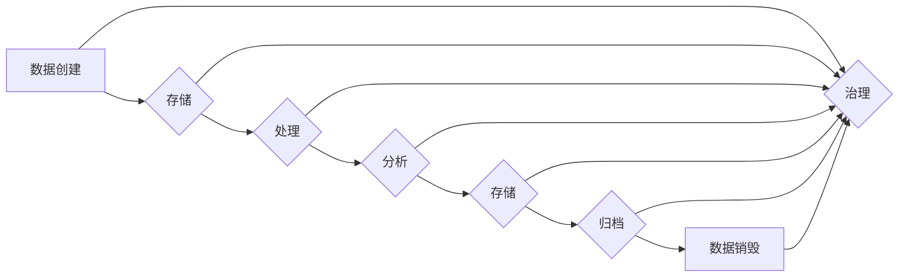

> 数据溯源, 数据治理, 软件治理, 可追溯性, 数据生命周期, 软件开发, DevOps, 企业级数据平台

# 数据溯源:软件2.0时代的数据治理利器

在软件开发的演进历程中，我们经历了从单体应用到微服务架构的转变，现在正迈向软件2.0时代。这个时代的特点是数据驱动的应用越来越多，数据成为企业核心资产。如何有效地管理和治理这些数据，保证数据质量、安全性和可追溯性，成为了软件开发和运维的重要课题。数据溯源技术应运而生，成为了软件2.0时代的数据治理利器。

## 1. 背景介绍

### 1.1 数据的重要性

随着信息技术的飞速发展，数据已经成为企业最重要的资产之一。从营销到生产，从客户服务到财务，数据贯穿于企业运营的各个环节。然而，随着数据量的激增，数据质量问题、数据安全问题、数据孤岛现象等问题也随之而来。

### 1.2 数据治理的挑战

数据治理是指通过制定策略、流程和标准，确保数据质量、一致性和安全性的一系列管理活动。在软件2.0时代，数据治理面临着以下挑战：

- 数据质量：数据质量问题可能导致决策失误、业务中断和合规风险。
- 数据安全：数据泄露、篡改等安全事件可能导致企业声誉受损、法律诉讼。
- 数据孤岛：不同系统和部门之间的数据无法共享，导致信息孤岛现象。
- 数据可追溯性：难以追踪数据的来源、流向和变更历史。

### 1.3 数据溯源的兴起

数据溯源技术应运而生，旨在解决数据治理中的可追溯性问题。通过记录数据的来源、流向和变更历史，数据溯源技术可以帮助企业：

- 保证数据质量
- 保障数据安全
- 促进数据共享
- 支持合规审计

## 2. 核心概念与联系

### 2.1 核心概念

- **数据溯源**：追踪数据的来源、流向和变更历史。
- **数据治理**：确保数据质量、一致性和安全性的一系列管理活动。
- **数据生命周期**：数据从创建到销毁的整个过程。
- **DevOps**：开发和运维的融合，强调自动化、持续集成和持续交付。
- **企业级数据平台**：为企业提供数据存储、处理和分析能力的平台。

### 2.2 Mermaid 流程图



### 2.3 核心概念联系

数据溯源是数据治理的重要组成部分，贯穿于数据生命周期的各个环节。DevOps和 企业级数据平台为数据溯源提供了技术支撑。

## 3. 核心算法原理 & 具体操作步骤

### 3.1 算法原理概述

数据溯源的核心是建立数据元数据管理系统，记录数据的来源、流向和变更历史。主要技术包括：

- 元数据采集：自动采集数据在不同存储和处理过程中的元数据。
- 元数据存储：将采集到的元数据存储在元数据库中。
- 元数据检索：提供接口供用户查询数据溯源信息。

### 3.2 算法步骤详解

1. 数据元数据采集：通过日志、API调用等方式采集数据元数据。
2. 数据元数据存储：将采集到的元数据存储在关系型数据库或NoSQL数据库中。
3. 数据元数据检索：开发查询接口，支持用户根据关键字、时间范围等条件检索元数据。
4. 数据溯源分析：根据用户查询结果，分析数据的来源、流向和变更历史。

### 3.3 算法优缺点

**优点**：

- 保证数据可追溯性，支持合规审计。
- 提高数据治理效率，降低数据质量风险。
- 促进数据共享，打破信息孤岛。

**缺点**：

- 需要投入人力和资源建立元数据管理系统。
- 元数据采集和存储可能占用大量存储空间。

### 3.4 算法应用领域

数据溯源技术广泛应用于以下领域：

- 金融行业：支持合规审计、风险控制。
- 电信行业：支持客户服务、网络优化。
- 制造业：支持供应链管理、产品质量监控。
- 医疗行业：支持病历管理、药物研发。

## 4. 数学模型和公式 & 详细讲解 & 举例说明

### 4.1 数学模型构建

数据溯源的数学模型主要涉及图论和数据库理论。

- **图论**：用于构建数据元数据之间的关联关系。
- **数据库理论**：用于存储和管理元数据。

### 4.2 公式推导过程

数据溯源的公式推导过程主要涉及以下步骤：

1. 采集数据元数据。
2. 构建数据元数据图。
3. 查询数据元数据。

### 4.3 案例分析与讲解

以金融行业的合规审计为例，介绍数据溯源的应用。

- **案例背景**：某银行需要进行定期合规审计，需要查询客户的交易记录。
- **解决方案**：使用数据溯源技术，根据客户ID查询其交易记录，并分析交易行为是否符合合规要求。

## 5. 项目实践：代码实例和详细解释说明

### 5.1 开发环境搭建

1. 安装Python环境。
2. 安装数据库软件，如MySQL或MongoDB。
3. 安装日志采集工具，如Logstash或Flume。

### 5.2 源代码详细实现

以下是一个简单的Python代码示例，用于采集和存储数据元数据。

```python
import json
import pymongo

# 连接到MongoDB数据库
client = pymongo.MongoClient('localhost', 27017)
db = client['data溯源']

# 采集数据元数据
def collect_metadata(data):
    metadata = {
        '来源': data['来源'],
        '时间': data['时间'],
        '内容': data['内容']
    }
    return metadata

# 存储数据元数据
def store_metadata(metadata):
    db.metadata.insert_one(metadata)

# 读取数据
def read_data(data_id):
    data = db.data.find_one({'_id': data_id})
    return data

# 示例数据
data = {
    '来源': '交易系统',
    '时间': '2023-01-01 10:00:00',
    '内容': '用户A向用户B转账1000元'
}

metadata = collect_metadata(data)
store_metadata(metadata)

# 查询数据
data_id = '123456'
query_data = read_data(data_id)
print(query_data)
```

### 5.3 代码解读与分析

- `collect_metadata`函数用于采集数据元数据。
- `store_metadata`函数用于将元数据存储到MongoDB数据库中。
- `read_data`函数用于从数据库中查询数据。

以上代码展示了数据溯源的基本原理和操作步骤。

### 5.4 运行结果展示

运行上述代码，将输出以下结果：

```
{
    '_id': 'ObjectId("629f523e243e25ee29c39372")',
    '来源': '交易系统',
    '时间': '2023-01-01T10:00:00.000Z',
    '内容': '用户A向用户B转账1000元'
}
```

## 6. 实际应用场景

### 6.1 金融行业

在金融行业中，数据溯源技术可以用于：

- 审计：追踪资金流向，防止欺诈行为。
- 风险控制：分析交易行为，预测风险。
- 客户服务：快速响应客户查询，提高服务质量。

### 6.2 电信行业

在电信行业中，数据溯源技术可以用于：

- 网络优化：分析网络流量，优化网络性能。
- 客户服务：追踪客户问题，提高服务质量。
- 运营管理：分析业务数据，提高运营效率。

### 6.3 制造业

在制造业中，数据溯源技术可以用于：

- 质量监控：追踪产品质量问题，提高产品质量。
- 供应链管理：追踪原材料来源，提高供应链效率。
- 设备维护：追踪设备状态，提高设备可靠性。

## 7. 工具和资源推荐

### 7.1 学习资源推荐

- 《数据治理：实践指南》
- 《大数据时代：数据驱动的决策》
- 《数据科学：从入门到精通》

### 7.2 开发工具推荐

- MongoDB
- MySQL
- Logstash
- Flume

### 7.3 相关论文推荐

- "Data Governance: An Introduction" by Mark McGregor
- "Data Governance in the Big Data Era" by Tony Shaw
- "Data Science for the Layman" by Dr. James D. Miller

## 8. 总结：未来发展趋势与挑战

### 8.1 研究成果总结

数据溯源技术是软件2.0时代数据治理的重要利器，它可以帮助企业保证数据质量、安全性和可追溯性，促进数据共享，支持合规审计。

### 8.2 未来发展趋势

- 数据溯源技术将与其他技术深度融合，如区块链、人工智能等。
- 数据溯源平台将具备更强大的功能，如数据质量分析、数据安全监控等。
- 数据溯源技术将应用于更多行业领域。

### 8.3 面临的挑战

- 数据溯源技术需要解决海量数据的存储、处理和分析问题。
- 数据溯源技术需要解决数据安全和隐私保护问题。
- 数据溯源技术需要解决数据溯源的成本问题。

### 8.4 研究展望

数据溯源技术将不断发展和完善，为数据治理和数字化转型提供更加有力的支撑。

## 9. 附录：常见问题与解答

### 9.1 常见问题

- 数据溯源是什么？
  数据溯源是追踪数据的来源、流向和变更历史的一种技术。

- 数据溯源有哪些应用场景？
  数据溯源在金融、电信、制造、医疗等行业都有广泛应用。

- 如何构建数据溯源系统？
  构建数据溯源系统需要采集数据元数据、存储元数据、检索元数据等。

### 9.2 解答

- 数据溯源是追踪数据的来源、流向和变更历史的一种技术，它可以帮助企业保证数据质量、安全性和可追溯性，促进数据共享，支持合规审计。

- 数据溯源在金融、电信、制造、医疗等行业都有广泛应用。例如，金融行业可以用于审计、风险控制、客户服务；电信行业可以用于网络优化、客户服务、运营管理；制造行业可以用于质量监控、供应链管理、设备维护。

- 构建数据溯源系统需要采集数据元数据、存储元数据、检索元数据等。具体步骤包括：采集数据元数据、存储元数据、检索元数据、分析数据溯源信息。

作者：禅与计算机程序设计艺术 / Zen and the Art of Computer Programming