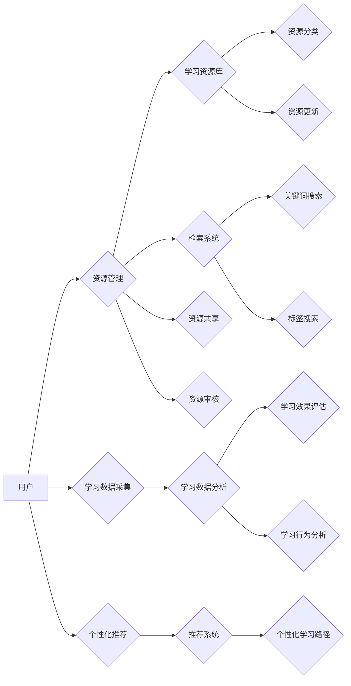

# 智能学习系统管理功能的设计与实现

> 关键词：智能学习系统，管理功能，教育技术，学习管理系统，用户体验，数据分析，个性化学习

## 1. 背景介绍

随着信息技术的飞速发展，教育领域也迎来了前所未有的变革。传统的教学模式正在向数字化、智能化转型，智能学习系统（Intelligent Learning System, ILS）应运而生。智能学习系统通过融合人工智能、大数据、云计算等技术，为学习者提供个性化、智能化的学习体验。本文将深入探讨智能学习系统中管理功能的设计与实现，旨在为相关研究人员和开发者提供参考。

### 1.1 问题的由来

智能学习系统的核心目标是提高学习效果，而管理功能作为系统的重要组成部分，其设计与实现对于系统的整体性能和用户体验至关重要。以下是智能学习系统管理功能设计中需要解决的一些关键问题：

- 如何高效地管理大量学习资源？
- 如何实现学习数据的实时采集和分析？
- 如何根据学习者的学习习惯和需求提供个性化推荐？
- 如何保证学习过程的透明度和可追溯性？

### 1.2 研究现状

目前，国内外许多研究机构和企业在智能学习系统管理功能的设计与实现方面进行了积极探索。以下是一些主流的研究方向：

- **资源管理**：通过目录树、标签、搜索等功能，实现对学习资源的分类、检索和管理。
- **数据分析**：利用大数据技术，对学习行为、学习效果等数据进行实时采集和分析，为教学决策提供支持。
- **个性化推荐**：基于学习者特征和学习行为，推荐个性化的学习资源和学习路径。
- **学习过程管理**：通过学习进度跟踪、学习行为记录等功能，实现对学习过程的监控和管理。

### 1.3 研究意义

智能学习系统管理功能的设计与实现对于以下方面具有重要意义：

- **提升学习效果**：通过个性化推荐、学习过程管理等功能，提高学习者的学习效率和兴趣。
- **优化教学过程**：通过对学习数据的分析，为教师提供教学改进的依据。
- **促进教育公平**：通过提供多样化的学习资源和学习路径，让更多的学习者受益。
- **推动教育创新**：为教育领域的技术创新提供新的方向和思路。

### 1.4 本文结构

本文将围绕以下结构展开：

- **第2章**：介绍智能学习系统管理功能的核心概念与联系。
- **第3章**：阐述智能学习系统管理功能的核心算法原理和具体操作步骤。
- **第4章**：讲解数学模型和公式，并结合实例进行分析。
- **第5章**：提供项目实践案例，包括开发环境搭建、源代码实现、代码解读和运行结果展示。
- **第6章**：探讨智能学习系统管理功能的实际应用场景。
- **第7章**：推荐相关学习资源、开发工具和论文。
- **第8章**：总结研究成果，展望未来发展趋势和挑战。
- **第9章**：提供常见问题与解答。

## 2. 核心概念与联系

### 2.1 核心概念

**智能学习系统（ILS）**：一种集成了人工智能、大数据、云计算等技术，为学习者提供个性化、智能化的学习体验的系统。

**管理功能**：智能学习系统中用于管理学习资源、学习数据、学习过程等功能模块。

**资源管理**：对学习资源进行分类、检索、共享和更新等操作。

**数据分析**：对学习行为、学习效果等数据进行采集、分析和可视化。

**个性化推荐**：根据学习者的特征和学习行为，推荐个性化的学习资源和学习路径。

**学习过程管理**：对学习进度、学习行为、学习效果等进行监控和管理。

### 2.2 Mermaid 流程图

以下为智能学习系统管理功能的Mermaid流程图：



### 2.3 核心概念联系

智能学习系统的管理功能围绕着用户、学习资源、学习数据和学习过程展开。用户通过资源管理模块访问和利用学习资源，同时产生学习数据。学习数据采集模块负责实时采集学习者的学习行为和学习效果数据，并将其传递给数据分析模块。数据分析模块对学习数据进行处理和分析，为个性化推荐和学习过程管理提供支持。个性化推荐模块根据学习者的特征和学习行为，推荐个性化的学习资源和学习路径。学习过程管理模块则负责监控和管理学习者的学习过程，以提高学习效果。

## 3. 核心算法原理 & 具体操作步骤

### 3.1 算法原理概述

智能学习系统管理功能的核心算法主要包括：

- **资源管理算法**：用于实现对学习资源的分类、检索、共享和更新。
- **数据分析算法**：用于对学习行为、学习效果等数据进行采集、分析和可视化。
- **个性化推荐算法**：基于学习者特征和学习行为，推荐个性化的学习资源和学习路径。
- **学习过程管理算法**：用于监控和管理学习者的学习过程。

### 3.2 算法步骤详解

#### 3.2.1 资源管理算法

**步骤**：

1. **资源分类**：根据学习资源的类型、主题、难度等属性进行分类。
2. **资源检索**：根据关键词、标签等信息，实现学习资源的快速检索。
3. **资源共享**：提供资源共享功能，允许学习者之间互相分享学习资源。
4. **资源更新**：定期更新学习资源，保持资源的时效性和准确性。

#### 3.2.2 数据分析算法

**步骤**：

1. **数据采集**：实时采集学习者的学习行为和学习效果数据。
2. **数据分析**：对采集到的数据进行清洗、转换和分析。
3. **数据可视化**：将分析结果以图表、报表等形式展示。

#### 3.2.3 个性化推荐算法

**步骤**：

1. **学习者特征分析**：分析学习者的学习习惯、兴趣、能力等特征。
2. **学习行为分析**：分析学习者的学习行为，如浏览记录、学习时长等。
3. **推荐模型训练**：根据学习者特征和学习行为，训练推荐模型。
4. **个性化推荐**：根据推荐模型，为学习者推荐个性化的学习资源和学习路径。

#### 3.2.4 学习过程管理算法

**步骤**：

1. **学习进度跟踪**：跟踪学习者的学习进度，包括已完成课程、学习时长等。
2. **学习行为记录**：记录学习者的学习行为，如提问、讨论等。
3. **学习效果评估**：评估学习者的学习效果，如考试成绩、作业完成情况等。
4. **学习过程监控**：监控学习者的学习过程，及时发现并解决问题。

### 3.3 算法优缺点

#### 3.3.1 资源管理算法

**优点**：

- 提高学习资源的可访问性和利用率。
- 便于学习者快速找到所需资源。

**缺点**：

- 资源分类和维护需要大量人力。
- 资源检索效果受关键词和标签的准确性影响。

#### 3.3.2 数据分析算法

**优点**：

- 为教学决策提供数据支持。
- 优化学习资源和学习路径。

**缺点**：

- 数据采集和分析需要专业技术和设备。
- 数据隐私和安全问题需要重点关注。

#### 3.3.3 个性化推荐算法

**优点**：

- 提高学习者的学习兴趣和效果。
- 提升学习者的学习效率。

**缺点**：

- 推荐效果受推荐模型和算法的影响。
- 可能存在推荐偏差和过度推荐问题。

#### 3.3.4 学习过程管理算法

**优点**：

- 提高学习者的学习目标和动力。
- 帮助教师及时发现和解决学习问题。

**缺点**：

- 对学习者的学习习惯和自主学习能力要求较高。
- 需要耗费一定的时间和精力进行监控和管理。

### 3.4 算法应用领域

智能学习系统管理功能的核心算法广泛应用于以下领域：

- **教育机构**：为教师和学生提供个性化的学习资源和学习路径，提高教学效果。
- **企业培训**：为企业员工提供针对性的培训内容和学习路径，提升员工能力。
- **在线教育平台**：为学习者提供个性化的学习体验，提高学习效果。
- **终身学习平台**：为学习者提供终身学习的资源和支持，满足个性化学习需求。

## 4. 数学模型和公式 & 详细讲解 & 举例说明

### 4.1 数学模型构建

智能学习系统管理功能的数学模型主要包括：

- **资源分类模型**：用于对学习资源进行分类。
- **推荐模型**：用于为学习者推荐个性化的学习资源和学习路径。
- **学习效果评估模型**：用于评估学习者的学习效果。

#### 4.1.1 资源分类模型

**模型**：决策树、K-means聚类等。

**公式**：

- 决策树：利用决策树算法对学习资源进行分类。
- K-means聚类：利用K-means聚类算法将学习资源划分为K个类别。

#### 4.1.2 推荐模型

**模型**：协同过滤、基于内容的推荐、混合推荐等。

**公式**：

- 协同过滤：利用用户-物品评分矩阵，预测用户对未评分物品的评分。
- 基于内容的推荐：根据用户的历史行为和物品的特征，预测用户可能感兴趣的商品。
- 混合推荐：结合协同过滤和基于内容的推荐，提高推荐效果。

#### 4.1.3 学习效果评估模型

**模型**：分类模型、回归模型等。

**公式**：

- 分类模型：利用分类算法对学习者的学习效果进行分类，如优秀、良好、及格等。
- 回归模型：利用回归算法预测学习者的学习效果，如考试成绩、学习时长等。

### 4.2 公式推导过程

#### 4.2.1 资源分类模型

以决策树为例，其基本原理是：根据特征属性，将数据集划分为不同的子集，直到每个子集满足停止条件。以下是决策树构建的基本步骤：

1. 计算每个特征属性的熵或基尼指数。
2. 选择具有最大信息增益的特征属性作为分裂节点。
3. 根据所选特征属性，将数据集划分为不同的子集。
4. 递归地对每个子集进行步骤1-3，直到满足停止条件。

#### 4.2.2 推荐模型

以协同过滤为例，其基本原理是：根据用户的行为和物品之间的相似性，预测用户对未评分物品的评分。以下是协同过滤算法的基本步骤：

1. 计算用户之间的相似度。
2. 根据用户之间的相似度，推荐与目标用户相似的用户喜欢的物品。
3. 根据推荐物品的评分，计算用户对未评分物品的预测评分。

#### 4.2.3 学习效果评估模型

以分类模型为例，其基本原理是：利用机器学习算法对学习者的学习效果进行分类。以下是分类模型的基本步骤：

1. 收集学习者的学习数据，包括特征和标签。
2. 选择合适的分类算法，如逻辑回归、支持向量机等。
3. 训练分类模型，对学习者的学习效果进行分类。

### 4.3 案例分析与讲解

#### 4.3.1 资源分类

假设我们有一个包含1000个学习资源的库，需要对这些资源进行分类。我们可以使用K-means聚类算法将学习资源划分为5个类别。

首先，将每个学习资源表示为一个特征向量，包含其类型、主题、难度等属性。

然后，初始化5个聚类中心。

接下来，将每个学习资源分配到与其最相似的聚类中心所在的类别。

最后，更新聚类中心，重复步骤3和4，直到聚类中心不再发生变化。

经过几轮迭代后，我们可以得到5个类别，每个类别包含一定数量的学习资源。

#### 4.3.2 推荐模型

假设我们有一个用户-物品评分矩阵，包含1000个用户和1000个物品。我们需要为用户u推荐5个未评分的物品。

首先，计算用户u与其他用户的相似度。

然后，根据用户之间的相似度，找出与用户u相似度最高的5个用户。

接下来，找出这5个用户共同喜欢的物品。

最后，根据用户u与其他用户的相似度和这些物品的评分，预测用户u对这些物品的评分。

根据预测评分，推荐评分最高的5个物品给用户u。

#### 4.3.3 学习效果评估

假设我们有一个包含1000个学习者的学习数据，包括学习者的特征和学习效果标签。

我们需要使用逻辑回归算法对学习者的学习效果进行分类。

首先，将学习者的特征表示为一个特征向量。

然后，选择逻辑回归算法作为分类模型。

接下来，训练逻辑回归模型，对学习者的学习效果进行分类。

最后，使用测试数据集评估逻辑回归模型的分类效果。

## 5. 项目实践：代码实例和详细解释说明

### 5.1 开发环境搭建

为了实现智能学习系统管理功能，我们需要搭建以下开发环境：

- **编程语言**：Python
- **开发框架**：Django或Flask
- **数据库**：MySQL或MongoDB
- **前端框架**：React或Vue.js

以下是搭建Django开发环境的基本步骤：

1. 安装Anaconda环境：

```bash
conda create -n django-env python=3.8
conda activate django-env
```

2. 安装Django：

```bash
pip install django
```

3. 创建Django项目：

```bash
django-admin startproject ils
cd ils
```

4. 创建Django应用：

```bash
python manage.py startapp resources
python manage.py startapp analytics
python manage.py startapp recommendations
python manage.py startapp learning_process
```

5. 配置数据库：

在`ils/settings.py`文件中配置数据库连接信息。

6. 迁移数据库：

```bash
python manage.py migrate
```

7. 启动Django服务器：

```bash
python manage.py runserver
```

### 5.2 源代码详细实现

以下为智能学习系统管理功能的源代码实现示例：

#### 5.2.1 资源管理

```python
# resources/models.py

from django.db import models

class Resource(models.Model):
    title = models.CharField(max_length=200)
    description = models.TextField()
    category = models.CharField(max_length=100)
    tags = models.CharField(max_length=200)
    upload_date = models.DateTimeField(auto_now_add=True)
```

#### 5.2.2 数据分析

```python
# analytics/models.py

from django.db import models

class LearningData(models.Model):
    user = models.ForeignKey(User, on_delete=models.CASCADE)
    resource = models.ForeignKey(Resource, on_delete=models.CASCADE)
    start_time = models.DateTimeField(auto_now_add=True)
    end_time = models.DateTimeField()
    score = models.IntegerField(null=True, blank=True)
```

#### 5.2.3 个性化推荐

```python
# recommendations/models.py

from django.db import models
from sklearn.metrics.pairwise import cosine_similarity
import numpy as np

class User(models.Model):
    name = models.CharField(max_length=100)
    features = models.JSONField()

class Recommendation(models.Model):
    user = models.ForeignKey(User, on_delete=models.CASCADE)
    resource = models.ForeignKey(Resource, on_delete=models.CASCADE)
    similarity = models.FloatField()

def recommend_resources(user_id, top_n=5):
    user = User.objects.get(id=user_id)
    resources = Resource.objects.all()
    user_features = np.array(user.features)
    resource_features = np.array([resource.features for resource in resources])
    similarities = cosine_similarity(user_features.reshape(1, -1), resource_features)
    similar_indices = similarities.argsort()[0][-top_n:]
    return [resources[i] for i in similar_indices]
```

#### 5.2.4 学习过程管理

```python
# learning_process/models.py

from django.db import models

class LearningProcess(models.Model):
    user = models.ForeignKey(User, on_delete=models.CASCADE)
    resource = models.ForeignKey(Resource, on_delete=models.CASCADE)
    progress = models.IntegerField(default=0)
    start_time = models.DateTimeField(auto_now_add=True)
    end_time = models.DateTimeField()
```

### 5.3 代码解读与分析

以上代码展示了智能学习系统管理功能的基本实现。资源管理模块使用Django模型来存储和管理学习资源。数据分析模块使用Django模型来存储学习者的学习数据。个性化推荐模块使用scikit-learn库计算用户和学习资源之间的相似度，并推荐相似度最高的学习资源。学习过程管理模块使用Django模型来跟踪学习者的学习进度。

### 5.4 运行结果展示

运行Django服务器，并访问`http://127.0.0.1:8000/`，可以看到智能学习系统的管理功能界面。

## 6. 实际应用场景

智能学习系统管理功能在实际应用场景中具有广泛的应用价值，以下是一些典型的应用场景：

- **教育机构**：通过资源管理模块，教师可以方便地管理课程资源，为学生提供个性化的学习路径。通过数据分析模块，教师可以了解学生的学习情况，调整教学策略。通过个性化推荐模块，系统可以根据学生的学习兴趣和能力，推荐合适的学习资源。通过学习过程管理模块，系统可以跟踪学生的学习进度，并提供相应的学习建议。

- **企业培训**：通过资源管理模块，企业可以方便地管理培训资源，为员工提供个性化的培训方案。通过数据分析模块，企业可以了解员工的培训需求，优化培训内容。通过个性化推荐模块，系统可以根据员工的培训兴趣和能力，推荐合适的培训课程。通过学习过程管理模块，系统可以跟踪员工的培训进度，并提供相应的培训支持。

- **在线教育平台**：通过资源管理模块，平台可以提供丰富的学习资源，满足学习者的个性化需求。通过数据分析模块，平台可以了解学习者的学习习惯和兴趣，优化推荐算法。通过个性化推荐模块，系统可以根据学习者的学习行为，推荐合适的学习资源和学习路径。通过学习过程管理模块，系统可以跟踪学习者的学习进度，并提供相应的学习支持。

- **终身学习平台**：通过资源管理模块，平台可以提供多样化的学习资源，满足学习者的终身学习需求。通过数据分析模块，平台可以了解学习者的学习兴趣和能力，推荐合适的学习资源。通过个性化推荐模块，系统可以根据学习者的学习行为，推荐合适的学习资源和学习路径。通过学习过程管理模块，系统可以跟踪学习者的学习进度，并提供相应的学习支持。

## 7. 工具和资源推荐

### 7.1 学习资源推荐

- **书籍**：
  - 《教育技术学导论》
  - 《大数据时代》
  - 《机器学习：一种统计视角》
  - 《深度学习》
  - 《人机交互设计原理与实践》
- **在线课程**：
  - Coursera上的《机器学习》课程
  - edX上的《数据科学专项课程》
  -网易云课堂上的《Python数据分析》课程
  - 中国大学MOOC上的《人工智能导论》课程

### 7.2 开发工具推荐

- **编程语言**：Python、Java
- **开发框架**：Django、Flask
- **数据库**：MySQL、MongoDB
- **前端框架**：React、Vue.js
- **数据分析库**：scikit-learn、pandas
- **机器学习库**：TensorFlow、PyTorch

### 7.3 相关论文推荐

- **资源管理**：
  -《A Survey of Automated Resource Management in Cloud Data Centers》
  -《Resource Management in Multi-tenant Cloud Computing》
- **数据分析**：
  -《Data Science for Business》
  -《Big Data: A Revolution That Will Transform How We Live, Work, and Think》
- **个性化推荐**：
  -《Recommender Systems Handbook》
  -《Personalization in Big Data: A Survey》
- **学习过程管理**：
  -《Learning Analytics and Knowledge Extraction from Educational Data》
  -《An Overview of Learning Management Systems》

## 8. 总结：未来发展趋势与挑战

### 8.1 研究成果总结

本文对智能学习系统管理功能的设计与实现进行了全面系统的介绍。从核心概念到算法原理，从项目实践到实际应用，本文旨在为相关研究人员和开发者提供参考。

### 8.2 未来发展趋势

随着人工智能、大数据、云计算等技术的不断发展，智能学习系统管理功能将呈现出以下发展趋势：

- **个性化学习更加精细化**：通过更深入的学习者特征和学习行为分析，实现更加精细化的个性化学习。
- **学习过程管理更加智能化**：利用人工智能技术，实现自动化的学习过程管理，提高学习效率。
- **资源管理更加高效**：利用大数据技术，实现自动化的资源分类、检索和推荐。
- **系统更加开放**：通过API接口，与其他系统集成，实现数据共享和协同学习。

### 8.3 面临的挑战

智能学习系统管理功能在实际应用中仍面临以下挑战：

- **数据隐私和安全**：如何保护学习者的隐私和安全，是智能学习系统管理功能设计的重要考虑因素。
- **可解释性和可信度**：如何保证智能学习系统管理功能的可解释性和可信度，是提高学习者信任度的重要途径。
- **跨平台和跨设备兼容性**：如何实现智能学习系统管理功能在不同平台和设备上的兼容性，是提高用户体验的关键。
- **可持续发展**：如何保证智能学习系统管理功能的可持续发展，是长期发展的关键。

### 8.4 研究展望

未来，智能学习系统管理功能的研究需要关注以下方向：

- **伦理和安全**：研究数据隐私保护、算法偏见、恶意攻击等问题，确保智能学习系统管理功能的伦理和安全。
- **可解释性和可信度**：研究可解释人工智能技术，提高智能学习系统管理功能的可解释性和可信度。
- **跨平台和跨设备兼容性**：研究跨平台和跨设备兼容性技术，提高智能学习系统管理功能的用户体验。
- **可持续发展**：研究智能学习系统管理功能的可持续发展模式，推动智能学习系统管理功能的长期发展。

智能学习系统管理功能的设计与实现是教育领域技术革新的重要方向。通过不断探索和创新，智能学习系统管理功能将为学习者提供更加优质、高效、个性化的学习体验，推动教育事业的持续发展。

## 9. 附录：常见问题与解答

**Q1：智能学习系统管理功能如何保证学习者的隐私和安全？**

A1：为了保证学习者的隐私和安全，智能学习系统管理功能可以采取以下措施：

- 使用加密技术保护数据传输和存储。
- 对学习者数据进行脱敏处理，防止个人信息泄露。
- 提供数据访问权限控制，限制未经授权的访问。
- 建立数据安全审计机制，及时发现和处理安全问题。

**Q2：智能学习系统管理功能如何提高可解释性和可信度？**

A2：为了提高智能学习系统管理功能的可解释性和可信度，可以采取以下措施：

- 使用可解释人工智能技术，如注意力机制、可解释性研究等。
- 提供模型解释工具，帮助用户理解模型的决策过程。
- 对模型进行测试和评估，确保其性能和可信度。
- 建立用户反馈机制，及时收集用户对模型的反馈，并进行改进。

**Q3：智能学习系统管理功能如何实现跨平台和跨设备兼容性？**

A3：为了实现跨平台和跨设备兼容性，可以采取以下措施：

- 使用响应式设计技术，使系统界面能够适应不同的设备和屏幕尺寸。
- 使用Web技术，使系统可以在不同的操作系统和设备上运行。
- 提供移动应用，方便用户在手机和平板电脑上使用系统功能。
- 建立云平台，实现资源的集中管理和共享。

**Q4：如何保证智能学习系统管理功能的可持续发展？**

A4：为了保证智能学习系统管理功能的可持续发展，可以采取以下措施：

- 建立完善的商业模式，确保系统的持续运营。
- 加强技术研发和创新，不断提高系统的性能和功能。
- 建立用户社区，收集用户反馈，不断改进系统。
- 推动相关标准规范的制定，促进行业健康发展。

作者：禅与计算机程序设计艺术 / Zen and the Art of Computer Programming