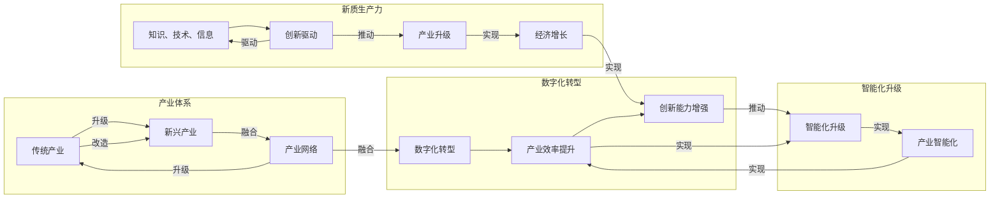

# 构建特色产业体系的新质生产力

> 关键词：产业体系，新质生产力，数字化转型，智能化，创新驱动，可持续发展

## 1. 背景介绍

在全球化、信息化和知识经济的大背景下，传统产业面临着转型升级的迫切需求。构建特色产业体系，培育新质生产力，成为推动经济增长、提高国际竞争力的关键。本文旨在探讨如何通过数字化转型、智能化升级和创新驱动，构建具有可持续发展的特色产业体系。

### 1.1 问题的由来

1. 传统产业效率低下：随着人力成本上升和资源环境约束，传统产业的生产效率和产品质量难以满足市场需求。
2. 产业结构不合理：部分产业产能过剩，而一些新兴产业和关键领域发展滞后。
3. 创新能力不足：传统产业缺乏核心技术，难以形成具有国际竞争力的产业链。
4. 可持续发展压力：环境污染、资源枯竭等问题日益突出。

### 1.2 研究现状

近年来，我国政府高度重视产业转型升级和新兴产业发展，出台了一系列政策措施。企业在数字化转型、智能化升级方面也取得了一定的成果。然而，构建特色产业体系仍面临诸多挑战。

### 1.3 研究意义

研究构建特色产业体系的新质生产力，对于推动经济高质量发展具有重要意义：

1. 提升产业竞争力：培育新兴产业，改造提升传统产业，提高产业链水平，增强国际竞争力。
2. 促进经济增长：新质生产力的发展将为经济增长提供新动力。
3. 增加就业机会：新兴产业和升级的传统产业将创造更多就业机会。
4. 推动可持续发展：通过技术创新和绿色生产，实现经济发展与环境保护的协调。

### 1.4 本文结构

本文将从以下方面展开：

- 介绍构建特色产业体系的新质生产力核心概念和联系。
- 分析核心算法原理和具体操作步骤。
- 举例说明数学模型和公式。
- 展示项目实践和代码实例。
- 探讨实际应用场景和未来发展趋势。
- 推荐相关工具和资源。
- 总结研究成果和展望未来。

## 2. 核心概念与联系

### 2.1 核心概念

1. **产业体系**：指一定区域内，由多个产业部门和行业组成的相互联系、相互依存、相互促进的产业网络。
2. **新质生产力**：指以知识、技术、信息等为主要要素的生产力，是推动产业转型升级和经济增长的重要力量。
3. **数字化转型**：指将数字技术与实体经济深度融合，提升产业效率、增强创新能力的过程。
4. **智能化升级**：指通过人工智能、物联网、大数据等技术，实现产业智能化、网络化、绿色化发展。
5. **创新驱动**：指以创新为核心驱动力，推动产业转型升级和经济增长。

### 2.2 核心概念原理和架构的 Mermaid 流程图



### 2.3 核心概念之间的联系

如图所示，产业体系是构建新质生产力、实现数字化转型和智能化升级的基础。新质生产力通过创新驱动，推动产业升级和经济增长。数字化转型和智能化升级则是实现新质生产力的关键手段。

## 3. 核心算法原理 & 具体操作步骤

### 3.1 算法原理概述

构建特色产业体系的新质生产力，需要以下核心算法原理：

1. **大数据分析**：通过对海量数据进行分析，挖掘有价值的信息，为产业决策提供支持。
2. **人工智能**：利用机器学习、深度学习等技术，实现产业智能化和自动化。
3. **云计算**：提供弹性的计算资源，支撑产业数字化转型和智能化升级。
4. **物联网**：实现设备互联和数据采集，为产业智能化提供数据基础。

### 3.2 算法步骤详解

构建特色产业体系的新质生产力，具体操作步骤如下：

1. **需求分析**：了解产业现状、市场需求、技术发展趋势等。
2. **数据采集**：收集产业相关数据，包括生产数据、市场数据、政策数据等。
3. **数据分析**：利用大数据分析技术，挖掘有价值的信息。
4. **技术选型**：根据需求分析，选择合适的技术方案。
5. **系统开发**：根据技术方案，开发产业数字化、智能化系统。
6. **系统部署**：将系统部署到生产环境，实现产业数字化转型和智能化升级。
7. **效果评估**：评估系统运行效果，持续优化和改进。

### 3.3 算法优缺点

#### 优点

1. 提高产业效率：通过自动化、智能化手段，提高生产效率，降低生产成本。
2. 增强创新能力：利用大数据、人工智能等技术，挖掘创新机会，推动产业升级。
3. 优化资源配置：通过数据分析，优化资源配置，提高资源利用效率。
4. 促进可持续发展：通过绿色生产，减少资源消耗和环境污染。

#### 缺点

1. 技术门槛较高：需要一定的技术积累和人才储备。
2. 投资成本较高：系统开发、部署和维护需要较大投入。
3. 数据安全风险：数据采集、存储和使用过程中，存在数据泄露、滥用等风险。
4. 适应性差：新技术、新应用层出不穷，需要不断更新和升级。

### 3.4 算法应用领域

构建特色产业体系的新质生产力，可应用于以下领域：

1. 制造业：通过智能化生产、供应链管理、产品创新等，提升制造业竞争力。
2. 服务业：通过数字化、智能化服务，提升服务质量，创造新价值。
3. 农业领域：通过农业物联网、大数据分析等，实现农业现代化。
4. 能源领域：通过智能电网、新能源等，推动能源产业转型升级。

## 4. 数学模型和公式 & 详细讲解 & 举例说明

### 4.1 数学模型构建

构建特色产业体系的新质生产力，涉及多个数学模型：

1. **回归分析模型**：用于分析产业数据之间的关系，预测产业发展趋势。
2. **聚类分析模型**：用于对产业数据进行分类，挖掘产业内部规律。
3. **神经网络模型**：用于进行图像、语音等数据的识别和分析。
4. **优化算法**：用于求解产业优化问题，如生产计划、供应链管理等。

### 4.2 公式推导过程

以回归分析模型为例，假设产业数据 $y$ 与自变量 $x$ 之间存在线性关系，则回归分析模型可以表示为：

$$
y = \beta_0 + \beta_1 x + \epsilon
$$

其中，$\beta_0$ 为截距项，$\beta_1$ 为斜率项，$\epsilon$ 为误差项。

### 4.3 案例分析与讲解

以下以一家制造企业为例，分析如何利用回归分析模型预测产品销量。

1. **数据采集**：收集该企业过去一年的产品销量数据。
2. **数据预处理**：对数据进行清洗和转换，确保数据质量。
3. **模型构建**：选择合适的回归分析模型，如线性回归。
4. **模型训练**：使用历史数据训练模型，得到模型参数。
5. **模型评估**：使用验证集数据评估模型性能，调整模型参数。
6. **模型预测**：使用训练好的模型预测未来一段时间的产品销量。

通过上述步骤，企业可以了解产品销量的变化趋势，为生产计划和库存管理提供依据。

## 5. 项目实践：代码实例和详细解释说明

### 5.1 开发环境搭建

1. 安装 Python 开发环境。
2. 安装必要的库，如 NumPy、Pandas、Scikit-learn、Matplotlib 等。

### 5.2 源代码详细实现

以下是一个简单的线性回归模型实现示例：

```python
import numpy as np
import pandas as pd
from sklearn.linear_model import LinearRegression

# 加载数据
data = pd.read_csv('sales_data.csv')

# 数据预处理
X = data[['x1', 'x2', 'x3']]
y = data['y']

# 模型训练
model = LinearRegression()
model.fit(X, y)

# 模型预测
predictions = model.predict(X)

# 模型评估
score = model.score(X, y)
```

### 5.3 代码解读与分析

1. 加载数据：使用 Pandas 库读取数据文件。
2. 数据预处理：将数据分为自变量和因变量。
3. 模型训练：使用 Scikit-learn 库的 LinearRegression 模型进行训练。
4. 模型预测：使用训练好的模型预测新数据。
5. 模型评估：使用 R-squared 指标评估模型性能。

### 5.4 运行结果展示

运行上述代码，可以得到线性回归模型的预测结果和评估指标。

## 6. 实际应用场景

构建特色产业体系的新质生产力在实际应用中具有广泛的应用场景：

1. **智能制造**：通过智能化设备、生产线和生产过程，提高生产效率和产品质量。
2. **供应链管理**：通过物联网、大数据等技术，实现供应链的实时监控和优化。
3. **金融服务**：通过金融科技，提升金融服务效率，降低风险。
4. **医疗健康**：通过人工智能、物联网等技术，实现精准医疗和健康管理。

## 7. 工具和资源推荐

### 7.1 学习资源推荐

1. 《大数据时代》
2. 《人工智能：一种现代的方法》
3. 《深度学习》
4. 《Python数据分析》

### 7.2 开发工具推荐

1. Jupyter Notebook
2. PyCharm
3. TensorFlow
4. PyTorch
5. Hadoop

### 7.3 相关论文推荐

1. 《The Fourth Industrial Revolution》
2. 《Artificial Intelligence: A Modern Approach》
3. 《Deep Learning》
4. 《Big Data: A Revolution That Will Transform How We Live, Work, and Think》

## 8. 总结：未来发展趋势与挑战

### 8.1 研究成果总结

本文从产业体系、新质生产力、数字化转型、智能化升级和创新驱动等方面，探讨了构建特色产业体系的新质生产力。通过分析核心概念、原理和算法，并结合实际应用场景，为产业发展提供了有益的参考。

### 8.2 未来发展趋势

1. **技术融合**：大数据、人工智能、物联网等技术与产业深度融合，推动产业转型升级。
2. **个性化定制**：产业更加注重个性化定制，满足消费者多样化需求。
3. **绿色生产**：绿色生产成为产业发展的必然趋势，推动可持续发展。

### 8.3 面临的挑战

1. **技术瓶颈**：关键技术仍需突破，如人工智能的泛化能力、大数据安全等。
2. **人才短缺**：产业数字化转型和智能化升级需要大量复合型人才。
3. **政策法规**：需要完善相关政策和法规，保障产业健康发展。

### 8.4 研究展望

未来，构建特色产业体系的新质生产力研究将更加注重以下方面：

1. **技术创新**：持续推动关键技术创新，提升产业核心竞争力。
2. **人才培养**：加强人才培养和引进，满足产业发展需求。
3. **政策引导**：制定有利于产业发展的政策和法规，营造良好的发展环境。

## 9. 附录：常见问题与解答

**Q1：什么是新质生产力？**

A：新质生产力是指以知识、技术、信息等为主要要素的生产力，是推动产业转型升级和经济增长的重要力量。

**Q2：如何利用大数据分析提升产业效率？**

A：通过大数据分析，可以挖掘产业数据中的有价值信息，为产业决策提供支持，从而提高产业效率。

**Q3：人工智能在产业发展中扮演什么角色？**

A：人工智能可以用于产业智能化、自动化，提高生产效率，降低生产成本，推动产业转型升级。

**Q4：如何实现产业可持续发展？**

A：通过技术创新和绿色生产，实现经济发展与环境保护的协调，实现产业可持续发展。

**Q5：构建特色产业体系需要哪些条件？**

A：构建特色产业体系需要政府、企业、科研机构等多方共同努力，包括技术创新、人才培养、政策引导等。

作者：禅与计算机程序设计艺术 / Zen and the Art of Computer Programming