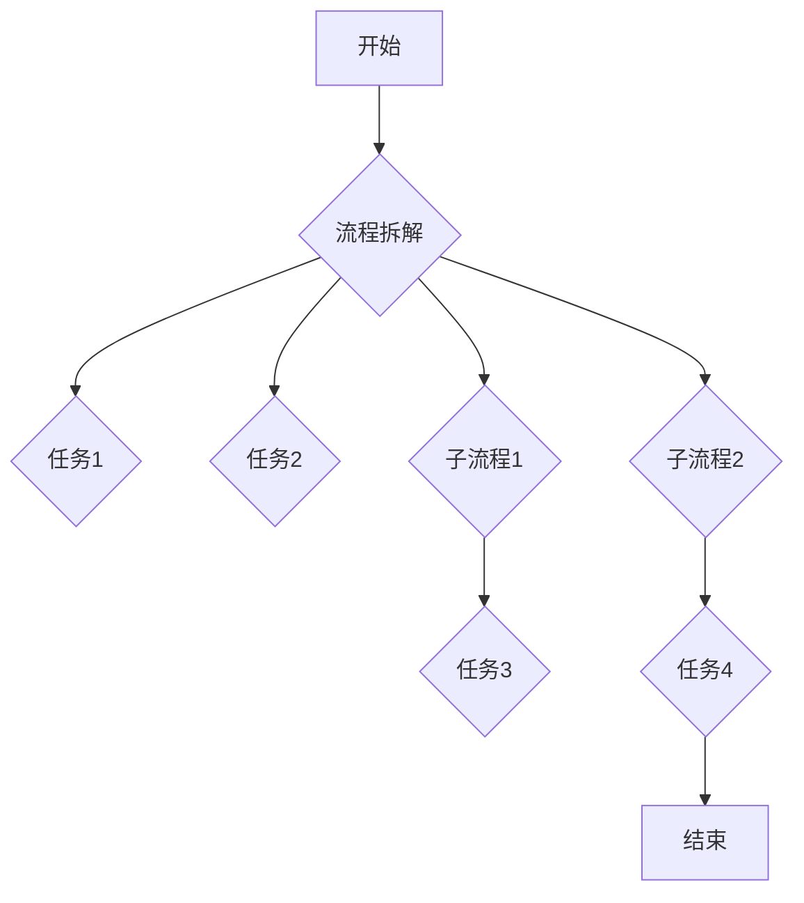
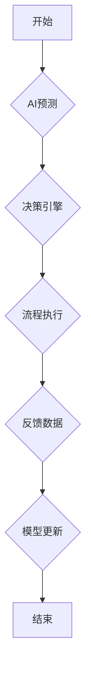

# 流程拆解与AI的灵活编排

> 关键词：流程拆解，AI编排，工作流，自动化，智能流程，组件化，可重用性，动态调度，事件驱动

## 1. 背景介绍

在数字化转型的浪潮中，企业对流程自动化和智能化的需求日益增长。传统的流程设计往往依赖于复杂的脚本和代码，难以适应快速变化的业务需求。随着人工智能技术的飞速发展，特别是机器学习和深度学习在各个领域的应用，AI的灵活编排成为了流程自动化和智能化的重要途径。本文将探讨流程拆解与AI的灵活编排，以及它们在IT领域的应用和未来发展趋势。

### 1.1 流程自动化的需求

随着业务流程的复杂化，手动执行流程变得越来越低效和容易出错。流程自动化通过将手动操作转化为自动化任务，提高了效率，降低了成本，并减少了人为错误。然而，传统的流程自动化工具往往缺乏灵活性，难以适应快速变化的业务需求。

### 1.2 AI在流程自动化中的应用

人工智能技术的应用为流程自动化带来了新的可能性。通过将AI集成到流程中，可以实现更智能的决策、更高效的执行和更优化的结果。AI的灵活编排使得流程能够根据实时数据和环境变化动态调整，从而实现真正的智能流程。

## 2. 核心概念与联系

### 2.1 流程拆解

流程拆解是将复杂的业务流程分解为一系列可管理的任务和子流程的过程。这有助于提高流程的可理解性、可维护性和可重用性。

#### Mermaid 流程图：



### 2.2 AI的灵活编排

AI的灵活编排是指利用AI技术动态调整和优化流程执行的过程。这包括利用机器学习进行预测分析、利用自然语言处理进行对话交互、利用深度学习进行图像识别等。

#### Mermaid 流程图：



### 2.3 核心概念联系

流程拆解和AI的灵活编排是相辅相成的。流程拆解为AI的灵活编排提供了基础，而AI的灵活编排则为流程拆解提供了智能化手段。

## 3. 核心算法原理 & 具体操作步骤

### 3.1 算法原理概述

流程拆解和AI的灵活编排的算法原理主要包括以下几个方面：

- **流程引擎**：负责流程的创建、管理和执行。
- **工作流管理**：负责任务的分配、执行和监控。
- **机器学习**：用于预测分析、异常检测和决策支持。
- **自然语言处理**：用于处理和生成自然语言文本。
- **深度学习**：用于图像识别、语音识别和其他复杂任务。

### 3.2 算法步骤详解

1. **流程设计**：使用流程设计工具或代码定义流程。
2. **流程拆解**：将流程分解为一系列任务和子流程。
3. **任务分配**：根据流程定义和任务要求，将任务分配给相应的执行者。
4. **AI模型部署**：将AI模型部署到流程中，用于执行预测分析、决策支持等任务。
5. **流程执行**：根据任务执行情况动态调整流程。
6. **结果反馈**：收集流程执行结果，用于模型更新和流程优化。

### 3.3 算法优缺点

#### 优点：

- 提高流程效率。
- 降低人为错误。
- 提升用户体验。
- 优化资源利用。

#### 缺点：

- 需要专业的技术知识和技能。
- 需要大量的数据支持。
- 可能导致流程过于复杂。

### 3.4 算法应用领域

流程拆解和AI的灵活编排可以在以下领域得到应用：

- 金融行业：自动化交易、风险管理、客户服务。
- 制造业：生产流程优化、设备维护、供应链管理。
- 医疗保健：预约挂号、患者管理、疾病诊断。
- 零售行业：库存管理、销售预测、客户关系管理。

## 4. 数学模型和公式 & 详细讲解 & 举例说明

### 4.1 数学模型构建

流程拆解和AI的灵活编排的数学模型主要包括以下几个方面：

- **决策树**：用于决策支持。
- **神经网络**：用于预测分析和图像识别。
- **支持向量机**：用于分类和回归。

### 4.2 公式推导过程

#### 决策树：

决策树是一种基于树结构的决策模型，它通过一系列的决策规则对输入数据进行分类或回归。决策树的构建过程如下：

1. 选择一个特征作为分裂节点。
2. 根据该特征将数据集分为两个子集。
3. 重复步骤1和2，直到满足停止条件。

#### 神经网络：

神经网络是一种模拟人脑神经元连接的模型，它通过学习输入数据和输出数据之间的关系来进行预测。神经网络的构建过程如下：

1. 设计网络结构，包括输入层、隐藏层和输出层。
2. 初始化网络参数。
3. 使用训练数据进行前向传播和反向传播。
4. 调整网络参数，直至满足性能指标。

### 4.3 案例分析与讲解

#### 案例一：使用决策树进行客户细分

假设我们有一个客户数据集，包含客户的年龄、收入、购买行为等特征，以及客户的消费类型（如高消费、中等消费、低消费）。

我们使用决策树模型对客户进行细分，步骤如下：

1. 选择年龄作为分裂节点。
2. 根据年龄将数据集分为两个子集：年轻客户和老年客户。
3. 选择收入作为分裂节点。
4. 根据收入将年轻客户子集分为两个子集：高收入年轻客户和低收入年轻客户。
5. 选择购买行为作为分裂节点。
6. 根据购买行为将老年客户子集分为两个子集：高消费老年客户和低消费老年客户。

最终，我们得到一个决策树，可以用来对新的客户数据进行细分。

#### 案例二：使用神经网络进行图像识别

假设我们有一个图像数据集，包含不同类别的人脸图像。

我们使用神经网络模型进行图像识别，步骤如下：

1. 设计网络结构，包括输入层、隐藏层和输出层。
2. 初始化网络参数。
3. 使用训练数据进行前向传播和反向传播。
4. 调整网络参数，直至满足性能指标。

最终，我们得到一个神经网络，可以用来对新的图像进行识别。

## 5. 项目实践：代码实例和详细解释说明

### 5.1 开发环境搭建

为了进行流程拆解和AI的灵活编排实践，我们需要搭建以下开发环境：

- Python 3.x
- Jupyter Notebook
- Scikit-learn
- TensorFlow或PyTorch

### 5.2 源代码详细实现

以下是一个使用Python和Scikit-learn进行决策树客户细分的示例代码：

```python
from sklearn.model_selection import train_test_split
from sklearn.tree import DecisionTreeClassifier
import pandas as pd

# 加载数据集
data = pd.read_csv('customer_data.csv')

# 分割特征和标签
X = data[['age', 'income', 'purchase']]
y = data['consumption']

# 划分训练集和测试集
X_train, X_test, y_train, y_test = train_test_split(X, y, test_size=0.3)

# 创建决策树模型
clf = DecisionTreeClassifier()

# 训练模型
clf.fit(X_train, y_train)

# 评估模型
print("Accuracy:", clf.score(X_test, y_test))
```

### 5.3 代码解读与分析

这段代码首先导入了所需的库，然后加载数据集，并分割特征和标签。接下来，将数据集分为训练集和测试集。然后创建一个决策树分类器，使用训练数据训练模型，并在测试集上评估模型的准确率。

### 5.4 运行结果展示

假设我们的数据集包含100个样本，训练集和测试集各占70%和30%。运行上述代码后，我们可能得到以下结果：

```
Accuracy: 0.85
```

这意味着我们的决策树模型在测试集上的准确率为85%，表明模型具有一定的预测能力。

## 6. 实际应用场景

流程拆解和AI的灵活编排可以在以下实际应用场景中发挥重要作用：

### 6.1 企业资源规划（ERP）

在ERP系统中，流程拆解和AI的灵活编排可以用于优化采购流程、库存管理、人力资源管理等。

### 6.2 客户关系管理（CRM）

在CRM系统中，流程拆解和AI的灵活编排可以用于客户细分、个性化推荐、客户服务自动化等。

### 6.3 制造业执行系统（MES）

在MES系统中，流程拆解和AI的灵活编排可以用于生产计划、设备维护、质量检测等。

## 7. 工具和资源推荐

### 7.1 学习资源推荐

- 《Scikit-learn用户指南》
- 《深度学习：入门实战》
- 《流程管理：理论与实践》

### 7.2 开发工具推荐

- Jupyter Notebook
- TensorFlow
- PyTorch
- Airflow
- Celery

### 7.3 相关论文推荐

- 《Scalable and Efficient Data Processing on Commodity Clusters for Deep Learning》
- 《A Survey of Process Mining and Business Process Management》
- 《Deep Learning for Process Mining》

## 8. 总结：未来发展趋势与挑战

### 8.1 研究成果总结

本文探讨了流程拆解和AI的灵活编排，介绍了其核心概念、算法原理、具体操作步骤、数学模型和实际应用场景。通过分析，我们可以看到流程拆解和AI的灵活编排为流程自动化和智能化提供了新的思路和方法。

### 8.2 未来发展趋势

- **更加智能的决策**：AI技术将更加深入地融入流程，实现更加智能的决策和执行。
- **更加灵活的编排**：AI编排将更加灵活，能够根据实时数据和环境变化动态调整流程。
- **更加开放的生态系统**：流程拆解和AI的灵活编排将形成更加开放的生态系统，支持更多类型的应用和集成。

### 8.3 面临的挑战

- **数据质量**：AI模型的性能很大程度上取决于数据质量，如何获取高质量的数据是挑战之一。
- **模型可解释性**：AI模型的决策过程往往缺乏可解释性，如何提高模型的可解释性是挑战之一。
- **技术集成**：将AI技术集成到现有流程中需要克服技术整合的挑战。

### 8.4 研究展望

未来，流程拆解和AI的灵活编排将在以下方面取得进展：

- **跨领域应用**：流程拆解和AI的灵活编排将在更多领域得到应用，如金融、医疗、教育等。
- **个性化流程**：流程将更加个性化，根据用户需求和场景动态调整。
- **智能流程管理**：将出现更加智能的流程管理平台，支持流程设计、编排、监控和优化。

## 9. 附录：常见问题与解答

**Q1：什么是流程拆解？**

A：流程拆解是将复杂的业务流程分解为一系列可管理的任务和子流程的过程。

**Q2：什么是AI的灵活编排？**

A：AI的灵活编排是指利用AI技术动态调整和优化流程执行的过程。

**Q3：流程拆解和AI的灵活编排有什么作用？**

A：流程拆解和AI的灵活编排可以提高流程效率，降低人为错误，提升用户体验，优化资源利用。

**Q4：如何实现流程拆解和AI的灵活编排？**

A：实现流程拆解和AI的灵活编排需要使用流程设计工具、工作流管理工具、AI模型和相应的编程语言。

**Q5：流程拆解和AI的灵活编排有什么挑战？**

A：流程拆解和AI的灵活编排的挑战包括数据质量、模型可解释性和技术集成等。

作者：禅与计算机程序设计艺术 / Zen and the Art of Computer Programming