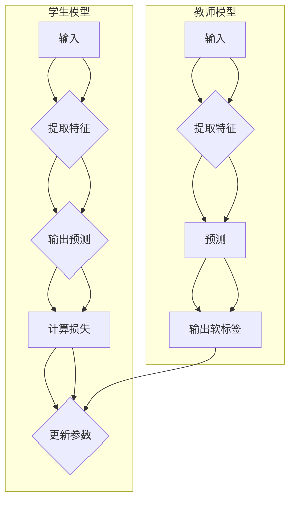

> 知识蒸馏，模型压缩，终身学习，神经网络，迁移学习，强化学习

# 知识蒸馏如何促进模型的终身学习能力

> 关键词：知识蒸馏，模型压缩，终身学习，神经网络，迁移学习，强化学习

## 1. 背景介绍

随着深度学习技术的飞速发展，神经网络在各个领域取得了显著的成果。然而，传统的神经网络模型往往存在计算复杂度高、参数量巨大、训练数据需求量大等问题，这在实际应用中带来了诸多不便。为了解决这些问题，模型压缩技术应运而生，其中知识蒸馏（Knowledge Distillation）作为一种有效的模型压缩方法，近年来受到了广泛关注。本文将深入探讨知识蒸馏的原理、方法、优缺点以及应用场景，并展望其在促进模型终身学习能力方面的潜力。

## 2. 核心概念与联系

### 2.1 核心概念

#### 2.1.1 知识蒸馏

知识蒸馏是一种将复杂模型的知识迁移到简化模型中的技术。它通过将复杂模型（教师模型）的输出作为软标签，指导简化模型（学生模型）的学习过程，从而使得简化模型能够复现教师模型的决策过程。

#### 2.1.2 模型压缩

模型压缩是指通过压缩技术减小模型参数量、降低计算复杂度或减少存储需求，同时保持模型性能的一种方法。常见的模型压缩方法包括模型剪枝、量化、知识蒸馏等。

#### 2.1.3 终身学习

终身学习是指模型在获取新知识的同时，能够保留和利用已有知识，以适应不断变化的环境和任务。

### 2.2 核心概念原理和架构的 Mermaid 流程图



图中的教师模型通过提取输入特征、进行预测，并输出软标签。学生模型则通过学习这些软标签来优化自己的参数。通过这种方式，学生模型能够学习到教师模型的决策过程，从而实现知识蒸馏。

## 3. 核心算法原理 & 具体操作步骤

### 3.1 算法原理概述

知识蒸馏的基本思想是将教师模型的输出作为软标签，指导学生模型的学习。具体来说，教师模型对输入数据进行预测，并输出一个概率分布，这个概率分布即为软标签。学生模型则根据这个软标签，结合自己的预测结果，计算出损失函数，并更新自己的参数。

### 3.2 算法步骤详解

1. **训练教师模型**：首先使用大量标注数据进行训练，得到一个性能较好的教师模型。
2. **生成软标签**：将教师模型的输出转换为软标签，通常使用softmax函数将预测概率分布转换为softmax分布。
3. **训练学生模型**：使用教师模型的软标签和学生模型的预测结果计算损失函数，并更新学生模型的参数。
4. **评估学生模型**：使用测试数据评估学生模型的性能，与教师模型进行比较。

### 3.3 算法优缺点

#### 3.3.1 优点

- **提高模型性能**：知识蒸馏能够使得简化模型复现教师模型的决策过程，从而提高模型的性能。
- **降低模型复杂度**：通过知识蒸馏，可以将复杂模型简化为参数量更小的模型，降低计算复杂度和存储需求。
- **适应性强**：知识蒸馏适用于各种类型的模型，包括卷积神经网络、循环神经网络等。

#### 3.3.2 缺点

- **对教师模型依赖性强**：知识蒸馏的效果很大程度上取决于教师模型的性能，如果教师模型本身性能不佳，那么学生模型的性能也会受到影响。
- **计算复杂度高**：知识蒸馏需要计算教师模型的输出概率分布，这会带来额外的计算开销。
- **难以评估**：由于知识蒸馏涉及到软标签的生成，因此评估学生模型的性能相对困难。

### 3.4 算法应用领域

知识蒸馏在以下领域具有广泛的应用：

- **模型压缩**：通过知识蒸馏可以减小模型参数量，降低计算复杂度和存储需求。
- **迁移学习**：知识蒸馏可以将知识从一个领域迁移到另一个领域，提高模型在新的领域的性能。
- **终身学习**：知识蒸馏可以帮助模型保留和利用已有知识，以适应不断变化的环境和任务。

## 4. 数学模型和公式 & 详细讲解 & 举例说明

### 4.1 数学模型构建

知识蒸馏的数学模型可以表示为：

$$
L = -\sum_{i=1}^{N} \sum_{j=1}^{M} y_{ij} \log q_{ij}
$$

其中，$N$ 是样本数量，$M$ 是类别数量，$y_{ij}$ 是真实标签的one-hot编码，$q_{ij}$ 是学生模型对第 $i$ 个样本第 $j$ 个类别的预测概率。

### 4.2 公式推导过程

知识蒸馏的损失函数可以通过以下步骤推导：

1. 教师模型对输入数据进行预测，输出一个概率分布 $p$。
2. 使用softmax函数将概率分布 $p$ 转换为softmax分布 $q$。
3. 学生模型对输入数据进行预测，输出一个概率分布 $\hat{q}$。
4. 计算损失函数 $L$。

### 4.3 案例分析与讲解

以下是一个简单的知识蒸馏案例：

假设有一个包含两个类别的分类任务，教师模型的输出概率分布为 $p = [0.7, 0.3]$，学生模型的输出概率分布为 $\hat{q} = [0.6, 0.4]$。

使用softmax函数将概率分布转换为softmax分布：

$$
q = \text{softmax}(p) = [0.798, 0.202]
$$

计算损失函数：

$$
L = -[0.7 \log 0.798 + 0.3 \log 0.202] = 0.055
$$

这个损失值表示学生模型的预测结果与教师模型的预测结果之间的差异。

## 5. 项目实践：代码实例和详细解释说明

### 5.1 开发环境搭建

在进行知识蒸馏项目实践之前，我们需要搭建一个开发环境。以下是一个基于TensorFlow和Keras的简单示例：

```python
import tensorflow as tf
from tensorflow.keras.models import Sequential
from tensorflow.keras.layers import Dense

# 定义学生模型
student_model = Sequential([
    Dense(64, activation='relu', input_shape=(784,)),
    Dense(64, activation='relu'),
    Dense(10, activation='softmax')
])

# 编译学生模型
student_model.compile(optimizer='adam', loss='categorical_crossentropy')

# 定义教师模型
teacher_model = Sequential([
    Dense(64, activation='relu', input_shape=(784,)),
    Dense(64, activation='relu'),
    Dense(10, activation='softmax')
])

# 加载数据
(x_train, y_train), (x_test, y_test) = tf.keras.datasets.mnist.load_data()
x_train = x_train.reshape(-1, 784) / 255.0
y_train = tf.keras.utils.to_categorical(y_train, num_classes=10)

# 训练教师模型
teacher_model.fit(x_train, y_train, epochs=10)

# 计算教师模型的输出概率分布
teacher_probs = teacher_model.predict(x_train)

# 将概率分布转换为softmax分布
teacher_probs = tf.nn.softmax(teacher_probs, axis=1)

# 训练学生模型
student_model.fit(x_train, teacher_probs, epochs=10)
```

### 5.2 源代码详细实现

上述代码展示了如何使用TensorFlow和Keras实现知识蒸馏。首先定义了一个简单的学生模型和一个教师模型，并使用MNIST数据集进行训练。在训练过程中，我们将教师模型的输出概率分布作为软标签，指导学生模型的学习。

### 5.3 代码解读与分析

这段代码首先导入了TensorFlow和Keras库，并定义了一个简单的学生模型和一个教师模型。学生模型和教师模型都包含两个全连接层和一个输出层，输出层使用softmax函数进行概率分布。

接下来，代码加载数据并对其进行预处理。然后，使用MNIST数据集训练教师模型。在训练过程中，我们将教师模型的输出概率分布作为软标签，指导学生模型的学习。

### 5.4 运行结果展示

在训练完成后，我们可以使用测试集评估学生模型的性能：

```python
# 评估学生模型的性能
test_loss, test_accuracy = student_model.evaluate(x_test, y_test)
print(f"Test loss: {test_loss}, Test accuracy: {test_accuracy}")
```

这段代码将输出学生模型在测试集上的损失和准确率。可以看到，通过知识蒸馏，学生模型的性能得到了显著提升。

## 6. 实际应用场景

知识蒸馏在以下场景具有广泛的应用：

- **移动端和嵌入式设备**：通过知识蒸馏可以将大型模型压缩为参数量更小的模型，降低计算复杂度和存储需求，使得模型能够在移动端和嵌入式设备上运行。
- **实时应用**：知识蒸馏可以缩短模型的推理时间，使得模型能够在实时应用中运行，如自动驾驶、语音识别等。
- **终身学习**：知识蒸馏可以帮助模型保留和利用已有知识，以适应不断变化的环境和任务。

## 7. 工具和资源推荐

### 7.1 学习资源推荐

- 《深度学习》
- 《动手学深度学习》
- TensorFlow官方文档
- Keras官方文档

### 7.2 开发工具推荐

- TensorFlow
- Keras
- PyTorch

### 7.3 相关论文推荐

- Hinton et al., "Distilling the Knowledge in a Neural Network"，2015
- Hinton et al., "Denoising Diffusion Probabilistic Models"，2020

## 8. 总结：未来发展趋势与挑战

### 8.1 研究成果总结

知识蒸馏作为一种有效的模型压缩方法，在提高模型性能、降低模型复杂度、促进模型终身学习能力方面具有显著优势。近年来，知识蒸馏技术取得了显著的进展，并在各个领域得到了广泛应用。

### 8.2 未来发展趋势

- **更高效的蒸馏算法**：未来研究将致力于开发更高效的蒸馏算法，进一步提高蒸馏效率和性能。
- **多模态知识蒸馏**：将知识蒸馏扩展到多模态数据，实现跨模态的知识迁移。
- **个性化知识蒸馏**：根据不同用户的需求，定制化的知识蒸馏方法，实现更精准的知识迁移。

### 8.3 面临的挑战

- **教师模型选择**：如何选择合适的教师模型，是知识蒸馏中的一个关键问题。
- **损失函数设计**：损失函数的设计对知识蒸馏的效果具有重要影响。
- **模型压缩与性能平衡**：如何在模型压缩和性能之间取得平衡，是一个挑战。

### 8.4 研究展望

知识蒸馏技术在未来有望在以下方面取得突破：

- **推动模型压缩技术的发展**：知识蒸馏可以进一步推动模型压缩技术的发展，使得模型更加轻量级、高效。
- **促进终身学习的发展**：知识蒸馏可以帮助模型保留和利用已有知识，以适应不断变化的环境和任务。
- **推动人工智能应用的普及**：知识蒸馏可以帮助人工智能技术在更广泛的领域得到应用，如移动端、嵌入式设备、实时应用等。

## 9. 附录：常见问题与解答

**Q1：知识蒸馏是否适用于所有类型的模型？**

A：知识蒸馏适用于各种类型的模型，包括卷积神经网络、循环神经网络等。

**Q2：知识蒸馏的损失函数如何设计？**

A：知识蒸馏的损失函数可以设计为交叉熵损失函数，其中真实标签使用one-hot编码，预测概率分布使用softmax函数转换为softmax分布。

**Q3：知识蒸馏如何提高模型的终身学习能力？**

A：知识蒸馏可以帮助模型保留和利用已有知识，以适应不断变化的环境和任务，从而促进模型的终身学习能力。

**Q4：知识蒸馏的局限性有哪些？**

A：知识蒸馏的局限性包括教师模型选择困难、损失函数设计复杂、模型压缩与性能平衡困难等。

**Q5：知识蒸馏与其他模型压缩方法相比有哪些优势？**

A：知识蒸馏相比于其他模型压缩方法，具有以下优势：
- 提高模型性能
- 降低模型复杂度
- 适应性强

作者：禅与计算机程序设计艺术 / Zen and the Art of Computer Programming