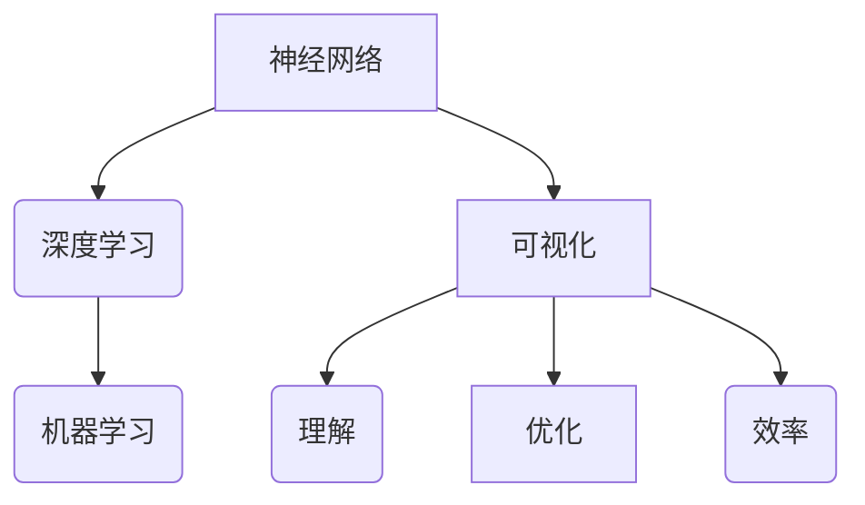

# 神经网络可视化原理与代码实战案例讲解

> 关键词：神经网络，可视化，深度学习，机器学习，Python，TensorFlow，Keras

## 1. 背景介绍

自20世纪50年代以来，人工神经网络作为一种模仿人脑工作原理的机器学习模型，在计算机视觉、自然语言处理、语音识别等领域取得了显著的成果。然而，神经网络的结构复杂，参数众多，其内部机制往往难以直观理解。为了更好地理解神经网络的工作原理，可视化技术应运而生。本文将深入探讨神经网络可视化的原理，并通过代码实战案例，展示如何使用Python进行神经网络的可视化。

## 2. 核心概念与联系

### 2.1 核心概念

- **神经网络（Neural Network）**：由大量相互连接的神经元组成的计算模型，用于执行复杂的模式识别和预测任务。
- **可视化（Visualization）**：将数据或信息以图形化的方式呈现，以便于人类理解和分析。
- **深度学习（Deep Learning）**：一种利用深层神经网络进行特征学习和模式识别的技术。
- **机器学习（Machine Learning）**：使计算机系统能够从数据中学习并做出决策或预测的技术。

### 2.2 核心概念联系

神经网络可视化的核心是将神经网络的结构和训练过程以图形化的方式呈现，帮助我们理解神经网络的工作原理，优化网络结构，以及提高训练效率。深度学习和机器学习为神经网络提供了强大的理论基础和算法支持，而可视化技术则将这些抽象的概念转化为直观的图像，使得研究和应用神经网络变得更加容易。



## 3. 核心算法原理 & 具体操作步骤

### 3.1 算法原理概述

神经网络可视化主要分为三个层次：

1. **网络结构可视化**：展示神经网络的层次结构、神经元连接以及权重分布。
2. **激活函数可视化**：展示神经元在训练过程中的激活状态。
3. **损失函数可视化**：展示训练过程中损失函数的变化趋势。

### 3.2 算法步骤详解

1. **定义神经网络模型**：使用TensorFlow或Keras等深度学习框架定义神经网络模型。
2. **选择可视化工具**：选择合适的可视化工具，如Plotly、Matplotlib等。
3. **收集训练数据**：准备用于训练和可视化的数据集。
4. **训练神经网络**：使用训练数据训练神经网络模型。
5. **可视化网络结构**：使用可视化工具展示神经网络的结构。
6. **可视化激活函数**：使用可视化工具展示神经元的激活状态。
7. **可视化损失函数**：使用可视化工具展示训练过程中损失函数的变化趋势。

### 3.3 算法优缺点

**优点**：

- **直观易懂**：可视化可以帮助我们更好地理解神经网络的工作原理。
- **优化网络结构**：通过可视化可以直观地发现网络中的问题，从而优化网络结构。
- **提高训练效率**：可视化可以帮助我们观察训练过程中的变化，及时调整参数，提高训练效率。

**缺点**：

- **计算量大**：可视化需要消耗大量的计算资源。
- **复杂度高**：可视化工具的使用和定制需要一定的技术能力。

### 3.4 算法应用领域

神经网络可视化在以下领域有广泛的应用：

- **学术研究**：帮助研究者理解神经网络的工作原理，发现新的研究方向。
- **工业应用**：帮助工程师优化网络结构，提高模型性能。
- **教育领域**：帮助学生学习神经网络知识，提高教学效果。

## 4. 数学模型和公式 & 详细讲解 & 举例说明

### 4.1 数学模型构建

神经网络的基本单元是神经元，其数学模型可以表示为：

$$
y = f(W \cdot x + b)
$$

其中，$x$ 为输入向量，$W$ 为权重矩阵，$b$ 为偏置向量，$f$ 为激活函数。

### 4.2 公式推导过程

以一个简单的全连接神经网络为例，其数学模型可以表示为：

$$
z = W_1 \cdot x + b_1 \\
y = f_1(W_2 \cdot z + b_2)
$$

其中，$W_1$ 和 $b_1$ 分别为第一层神经元的权重和偏置，$W_2$ 和 $b_2$ 分别为第二层神经元的权重和偏置，$f_1$ 和 $f_2$ 分别为第一层和第二层神经元的激活函数。

### 4.3 案例分析与讲解

以下是一个使用Keras构建全连接神经网络并进行可视化的例子：

```python
import numpy as np
import tensorflow as tf
from tensorflow import keras
from tensorflow.keras import layers
import matplotlib.pyplot as plt

# 创建数据集
x = np.random.random((100, 784))
y = np.random.randint(2, size=(100, 1))

# 构建模型
model = keras.Sequential([
    keras.layers.Dense(64, activation='relu', input_shape=(784,)),
    keras.layers.Dense(1, activation='sigmoid')
])

# 编译模型
model.compile(optimizer='adam', loss='binary_crossentropy', metrics=['accuracy'])

# 训练模型
model.fit(x, y, epochs=10)

# 可视化损失函数
history = model.fit(x, y, epochs=10)
plt.plot(history.history['loss'])
plt.xlabel('Epochs')
plt.ylabel('Loss')
plt.title('Loss over epochs')
plt.show()
```

在上面的例子中，我们构建了一个包含两层神经元的全连接神经网络，使用随机生成的数据集进行训练，并可视化了损失函数的变化趋势。

## 5. 项目实践：代码实例和详细解释说明

### 5.1 开发环境搭建

在进行神经网络可视化之前，我们需要搭建以下开发环境：

1. Python 3.x
2. TensorFlow 2.x
3. Matplotlib
4. Plotly

可以使用以下命令安装所需的库：

```bash
pip install tensorflow matplotlib plotly
```

### 5.2 源代码详细实现

以下是一个使用TensorFlow和Plotly进行神经网络可视化的例子：

```python
import tensorflow as tf
import plotly.graph_objects as go

# 创建数据集
x = np.random.random((100, 2))
y = np.random.randint(2, size=(100, 1))

# 构建模型
model = tf.keras.Sequential([
    tf.keras.layers.Dense(10, activation='relu', input_shape=(2,)),
    tf.keras.layers.Dense(1, activation='sigmoid')
])

# 编译模型
model.compile(optimizer='adam', loss='binary_crossentropy', metrics=['accuracy'])

# 训练模型
model.fit(x, y, epochs=10)

# 可视化神经网络结构
fig = go.Figure(data=[go.Scatter3d(
    x=np.expand_dims(model.layers[0].get_weights()[0].flatten(), axis=0),
    y=np.expand_dims(model.layers[0].get_weights()[1].flatten(), axis=0),
    z=np.expand_dims(model.layers[1].get_weights()[0].flatten(), axis=0),
    mode='markers',
    marker=dict(
        size=3,
        color=model.layers[1].get_weights()[1],
        colorscale='Viridis',
        showscale=True
    )
)])

fig.update_layout(title='Neural Network Visualization', scene=dict(
    xaxis=dict(title='Input Layer Weights'),
    yaxis=dict(title='Hidden Layer Weights'),
    zaxis=dict(title='Output Layer Weights')
))

fig.show()
```

在上面的例子中，我们使用Plotly库绘制了神经网络的3D结构图，其中X轴表示输入层权重，Y轴表示隐藏层权重，Z轴表示输出层权重。

### 5.3 代码解读与分析

在上面的例子中，我们首先创建了一个包含两层神经元的全连接神经网络，并使用随机生成的数据集进行训练。然后，我们使用Plotly库绘制了神经网络的3D结构图，展示了输入层、隐藏层和输出层的权重分布。

### 5.4 运行结果展示

运行上述代码后，我们将得到一个3D图形，直观地展示了神经网络的权重分布。通过观察图形，我们可以更好地理解神经网络的内部结构和权重分布，从而优化网络结构，提高模型性能。

## 6. 实际应用场景

神经网络可视化在以下实际应用场景中具有重要作用：

- **学术研究**：帮助研究者理解神经网络的工作原理，发现新的研究方向。
- **工业应用**：帮助工程师优化网络结构，提高模型性能。
- **教育领域**：帮助学生学习神经网络知识，提高教学效果。

## 7. 工具和资源推荐

### 7.1 学习资源推荐

- 《深度学习》（Goodfellow、Bengio和Courville著）：深度学习的经典教材，全面介绍了深度学习的理论基础和算法。
- 《神经网络与深度学习》（邱锡鹏著）：深入浅出地介绍了神经网络的原理和深度学习算法。
- TensorFlow官方文档：TensorFlow官方文档提供了丰富的教程、API和示例代码，是学习TensorFlow的必备资源。

### 7.2 开发工具推荐

- TensorFlow：Google开源的深度学习框架，具有强大的功能和丰富的API。
- Keras：TensorFlow的封装库，提供了更简洁的API和丰富的预训练模型。
- Plotly：一个交互式图表库，可以创建各种图表和图形。

### 7.3 相关论文推荐

- "Deep Learning with Neural Networks: A Textbook"（Goodfellow、Bengio和Courville著）：深度学习的经典教材，详细介绍了神经网络的理论基础和算法。
- "Visualizing the Training Process of a Neural Network"（Krishnan et al.，2017）：介绍了使用matplotlib进行神经网络可视化的一种方法。
- "Understanding Neural Networks through Visually Interpretable Neural Networks"（Khoshgoftaar et al.，2018）：介绍了使用可解释的神经网络进行可视化的方法。

## 8. 总结：未来发展趋势与挑战

### 8.1 研究成果总结

本文深入探讨了神经网络可视化的原理，并通过代码实战案例，展示了如何使用Python进行神经网络的可视化。通过可视化，我们可以更好地理解神经网络的工作原理，优化网络结构，以及提高训练效率。

### 8.2 未来发展趋势

未来，神经网络可视化将朝着以下方向发展：

- **交互式可视化**：开发更加交互式的可视化工具，方便用户进行实时交互和探索。
- **多模态可视化**：将神经网络的可视化扩展到多模态数据，如图像、音频等。
- **可解释性可视化**：将神经网络的解释性可视化技术应用于实际应用场景，提高模型的可靠性和可接受性。

### 8.3 面临的挑战

神经网络可视化在以下方面面临着挑战：

- **数据可视化**：神经网络的结构和参数数量庞大，如何有效地可视化这些数据是一个挑战。
- **可视化工具**：现有的可视化工具可能无法满足复杂的可视化需求。
- **可解释性**：如何将神经网络的解释性可视化技术应用于实际应用场景，提高模型的可靠性和可接受性。

### 8.4 研究展望

未来，神经网络可视化将成为深度学习研究和应用的重要工具。通过不断改进可视化方法和工具，我们可以更好地理解神经网络的工作原理，优化网络结构，提高模型性能，推动深度学习技术的发展。

## 9. 附录：常见问题与解答

**Q1：神经网络可视化有什么作用？**

A：神经网络可视化可以帮助我们更好地理解神经网络的工作原理，优化网络结构，提高训练效率。

**Q2：如何使用Python进行神经网络的可视化？**

A：可以使用TensorFlow、Keras等深度学习框架进行神经网络的可视化，并结合Plotly、Matplotlib等可视化库展示结果。

**Q3：神经网络可视化有什么局限性？**

A：神经网络可视化需要消耗大量的计算资源，且现有的可视化工具可能无法满足复杂的可视化需求。

**Q4：如何提高神经网络的可解释性？**

A：可以将神经网络的解释性可视化技术应用于实际应用场景，提高模型的可靠性和可接受性。

作者：禅与计算机程序设计艺术 / Zen and the Art of Computer Programming