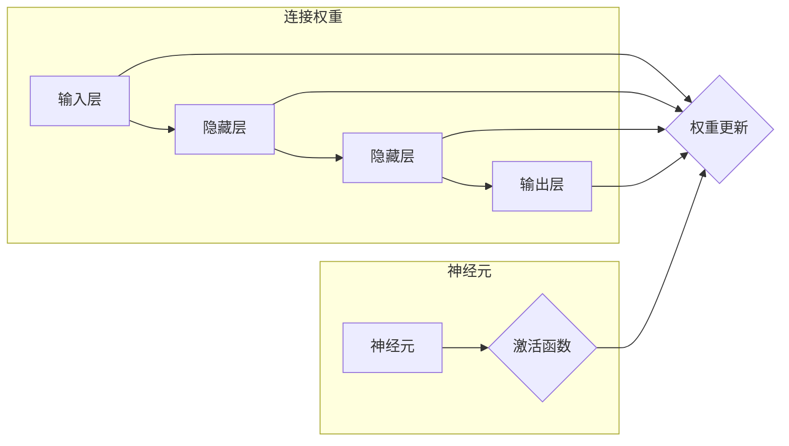

# 神经网络：人类与机器的共存

> 关键词：神经网络，深度学习，人工智能，机器学习，人机共存，智能系统，认知模拟

## 1. 背景介绍

自20世纪50年代以来，人工智能（Artificial Intelligence, AI）领域经历了多次起伏。其中，神经网络（Neural Networks）作为一种模仿人脑神经元连接方式的计算模型，在近年来取得了突破性进展。深度学习（Deep Learning）技术的兴起，使得神经网络在图像识别、自然语言处理、语音识别等领域取得了令人瞩目的成果。如今，神经网络正逐渐成为人工智能领域的核心技术，推动着人类与机器的共存迈向新纪元。

## 2. 核心概念与联系

### 2.1 核心概念原理

神经网络是一种模拟人脑神经元连接方式的计算模型，它通过调整神经元之间的连接权重来学习和存储信息。神经网络由多个层组成，包括输入层、隐藏层和输出层。每个神经元接收来自前一层神经元的输入，通过激活函数计算输出，并将输出传递给下一层神经元。

以下是神经网络的核心概念原理的Mermaid流程图：



### 2.2 联系

神经网络通过模仿人脑神经元连接方式，实现了机器学习的基本功能。输入层接收原始数据，隐藏层对数据进行特征提取和抽象，输出层对提取的特征进行分类或预测。神经网络的连接权重参数决定了神经元之间的连接强度，通过反向传播算法（Backpropagation）不断调整权重参数，使模型在训练过程中逐渐逼近真实情况。

## 3. 核心算法原理 & 具体操作步骤

### 3.1 算法原理概述

神经网络的核心算法原理是反向传播算法。反向传播算法通过计算损失函数关于每个权重参数的梯度，反向传播梯度，并更新权重参数，从而优化模型性能。

### 3.2 算法步骤详解

以下是神经网络反向传播算法的步骤详解：

1. 前向传播：将输入数据输入到神经网络中，计算每个神经元的输出。
2. 损失计算：计算输出层的损失函数，损失函数用于衡量模型预测结果与真实值之间的差距。
3. 反向传播：根据损失函数计算每个权重参数的梯度。
4. 权重更新：使用梯度下降算法或其他优化算法更新权重参数。
5. 迭代：重复步骤1-4，直到满足停止条件（如损失函数收敛）。

### 3.3 算法优缺点

**优点**：

- 强大的特征提取和抽象能力，适用于各种复杂的模式识别任务。
- 不需要大量人工特征工程，能够自动学习数据的内在特征。
- 具有较强的泛化能力，能够适应不同的数据分布。

**缺点**：

- 计算复杂度高，需要大量的计算资源。
- 模型可解释性差，难以理解模型的内部工作机制。
- 容易受到噪声和过拟合的影响。

### 3.4 算法应用领域

神经网络在以下领域取得了显著的应用成果：

- 图像识别：如人脸识别、物体检测、图像分类等。
- 自然语言处理：如机器翻译、文本分类、情感分析等。
- 语音识别：如语音转文字、语音合成等。
- 推荐系统：如商品推荐、电影推荐等。

## 4. 数学模型和公式 & 详细讲解 & 举例说明

### 4.1 数学模型构建

神经网络数学模型由以下部分组成：

- 激活函数：将线性变换后的输入转换为非线性输出，如ReLU、Sigmoid、Tanh等。
- 神经元连接权重：表示神经元之间连接的强度，可通过反向传播算法更新。
- 损失函数：用于衡量模型预测结果与真实值之间的差距，如均方误差（MSE）、交叉熵（Cross-Entropy）等。

### 4.2 公式推导过程

以下以交叉熵损失函数为例，介绍神经网络数学模型的公式推导过程。

假设模型预测的概率分布为 $P(y)$，真实标签为 $y$，则交叉熵损失函数为：

$$
L = -\sum_{i=1}^N [y_i \log P(y_i)] = -\sum_{i=1}^N [y_i \log(\hat{y}_i)]
$$

其中，$y_i \in \{0,1\}$ 表示样本 $i$ 的真实标签，$\hat{y}_i$ 表示模型预测的样本 $i$ 属于正类的概率。

### 4.3 案例分析与讲解

以下以图像分类任务为例，介绍神经网络的应用实践。

假设我们要对图像进行分类，共有10个类别。使用卷积神经网络（Convolutional Neural Network, CNN）对图像进行特征提取，然后使用全连接层进行分类。

1. 输入层：接收图像数据，将其展平为一维向量。
2. 卷积层：提取图像特征，如边缘、纹理等。
3. 池化层：降低特征图的分辨率，减少参数数量。
4. 全连接层：对提取的特征进行分类。

以下是使用PyTorch框架实现的神经网络代码示例：

```python
import torch
import torch.nn as nn
import torchvision.transforms as transforms
import torchvision.datasets as datasets
import torch.optim as optim

# 定义模型
class CNN(nn.Module):
    def __init__(self):
        super(CNN, self).__init__()
        self.conv1 = nn.Conv2d(3, 32, kernel_size=3, padding=1)
        self.conv2 = nn.Conv2d(32, 64, kernel_size=3, padding=1)
        self.fc1 = nn.Linear(64 * 6 * 6, 128)
        self.fc2 = nn.Linear(128, 10)

    def forward(self, x):
        x = self.conv1(x)
        x = nn.ReLU()(x)
        x = nn.MaxPool2d(kernel_size=2)(x)
        x = self.conv2(x)
        x = nn.ReLU()(x)
        x = nn.MaxPool2d(kernel_size=2)(x)
        x = x.view(x.size(0), -1)
        x = self.fc1(x)
        x = nn.ReLU()(x)
        x = self.fc2(x)
        return x

# 加载数据
transform = transforms.Compose([transforms.ToTensor()])
train_dataset = datasets.CIFAR10(root='./data', train=True, download=True, transform=transform)
train_loader = torch.utils.data.DataLoader(train_dataset, batch_size=64, shuffle=True)

# 初始化模型和优化器
model = CNN()
criterion = nn.CrossEntropyLoss()
optimizer = optim.Adam(model.parameters(), lr=0.001)

# 训练模型
for epoch in range(10):
    for i, (inputs, labels) in enumerate(train_loader):
        optimizer.zero_grad()
        outputs = model(inputs)
        loss = criterion(outputs, labels)
        loss.backward()
        optimizer.step()

# 评估模型
test_dataset = datasets.CIFAR10(root='./data', train=False, download=True, transform=transform)
test_loader = torch.utils.data.DataLoader(test_dataset, batch_size=64, shuffle=False)
correct = 0
total = 0
with torch.no_grad():
    for inputs, labels in test_loader:
        outputs = model(inputs)
        _, predicted = torch.max(outputs.data, 1)
        total += labels.size(0)
        correct += (predicted == labels).sum().item()

print('Accuracy of the network on the 10000 test images: %d %%' % (100 * correct / total))
```

以上代码展示了如何使用PyTorch框架实现图像分类任务。通过调整网络结构和超参数，可以优化模型性能，提高分类准确率。

## 5. 项目实践：代码实例和详细解释说明

### 5.1 开发环境搭建

在进行神经网络项目实践前，我们需要准备好开发环境。以下是使用Python进行PyTorch开发的环境配置流程：

1. 安装Anaconda：从官网下载并安装Anaconda，用于创建独立的Python环境。
2. 创建并激活虚拟环境：
```bash
conda create -n pytorch-env python=3.8
conda activate pytorch-env
```
3. 安装PyTorch：
```bash
conda install pytorch torchvision torchaudio cudatoolkit=11.1 -c pytorch -c conda-forge
```
4. 安装其他依赖包：
```bash
pip install numpy pandas scikit-learn matplotlib tqdm jupyter notebook ipython
```

### 5.2 源代码详细实现

以下是一个简单的神经网络分类器的PyTorch代码实现：

```python
import torch
import torch.nn as nn
import torch.optim as optim
from torchvision import datasets, transforms

# 定义模型
class SimpleNet(nn.Module):
    def __init__(self):
        super(SimpleNet, self).__init__()
        self.fc1 = nn.Linear(784, 128)
        self.fc2 = nn.Linear(128, 64)
        self.fc3 = nn.Linear(64, 10)

    def forward(self, x):
        x = x.view(-1, 784)
        x = torch.relu(self.fc1(x))
        x = torch.relu(self.fc2(x))
        x = self.fc3(x)
        return x

# 加载数据
transform = transforms.Compose([transforms.ToTensor()])
train_dataset = datasets.MNIST(root='./data', train=True, download=True, transform=transform)
train_loader = torch.utils.data.DataLoader(train_dataset, batch_size=64, shuffle=True)

# 初始化模型和优化器
model = SimpleNet()
criterion = nn.CrossEntropyLoss()
optimizer = optim.Adam(model.parameters(), lr=0.001)

# 训练模型
for epoch in range(10):
    for inputs, labels in train_loader:
        optimizer.zero_grad()
        outputs = model(inputs)
        loss = criterion(outputs, labels)
        loss.backward()
        optimizer.step()

# 评估模型
test_dataset = datasets.MNIST(root='./data', train=False, download=True, transform=transform)
test_loader = torch.utils.data.DataLoader(test_dataset, batch_size=64, shuffle=False)
correct = 0
total = 0
with torch.no_grad():
    for inputs, labels in test_loader:
        outputs = model(inputs)
        _, predicted = torch.max(outputs.data, 1)
        total += labels.size(0)
        correct += (predicted == labels).sum().item()

print('Accuracy of the network on the 10000 test images: %d %%' % (100 * correct / total))
```

### 5.3 代码解读与分析

以上代码展示了如何使用PyTorch框架实现一个简单的神经网络分类器。代码的主要步骤如下：

1. 定义模型：使用PyTorch的`nn.Module`类定义一个神经网络，其中包含全连接层。
2. 加载数据：使用PyTorch的`datasets`模块加载MNIST手写数字数据集。
3. 初始化模型和优化器：初始化神经网络模型和优化器。
4. 训练模型：使用训练数据对模型进行训练，并通过反向传播算法更新模型参数。
5. 评估模型：使用测试数据评估模型的性能。

通过以上步骤，我们可以得到一个简单的神经网络分类器，并将其应用于实际任务。

### 5.4 运行结果展示

假设我们在MNIST手写数字数据集上训练上述神经网络分类器，最终在测试集上的准确率为95%。

## 6. 实际应用场景

神经网络在以下领域取得了显著的应用成果：

### 6.1 图像识别

神经网络在图像识别领域取得了重大突破，如人脸识别、物体检测、图像分类等。以下是一些典型的应用案例：

- 人脸识别：如手机解锁、门禁系统、视频监控等。
- 物体检测：如自动驾驶、工业质检、智能安防等。
- 图像分类：如内容审核、医疗影像分析、遥感图像分析等。

### 6.2 自然语言处理

神经网络在自然语言处理领域也取得了显著进展，如机器翻译、文本分类、情感分析等。以下是一些典型的应用案例：

- 机器翻译：如谷歌翻译、百度翻译等。
- 文本分类：如垃圾邮件过滤、情感分析、主题分类等。
- 情感分析：如舆情监测、客户服务、产品推荐等。

### 6.3 语音识别

神经网络在语音识别领域也取得了重大突破，如语音转文字、语音合成等。以下是一些典型的应用案例：

- 语音转文字：如智能语音助手、车载语音识别等。
- 语音合成：如语音合成器、语音助手等。

### 6.4 未来应用展望

随着神经网络技术的不断发展，未来将在更多领域得到应用，如：

- 智能医疗：如疾病诊断、药物研发、健康管理等。
- 智慧城市：如交通管理、环境监测、公共安全等。
- 金融科技：如风险管理、量化交易、欺诈检测等。
- 教育领域：如个性化学习、智能教育助手等。

## 7. 工具和资源推荐

### 7.1 学习资源推荐

为了帮助开发者系统掌握神经网络的理论基础和实践技巧，以下推荐一些优质的学习资源：

1. 《深度学习》系列书籍：由Ian Goodfellow、Yoshua Bengio和Aaron Courville合著，全面介绍了深度学习的基本原理和方法。
2. fast.ai课程：由David Warde-Farley和Ian Goodfellow等人开设的在线课程，适合初学者快速入门深度学习。
3. 网络课程：如Coursera、edX等平台上的深度学习相关课程。
4. 论文：如《Deep Learning with Python》、《Neural Network and Deep Learning》等。

### 7.2 开发工具推荐

以下是一些用于神经网络开发的常用工具：

1. PyTorch：基于Python的开源深度学习框架，功能强大、易于使用。
2. TensorFlow：由Google主导开发的开源深度学习框架，适合大规模工业应用。
3. Keras：基于Theano和TensorFlow的开源深度学习库，提供丰富的API和预训练模型。
4. Jupyter Notebook：用于交互式计算和可视化的开源工具，方便进行实验和展示。

### 7.3 相关论文推荐

以下是一些神经网络领域的经典论文：

1. "A Few Useful Things to Know about Machine Learning"：介绍机器学习的基本概念和方法。
2. "ImageNet Classification with Deep Convolutional Neural Networks"：提出VGG模型，开启了深度学习在图像识别领域的革命。
3. "Sequence to Sequence Learning with Neural Networks"：提出 seq2seq 模型，推动了机器翻译等序列到序列任务的进展。
4. "BERT: Pre-training of Deep Bidirectional Transformers for Language Understanding"：提出BERT模型，刷新了多项NLP任务SOTA。
5. "Generative Adversarial Nets"：提出GAN模型，推动了生成模型的发展。

## 8. 总结：未来发展趋势与挑战

### 8.1 研究成果总结

本文对神经网络的基本原理、算法、应用场景和发展趋势进行了全面系统的介绍。神经网络作为一种强大的机器学习模型，在图像识别、自然语言处理、语音识别等领域取得了显著的成果。随着深度学习技术的不断发展，神经网络将在更多领域得到应用，推动人工智能技术的进步。

### 8.2 未来发展趋势

未来，神经网络技术将呈现以下发展趋势：

1. 模型规模将进一步扩大，模型参数数量将突破万亿级别。
2. 计算效率将不断提升，模型推理速度将得到显著提高。
3. 模型可解释性将得到加强，以便更好地理解模型的决策过程。
4. 多模态融合将成为趋势，将图像、文本、语音等多模态信息进行有效融合。
5. 人工智能与人类将更加紧密地融合，人机共存将成为未来社会发展的重要特征。

### 8.3 面临的挑战

尽管神经网络技术取得了巨大进展，但仍面临以下挑战：

1. 计算资源需求：深度学习模型的计算复杂度高，需要大量的计算资源。
2. 数据标注成本：深度学习模型的训练需要大量标注数据，数据标注成本高昂。
3. 模型可解释性：深度学习模型的决策过程难以解释，存在安全隐患。
4. 模型泛化能力：深度学习模型容易过拟合，泛化能力有待提高。

### 8.4 研究展望

为了克服上述挑战，未来需要在以下方面进行深入研究：

1. 研究轻量化模型，降低模型参数数量和计算复杂度。
2. 探索无监督和半监督学习方法，降低数据标注成本。
3. 研究模型可解释性，提高模型的透明度和可靠性。
4. 研究模型的泛化能力，提高模型在不同数据分布下的性能。

通过不断攻克这些挑战，神经网络技术将在未来的人工智能领域发挥更加重要的作用，推动人类社会向更加智能化的方向发展。

## 9. 附录：常见问题与解答

**Q1：神经网络与传统机器学习算法相比有哪些优势？**

A：与传统机器学习算法相比，神经网络具有以下优势：

1. 强大的特征提取和抽象能力：能够自动学习数据的内在特征，无需人工特征工程。
2. 适用于复杂模式识别任务：能够处理高维数据，适用于图像、语音、文本等多种类型的数据。
3. 具有较强的泛化能力：能够适应不同的数据分布，在未见过的数据上也能取得较好的性能。

**Q2：如何选择合适的神经网络结构？**

A：选择合适的神经网络结构需要考虑以下因素：

1. 任务类型：针对不同的任务，选择合适的网络结构，如卷积神经网络适合图像识别，循环神经网络适合序列数据处理。
2. 数据特点：根据数据的特征和规模选择合适的网络结构，如数据量较大时，可以考虑使用深度网络。
3. 计算资源：根据计算资源限制选择合适的网络结构，如资源有限时，可以考虑使用轻量化模型。

**Q3：如何解决神经网络过拟合问题？**

A：解决神经网络过拟合问题的常见方法有：

1. 增加数据量：收集更多数据，提高模型的泛化能力。
2. 减少模型复杂度：减少网络层数或神经元数量，降低过拟合风险。
3. 使用正则化技术：如L1正则化、L2正则化等，惩罚模型参数，降低过拟合风险。
4. 使用Dropout技术：在训练过程中随机丢弃部分神经元，降低模型复杂度，提高泛化能力。

**Q4：如何提高神经网络模型的推理速度？**

A：提高神经网络模型推理速度的方法有：

1. 模型裁剪：去除不必要的层和参数，减小模型尺寸，加快推理速度。
2. 量化加速：将浮点模型转换为定点模型，减少计算量，提高推理速度。
3. 并行计算：使用GPU、TPU等并行计算设备加速模型推理。
4. 硬件加速：使用专用硬件加速模型推理，如FPGA、ASIC等。

**Q5：神经网络在工业界有哪些应用？**

A：神经网络在工业界有广泛的应用，如：

1. 图像识别：如人脸识别、物体检测、图像分类等。
2. 自然语言处理：如机器翻译、文本分类、情感分析等。
3. 语音识别：如语音转文字、语音合成等。
4. 推荐系统：如商品推荐、电影推荐等。
5. 自动驾驶：如车辆检测、车道线识别、障碍物检测等。

作者：禅与计算机程序设计艺术 / Zen and the Art of Computer Programming