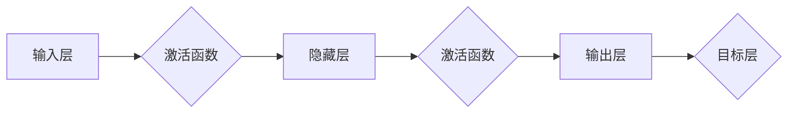

> 神经网络, 人工智能, 深度学习, 机器学习, 智能计算, 模式识别

# 神经网络：人类智慧的延伸

> 关键词：神经网络，人工智能，深度学习，机器学习，智能计算，模式识别

## 1. 背景介绍

### 1.1 人工智能的兴起

人工智能（Artificial Intelligence, AI）作为计算机科学的一个分支，旨在使机器具备模拟、延伸和扩展人类智能的能力。自20世纪50年代以来，人工智能经历了多次起伏，近年来，随着深度学习技术的突破，人工智能迎来了新一轮的快速发展。

### 1.2 深度学习的崛起

深度学习（Deep Learning）是机器学习的一个子领域，通过构建多层神经网络模型，自动从数据中学习特征和模式。深度学习在图像识别、语音识别、自然语言处理等领域取得了显著成果，推动了人工智能的快速发展。

### 1.3 神经网络的角色

神经网络作为深度学习的基础，是实现人工智能的核心技术之一。本文将深入探讨神经网络的理论基础、核心算法、应用领域和发展趋势，以揭示人类智慧的延伸之路。

## 2. 核心概念与联系

### 2.1 神经网络的基本原理

神经网络由大量的神经元组成，通过模拟人脑神经元之间的连接和信息传递机制，实现对输入数据的处理和分析。神经网络的每个神经元都包含输入层、激活函数和输出层，通过前向传播和反向传播算法进行信息的传递和参数的优化。

### 2.2 神经网络与人工智能的关系

神经网络是人工智能的核心技术之一，为人工智能提供了强大的数据处理和分析能力。通过神经网络，机器可以自动从数据中学习特征和模式，实现智能识别、决策和控制。

### 2.3 Mermaid 流程图



## 3. 核心算法原理 & 具体操作步骤

### 3.1 算法原理概述

神经网络的核心算法包括：

- **前向传播**：将输入数据通过神经网络传递，计算每个神经元的输出。
- **反向传播**：根据损失函数计算梯度，反向更新网络权重和偏置。
- **激活函数**：对神经元输出进行非线性变换，引入非线性因素。

### 3.2 算法步骤详解

1. **初始化**：设定神经网络结构，包括层数、每层的神经元数量、激活函数等。
2. **前向传播**：将输入数据传递给网络的每一层，计算每个神经元的输出。
3. **计算损失**：使用损失函数计算预测结果与真实标签之间的差异。
4. **反向传播**：根据损失函数计算梯度，反向更新网络权重和偏置。
5. **优化**：使用优化算法（如梯度下降、Adam等）更新网络参数，降低损失函数值。

### 3.3 算法优缺点

**优点**：

- **强大的表达能力**：神经网络可以学习任意复杂度的函数，适用于各种类型的任务。
- **自动特征提取**：神经网络可以自动从数据中学习特征，无需人工设计特征。
- **可扩展性**：可以通过增加层数和神经元数量来提高网络的表达能力。

**缺点**：

- **计算复杂度高**：神经网络需要大量的计算资源，训练时间较长。
- **参数数量庞大**：神经网络需要大量参数，参数初始化和调优比较困难。
- **过拟合风险**：神经网络容易过拟合，需要使用正则化技术进行防止。

### 3.4 算法应用领域

神经网络在以下领域取得了显著的应用成果：

- **图像识别**：识别图像中的物体、场景和动作。
- **语音识别**：将语音信号转换为文本。
- **自然语言处理**：理解、生成和翻译自然语言。
- **推荐系统**：根据用户历史行为推荐相关物品。
- **医疗诊断**：辅助医生进行疾病诊断。

## 4. 数学模型和公式 & 详细讲解 & 举例说明

### 4.1 数学模型构建

神经网络的基本数学模型如下：

$$
y = f(W \cdot x + b)
$$

其中，$y$ 为输出，$x$ 为输入，$W$ 为权重，$b$ 为偏置，$f$ 为激活函数。

### 4.2 公式推导过程

以多层感知机（MLP）为例，推导神经网络的前向传播和反向传播公式。

#### 前向传播

对于第 $l$ 层，其输出为：

$$
z_l = W_l \cdot x_{l-1} + b_l
$$

其中，$z_l$ 为第 $l$ 层的激活值，$x_{l-1}$ 为第 $l-1$ 层的输出。

#### 反向传播

对于第 $l$ 层，其梯度为：

$$
\delta_l = f'(z_l) \cdot \frac{\partial J}{\partial z_l}
$$

其中，$\delta_l$ 为第 $l$ 层的梯度，$f'$ 为激活函数的导数，$J$ 为损失函数。

### 4.3 案例分析与讲解

以手写数字识别任务为例，介绍神经网络的实现步骤。

1. **数据预处理**：将手写数字图像进行灰度化、二值化、缩放等处理。
2. **模型构建**：选择合适的神经网络结构，如多层感知机。
3. **训练**：使用训练数据对神经网络进行训练，优化网络权重和偏置。
4. **测试**：使用测试数据评估神经网络的性能。

## 5. 项目实践：代码实例和详细解释说明

### 5.1 开发环境搭建

1. 安装 Python 和 PyTorch 库。
2. 下载手写数字识别数据集，如 MNIST。

### 5.2 源代码详细实现

```python
import torch
import torch.nn as nn
import torch.optim as optim
from torchvision import datasets, transforms

# 定义神经网络模型
class NeuralNetwork(nn.Module):
    def __init__(self):
        super(NeuralNetwork, self).__init__()
        self.fc1 = nn.Linear(28*28, 128)
        self.fc2 = nn.Linear(128, 10)
        self.relu = nn.ReLU()

    def forward(self, x):
        x = x.view(x.size(0), -1)
        x = self.relu(self.fc1(x))
        x = self.fc2(x)
        return x

# 加载和预处理数据
transform = transforms.Compose([transforms.ToTensor(), transforms.Normalize((0.5,), (0.5,))])
train_dataset = datasets.MNIST(root='./data', train=True, download=True, transform=transform)
train_loader = torch.utils.data.DataLoader(dataset=train_dataset, batch_size=64, shuffle=True)

# 创建模型和优化器
model = NeuralNetwork()
optimizer = optim.SGD(model.parameters(), lr=0.01, momentum=0.9)

# 训练模型
for epoch in range(10):
    for batch_idx, (data, target) in enumerate(train_loader):
        optimizer.zero_grad()
        output = model(data)
        loss = nn.CrossEntropyLoss()(output, target)
        loss.backward()
        optimizer.step()
        if batch_idx % 100 == 0:
            print(f"Train Epoch: {epoch} [{batch_idx * len(data)}/{len(train_loader.dataset)} ({100. * batch_idx / len(train_loader):.0f}%)]\tLoss: {loss.item():.6f}")

# 保存模型
torch.save(model.state_dict(), './model.pth')
```

### 5.3 代码解读与分析

以上代码实现了使用 PyTorch 库构建和训练一个简单的多层感知机模型，用于手写数字识别任务。

- 定义了 `NeuralNetwork` 类，包含两个全连接层和 ReLU 激活函数。
- 使用 `transforms.Compose` 对数据进行预处理。
- 使用 `DataLoader` 加载训练数据。
- 创建模型和优化器，并开始训练。
- 保存训练好的模型。

### 5.4 运行结果展示

运行以上代码后，训练过程中会输出训练损失和迭代次数。训练完成后，保存训练好的模型，可用于测试或部署。

## 6. 实际应用场景

### 6.1 图像识别

神经网络在图像识别领域取得了显著的成果，广泛应用于人脸识别、物体检测、图像分割等任务。

### 6.2 语音识别

神经网络在语音识别领域也取得了突破性进展，广泛应用于智能语音助手、语音翻译等应用。

### 6.3 自然语言处理

神经网络在自然语言处理领域取得了巨大成功，广泛应用于机器翻译、文本分类、情感分析等任务。

### 6.4 未来应用展望

随着神经网络技术的不断发展，其在更多领域的应用前景也将更加广阔。例如：

- **医疗诊断**：辅助医生进行疾病诊断，提高诊断准确率。
- **交通管理**：智能识别交通违法行为，提高道路安全。
- **金融风控**：识别金融风险，防范金融犯罪。

## 7. 工具和资源推荐

### 7.1 学习资源推荐

- 《深度学习》（Goodfellow, Bengio, Courville）
- 《神经网络与深度学习》（邱锡鹏）
- Hugging Face 官方文档：https://huggingface.co/docs/

### 7.2 开发工具推荐

- PyTorch：https://pytorch.org/
- TensorFlow：https://www.tensorflow.org/

### 7.3 相关论文推荐

- "A Few Useful Things to Know about Machine Learning"（Jürgen Schmidhuber）
- "Deep Learning"（Ian Goodfellow, Yoshua Bengio, Aaron Courville）
- "ImageNet Classification with Deep Convolutional Neural Networks"（Alex Krizhevsky, Ilya Sutskever, Geoffrey Hinton）

## 8. 总结：未来发展趋势与挑战

### 8.1 研究成果总结

神经网络作为人工智能的核心技术之一，在图像识别、语音识别、自然语言处理等领域取得了显著成果。神经网络具有强大的表达能力、自动特征提取和可扩展性等优点，为人工智能的发展提供了强大的技术支撑。

### 8.2 未来发展趋势

- **模型轻量化**：降低模型复杂度和计算量，提高模型的实时性和部署效率。
- **可解释性**：提高模型的可解释性，增强用户对模型的信任度。
- **多模态学习**：融合多种模态信息，实现更全面、准确的信息处理。

### 8.3 面临的挑战

- **计算资源**：神经网络训练需要大量的计算资源，成本较高。
- **数据质量**：数据质量对模型性能影响较大，需要保证数据质量。
- **过拟合**：神经网络容易过拟合，需要使用正则化技术进行防止。

### 8.4 研究展望

神经网络技术将继续在人工智能领域发挥重要作用。未来研究方向包括：

- **新型神经网络结构**：设计更高效、更强大的神经网络结构。
- **可解释性**：提高模型的可解释性，增强用户对模型的信任度。
- **多模态学习**：融合多种模态信息，实现更全面、准确的信息处理。

## 9. 附录：常见问题与解答

**Q1：神经网络和机器学习的区别是什么？**

A：神经网络是机器学习的一个子领域，旨在模拟人脑神经元之间的连接和信息传递机制。机器学习则是一个更广泛的概念，包括神经网络、支持向量机、决策树等多种学习算法。

**Q2：神经网络是如何进行特征提取的？**

A：神经网络通过多层非线性变换，自动从数据中学习特征和模式。每一层神经网络都会提取不同层次的特征，最终输出表示整个数据的最优特征。

**Q3：神经网络过拟合的原因是什么？如何解决？**

A：过拟合的原因是神经网络拟合了训练数据中的噪声，导致泛化能力差。解决过拟合的方法包括正则化、数据增强、早停等。

**Q4：神经网络在哪些领域取得了显著成果？**

A：神经网络在图像识别、语音识别、自然语言处理、推荐系统、医疗诊断等领域取得了显著成果。

**Q5：未来神经网络的研究方向有哪些？**

A：未来神经网络的研究方向包括模型轻量化、可解释性、多模态学习等。

---

作者：禅与计算机程序设计艺术 / Zen and the Art of Computer Programming